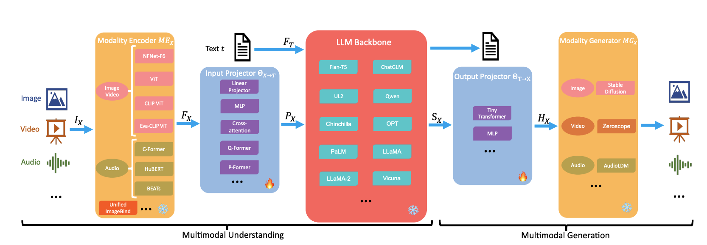
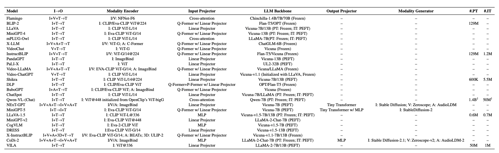
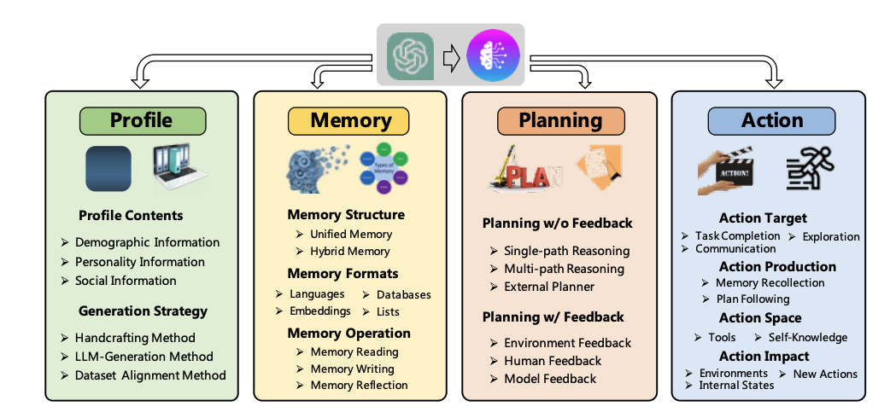

## 5 分钟速览

在本部分，我们将深入 LLM 周边的最新研究进展。开篇审视多模态大语言模型（MM-LLMs），探索这一领域如何快速推进。随后讨论流行的开源模型，聚焦其构造与贡献。接着讲解能够从始至终自主完成任务的智能体（Agents）概念。此外，我们理解领域专用模型在丰富各行业专业知识方面的作用，并细看混合专家（Mixture of Experts）和 RWKV 等开创性架构——它们有望提升 LLM 的可扩展性与效率。

## 多模态 LLM（MM-LLMs）

过去一年，多模态大语言模型（MM-LLMs）取得了显著进展。具体而言，MM-LLMs 代表了语言模型领域的一次重要演进——它们在文本处理能力之外加入了多模态组件。虽然多模态模型整体上也有所进步，但 MM-LLMs 的提升尤为显著，很大程度上得益于这一年来 LLM 本身的惊人提升，而 MM-LLMs 高度依赖于此。

此外，低成本训练策略的采用极大助力了 MM-LLMs 的发展。这些策略使模型能高效管理跨多种模态的输入与输出。与传统模型不同，MM-LLMs 不仅保留了 LLM 固有的出色推理与决策能力，还把效用扩展到跨多种模态的多样任务。

要理解 MM-LLMs 如何运作，可以梳理一些常见的架构组件。多数 MM-LLMs 可分为 5 个主要组件，如下图所示。下面解释的组件改编自论文"[MM-LLMs: Recent Advances in MultiModal Large Language Models](https://arxiv.org/pdf/2401.13601.pdf)"。我们逐一详述。

图片来源：[https://arxiv.org/pdf/2401.13601.pdf](https://arxiv.org/pdf/2401.13601.pdf)

**1. 模态编码器（Modality Encoder）：** 模态编码器（ME）在编码来自多样模态的输入 $I_X$ 以提取对应特征 $F_X$ 方面扮演关键角色。针对不同模态（视觉、音频、3D 输入）存在多种预训练编码器选项。视觉输入常用 NFNet-F6、ViT、CLIP ViT、Eva-CLIP ViT；音频输入则用 CFormer、HuBERT、BEATs、Whisper 等框架；点云输入用带 PointBERT 主干的 ULIP-2 编码。一些 MM-LLMs 还借助 ImageBind——一个覆盖图像、视频、文本、音频和热图等多模态的统一编码器。

**2. 输入投影器（Input Projector）：** 输入投影器 $Θ_{(X→T)}$ 把其他模态的编码特征 $F_X$ 与文本特征空间 $T$ 对齐。这种对齐对于把多模态信息有效整合进 LLM 主干至关重要。输入投影器可通过线性投影器、多层感知机（MLP）、交叉注意力、Q-Former 或 P-Former 等多种方法实现，各有其跨模态特征对齐的独特方式。

**3. LLM 主干（LLM Backbone）：** LLM 主干是 MM-LLMs 的核心代理，继承 LLM 的诸多特性，如零样本泛化、少样本上下文学习（ICL）、思维链（CoT）和指令遵循。主干处理来自各模态的表示，进行语义理解、推理和关于输入的决策。此外，部分 MM-LLMs 纳入参数高效微调（PEFT）方法，如 Prefix-tuning、Adapter 或 LoRA，以最小化额外可训练参数数量。

**4. 输出投影器（Output Projector）：** 输出投影器 $Θ_{(T→X)}$ 把来自 LLM 主干的信号 token 表示 $S_X$ 映射为模态生成器 $MG_X$ 可理解的特征 $H_X$。这种投影促成多模态内容的生成。输出投影器通常用微型 Transformer 或 MLP 实现，其优化聚焦于最小化映射特征 $H_X$ 与 $MG_X$ 的条件文本表示之间的距离。

**5. 模态生成器（Modality Generator）：** 模态生成器 $MG_X$ 负责产出图像、视频或音频等不同模态的输出。现有工作通常借助现成的潜在扩散模型（LDMs）进行图像、视频和音频合成。训练时，真实内容被转换为潜在特征，然后以输出投影器的映射特征 $H_X$ 为条件、用 LDM 去噪以生成多模态内容。

### 训练

MM-LLMs 分两个主要阶段训练：多模态预训练（MM PT）和多模态指令微调（MM IT）。

**MM PT：**
在 MM PT 期间，MM-LLMs 被训练去理解和生成来自图像、视频、文本等不同类型数据的内容。它们学习把这些不同种类的信息对齐起来协同工作。例如，学习把一张猫的图片与单词 "cat" 关联，反之亦然。这一阶段聚焦于教会模型处理不同类型的输入与输出。

**MM IT：**
在 MM IT 中，模型基于特定指令做微调，这帮助模型适配新任务并表现更好。MM IT 中有两种主要方法：

- **监督微调（SFT）：** 模型在结构上含指令的示例上训练。例如在问答任务中，每个问题配对正确答案，帮助模型学会遵循指令并生成恰当响应。
- **基于人类反馈的强化学习（RLHF）：** 模型收到对其响应的反馈，通常以人类生成的反馈形式。这种反馈帮助模型通过从错误中学习来随时间改进表现。

因此，MM-LLMs 被训练去理解和生成来自多种信息源的内容，并能基于指令和反馈微调以更好地执行特定任务。

下图总结了流行的 MM-LLMs 及其各组件所用模型。

图片来源：[https://arxiv.org/pdf/2401.13601.pdf](https://arxiv.org/pdf/2401.13601.pdf)

### 新兴研究方向

MM-LLMs 的一些潜在未来方向涉及通过多种途径扩展其能力：

1. **更强大的模型**：
   - 把 MM-LLMs 扩展到容纳图像、视频、音频、3D、文本之外更多模态，如网页、热图、图表。
   - 纳入不同类型与规模的 LLM，为从业者提供按具体需求选择最合适的灵活性。
   - 通过多样化指令范围来增强 MM IT 数据集，改善 MM-LLMs 对用户命令的理解与执行。
   - 探索整合基于检索的方法以补充 MM-LLMs 中的生成过程，有望提升整体表现。
2. **更具挑战性的基准**：
   - 开发更大规模的基准，包含更广模态范围并采用统一评估标准，以充分挑战 MM-LLMs 的能力。
   - 定制基准以评估 MM-LLMs 在实际应用中的熟练度，如评估其辨别并回应 meme 中社会滥用等细微层面的能力。
3. **移动/轻量化部署**：
   - 开发轻量化实现，把 MM-LLMs 部署到低功耗移动和 IoT 设备等资源受限平台，确保最优表现。
4. **具身智能**：
   - 探索具身智能以复现人类式的感知与周围环境交互，使机器人能基于实时观察自主执行长程规划。
   - 在 PaLM-E、EmbodiedGPT 等现有进展基础上进一步增强基于 MM-LLM 的具身智能，提升机器人自主性。
5. **持续指令微调（Continual IT）**：
   - 开发方法让 MM-LLMs 持续适配新的多模态任务，同时保持对已学任务的优异表现，应对灾难性遗忘与负向前向迁移等挑战。
   - 建立基准并开发方法克服 MM-LLMs 持续 IT 中的挑战，确保无需大量重训练成本即可高效适配新兴需求。

## 开源模型

近期开源 LLM 的发展在使先进 AI 技术大众化方面起到了关键作用。开源 LLM 相对闭源模型有若干优势——提升了透明度、可定制性与协作性。它们允许更深入理解模型运作、便于按需修改，并通过社区贡献鼓励改进。它们也充作教育工具并支撑多样的 AI 生态、防止垄断。当然也存在计算需求大和潜在被滥用等挑战，但开源模型的好处往往盖过这些问题，尤其对看重 AI 开放性与适应性的群体。

部分流行开源 LLM 列举如下：

### Meta 的 LLaMA

- **LLaMA**（130 亿参数）由 Meta 于 2023 年 2 月发布，尽管参数更少，却在许多 NLP 基准上超越 GPT-3。**LLaMA-2** 是增强版，数据多 40%、上下文长度翻倍，于 2023 年 7 月连同对话专用版（**LLaMA 2-Chat**）和代码生成版（**LLaMA Code**）一同发布。

### Mistral

- 由一家巴黎初创公司开发，**Mistral 7B** 在英语和代码基准上超越了截至 13B 参数的所有现有开源 LLM，树立新标杆。Mistral AI 随后又发布了 **Mixtral 8x7B**——一个稀疏混合专家（SMoE）模型。该模型标志着对传统 AI 架构与训练方法的偏离，旨在为开发者社区提供可激发新应用与技术的创新工具。我们将在下一节进一步学习混合专家范式。

### 开放语言模型（OLMo）

- **OLMo** 是 AI2 LLM 框架的一部分，旨在通过提供训练数据、代码、模型和评估工具来鼓励开放研究。它包含 **Dolma 数据集**、完整的训练与推理代码、四个 7B 规模变体的模型权重，以及 Catwalk 项目下的广泛评估套件。

### LLM360 倡议

- **LLM360** 提出一种全开源的 LLM 开发方式，倡导发布训练代码、数据、模型检查点和中间结果。它发布了两个 7B 参数 LLM——**AMBER** 和 **CRYSTALCODER**，配有保障 LLM 训练透明度与可复现性的资源。

Llama 和 Mistral 只发布模型，而 OLMo 和 LLM360 走得更远——提供检查点、数据集等，确保其成果完全开放且可复现。

## 智能体（Agents）

LLM 智能体近几个月势头正盛，代表了 LLM 能力的未来与扩展。LLM 智能体是以大语言模型为核心、执行广泛任务（不限于文本生成）的 AI 系统。这些任务包括开展对话、推理、完成各类任务，以及基于所提供上下文与指令展现自主行为。LLM 智能体通过精细的提示工程运作——把指令、上下文和权限编码进去，以引导智能体的动作与响应。

### LLM 智能体的能力

- **自主性**：LLM 智能体可按设计和所收提示，展现从被动到主动的不同自主程度。
- **任务完成**：借助外部知识库、工具和推理能力，LLM 智能体可协助或独立处理从聊天机器人到复杂工作流自动化的各类应用。
- **适应性**：其语言建模能力使其能理解并遵循自然语言提示，因而通用、能定制响应与动作。
- **高级技能**：通过提示工程，LLM 智能体可配备高级分析、规划与执行技能，能以最少人工介入管理任务，依赖其访问与处理信息的能力。
- **协作**：通过响应交互式提示并把反馈整合进运作，实现人与 AI 的无缝协作。

LLM 智能体把 LLM 的核心语言处理能力与规划、记忆、工具使用等额外模块结合，有效地成为指挥一系列操作以完成任务或响应查询的"大脑"。这种架构允许它把复杂问题拆解为可管理的部分、检索并分析相关信息，并按需生成全面响应或视觉呈现。

示例：

假设我们要筹办一场关于可持续能源解决方案的国际会议，议题涵盖可再生能源技术、能源生产中的可持续实践、以及促进绿色能源的创新政策。该任务涉及复杂规划与信息收集，包括确定关键讲者、了解可持续能源当前趋势、与利益相关者接洽。

为应对这一多面项目，可部署一个 LLM 智能体来：

1. **调研与总结**：把任务拆解为子任务，如识别可持续能源的新兴趋势、定位该领域领先专家、总结近期研究发现。智能体利用其对海量数字资源的访问来编制综合报告。
2. **讲者接洽**：为潜在讲者起草个性化邀请，融入会议目标及其专长如何契合等信息。智能体可基于专家档案与过往作品生成这些沟通。
3. **后勤规划**：为会议制定详尽计划，包括活动前的时间线、后勤清单（场地、混合参会的虚拟平台搭建等）和参会者参与策略。智能体可借助活动规划资源与最佳实践数据库来勾勒这些计划。
4. **利益相关者沟通**：为利益相关者起草更新与简报，提供会议进展洞察、议程亮点、已确认的关键讲者。智能体针对赞助商、参会者或公众等不同受众定制每份沟通内容。
5. **互动问答环节规划**：为互动问答环节搭建框架，包括向潜在参会者预先征集问题、分类，并为讲者准备简报文档。智能体可通过分析注册数据与提交的提问来促成此事。

在这个场景中，LLM 智能体不仅助力执行复杂耗时的任务，还确保规划过程周全、紧贴可持续能源最新进展、并契合会议的具体目标。通过借助外部数据库、数据分析与可视化工具及其天生的语言处理能力，LLM 智能体充当全面助手， streamlined 地组织一场有众多环节的大型活动。

LLM 智能体的框架可从多个视角概念化，论文"[A Survey on Large Language Model based Autonomous Agents](https://arxiv.org/pdf/2308.11432.pdf)"通过其独特组件提供了其中一种视角。该架构由四个关键模块组成：画像模块（Profiling）、记忆模块（Memory）、规划模块（Planning）和行动模块（Action）。每个模块在使 LLM 智能体于各类场景中自主有效行动方面都至关重要。

图片来源：[https://arxiv.org/pdf/2308.11432.pdf](https://arxiv.org/pdf/2308.11432.pdf)

### LLM 智能体的组件

1. **画像模块（Profiling Module）**

   画像模块负责定义智能体的身份与角色。它纳入年龄、性别、职业、性格特质和社交关系等信息来塑造智能体行为。该模块用多种方法创建画像，包括手工定制（精确控制）、LLM 生成（可扩展）和数据集对齐（贴合真实世界）。智能体的画像显著影响其交互、决策和任务执行方式，使该模块成为智能体设计的基础。

2. **记忆模块（Memory Module）**

   记忆模块存储智能体从环境感知的信息，并利用这些存储知识为未来行动提供依据。它模仿人类记忆过程，结构上借鉴感觉记忆、短期记忆和长期记忆。该模块使智能体能积累经验、基于过往交互演化，并以一致且有效的方式行动。它确保智能体能回忆过往行为、从中学习并随时间调整策略。

3. **规划模块（Planning Module）**

   规划模块赋予智能体把复杂任务分解为更简单子任务并逐一处理的能力，镜像人类问题求解策略。它包括带反馈和不带反馈的规划，允许灵活适配变化的环境与需求。单路径推理和思维链（CoT）等策略用于引导智能体一步步走向目标，使规划过程对智能体的有效性与可靠性至关重要。

4. **行动模块（Action Module）**

   行动模块把智能体的决策转化为具体结果，直接与环境交互。它考量行动目标、行动如何生成、可能行动的范围（行动空间）及行动后果。该模块整合来自画像、记忆和规划模块的输入，执行契合智能体目标与能力的决策。它对智能体策略的实际应用至关重要，使其能在真实世界中产出切实结果。

这些模块共同构成 LLM 智能体架构的全面框架，允许创建能担当特定角色、从环境感知并学习、并以近似人类行为的精细度与灵活性自主执行任务的智能体。

### 未来研究方向

1. 多数 LLM 智能体研究局限于基于文本的交互。扩展到多模态环境——智能体能跨图像、音频、视频等格式处理并生成输出——会引入数据处理复杂性，并要求智能体解读和响应更广的感官输入。
2. 幻觉（模型生成与事实不符的文本）在 LLM 智能体系统中更成问题，因为有级联误信息的可能。开发检测与缓解幻觉的策略涉及管理信息流，以防不准确信息在网络中蔓延。
3. 虽然 LLM 智能体从即时反馈学习，但为可扩展学习创建可靠的交互环境存在挑战。此外，当前方法聚焦于逐个调整智能体，未充分利用多个智能体协调交互可能涌现的集体智能。
4. 为某用例扩展智能体数量（多智能体系统）会带来显著的计算需求以及协调与通信复杂性。开发高效的编排方法对优化工作流、确保有效多智能体协作至关重要。
5. 当前基准可能无法充分捕捉对智能体至关重要的涌现行为，或跨越多样的研究领域。开发全面基准对评估智能体在科学、经济、医疗等各领域能力至关重要。

## 领域专用 LLM

通用 LLM 虽通用且在广泛任务上表现良好，但因缺乏领域专属数据训练，在处理专业或小众任务时常力有不逮。此外运行这些通用模型成本可能高昂。这些场景下，领域专用 LLM 成为更优选择。其训练聚焦于特定领域数据，从而提升准确性并赋予对相关术语与概念的更深层理解。这种定制方式不仅改善其在特定领域任务上的表现，也降低生成无关或错误信息的几率。

这些模型被设计为遵循各自领域的监管与伦理标准，确保敏感数据得到恰当处理。它们也因掌握专业语言而能与领域专家更有效沟通。从经济角度，领域专用 LLM 通过免去大量人工调整提供更高效的方案。此外，其专业知识库能识别独特洞察与模式，驱动各自领域的创新。

部分流行领域专用 LLM 列举如下：

### 流行领域专用 LLM

**临床与生物医学 LLM**

- **BioBERT**：在大规模生物医学语料上预训练的领域专用模型，旨在有效挖掘生物医学文本。
- **Hi-BEHRT**：提供分层 Transformer 结构，用于分析电子健康记录中的长序列，展现模型处理复杂医疗数据的能力。

**金融 LLM**

- **BloombergGPT**：一个 500 亿参数的金融专用模型，在海量金融数据上训练，在金融任务上表现出色。
- **FinGPT**：针对特定应用微调的金融模型，借助既有 LLM 增强金融数据理解。

**代码专用 LLM**

- **WizardCoder**：用复杂指令微调赋能代码 LLM，展现对编码领域挑战的适应性。
- **CodeT5**：一个统一的预训练模型，聚焦代码所传达的语义，强调开发者赋予的标识符在理解编程任务中的重要性。

这些领域专用 LLM 展示了 AI 跨领域的巨大潜力与适应性——从理解多语言内容、处理临床数据，到金融分析与代码生成。通过聚焦各领域独特挑战与数据类型，这些模型为 AI 应用的创新、效率与准确性开辟了新途径。

### 领域专用 LLM 的未来趋势

1. 领域专用 LLM 可能演化到不仅处理文本，还处理图像、音频等其他数据类型，实现跨多种格式更全面的理解与交互能力。
2. 未来模型可能纳入先进的交互式学习技术，使其能基于用户反馈和新数据实时更新知识库，确保输出保持相关与准确。
3. 我们可能看到领域专用 LLM 与其他 AI 技术（如决策算法和预测模型）协同工作的系统增多，以提供整体性方案（如上一节讨论的智能体）。
4. 随着 AI 社会影响意识增长，领域专用 LLM 的开发可能更强调伦理考量、公平与透明，尤其在医疗和金融等敏感领域。

## 新型 LLM 架构

### 混合专家（Mixture of Experts）

混合专家（MoEs）代表 Transformer 模型领域的一种精细架构，聚焦于提升模型可扩展性与计算效率。下面拆解 MoEs 是什么及其意义：

**定义与组件**

- **Transformer 中的 MoEs**：在 Transformer 模型中，MoEs 用稀疏 MoE 层替换传统的稠密前馈网络（FFN）层。这些层包含若干"专家"，每个都是一个神经网络——通常是 FFN，但也可能是更复杂结构乃至分层 MoE。
- **专家**：这些是处理数据特定部分的专用神经网络（常为 FFN）。一个 MoE 层可含多个专家（如 8 个），允许同一模型层内具备多样的数据处理能力。
- **门控网络/路由器**：这是关键组件，基于所学参数把输入 token 导向合适的专家。路由器决定哪个专家最适合处理给定输入 token，从而实现计算资源的动态分配。

**优势**

- **高效的预训练**：借助 MoEs，模型可用显著更少的计算资源预训练，允许在同等计算预算下达到更大的模型或数据集规模。
- **更快的推理**：尽管参数量大，MoEs 推理时只用一个子集，因而比相近参数量的稠密模型处理更快。但这种效率有个前提——由于需要把所有参数载入内存，内存需求高。

**挑战**

- **训练泛化**：虽然 MoEs 预训练时计算更高效，但历史上在微调时泛化良好方面有挑战，常导致过拟合。
- **内存需求**：MoEs 高效的推理过程需要大量内存来载入整个模型参数，尽管任一推理任务中只活跃使用一小部分。

**实现细节**

- **参数共享**：MoE 模型中并非所有参数都专属单个专家，许多跨模型共享，有助于提升效率。例如在 Mixtral 8x7B 这样的 MoE 模型中，稠密等价参数量可能小于所有专家之和，因为有共享组件。
- **推理速度**：推理速度优势源于模型每个 token 只激活一部分专家，有效把计算负载降到小得多模型的水平，同时维持大参数空间的好处。

### Mamba 模型

Mamba 是一种创新的循环神经网络架构，以处理长序列（可能长达 100 万元素）的高效性著称。该模型因出色的可扩展性和更快的处理能力，被视为知名 Transformer 模型的有力竞争者。下面是 Mamba 是什么及其为何重要的简化概述：

**Mamba 的核心特征：**

- **线性时间处理**：不同于计算和内存成本随序列长度二次增长的 Transformer，Mamba 在线性时间运作，尤其在很长序列上高效得多。
- **选择性状态空间**：Mamba 采用选择性状态空间，通过在任意时刻聚焦数据相关部分来有效管理并处理长序列。

像 Mamba 这类模型中的选择性状态空间（SSS），指神经架构中一种精细方法，使模型能高效处理很长的数据序列。该方法专门为改善传统 Transformer 和循环神经网络（RNN）在处理显著长度序列时的局限而设计。以下是选择性状态空间背后关键概念的拆解：

**选择性状态空间的基础：**

- **状态空间模型（SSMs）**：SSS 核心建立在状态空间模型概念之上。SSM 是一类用于描述随时间演化系统的模型，通过响应外部输入而变化的状态变量来捕捉动力学。SSM 已用于信号处理、控制系统等领域，如今用于 AI 的序列建模。
- **选择性机制**："选择性"引入一种机制，让模型能判定输入序列中哪些部分在任意时刻相关。这通过一个门控或路由函数实现——基于输入动态选择应激活哪个状态空间（或模型参数子集）。这种选择性激活帮助模型把计算资源聚焦于数据最相关的部分，提升效率。

**相对传统模型的优势：**

- **长序列上的效率**：Mamba 架构为速度优化，处理长序列时吞吐量可达 Transformer 的 5 倍，且更有效。
- **通用性**：虽其在聊天机器人和摘要等文本应用上 prowess 尤为明显，Mamba 在音频生成、基因组学、时间序列等需分析长序列的其他领域也展现潜力。
- **创新设计**：该模型建立在状态空间模型（S4）之上，但通过纳入选择性结构化状态空间序列模型引入新方法，增强其处理能力。

Mamba 代表序列建模的一项重大进展，为涉及长序列的任务提供了比 Transformer 更高效的替代。其随序列长度线性扩展而无需相应增加计算与内存需求的能力，使其成为自然语言处理之外广泛应用的 promising 工具。

本质上，Mamba 正在重新定义 AI 序列建模的可能性，结合 RNN 与状态空间模型之长与创新技术，在多领域实现高效率与高性能。

### RWKV：为 Transformer 时代重塑 RNN

RWKV 架构代表神经模型领域的一种新方法，整合了循环神经网络（RNN）的优势与 Transformer 的变革性能力。这种混合架构由 Bo Peng 倡导、并有活跃社区支撑，旨在应对处理长数据序列的特定挑战，使其对自然语言处理（NLP）及更广领域的各类应用尤为引人关注。

**RWKV 的关键特征：**

- **处理长序列的效率**：不同于随序列长度增加在二次计算与内存成本上挣扎的传统 Transformer，RWKV 设计为线性扩展。这使其能高效处理显著长于常规模型可处理范围的序列。
- **RNN 与 Transformer 混合**：RWKV 结合 RNN 处理序列数据的能力与 Transformer 强大的自注意力机制。这种融合旨在兼取两家之长：RNN 的序列数据处理能力和 Transformer 的上下文感知、并行处理优势。
- **创新架构**：RWKV 引入简化和优化的设计，使其能作为 RNN 有效运作。它纳入 TokenShift 和 SmallInitEmb 等额外特性以增强性能，使其能达到与 GPT 模型相当的结果。
- **可扩展性与性能**：具备支持训练至 14B 参数模型的基础设施，以及克服数值不稳定等问题的优化，RWKV 呈现出一个可扩展且稳健的框架，用于开发先进 AI 模型。

**相对传统模型的优势：**

- **处理超长上下文**：RWKV 可利用数千乃至更多 token 的上下文，超越传统 RNN 局限，实现更全面的文本理解与生成。
- **并行化训练**：不同于难以并行化的传统 RNN，RWKV 架构允许更快训练，类似"线性化的 GPT"，兼顾速度与效率。
- **内存与速度效率**：RWKV 模型可在长上下文下训练和运行，而无需大型 Transformer 那样显著的内存需求，在计算资源使用与模型性能间取得平衡。

**应用与集成：**

RWKV 架构适用于从纯语言模型到多模态任务的广泛应用。它被整合进 Hugging Face Transformers 库，便于 AI 社区访问和使用，支持文本生成、聊天机器人等多种任务。

总之，RWKV 代表 AI 研究中一项令人兴奋的发展，结合 RNN 的序列处理优势与 Transformer 的上下文感知和效率。其设计应对了长序列建模的关键挑战，为推进 NLP 及相关领域提供了一个 promising 工具。

## 扩展阅读（选读）

1. LLM Agents：[https://www.promptingguide.ai/research/llm-agents](https://www.promptingguide.ai/research/llm-agents)
2. LLM Powered Autonomous Agents：[https://lilianweng.github.io/posts/2023-06-23-agent/](https://lilianweng.github.io/posts/2023-06-23-agent/)
3. Emerging Trends in LLM Architecture：[https://medium.com/@bijit211987/emerging-trends-in-llm-architecture-a8897d9d987b](https://medium.com/@bijit211987/emerging-trends-in-llm-architecture-a8897d9d987b)
4. Four LLM trends since ChatGPT and their implications for AI builders：[https://towardsdatascience.com/four-llm-trends-since-chatgpt-and-their-implications-for-ai-builders-a140329fc0d2](https://towardsdatascience.com/four-llm-trends-since-chatgpt-and-their-implications-for-ai-builders-a140329fc0d2)

## 推荐论文（选读）

1. [https://arxiv.org/abs/2401.13601](https://arxiv.org/abs/2401.13601)
2. [https://arxiv.org/abs/2312.00752](https://arxiv.org/abs/2312.00752)
3. [https://arxiv.org/abs/2310.14724](https://arxiv.org/abs/2310.14724)
4. [https://arxiv.org/abs/2307.06435](https://arxiv.org/abs/2307.06435)
