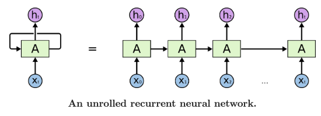
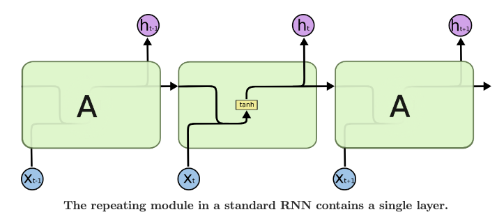
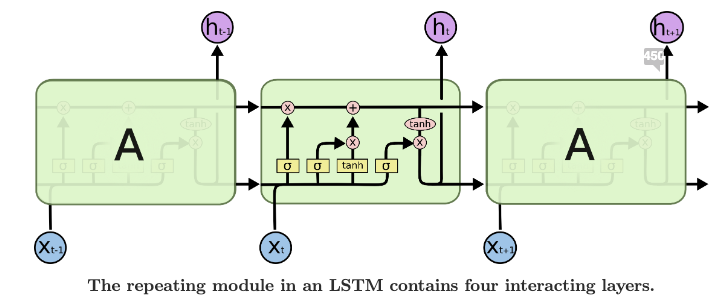
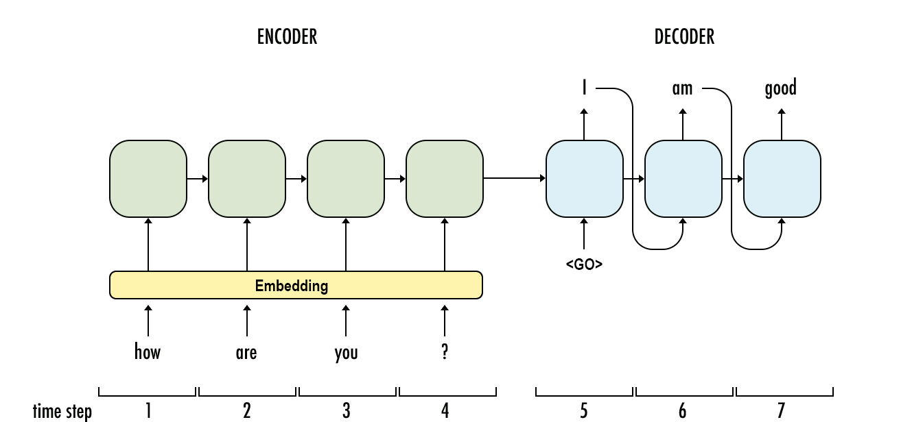
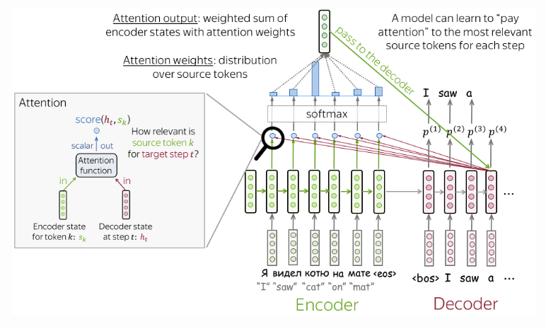
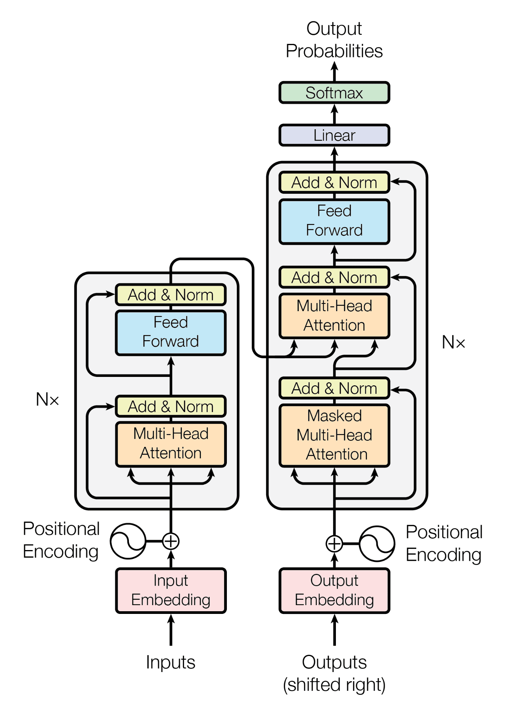

## 5 分钟速览（ETMI5）

在本课程的第一周，我们考察了两类机器学习模型的区别：生成式模型（LLM 属于这一类）和判别式模型。生成式模型擅长从数据中学习并创造出新的内容。本周，我们将通过回顾语言处理中所用神经网络的发展历史，来了解 LLM 是如何一步步发展起来的。我们从循环神经网络（Recurrent Neural Networks, RNN）的基础知识讲起，再逐步深入到更先进的架构，比如序列到序列（sequence-to-sequence）模型、注意力机制（attention mechanism）以及 Transformer。我们还会回顾一些早期使用了 Transformer 的语言模型，例如 BERT 和 GPT。最后，我们会谈谈今天所使用的 LLM 是如何建立在这些早期成果之上的。

## 生成式模型 vs 判别式模型

在第一周，我们简要介绍了生成式 AI（Generative AI）的概念。需要特别指出的是，所有机器学习模型都可以归入两大类之一：生成式（generative）或判别式（discriminative）。LLM 属于生成式这一类，也就是说，它们学习文本的特征，并将其生成出来以用于各种应用。虽然我们不会深入探讨其中复杂的数学细节，但理解生成式模型与判别式模型之间的区别，对于从整体上把握 LLM 的运作方式是很重要的：

### **生成式模型（Generative Models）**

生成式模型试图理解数据是如何被生成的。它们学习数据中的模式和结构，从而能够创造出新的、相似的数据点。

举个例子，如果你有一个用于生成狗狗图像的生成式模型，它会学习构成一只狗的特征和特性（比如毛发、耳朵和尾巴），然后就能够生成看起来很逼真的、全新的狗狗图像——哪怕这些图像此前从未出现过。

### **判别式模型（Discriminative Models）**

另一方面，判别式模型则专注于基于所接收到的输入来做出决策或预测。

仍以狗狗图像为例，判别式模型会查看一张图像，并判断它是否包含一只狗。它并不关心数据是如何被生成的；它只关心基于给定的输入做出正确的判断。

因此，生成式模型学习数据中潜在的模式以创造新的样本，而判别式模型则专注于基于输入数据做出决策或预测，而不关心数据是如何生成的。

**从本质上说，生成式模型负责"创造"，而判别式模型负责"分类"或"预测"。**

## 面向语言的神经网络

多年以来，神经网络一直是机器学习的重要组成部分。在这些模型中，有一类高度依赖神经网络的重要模型，被称为深度学习（deep learning）模型。最早被引入用于文本生成的神经网络类型，被称为循环神经网络（Recurrent Neural Network, RNN）。后来又陆续出现了一些带有改进的迭代版本，例如长短期记忆网络（Long Short-Term Memory networks, LSTM）、双向 LSTM（Bidirectional LSTM）以及门控循环单元（Gated Recurrent Units, GRU）。下面，让我们来看看 RNN 是如何生成文本的。

### 循环神经网络（RNN）

循环神经网络（RNN）是一类人工神经网络，专为处理序列数据而设计——它通过在网络架构内部引入循环（loop），使信息得以持续保留。传统的神经网络缺乏随时间保留信息的能力，而在处理诸如文本、音频或时间序列数据这类序列数据时，这会是一个重大的局限。

RNN 背后的基本原理是：它拥有构成有向环（directed cycle）的连接，使得信息能够从网络的某一步传递到下一步。这意味着，网络在某个特定时间步的输出，不仅取决于当前的输入，还取决于此前的输入以及网络的内部状态（internal state）——这一内部状态捕捉了来自更早时间步的信息。

图片来源：[https://colah.github.io/posts/2015-08-Understanding-LSTMs/](https://colah.github.io/posts/2015-08-Understanding-LSTMs/)

下面是对 RNN 工作原理的一个简化说明：

1. **输入处理（Input Processing）**：在每个时间步 $t$，RNN 接收一个输入 $x_t$。这个输入可以是序列中的单个元素（例如句子中的一个词），也可以是表示输入数据某种特征的特征向量。
2. **状态更新（State Update）**：输入 $x_t$ 会与网络在上一时间步的内部状态 $h_{t-1}$ 相结合，通过网络内部的一组带权连接（参数）产生新的状态 $h_t$。这一更新过程使网络能够保留来自此前时间步的信息。
3. **输出生成（Output Generation）**：当前状态 $h_t$ 被用于在当前时间步生成一个输出 $y_t$。这个输出可用于各种任务，例如分类、预测或序列生成。
4. **循环连接（Recurrent Connections）**：RNN 的关键特征在于存在循环连接，它使信息能够随时间在网络中流动。这些连接在网络内部形成了一种"记忆"，使其能够捕捉序列数据中的依赖关系和模式。

虽然 RNN 是处理序列数据的强大模型，但它们也存在一些局限性，比如难以学习长程依赖（long-range dependencies），以及在训练过程中出现的梯度消失/梯度爆炸（vanishing/exploding gradient）问题。为了解决这些问题，人们开发出了更先进的 RNN 变体，例如长短期记忆网络（LSTM）和门控循环单元（GRU）。这些架构引入了能够更好地处理长期依赖、并缓解梯度相关问题的机制，从而在各种序列数据任务上取得了更优的表现。

### 长短期记忆网络（LSTM）

因此，LSTM 网络是 RNN 的一个增强版本，它和 RNN 一样旨在更好地处理诸如文本之类的序列数据，但带有以下改进：

图片来源：[https://colah.github.io/posts/2015-08-Understanding-LSTMs/](https://colah.github.io/posts/2015-08-Understanding-LSTMs/)

1. **记忆单元（Memory Cell）**：LSTM 拥有一个特殊的记忆单元，能够随时间存储信息。
2. **门控机制（Gating Mechanism）**：LSTM 使用"门"来控制信息流入和流出记忆单元：
    - 输入门（Input Gate）：决定保留多少新信息。
    - 遗忘门（Forget Gate）：决定遗忘多少旧信息。
    - 输出门（Output Gate）：决定输出当前单元状态中的多少内容。
3. **梯度流动（Gradient Flow）**：LSTM 有助于梯度在训练过程中更好地流动，这有利于从长序列数据中进行学习。
4. **学习长期依赖（Learning Long-Term Dependencies）**：LSTM 擅长记住序列中较早出现的重要信息，这使它们在那些需要理解长距离上下文的任务中非常有用。

因此，LSTM 在处理序列时表现更好——它能够记住重要信息、遗忘不需要的内容，这使得它在诸如语言处理之类的任务中比传统 RNN 更为有效。

无论是 RNN 还是 LSTM（及其变体），都被广泛用于语言建模任务，其目标是预测一个词序列中的下一个词。它们能够学习语言的潜在结构并生成连贯的文本。然而，它们难以处理长度可变的输入序列，也难以生成长度可变的输出序列，因为它们固定大小的隐藏状态限制了其捕捉长程依赖、并随时间维持上下文的能力。

### 序列到序列（Seq2Seq）模型

这正是序列到序列（Sequence-to-Sequence, Seq2Seq）模型登场的地方；它们采用了编码器-解码器（encoder-decoder）架构来工作：输入序列由编码器（encoder）编码成一个固定大小的表示（即上下文向量，context vector），然后再由解码器（decoder）解码成一个输出序列。这种架构使 Seq2Seq 模型能够处理长度可变的序列，并在生成相应输出序列的同时，有效捕捉输入序列的语义含义和结构。下图描绘了一个简单的 Seq2Seq 模型。Seq2Seq 中的每个单元本质上仍然是一种 RNN 类型的架构。

为了简洁起见，这里我们不会过于深入地探讨其内部机制，对此感兴趣的读者可以阅读[这篇](https://www.analyticsvidhya.com/blog/2020/08/a-simple-introduction-to-sequence-to-sequence-models/#:~:text=Sequence%20to%20Sequence%20(often%20abbreviated,Chatbots%2C%20Text%20Summarization%2C%20etc.)非常不错的文章：

图片来源：[https://towardsdatascience.com/sequence-to-sequence-model-introduction-and-concepts-44d9b41cd42d](https://towardsdatascience.com/sequence-to-sequence-model-introduction-and-concepts-44d9b41cd42d)

### Seq2Seq 模型 + 注意力机制

图片来源：[https://lena-voita.github.io/nlp_course/seq2seq_and_attention.html](https://lena-voita.github.io/nlp_course/seq2seq_and_attention.html)

传统 Seq2Seq 模型的问题在于，它们无法有效处理较长的输入序列，尤其是在生成长度可变的输出序列时。在标准的 Seq2Seq 模型中，使用一个固定长度的上下文向量来概括整个输入序列，这可能导致信息丢失，对于长序列而言尤为明显。此外，在生成输出序列时，解码器可能难以聚焦于输入序列中相关的部分，从而导致翻译或预测的效果不够理想。

为了解决这些问题，人们引入了注意力机制（attention mechanism）。注意力机制使 Seq2Seq 模型能够在解码过程中动态地聚焦于输入序列的不同部分。

**注意力机制的工作原理如下：**

1. **编码器表示（Encoder Representation）**：首先，输入序列由编码器进行处理。编码器将输入序列中的每个词或元素转换成一个隐藏状态（hidden state）。这些隐藏状态代表了输入序列的不同部分，并包含了关于序列内容和结构的信息。
2. **计算注意力权重（Calculating Attention Weights）**：在解码过程中，解码器需要决定聚焦于输入序列的哪些部分。为此，它会计算注意力权重（attention weights）。这些权重表示每个编码器隐藏状态对于当前解码步骤的相关性或重要性。本质上，模型是在尝试判断输入序列中的哪些部分对于生成下一个输出 token 最为相关。
3. **Softmax 归一化（Softmax Normalization）**：在计算出注意力权重之后，模型使用 softmax 函数对其进行归一化。这确保了注意力权重之和为 1，从而有效地将它们转化为一个概率分布。通过这样做，模型能够确保自己把注意力恰当地分配到输入序列的不同部分。
4. **加权求和（Weighted Sum）**：在计算并归一化注意力权重之后，模型接着对编码器隐藏状态进行加权求和。本质上，它根据注意力权重所确定的重要性或相关性，将来自输入序列不同部分的信息组合起来。这个加权和代表了从输入序列中"被关注到"的信息，聚焦于对当前解码步骤最相关的部分。
5. **将上下文与解码器状态相结合（Combining Context with Decoder State）**：最后，从加权求和中得到的上下文向量会与解码器的当前状态相结合。这个组合后的表示同时包含了来自输入序列的信息（通过上下文向量）和解码器先前的状态信息。它将作为生成解码器在当前解码步骤输出的依据。
6. **在每个解码步骤重复（Repeating for Each Decoding Step）**：步骤 2 到 5 会在每个解码步骤中重复进行，直到生成序列结束标记（end-of-sequence token）或达到最大长度为止。在每一步，注意力机制都帮助模型决定该把注意力聚焦于输入序列中的何处，从而使其能够生成准确且符合上下文的输出序列。

### Transformer 模型

带注意力机制的 Seq2Seq 模型的问题在于，它们的计算效率较低，并且无法有效地跨越长序列捕捉依赖关系。虽然注意力机制显著提升了模型在解码过程中聚焦于输入序列相关部分的能力，但它们也带来了额外的计算开销，因为需要在每个解码步骤都计算注意力权重。此外，正如我们之前提到的，带注意力机制的传统 Seq2Seq 模型仍然依赖于 RNN 或 LSTM 网络，而这些网络在捕捉长程依赖方面存在局限。

为了解决这些局限性、并提升序列到序列任务的效率与效果，Transformer 模型应运而生。下面是 Transformer 模型如何解决带注意力机制的 Seq2Seq 模型所存在的问题：

图片来源：[https://arxiv.org/pdf/1706.03762.pdf](https://arxiv.org/pdf/1706.03762.pdf)

1. **自注意力机制（Self-Attention Mechanism）**：Transformer 模型不再仅仅依赖编码器与解码器之间的注意力机制，而是引入了自注意力机制（self-attention mechanism）。该机制允许输入序列中的每个位置去关注所有其他位置，从而同时捕捉整个输入序列范围内的依赖关系。与带注意力机制的传统 Seq2Seq 模型相比，自注意力能够更有效地捕捉长程依赖。
2. **并行化（Parallelization）**：Transformer 模型依赖于自注意力层，而这些层可以针对输入序列中的每个位置并行计算。与按顺序逐步处理序列的、带有循环层的传统 Seq2Seq 模型相比，这种并行化极大地提升了模型的计算效率。因此，Transformer 模型能够更快地处理序列，使其更适合处理长序列和大规模数据集。
3. **位置编码（Positional Encoding）**：由于 Transformer 模型不使用循环层，它本身缺乏关于输入序列中元素顺序的信息。为了解决这个问题，人们在输入的 embedding 中加入了位置编码（positional encoding），以提供序列中每个元素的位置信息。位置编码使模型能够根据位置来区分不同的元素，从而确保模型可以有效地处理具有顺序的序列。
4. **Transformer 架构（Transformer Architecture）**：Transformer 模型采用了与传统 Seq2Seq 模型类似的编码器-解码器架构。但它用自注意力层替换了循环层，使模型能够更高效地捕捉跨越长序列的依赖关系。此外，Transformer 架构具备更高的灵活性和可扩展性，使其更易于在各种任务和数据集上进行训练和部署。

总而言之，Transformer 模型通过引入自注意力机制、并行化、位置编码以及灵活的架构，解决了带注意力机制的 Seq2Seq 模型所存在的局限。这些进步提升了模型捕捉长程依赖、高效处理序列的能力，并使其在各种序列到序列任务上达到了最先进（state-of-the-art）的表现。

### 早期的语言模型

尽管 LLM 近来获得了广泛关注，尤其是随着 OpenAI 的 GPT 等模型的出现，但我们也应当认识到，这一架构的基础早已由一些更早期的模型奠定，例如下面将要介绍的 BERT、GPT（较旧的版本）和 T5。

诸如 BERT（Bidirectional Encoder Representations from Transformers，基于 Transformer 的双向编码器表示）、GPT（Generative Pre-trained Transformer，生成式预训练 Transformer）和 T5（Text-To-Text Transfer Transformer，文本到文本迁移 Transformer）这样的 LLM，都通过以下步骤建立在 Transformer 模型（前文已介绍）所引入的概念之上：

1. **预训练与微调（Pre-training and Fine-Tuning）**：这些模型采用了预训练加微调的方法。在预训练阶段，模型使用无监督学习目标（例如 BERT 的掩码语言建模、GPT 的自回归语言建模，或 T5 的文本到文本预训练）在大规模语料上进行训练。这一预训练阶段使模型能够从海量文本数据中学习到丰富的语言表示和通用知识。预训练之后，模型可以在带标注数据的特定下游任务上进行微调，从而使其能够调整所学到的表示，以执行各种 NLP 任务，比如文本分类、问答和机器翻译。
2. **双向上下文（Bidirectional Context）**：BERT 通过采用掩码语言建模（masked language modeling）目标，引入了双向上下文建模。与从左到右或从右到左处理文本不同，BERT 能够同时考虑来自两个方向的上下文——它会掩盖部分输入 token，并基于周围的上下文来预测这些 token。这种双向上下文建模使 BERT 能够捕捉文本中更深层次的语义关系和依赖，从而在各种 NLP 任务上取得更优的表现。
3. **自回归生成（Autoregressive Generation）**：GPT 模型利用了自回归生成（autoregressive generation），即模型基于此前已生成的 token 来预测序列中的下一个 token。这种方法使 GPT 模型能够通过考虑已生成序列的整个历史，来生成连贯且符合上下文的文本。GPT 模型在涉及生成自然语言的任务上尤为有效，例如文本生成、对话生成和摘要。
4. **文本到文本方法（Text-to-Text Approach）**：T5 引入了一个统一的文本到文本框架，将所有 NLP 任务都构建为文本到文本的映射问题。这一方法将翻译、分类、摘要和问答等各种 NLP 任务统一到了单一框架之下，从而简化了训练和部署过程。T5 通过把每个任务的输入和输出都表示为文本字符串来实现这一点，使模型能够学习一个可应用于不同任务的单一映射函数。
5. **大规模训练（Large-Scale Training）**：这些模型在包含数十亿 token 的大规模数据集上进行训练，借助了海量的计算资源和分布式训练技术。通过在大量数据上、利用强大的硬件进行训练，这些模型能够捕捉丰富的语言模式和语义关系，从而在各种 NLP 任务上带来显著的性能提升。

### 大语言模型

最新的模型，例如 Llama 和 ChatGPT，在若干关键方面相较于 BERT、GPT 等早期模型实现了显著的进步：

1. **任务专门化（Task Specialization）**：早期的 LLM（如 BERT 和 GPT）被设计用于执行范围广泛的 NLP 任务，包括文本分类、语言生成和问答；而 Llama、ChatGPT 等较新的模型则更为专门化。例如，Llama 专门针对多模态任务进行了优化，比如图像描述（image captioning）和视觉问答（visual question answering），而 ChatGPT 则针对对话类应用进行了优化，比如对话生成和聊天机器人。
2. **多模态能力（Multimodal Capabilities）**：Llama 等近期的 LLM 整合了多模态能力，使它们能够结合图像、音频、视频等其他模态来处理和生成文本。这使 LLM 能够执行那些需要跨多种模态理解和生成内容的任务，为图像描述、视频摘要和多模态对话系统等应用开辟了新的可能性。
3. **效率提升（Improved Efficiency）**：LLM 架构与训练方法的近期进展带来了效率上的提升，使 Llama、ChatGPT 等模型能够以更少的参数和计算资源，达到与其前辈相当的性能。这种效率的提升让在实际应用中部署这些模型变得更加可行，也减少了训练大型模型所带来的环境影响。
4. **微调与迁移学习（Fine-Tuning and Transfer Learning）**：ChatGPT 等 LLM 常常会在特定的数据集或任务上进行微调，以进一步提升其在目标领域中的表现。通过在特定领域的数据上进行微调，这些模型能够调整其预训练得到的知识，以更好地满足特定应用的需求，从而带来更优的性能和泛化能力。
5. **交互式与动态响应（Interactive and Dynamic Responses）**：ChatGPT 及类似的对话模型被设计为能够在自然语言对话中生成交互式、动态的响应。这些模型利用对话中此前轮次的上下文来生成更连贯、更符合上下文的响应，使它们更适合在聊天机器人应用和对话系统中实现类人般的交互。

## 阅读/观看这些资源（可选）

1. 理解 LSTM 网络：[https://colah.github.io/posts/2015-08-Understanding-LSTMs/](https://colah.github.io/posts/2015-08-Understanding-LSTMs/)
2. 序列到序列（seq2seq）与注意力机制：[https://lena-voita.github.io/nlp_course/seq2seq_and_attention.html](https://lena-voita.github.io/nlp_course/seq2seq_and_attention.html)
3. 序列到序列模型：[https://www.youtube.com/watch?v=kklo05So99U](https://www.youtube.com/watch?v=kklo05So99U)
4. 注意力机制在深度学习中如何工作：理解序列模型中的注意力机制：[https://theaisummer.com/attention/](https://theaisummer.com/attention/)
5. LLM 入门：
    1. [https://www.youtube.com/watch?v=zjkBMFhNj_g&t=1845s](https://www.youtube.com/watch?v=zjkBMFhNj_g&t=1845s)
    2. [https://www.youtube.com/watch?v=zizonToFXDs](https://www.youtube.com/watch?v=zizonToFXDs)
6. Transformer：[https://www.youtube.com/watch?v=wl3mbqOtlmM](https://www.youtube.com/watch?v=wl3mbqOtlmM)

## 阅读这些论文（可选）

1. [https://arxiv.org/abs/1706.03762](https://arxiv.org/abs/1706.03762)
2. [https://arxiv.org/abs/2005.14165](https://arxiv.org/abs/2005.14165)
3. [https://arxiv.org/abs/1910.10683](https://arxiv.org/abs/1910.10683)
