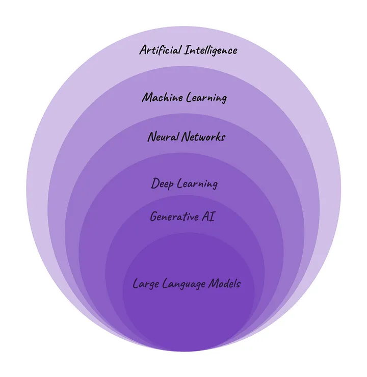
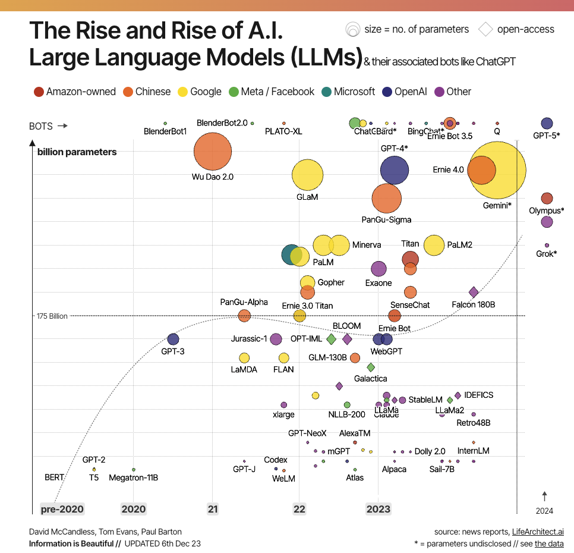
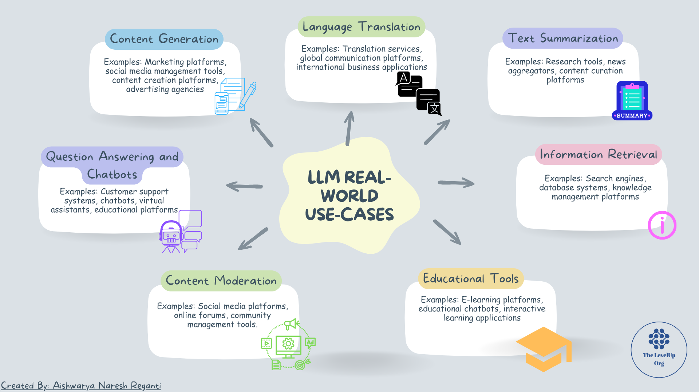
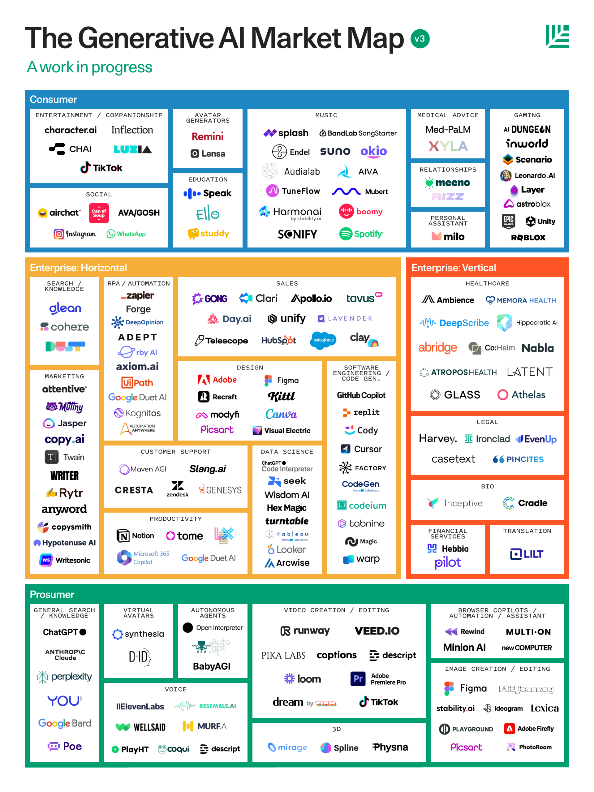
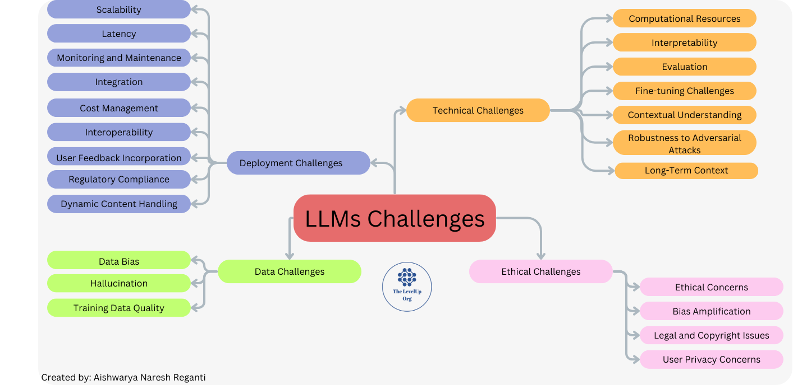

## 5 分钟速览

在本部分课程中，我们将深入探讨大语言模型（LLM）的内部机理。我们首先回顾人工智能（AI）、机器学习（ML）、神经网络（NN）和生成式 AI（GenAI）的历史背景与基础概念，然后剖析 LLM 的核心特征，重点关注它们的规模、在多样化数据集上的大规模训练，以及模型参数的作用。接着，我们会讨论使用 LLM 所面临的各类挑战。

在下一节中，我们将探索 LLM 在各个领域的实际应用，强调它们在内容生成、语言翻译、文本摘要、问答等场景中的多样性。本节最后会分析部署 LLM 时遇到的挑战，涵盖可扩展性、延迟、监控等关键方面。

总而言之，本部分课程为大语言模型提供了一次实用且翔实的探索，让你深入了解它们的演进、功能、应用、挑战以及对现实世界的影响。

## 历史与背景

图片来源：[https://medium.com/womenintechnology/ai-c3412c5aa0ac](https://medium.com/womenintechnology/ai-c3412c5aa0ac)

上图中提到的这些术语，很可能在你讨论 ChatGPT 时就出现过。这张图直观地展示了它们在层级关系中的位置。AI 是一个宏大的领域，LLM 是其中一个特定的子领域，而 ChatGPT 则是这一语境下 LLM 的典型代表。

简单来说，<strong>人工智能（AI）</strong>是计算机科学的一个分支，致力于创造具有类人思维与行为的机器。<strong>机器学习（ML）</strong>是 AI 的一个子领域，让计算机无需显式编程就能从数据中学习模式并做出预测。<strong>神经网络（NN）</strong>是 ML 的一个子集，它模仿人脑的结构，在深度学习算法中至关重要。深度学习（DL）是神经网络的一个子集，擅长解决复杂问题，例如图像识别和语言翻译技术。<strong>生成式 AI（GenAI）</strong>是深度学习的一个子集，能够基于所学到的模式创造多样化的内容。<strong>大语言模型（LLM）</strong>是生成式 AI 的一种形式，专门通过学习海量文本数据来生成类人文本。

生成式 AI 和大语言模型（LLM）已经彻底改变了人工智能领域，让机器能够创造文本、图像、音乐、音频和视频等多样化内容。与用于分类的判别式模型不同，生成式 AI 模型通过学习人类创作数据集中的模式与关联来生成全新内容。

生成式 AI 的核心是基础模型（foundation model），它本质上是指能够多任务处理的大型 AI 模型，可以开箱即用地完成摘要、问答、分类等任务。这些模型——比如人尽皆知的 ChatGPT——只需极少量训练就能适配到具体用例，并用极少的示例数据生成内容。

生成式 AI 的训练通常采用监督学习（supervised learning），即向模型提供人类创作的内容及其对应标签。通过从这些数据中学习，模型逐渐擅长生成与训练集相似的内容。

生成式 AI 并不是一个新概念。早期生成式 AI 的一个著名例子是马尔可夫链（Markov chain），这是俄国数学家 Andrey Markov 于 1906 年提出的统计模型。马尔可夫模型最初被用于下一词预测等任务，但其简单性限制了它生成可信文本的能力。

多年来，随着更强大的架构和更大的数据集出现，整个格局发生了显著变化。2014 年，生成对抗网络（GAN）应运而生，它使用两个协同工作的模型——一个生成输出，另一个负责区分真实数据与生成的输出。以 StyleGAN 等模型为代表的这种方法，大幅提升了生成内容的逼真度。

一年后，扩散模型（diffusion model）问世，它通过迭代式地优化输出，生成与训练数据集相似的新数据样本。以 Stable Diffusion 为代表的这一创新，催生了看起来非常逼真的图像。

2017 年，Google 提出了 Transformer 架构，这是自然语言处理领域的一次重大突破。Transformer 将每个词编码为一个 token，并生成一张注意力图（attention map）来捕捉 token 之间的关系。这种对上下文的关注增强了模型生成连贯文本的能力，ChatGPT 等大语言模型便是典型代表。

生成式 AI 的爆发不仅得益于更大的数据集，也得益于多样化的研究进展。GAN、扩散模型和 Transformer 等方法，共同展现了推动生成式 AI 这一激动人心领域发展的方法之广度。

## LLM 登场

大语言模型（LLM）中的"大"（Large），指的是这些模型的庞大规模——既包括其架构的体量，也包括它们所训练数据的海量规模。规模之所以重要，是因为它让模型能够捕捉语言中更复杂的模式与关联。GPT-3、Gemini、Claude 等流行的 LLM 拥有数千亿级别的模型参数。在机器学习的语境中，模型参数就像算法在训练过程中调节的旋钮和开关，用来做出准确的预测或生成有意义的输出。

接下来，我们拆解一下这里的"语言模型"（Language Model）指什么。语言模型本质上是经过训练以理解和生成类人文本的算法或系统。它们是语言运作方式的一种表征，通过从多样化数据集中学习，来预测在给定上下文中接下来可能出现的词或词序列。

"大"这个特性放大了它们的能力。传统的语言模型，尤其是早期的那些，规模较小，无法有效捕捉语言的精妙之处。随着技术进步和海量算力的普及，我们得以构建更大的模型。这些大语言模型，如 ChatGPT，拥有数十亿个参数，这些参数本质上就是模型用来理解语言的变量。

看看下面这张来自"Information is beautiful"的信息图，了解近期的 LLM 拥有多少参数。你可以在[这里](https://informationisbeautiful.net/visualizations/the-rise-of-generative-ai-large-language-models-llms-like-chatgpt/)查看动态可视化。

图片来源：[https://informationisbeautiful.net/visualizations/the-rise-of-generative-ai-large-language-models-llms-like-chatgpt/](https://informationisbeautiful.net/visualizations/the-rise-of-generative-ai-large-language-models-llms-like-chatgpt/)

## 训练 LLM

训练 LLM 是一个复杂的过程，它要让模型学会理解和生成类人文本。下面是 LLM 训练原理的简化拆解：

1. **提供输入文本：**
    - LLM 最初会接触海量文本数据，涵盖书籍、文章、网站等各类来源。
    - 训练期间，模型的任务是根据给定的上下文，预测序列中的下一个词或 token。它在此过程中学习文本数据中的模式与关联。
2. **优化模型权重：**
    - 模型由与其参数相关联的不同权重组成，这些权重反映了各种特征的重要程度。
    - 在整个训练过程中，这些权重被微调以最小化错误率。目标是提升模型预测下一个词的准确度。
3. **微调参数值：**
    - LLM 会根据预测过程中收到的误差反馈，持续调整参数值。
    - 模型通过迭代式地调整参数来不断完善对语言的把握，从而提升预测后续 token 的准确度。

训练过程可能因所开发 LLM 的具体类型而异，例如针对连续文本优化的模型与针对对话优化的模型就有所不同。

LLM 的性能主要受两个关键因素影响：

- **模型架构：** LLM 架构的设计与复杂程度，影响其捕捉语言细微差别的能力。
- **数据集：** 用于训练的数据集的质量与多样性，对塑造模型的语言理解能力至关重要。

训练一个私有的 LLM 需要大量的计算资源和专业知识。整个过程的耗时可能从数天到数周不等，取决于模型的复杂度和数据集规模。通常会采用基于云的方案和高性能 GPU 来加速训练，使其更加高效。总体而言，LLM 训练是一项细致且资源密集的工程，为模型的语言理解与生成能力奠定了基础。

在完成初始训练后，LLM 可以借助相对小规模的监督数据，轻松适配各种任务，这一过程被称为微调（Fine-tuning）。

目前有三种常见的学习模式：

1. **零样本学习（Zero-shot learning）：** 基础 LLM 无需显式训练即可处理各种各样的请求，通常通过提示词（prompt）来完成，不过回答的准确度可能参差不齐。
2. **少样本学习（Few-shot learning）：** 通过提供少量相关的训练示例，基础模型在特定领域的表现会显著提升。
3. **领域自适应（Domain Adaptation）：** 这是少样本学习的延伸，从业者会用与特定应用或领域相关的额外数据来训练基础模型，调整其参数。

我们将在课程中深入探讨上述每一种方法。

## LLM 的真实世界用例

LLM 已经被应用于各种场景，展现出这些模型的多样性以及变革多个领域的强大能力。下面来看 LLM 如何应用于具体场景：

1. **内容生成：**
    - LLM 擅长内容生成，它们能理解上下文并生成连贯且切合语境的文本。它们可用于自动生成营销、社交媒体帖子及其他传播材料的创意内容，确保高质量与高相关性。
    - **真实世界应用：** 营销平台、社交媒体管理工具、内容创作平台、广告公司
2. **语言翻译：**
    - LLM 能够理解不同语言的细微差别，从而显著改善语言翻译任务。它们可以提供准确且贴合上下文的翻译，对于在多语言环境中运营的企业而言是宝贵的工具，能够增强全球范围的沟通与触达。
    - **真实世界应用：** 翻译服务、全球沟通平台、国际业务应用
3. **文本摘要：**
    - LLM 擅长通过识别关键信息、保留核心要旨来对冗长文档进行摘要。这一能力对于内容创作者、研究人员以及希望从海量文本中快速提炼核心洞见的企业非常有价值，能够提升信息获取的效率。
    - **真实世界应用：** 研究工具、新闻聚合器、内容策展平台
4. **问答与聊天机器人：**
    - LLM 可用于问答任务，它们能理解问题的上下文并生成相关且准确的回答。这使得相关系统能够进行更自然、更贴合语境的对话，理解用户的查询并给出相关回应。
    - **真实世界应用：** 客户支持系统、聊天机器人、虚拟助手、教育平台
5. **内容审核：**
    - LLM 可用于内容审核，通过分析文本来识别潜在的不当或有害内容。这有助于通过自动标记或过滤违反规范的内容来维护安全、文明的网络环境，保障用户安全。
    - **真实世界应用：** 社交媒体平台、在线论坛、社区管理工具
6. **信息检索：**
    - LLM 能够理解用户查询，并从大型数据集中检索相关信息，从而增强信息检索系统。这在搜索引擎、数据库和知识管理系统中尤其有用，LLM 可以提升搜索结果的准确性。
    - **真实世界应用：** 搜索引擎、数据库系统、知识管理平台
7. **教育工具：**
    - LLM 通过为学习平台提供自然语言接口，为教育工具赋能。它们可以帮助学生生成摘要、回答问题，并参与互动式学习对话，从而带来个性化、高效的学习体验。
    - **真实世界应用：** 在线学习平台、教育聊天机器人、互动学习应用

热门 LLM 用例汇总

| 序号 | 用例 | 描述 |
| --- | --- | --- |
| 1 | 内容生成 | 根据给定指令创作类人文本、视频、代码和图像 |
| 2 | 语言翻译 | 将一种语言翻译为另一种语言 |
| 3 | 文本摘要 | 对冗长文本进行摘要，通过提炼要点简化理解 |
| 4 | 问答与聊天机器人 | LLM 可凭借其海量知识为查询提供相关答案 |
| 5 | 内容审核 | 通过识别并过滤不当或有害的语言来协助内容审核 |
| 6 | 信息检索 | 从大型数据集或文档中检索相关信息 |
| 7 | 教育工具 | 进行辅导、提供讲解并生成学习材料 |

要理解生成式 AI 模型（尤其是 LLM）的应用方式，还可以从这一领域大量活跃的创业公司中窥见一斑。Sequoia Capital 发布的一张[信息图](https://www.sequoiacap.com/article/generative-ai-act-two/)展示了横跨各个行业的这些公司，呈现出生成式 AI 领域中多样化的应用场景以及众多参与者的庞大规模。

图片来源：[https://markovate.com/blog/applications-and-use-cases-of-llm/](https://markovate.com/blog/applications-and-use-cases-of-llm/)

## LLM 面临的挑战

尽管 LLM 无疑已经变革了各种应用，但仍存在诸多挑战。这些挑战可归为以下几个主题：

- **数据挑战：** 涉及用于训练的数据，以及模型如何应对数据缺口或缺失。
- **伦理挑战：** 涉及在部署 LLM 时如何缓解偏见、保障隐私，以及防止生成有害内容等问题。
- **技术挑战：** 这些挑战聚焦于 LLM 的实际落地实现。
- **部署挑战：** 关注将功能完备的 LLM 转化为真实世界用例（即生产化）所涉及的具体流程。

**数据挑战：**

1. **数据偏见：** 训练数据中存在的偏见与失衡，会导致模型输出带有偏见。
2. **有限的世界知识与幻觉：** LLM 可能缺乏对真实世界事件和信息的全面理解，并倾向于"幻觉"出信息。需要注意的是，用新数据来训练它们是一个漫长且昂贵的过程。
3. **对训练数据质量的依赖：** LLM 的性能极大地受到训练数据质量与代表性的影响。

**伦理与社会挑战：**

1. **伦理担忧：** 对于语言模型负责任、合乎伦理使用的担忧，尤其是在敏感场景中。
2. **偏见放大：** 训练数据中存在的偏见可能被进一步加剧，导致不公平或带有歧视性的输出。
3. **法律与版权问题：** 生成的内容可能侵犯版权或违反法律，从而引发潜在的法律纠纷。
4. **用户隐私担忧：** 基于用户输入生成文本所带来的风险，尤其是在处理私密或敏感信息时。

**技术挑战：**

1. **计算资源：** 训练和部署大语言模型需要巨大的算力。
2. **可解释性：** 难以理解和解释复杂模型的决策过程。
3. **评估：** 评估是一项突出的挑战，因为跨越多样化任务与领域来评估模型的方案设计得并不完善，尤其是自由生成内容所带来的难题。
4. **微调挑战：** 难以将预训练模型适配到特定任务或领域。
5. **上下文理解：** LLM 在较长篇幅或对话中可能难以保持连贯的上下文。
6. **对抗攻击的鲁棒性：** 易受输入数据的蓄意操纵，从而导致错误输出。
7. **长程上下文：** 在较长篇幅的文本或讨论中难以保持上下文与连贯性。

**部署挑战：**

1. **可扩展性：** 确保模型能够高效扩展，以应对生产环境中不断增加的工作负载和需求。
2. **延迟：** 最小化模型的响应时间或延迟，以提供快速高效的交互，尤其是在实时应用中。
3. **监控与维护：** 构建健全的监控系统，以追踪模型性能、检测问题，并进行定期维护以避免停机。
4. **与现有系统集成：** 确保 LLM 能与组织内现有的软件、数据库和基础设施平滑集成。
5. **成本管理：** 优化部署和维护大语言模型的成本，因为它们在计算和存储方面都可能十分消耗资源。
6. **安全担忧：** 应对在生产环境中部署语言模型所带来的潜在安全漏洞与风险，包括防范恶意攻击。
7. **互操作性：** 确保与整个生产流水线中可能涉及的其他工具、框架或系统兼容。
8. **用户反馈的纳入：** 开发相应机制以纳入用户反馈，从而在生产环境中持续改进和更新模型。
9. **合规性：** 遵守监管要求与合规标准，尤其是在数据保护和隐私法规严格的行业。
10. **动态内容处理：** 在内容和用户交互频繁变化的动态环境中，管理文本的生成。

## 扩展阅读/观看资源（选读）

1. [https://www.nvidia.com/en-us/glossary/generative-ai/](https://www.nvidia.com/en-us/glossary/generative-ai/)
2. [https://markovate.com/blog/applications-and-use-cases-of-llm/](https://markovate.com/blog/applications-and-use-cases-of-llm/)
3. [https://www.sequoiacap.com/article/generative-ai-act-two/](https://www.sequoiacap.com/article/generative-ai-act-two/)
4. [https://datasciencedojo.com/blog/challenges-of-large-language-models/](https://datasciencedojo.com/blog/challenges-of-large-language-models/)
5. [https://snorkel.ai/enterprise-llm-challenges-and-how-to-overcome-them/](https://snorkel.ai/enterprise-llm-challenges-and-how-to-overcome-them/)
6. [https://www.youtube.com/watch?v=MyFrMFab6bo](https://www.youtube.com/watch?v=MyFrMFab6bo)
7. [https://www.youtube.com/watch?v=cEyHsMzbZBs](https://www.youtube.com/watch?v=cEyHsMzbZBs)

## 推荐论文（选读）

1. [https://dl.acm.org/doi/abs/10.1145/3605943](https://dl.acm.org/doi/abs/10.1145/3605943)
2. [https://www.sciencedirect.com/science/article/pii/S2950162823000176](https://www.sciencedirect.com/science/article/pii/S2950162823000176)
3. [https://arxiv.org/pdf/2303.13379.pdf](https://arxiv.org/pdf/2303.13379.pdf)
4. [https://proceedings.mlr.press/v202/kandpal23a/kandpal23a.pdf](https://proceedings.mlr.press/v202/kandpal23a/kandpal23a.pdf)
5. [https://link.springer.com/article/10.1007/s12599-023-00795-x](https://link.springer.com/article/10.1007/s12599-023-00795-x)
