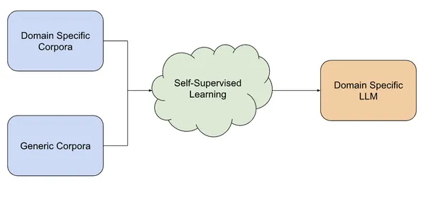
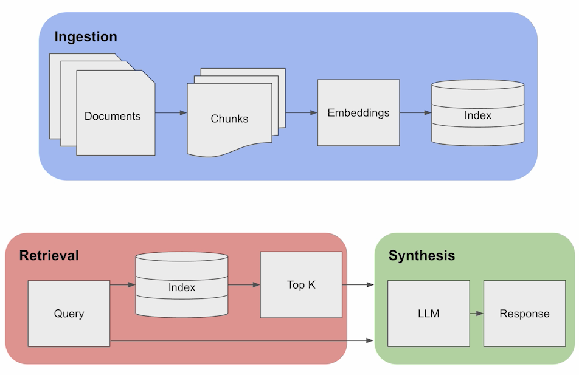
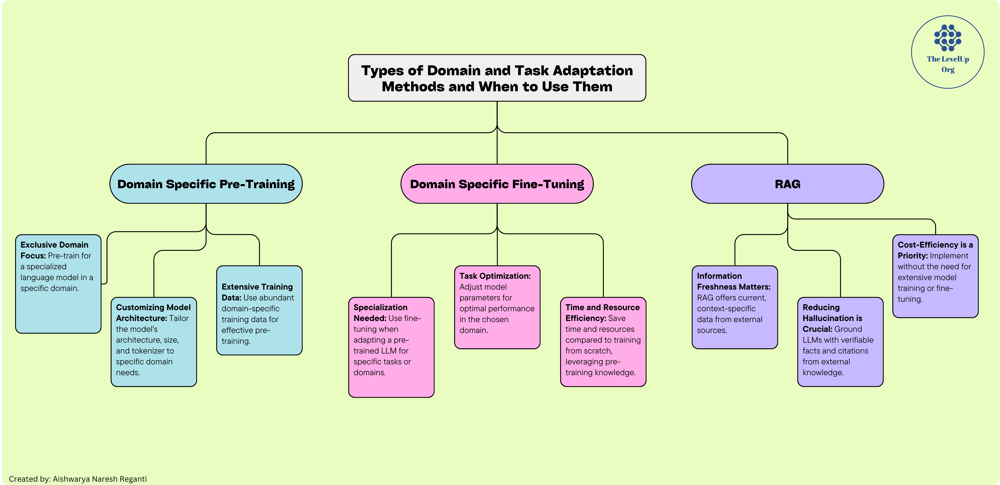

## 5 分钟速览（ETMI5）

本节深入探讨通用 AI 模型在专业领域中的局限，强调领域自适应（Domain Adaptation）LLM 的重要意义。我们会剖析这类模型的优势，包括理解的深度、表达的精准、更好的用户体验，以及对隐私问题的处理。

我们将介绍三类领域自适应方法：领域预训练（Domain-Specific Pre-Training）、领域微调（Domain-Specific Fine-Tuning）以及检索增强生成（RAG，Retrieval Augmented Generation）。每种方法都会给出概览，说明其类型、训练耗时和简要总结。随后我们会结合真实案例对每种方法做进一步展开。最后，我们会总体梳理：相较于直接更新模型的方法，何时应该选用 RAG。

## 有效使用 LLM

像 ChatGPT 这样的通用 AI 模型，在各类主题上都展现出了令人印象深刻的文本生成能力，但它们往往缺乏特定领域所需的理解深度与细腻把握。此外，这类模型更容易生成不准确或与语境不符的内容，也就是所谓的"幻觉（hallucination）"。举例来说，在医疗领域，诸如"电子健康档案互操作性（electronic health record interoperability）"或"以患者为中心的医疗之家（patient-centered medical home）"这样的术语具有重要意义，但由于缺乏针对医疗数据的专门训练，通用语言模型可能难以充分理解它们的内涵与重要性。这正是任务专用和领域专用 LLM 发挥关键作用的地方。这类模型需要掌握行业特定的术语与实践知识，才能确保对领域概念的准确解读。在本课程接下来的内容里，我们会把这类专门化的 LLM 称为 **领域专用 LLM（domain-specific LLM）**，这是业界对此类模型的常见叫法。

使用领域专用 LLM 有以下一些好处：

1. **深度与精准**：通用 LLM 虽然能够生成涵盖各种主题的文本，但可能缺乏专业领域所需的深度与细腻。领域专用 LLM 则经过定制，能够理解并解读行业特定术语，从而保证理解上的精准。
2. **克服固有局限**：通用 LLM 存在潜在的不准确、缺乏上下文、易产生幻觉等局限。在金融、医疗这类术语至关重要的领域，领域专用 LLM 能够提供准确且贴合语境的信息。
3. **更好的用户体验**：领域专用 LLM 能够给出量身定制、个性化的回应，从而提升用户体验。在客服聊天机器人或动态 AI 智能体等应用中，这些模型借助专门知识提供更准确、更有洞见的信息。
4. **更高的效率与生产力**：企业可以从领域专用 LLM 带来的效率提升中获益。通过自动化任务、生成符合行业术语的内容、精简流程，这些模型把人力解放出来去做更高层次的工作，最终提升生产力。
5. **应对隐私问题**：在处理敏感数据的行业（如医疗）中，使用通用 LLM 可能带来隐私方面的挑战。领域专用 LLM 可以提供一个封闭框架，确保机密数据受到保护，并符合隐私协议的要求。

如果你还记得[上一篇](https://www.notion.so/Week-1-Applied-LLM-Foundations-369ae7cf630d467cbfeedd3b9b3bfc46?pvs=21)的内容，我们曾提到在具体场景中使用 LLM 有多种方式，即：

1. **零样本学习（Zero-shot learning）**
2. **少样本学习（Few-shot learning）**
3. **领域自适应（Domain Adaptation）**

零样本学习和少样本学习，是通过给出示例或用具体的目标问题进行提示，来指导通用模型完成任务。另一个引入的概念是领域自适应，它将是本节的主要关注点。关于前两种方法的更多细节，我们会在后面讲到提示（prompting）这一主题时再深入展开。

## 领域自适应方法的类型

将领域知识融入 LLM 有多种方法，每种方法各有优劣。下面是三类典型的做法：

1. **领域预训练（Domain-Specific Pre-Training）：**
    - ***训练耗时**：* 数天到数周乃至数月
    - ***总结**：* 需要大量领域训练数据；可以定制模型架构、规模、分词器等

    在这种方法中，LLM 会在大量代表各类自然语言用例的数据集上进行预训练。例如，PaLM 540B、GPT-3、LLaMA 2 等模型就是在规模从 4990 亿到 2 万亿 token 不等的数据集上预训练的。领域预训练的例子包括：用于蛋白质序列的 ESMFold、ProGen2，用于科学的 Galactica，用于金融的 BloombergGPT，以及用于代码的 StarCoder。这些模型在各自的领域内表现优于通用模型，但在准确性和潜在幻觉方面仍存在局限。

2. **领域微调（Domain-Specific Fine-Tuning）：**
    - ***训练耗时**：* 数分钟到数小时
    - ***总结**：* 加入领域专用数据；针对特定任务进行调优；更新 LLM 模型

    微调是指在特定任务或领域上训练一个已经预训练好的 LLM，使其知识适配到更窄的语境中。例子包括：Alpaca（针对通用任务微调的 LLaMA-7B 模型）、xFinance（针对金融任务微调的 LLaMA-13B 模型），以及 ChatDoctor（针对医疗对话微调的 LLaMA-7B 模型）。与预训练相比，微调的成本要小得多。

3. **检索增强生成（RAG，Retrieval Augmented Generation）：**
    - ***训练耗时**：* 无需训练
    - ***总结**：* 不涉及模型权重；可以对外部信息检索系统进行调优

    RAG 是指用来自信息检索系统的外部知识（即非参数化知识）来支撑 LLM 的参数化知识。这些外部知识会作为额外上下文加入到给 LLM 的提示中。RAG 的优势在于无需训练成本、对专业能力要求低，并且能够引用来源以便人工核验。这种方法可以缓解幻觉等问题，并允许对知识进行精确的操控。知识库可以方便地更新，而无需改动 LLM。如何把非参数化知识与 LLM 的参数化知识相结合，是当前一个活跃的研究方向。

## 领域预训练（Domain-Specific Pre-Training）

      图片来源：[https://www.analyticsvidhya.com/blog/2023/08/domain-specific-llms/](https://www.analyticsvidhya.com/blog/2023/08/domain-specific-llms/)

领域预训练是指在能够具体代表某一特定领域语言与特征的大规模数据集上训练大语言模型。这一过程旨在增强模型在某个明确主题范围内的理解力与表现力。下面我们通过 [BloombergGPT](https://arxiv.org/pdf/2303.17564.pdf)（一个面向金融的大语言模型）这个例子，来理解领域预训练。

BloombergGPT 是一个拥有 500 亿参数的语言模型，旨在金融行业的各类任务中表现出色。通用模型虽然用途广泛、在各类任务上表现良好，但在专业领域往往不如领域专用模型。在 Bloomberg，绝大多数应用都集中在金融领域，因此需要一个既能在金融任务上表现出色、又能在通用基准上保持竞争力的模型。BloombergGPT 可以完成以下任务：

1. **金融情感分析（Financial Sentiment Analysis）：** 分析并判断金融文本（如新闻文章、社交媒体帖子或财报）中的情感倾向。这有助于理解市场情绪并做出明智的投资决策。
2. **命名实体识别（Named Entity Recognition）：** 识别并分类金融文档中提到的实体（如公司、个人和金融工具）。这对于从海量数据中提取相关信息至关重要。
3. **新闻分类（News Classification）：** 将金融新闻文章归入不同的主题或类别。这有助于按照与特定金融领域的相关性来组织和排序新闻更新。
4. **金融问答（Question Answering in Finance）：** 回答与金融主题相关的问题。用户可以就市场趋势、金融工具或经济指标提出疑问，BloombergGPT 能够给出相关的答案。
5. **金融对话系统（Conversational Systems for Finance）：** 进行与金融相关的自然语言对话。用户可以与 BloombergGPT 交互，以获取信息、澄清疑问或讨论金融概念。

为实现这些能力，BloombergGPT 使用一个大型数据集进行领域预训练，该数据集把来自 Bloomberg 庞大档案的领域金融语言文档与公开数据集相结合。这个名为 FinPile 的数据集，包含多样化的英文金融文档，涵盖新闻、申报文件、新闻稿、网络抓取的金融文档以及社交媒体内容。训练语料大致一半为领域专用文本、一半为通用文本，目的是同时发挥领域数据与通用数据两类来源的优势。

模型架构基于既往研究成果给出的指导原则，包含 70 层 Transformer 解码器（decoder）模块（更多内容可阅读[论文](https://arxiv.org/pdf/2303.17564.pdf)）。

## 领域微调（Domain-Specific Fine-Tuning）

领域微调是指对一个已有的语言模型进行精炼，使其适配某项特定任务或某个特定领域，从而提升性能并贴合该领域独特的语境。这种方法会取一个已经在涵盖各类语言用例的多样化数据集上完成预训练的 LLM，随后在一个与特定领域或任务相关的、范围更窄的数据集上对它进行微调。

💡注意：前一种方法，即领域预训练，是仅用某个特定领域的数据从头训练一个语言模型，从而为该领域打造一个专门化的模型。而领域微调则是取一个已经预训练好的通用模型，进一步在领域专用数据上训练它，使其适配该领域的任务，而无需从零开始。预训练从一开始就专属于某个领域，微调则是把一个更通用的模型适配到特定领域。

领域微调的关键步骤包括：

1. **预训练：** 首先，在一个庞大的数据集上对大语言模型进行预训练，使其掌握通用的语言模式、语法与上下文理解能力（即一个通用 LLM）。
2. **微调数据集：** 收集或准备一个更聚焦、贴合目标领域或任务的数据集。该数据集包含与目标领域相关的示例与实例，可能还包括用于监督学习的带标注样本。
3. **微调过程：** 让预训练好的语言模型在这个领域专用数据集上进一步训练。在微调过程中，模型的参数会根据新数据集进行调整，同时保留预训练阶段获得的通用语言理解能力。
4. **任务优化：** 针对所选领域内的特定任务对微调后的模型进行优化。这种优化可能涉及调整与任务相关的参数，例如模型架构、规模或分词器，以达到最佳性能。

领域微调具有以下几个优势：

- 它能让模型专精于某个特定领域，从而提升其在该领域任务上的有效性。
- 与从零开始训练模型相比，它借助预训练阶段获得的知识，节省了时间与算力。
- 模型可以适配目标领域的特定需求与细微之处，从而在领域专用任务上取得更好的表现。

领域微调的一个典型例子是 ChatDoctor LLM，它是在 Meta-AI 的大语言模型 LLaMA 基础上微调而来的专门化语言模型，使用了来自某在线医疗咨询平台的 10 万条医患对话数据集。该模型在真实世界的医患交互上进行微调，显著提升了它对患者需求的理解，并能给出更准确的医疗建议。ChatDoctor 利用来自 Wikipedia 等在线来源的实时信息，以及经过整理的离线医疗数据库，提升了对医疗问题回答的准确性。该模型的贡献包括：一套面向医疗领域的 LLM 微调方法、一个公开分享的数据集，以及一个能够检索最新医疗知识的自主 ChatDoctor 模型。关于 ChatDoctor 的更多内容可阅读[这篇论文](https://arxiv.org/pdf/2303.14070.pdf)。

## 检索增强生成（RAG，Retrieval Augmented Generation）

检索增强生成（RAG）是一种 AI 框架，它在生成过程中引入来自外部来源的、最新且与语境相关的信息，从而提升 LLM 所生成回答的质量。它解决了 LLM 表现不稳定、缺乏领域知识的问题，降低了产生幻觉或错误回答的概率。RAG 包含两个阶段：检索（retrieval），即搜索并取回相关信息；以及内容生成（content generation），即 LLM 基于取回的信息及其内部训练数据合成出答案。这种方法提升了准确性，允许对来源进行核验，并减少了持续重新训练模型的需要。

图片来源：[https://www.deeplearning.ai/short-courses/langchain-for-llm-application-development/](https://www.deeplearning.ai/short-courses/langchain-for-llm-application-development/)

上图勾勒出了基本的 RAG 流水线，它由三个关键环节组成：

1. **摄取（Ingestion）：**
    - 文档被切分成若干块（chunk），从这些块生成嵌入向量（embedding），随后存入索引。
    - 块是针对给定查询定位相关信息的关键，这与标准的检索方式类似。
2. **检索（Retrieval）：**
    - 借助嵌入向量索引，当接收到一个查询时，系统会基于嵌入向量的相似度取回前 k（top-k）个文档。
3. **合成（Synthesis）：**
    - 把这些块作为上下文信息，LLM 利用这些知识来组织出准确的回答。

💡与前面几种领域自适应方法不同，需要特别强调的是：RAG 完全不需要任何模型训练。只要提供了特定的领域数据，它就可以直接应用，无需训练。

与前面更新模型的做法（预训练和微调）相比，RAG 有其特定的优势和劣势。是否采用 RAG，取决于对这些因素的权衡评估。

| RAG 的优势 | RAG 的劣势 |
| --- | --- |
| 信息新鲜度：RAG 通过从外部数据库提供最新或语境相关的数据，解决了 LLM 知识静态的问题。 | 实现复杂（环节众多）：实现 RAG 可能涉及构建向量数据库、嵌入模型、搜索索引等。RAG 的整体表现取决于所有这些组件各自的表现。 |
| 领域专用知识：RAG 通过从向量数据库中取回相关结果，为 LLM 补充领域专用知识。 | 延迟增加：RAG 的检索步骤涉及在数据库中搜索，相比不依赖外部来源的模型，可能在生成回答时引入延迟。 |
| 减少幻觉并可引用来源：RAG 通过用外部、可核验的事实来支撑 LLM，降低了产生幻觉的可能，并且还能引用来源。 |  |
| 成本高效：RAG 是一种性价比高的方案，避免了大量的模型训练或微调。 |  |

## 在 RAG、领域微调与领域预训练之间做选择

### 何时使用领域预训练：

- **专属领域聚焦：** 当你需要一个仅在某个特定领域数据上训练的模型，从而为该领域打造一个专门化语言模型时，预训练是合适的选择。
- **定制模型架构：** 它允许你根据领域的具体需求，定制模型架构、规模、分词器等各个方面。
- **拥有大量训练数据：** 有效的预训练通常需要大量领域专用训练数据，以确保模型能捕捉到所选领域的细微之处。

### 何时使用领域微调：

- **需要专门化：** 当你已经有一个预训练好的 LLM，并希望把它适配到特定任务或某个特定领域时，微调是合适的选择。
- **任务优化：** 它允许你调整与任务相关的模型参数，例如架构、规模或分词器，以在所选领域取得最佳性能。
- **节省时间与资源：** 与从零开始训练模型相比，微调借助了预训练阶段获得的知识，从而节省了时间与算力。

### 何时使用 RAG：

- **看重信息新鲜度：** RAG 能从外部来源提供最新、语境相关的数据。
- **减少幻觉至关重要：** 用来自外部知识库的可核验事实与引用来源来支撑 LLM。
- **成本高效是优先项：** 避免大量的模型训练或微调；无需训练即可实现。

## 扩展阅读（选读）

1. [https://www.deeplearning.ai/short-courses/langchain-for-llm-application-development/](https://www.deeplearning.ai/short-courses/langchain-for-llm-application-development/)
2. [https://www.superannotate.com/blog/llm-fine-tuning#what-is-llm-fine-tuning](https://www.superannotate.com/blog/llm-fine-tuning#what-is-llm-fine-tuning)
3. [https://aws.amazon.com/what-is/retrieval-augmented-generation/#:~:text=Retrieval-Augmented Generation (RAG),sources before generating a response](https://aws.amazon.com/what-is/retrieval-augmented-generation/#:~:text=Retrieval%2DAugmented%20Generation%20(RAG),sources%20before%20generating%20a%20response).
4. [https://www.youtube.com/watch?v=cXPYtkosXG4](https://www.youtube.com/watch?v=cXPYtkosXG4)
5. [https://gradientflow.substack.com/p/best-practices-in-retrieval-augmented](https://gradientflow.substack.com/p/best-practices-in-retrieval-augmented)

## 推荐论文（选读）

1. [https://proceedings.neurips.cc/paper_files/paper/2020/file/6b493230205f780e1bc26945df7481e5-Paper.pdf](https://proceedings.neurips.cc/paper_files/paper/2020/file/6b493230205f780e1bc26945df7481e5-Paper.pdf)
2. [https://arxiv.org/abs/2202.01110](https://arxiv.org/abs/2202.01110)
3. [https://arxiv.org/abs/1801.06146](https://arxiv.org/abs/1801.06146)
