## 5 分钟速览

在本篇关于提示（Prompting）的部分，你将学习如何构造有效的提示来引导语言模型生成期望输出的基础知识。我们会探索提示工程（Prompt Engineering）技术，在各种应用中打磨提示以获得更好的表现。内容涵盖上下文理解、利用训练数据中的模式、以及迁移学习的重要性。同时介绍思维链（Chain-of-Thought）和思维树（Tree-of-Thought）等进阶提示方法，强调它们在提升推理能力方面的作用。此外，本篇还会讨论与提示相关的风险——比如偏见和提示攻击（Prompt Hacking），并给出缓解这些风险的策略。

## 引言

### 提示

在语言模型领域，"**提示**"指的是一门构造精确指令或查询、并交给模型以生成期望输出的艺术与科学。它是用户呈现给语言模型的输入（通常是文本形式），用以引出特定的响应。一个提示是否有效，取决于它能否引导模型的理解、并生成符合用户预期的输出。

### 提示工程

- 提示工程是一个快速发展的领域，核心在于打磨提示，从而在各种应用中释放语言模型的全部潜力。
- 在研究中，提示工程是一种强大的工具，能提升 LLM 在问答、算术推理等任务上的表现。使用者需要掌握这些技能，以创造出能与 LLM 及其他工具顺畅协作的有效提示技术。
- 除了打磨提示，提示工程还是一套与 LLM 交互和开发的丰富技能集。它不只是设计，更是理解与利用 LLM 能力、保障安全、引入领域知识整合等新特性的关键技能。
- 这种能力对于让 AI 行为与人类意图对齐至关重要。虽然专业提示工程师会深入 AI 的复杂性，但这门技能并非专家专属。任何为 ChatGPT 这类模型打磨提示的人，都在从事提示工程，它对探索语言模型潜力的用户来说同样触手可及。


图片来源：[https://zapier.com/blog/prompt-engineering/](https://zapier.com/blog/prompt-engineering/)

## 为什么要做提示？

大语言模型是通过一种叫无监督学习（Unsupervised Learning）的过程，在海量多样化的文本数据上训练而成的。训练时，模型学习根据前文提供的上下文预测句子中的下一个词。这个过程让模型掌握了语法、事实、推理能力，甚至一些常识。

提示是有效使用这些模型的关键环节。以下是"用正确方式给 LLM 写提示"为何如此重要的原因：

1. **上下文理解：** LLM 被训练去理解上下文，并基于从多样文本数据中学到的模式生成响应。当你给出一个提示时，按模型熟悉的上下文结构来组织它是至关重要的，这有助于模型建立相关联想并产出连贯的响应。
2. **训练数据模式：** 训练期间，模型从广泛的文本中学习，捕捉数据中的语言细节与模式。有效的提示会融入与训练数据中相似的语言和结构来利用这一点，使模型生成与其所学模式一致的响应。
3. **迁移学习：** LLM 利用迁移学习。在多样数据集上训练获得的知识，在给出提示时会迁移到当前任务上。精心打磨的提示就像一座桥梁，把训练中获得的通用知识与用户期望的具体信息或动作连接起来。
4. **上下文提示换来上下文响应：** 通过使用与模型训练语言和上下文相似的提示，用户能调用模型在相似上下文中理解与生成内容的能力，从而获得更准确、更贴合上下文的响应。
5. **缓解偏见：** 模型可能继承训练数据中的偏见。用心的提示可以通过提供额外上下文或以鼓励无偏见响应的方式重构问题来缓解偏见，这对让模型输出符合伦理标准至关重要。

总而言之，LLM 的训练是从海量数据集中学习，而提示是用户引导这些模型产出有用、相关且符合策略的响应的手段。这是一个用户与模型协作以达成期望结果的过程。此外还有一个不断发展的领域叫对抗性提示（Adversarial Prompting），它通过刻意构造提示来利用语言模型的弱点或偏见，目的是生成可能具有误导性、不当或暴露模型局限的响应。保护模型免于给出有害响应是一个亟待解决、且仍是活跃研究方向的挑战。

## 提示基础

提示的基本原则，是针对当前任务纳入一些特定元素。这些元素包括：

1. **指令（Instruction）：** 清晰地说明你希望模型执行的任务或动作。这为模型的响应设定上下文，并引导其行为。
2. **上下文（Context）：** 提供外部信息或额外上下文，帮助模型更好地理解任务并生成更准确的响应。上下文在把模型导向期望结果时可能至关重要。
3. **输入数据（Input Data）：** 包含你希望模型据此响应或提供洞察的输入或问题。
4. **输出指示（Output Indicator）：** 定义期望输出的类型或格式。这引导模型以符合你预期的方式呈现信息。

下面是一个文本分类任务的示例提示：

**Prompt：**

```python
Classify the text into neutral, negative, or positive
Text: I think the food was okay.
Sentiment:
```

在这个示例中：

- **指令：** "Classify the text into neutral, negative, or positive."
- **输入数据：** "I think the food was okay."
- **输出指示：** "Sentiment."

注意这个示例并未显式使用上下文，但上下文同样可以融入提示，为模型更好地理解任务提供额外信息。

需要强调的是，**并非**四个元素在所有提示中都是必需的，格式也可因具体任务而异。关键在于以有效传达用户意图、并引导模型产出相关且准确响应的方式来组织提示。

OpenAI 近期提供了使用 OpenAI API 进行提示工程的最佳实践指南。如需深入理解，可在[这里](https://help.openai.com/en/articles/6654000-best-practices-for-prompt-engineering-with-openai-api)查看指南，下面是要点简述：

1. **使用最新模型：** 为获得最佳效果，建议使用最新、能力最强的模型。
2. **结构化指令：** 把指令放在提示开头，并用 `###` 或 `"""` 把指令与上下文分隔开，以提升清晰度和效果。
3. **具体且描述充分：** 以具体、详尽的方式清晰说明期望的上下文、结果、长度、格式、风格等。
4. **用示例指定输出格式：** 通过示例清晰表达期望的输出格式，让模型更容易理解并准确响应。
5. **先用零样本、少样本，再考虑微调：** 从零样本（Zero-shot）方法开始，接着用少样本（Few-shot）方法（提供示例）。若都不奏效，再考虑微调模型。
6. **避免含糊描述：** 减少模糊、不精确的描述，改用清晰的指令，避免不必要的啰嗦。
7. **提供正向引导：** 与其说"不要做什么"，不如清晰说明在给定情况下应当采取什么行动，提供正向引导。
8. **代码生成场景——使用"引导词"：** 生成代码时，利用"引导词"（leading words）把模型导向特定模式或语言，提升代码生成的准确性。

> 💡 同样需要注意的是，构造有效提示是一个迭代过程，你可能需要不断试验才能为特定用例找到最合适的方法。提示模式可能与具体模型及其训练方式（架构、所用数据集等）相关。

可以探索这些[示例](https://www.promptingguide.ai/introduction/examples)，以更好地理解在不同用例中如何构造有效提示。

## 进阶提示技术

提示技术是一个快速演进的研究领域，研究者们持续探索让模型获得最佳表现的新方法。最简单的提示形式包括零样本（只给指令）和少样本（给示例，让 LLM 模仿）。更复杂的技术则在各类研究论文中阐明。下面这份清单并不详尽，现有提示方法可大致归入几个高层类别。需要强调，这些类别源自当前技术，既非穷尽也非定论——它们会随领域进展而演化；许多方法可能同时落入一个或多个类别，呈现出重叠特征以获取多类别的好处。

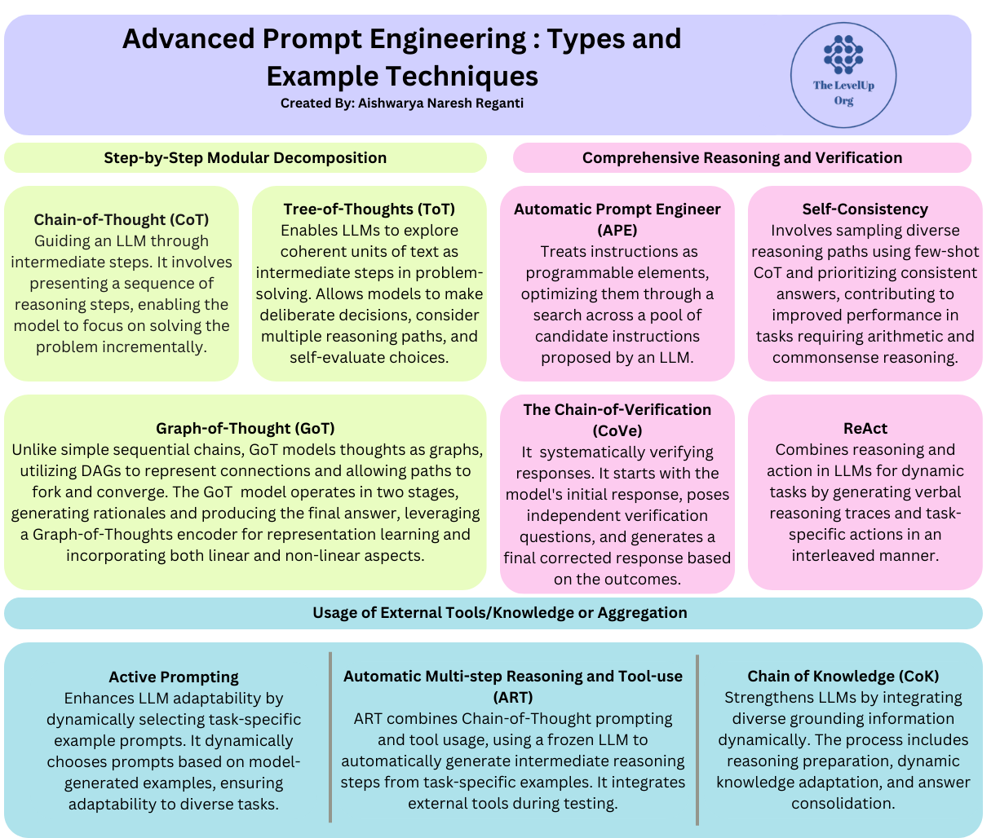

### A. 逐步模块化分解

这类方法把复杂问题拆解成更小、更易处理的步骤，以结构化的方式解决问题。它们引导 LLM 经历一系列中间步骤，让它一次专注解决一个步骤，而非一步解决整个问题。这种方式能增强 LLM 的推理能力，尤其适用于需要多步思考的任务。

落入此类别的方法示例包括：

1. **思维链（Chain-of-Thought, CoT）提示：**

   思维链（CoT）提示是一种通过中间推理步骤来增强复杂推理能力的技术。该方法提供一串推理步骤，引导大语言模型（LLM）逐步走完一个问题，让它一次专注解决一个步骤。

   在下面给出的示例中，提示涉及判断一组奇数之和是否为偶数。LLM 被引导逐例推理，在得出最终答案前给出中间推理。输出显示模型通过考虑奇数及其求和成功解决了问题。

   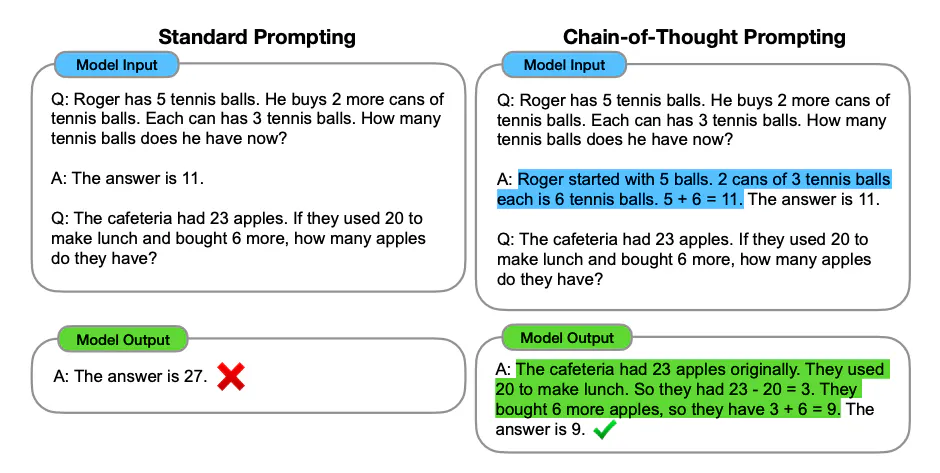

   图片来源：[Wei et al. (2022)](https://arxiv.org/abs/2201.11903)

   1a. **零样本/少样本 CoT 提示：**

   零样本是在原始问题上加上 "Let's think step by step" 这一提示，引导 LLM 走系统化的推理流程。少样本则给模型提供几个相似问题的示例以增强推理能力。这些 CoT 方法通过显式指示模型一步步思考，显著提升了模型表现。相比之下，没有这个特殊提示时，模型无法给出正确答案。

   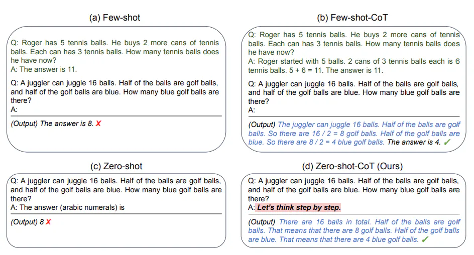

   图片来源：[Kojima et al. (2022)](https://arxiv.org/abs/2205.11916)

   1b. **自动思维链（Auto-CoT）：**

   自动思维链（Auto-CoT）旨在为示例自动生成推理链。与其手工构造示例，Auto-CoT 借助 LLM 用 "Let's think step by step" 提示逐条自动生成推理链。

   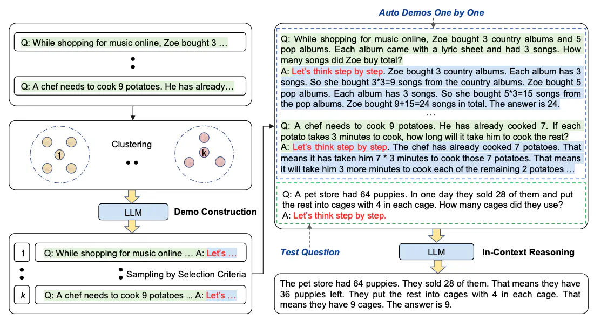

   图片来源：[Zhang et al. (2022)](https://arxiv.org/abs/2210.03493)

   Auto-CoT 流程包含两个主要阶段：

   1. **问题聚类：** 按相似度把问题划分成若干簇。
   2. **示例采样：** 从每个簇中选一个代表性问题，用 Zero-Shot-CoT 加简单启发式生成其推理链。

   目标是消除人工构造多样且有效示例的工作量。Auto-CoT 保证了示例的多样性，而基于启发式的方法促使模型生成简洁却准确的推理链。

   总的来说，这些 CoT 提示技术展示了通过逐步推理引导 LLM 在问题求解和示例生成上的有效性。

2. **思维树（Tree-of-Thoughts, ToT）提示**

   思维树（ToT）提示是对思维链方法的扩展。它允许语言模型把连贯的文本单元（"思维"/thoughts）作为走向问题求解的中间步骤来探索。ToT 让模型能够做出深思熟虑的决策、考虑多条推理路径并自我评估选择。它引入了一个结构化框架，模型在推理过程中可以视需要前瞻或回溯。ToT 提供了一种更结构化、更动态的推理方式，让语言模型以更大的灵活性和策略性决策来驾驭复杂问题，尤其适合需要全面且自适应推理能力的任务。

   **关键特征：**

   - **连贯单元（"思维"）：** ToT 促使 LLM 把连贯的文本单元作为中间推理步骤来考虑。
   - **深思熟虑的决策：** 让模型有意地做出决策，并评估不同推理路径。
   - **回溯与前瞻：** 允许模型在推理过程中回溯或前瞻，提供问题求解的灵活性。

   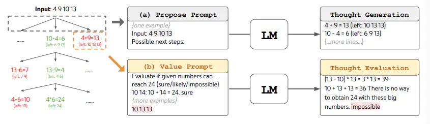

   图片来源：[Yao et al. (2023)](https://arxiv.org/abs/2305.10601)

3. **思维图（Graph of Thought）提示**

   这项工作源于这样一个事实：人类的思维过程常常遵循非线性模式，偏离简单的顺序链。为此，作者提出思维图（Graph-of-Thought, GoT）推理，一种不仅把思维建模为链、而是建模为图的新方法，以捕捉非顺序思维的复杂性。

   这一扩展在表示思维单元方面带来了范式转变。图中的节点象征这些思维单元，边描绘连接，更真实地呈现了人类认知中固有的复杂性。与传统树结构不同，GoT 采用有向无环图（DAG），允许对分叉与汇合的路径建模，这让 GoT 相较于传统线性方法具有显著优势。

   GoT 推理模型运行于一个两阶段框架中：先生成理由（rationales），随后产出最终答案。为此，模型利用一个思维图编码器进行表示学习，并通过门控融合机制把 GoT 表示与原始输入整合，使模型能同时结合思维过程的线性与非线性方面。

   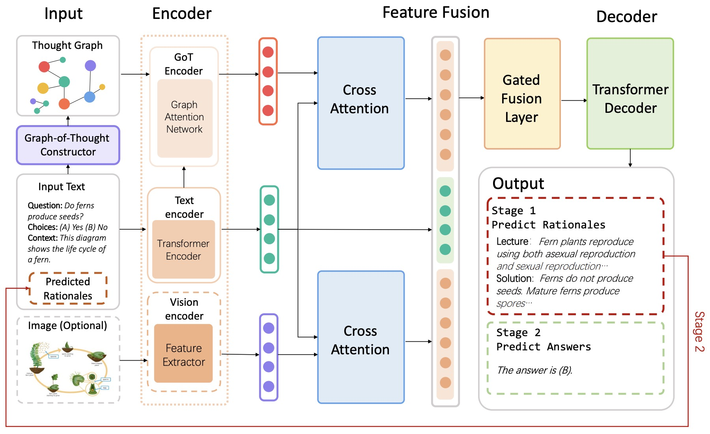

   图片来源：[Yao et al. (2023)](https://arxiv.org/abs/2305.16582)

### B. 综合推理与验证

提示中的综合推理与验证方法采取更精细的方式——推理不仅限于给出最终答案，而是包含生成详尽的中间步骤。这类技术的独特之处在于框架内集成了自验证机制。当 LLM 生成中间答案或推理轨迹时，它会自主验证其一致性与正确性。若内部验证得出否定的结果，模型会迭代地精炼响应，确保生成的推理符合预期的逻辑连贯性。这些检查促成了更鲁棒、更可靠的推理过程，让模型能基于内部验证自适应地精炼输出。

1. **自动提示工程师（Automatic Prompt Engineer, APE）**

   自动提示工程师（APE）是一种把指令当作可编程元素、并在 LLM 提出的一批候选指令池中搜索以优化的技术。从经典程序综合和人类提示工程中汲取灵感，APE 用一个评分函数评估候选指令的有效性。得分最高的指令被选出作为 LLM 的提示。这种自动化方式旨在提升提示生成的效率，契合经典程序综合原则，并借助大语言模型内嵌的知识来提升产出期望输出的整体表现。

   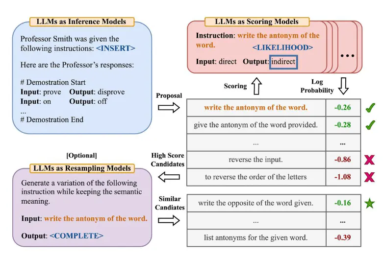

   图片来源：[Zhou et al., (2022)](https://arxiv.org/abs/2211.01910)

2. **验证链（Chain of Verification, CoVe）**

   验证链（CoVe）方法通过引入系统化的验证流程来应对大语言模型的幻觉问题。它先让模型对用户查询草拟一个初始响应（可能含有不准确之处），随后 CoVe 规划并提出独立的验证问题，旨在不带偏见地对初始响应进行事实核查。模型回答这些问题，并基于验证结果生成最终响应，纳入验证过程中发现的修正与改进。CoVe 保证了无偏验证，从而提升最终响应的事实准确性，并通过减少不准确信息的生成来改善模型整体表现。

   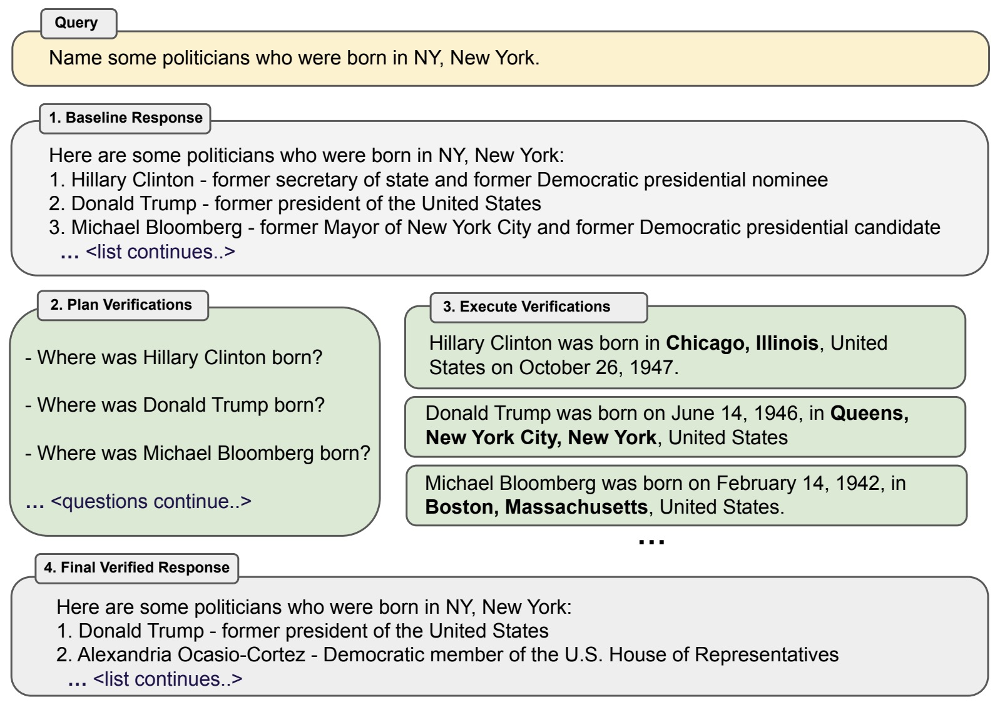

   图片来源：[Dhuliawala et al. 2023](https://arxiv.org/abs/2309.11495)

3. **自洽性（Self Consistency）**

   自洽性是提示工程中的一种改进，专门针对思维链提示中朴素贪心解码的局限。其核心是用少样本 CoT 采样多条多样的推理路径，并利用生成的响应找出最一致的答案。该方法旨在增强 CoT 提示的表现，尤其在需要算术与常识推理的任务上。通过引入推理路径的多样性并优先考虑一致性，自洽性在 CoT 框架内促成了更鲁棒、更准确的语言模型响应。

   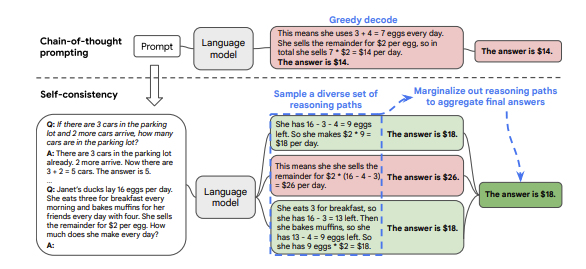

   图片来源：[Wang et al. (2022)](https://arxiv.org/pdf/2203.11171.pdf)

4. **ReAct**

   ReAct 框架在 LLM 中结合推理与行动，以增强其在动态任务中的能力。该框架以交错方式同时生成言语推理轨迹和任务相关的动作。ReAct 旨在解决如思维链这类模型缺乏与外部世界交互、并可能遭遇事实幻觉与错误传播等局限。受人"行动"与"推理"在学习与决策中协同的启发，ReAct 促使 LLM 创建、维护并调整动态行动的规划。模型可与外部环境（如知识库）交互以检索额外信息，从而带来更可靠、更有事实依据的响应。

   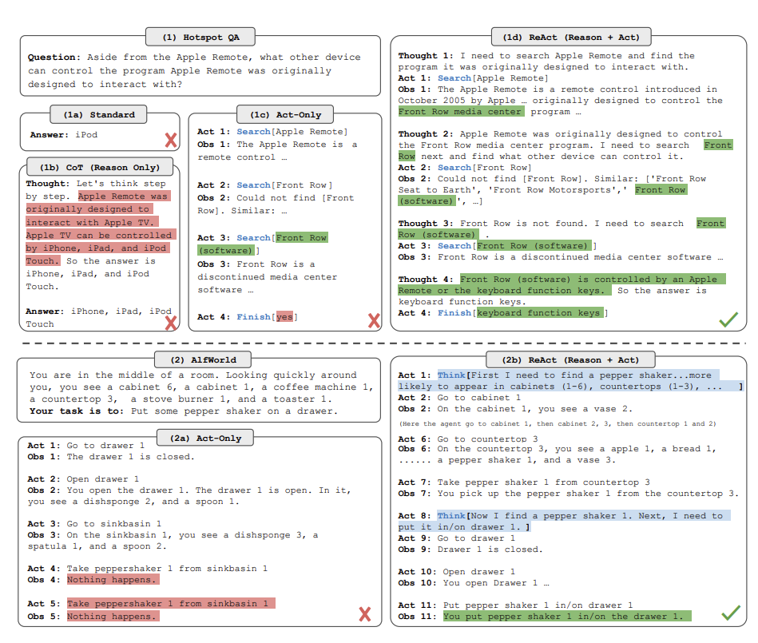

   图片来源：[Yao et al., 2022](https://arxiv.org/abs/2210.03629)

   **ReAct 如何工作：**

   1. **动态推理与行动：** ReAct 同时生成言语推理轨迹与动作，允许针对复杂任务进行动态推理。
   2. **与外部环境交互：** 行动步骤允许与搜索引擎、知识库等外部信息源交互，以收集信息并精炼推理。
   3. **提升任务表现：** 该框架对推理与行动的整合，使其在语言与决策任务上超越了最先进的基线方法。
   4. **增强人类可解释性：** ReAct 提升了 LLM 对人类的可解释性与可信度，使其响应更易懂、更可靠。

### C. 外部工具/知识或聚合的使用

这类提示方法涵盖借助外部来源、工具或聚合信息来提升 LLM 表现的技术。这些方法认识到，获取外部知识或工具对生成更知情、上下文更丰富的响应很重要。聚合技术则借助多个响应的力量来增强鲁棒性——它认识到多样的视角和推理路径能促成更可靠、更全面的答案。概述如下：

1. **主动提示（Active Prompting，聚合）**

   主动提示旨在通过动态选择任务专属的示例提示来增强 LLM 对各类任务的适应性。思维链方法通常依赖一组固定的人工标注示例，这对多样任务并不总是最有效的。主动提示这样应对该挑战：

   1. **动态查询：**
      - 流程先针对一组训练问题，带或不带少量 CoT 示例地查询 LLM。
      - 模型生成 k 个可能答案，在其响应中引入不确定性。
   2. **不确定性度量：**
      - 基于 k 个生成答案之间的分歧计算一个不确定性度量，反映模型对最合适响应的不确定程度。
   3. **选择性标注：**
      - 不确定性最高（即模型响应缺乏共识）的问题被选出，由人工标注。
      - 人类提供新的标注示例，专门针对 LLM 识别出的不确定性。
   4. **自适应学习：**
      - 新标注的示例被纳入训练数据，丰富模型对那些特定问题的理解与适应性。
      - 模型从新标注的示例中学习，依据所提供的任务专属引导调整响应。

   主动提示的动态自适应机制让 LLM 能主动寻找并纳入与不同任务挑战相契合的任务专属示例。通过在不确定案例上借助人工标注示例，该方法促成了跨多样任务更贴合上下文、更有效的表现。

   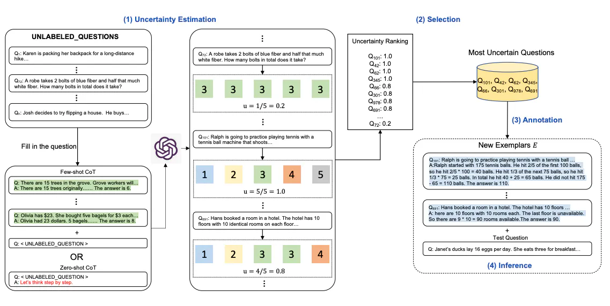

   图片来源：[Diao et al., (2023)](https://arxiv.org/pdf/2302.12246.pdf)

2. **自动多步推理与工具使用（ART，外部工具）**

   ART 强调用 LLM 处理任务。该框架使用一个冻结的 LLM，整合了思维链提示与工具使用。它不从手工构造示例出发，而是从库中选取任务专属示例，让模型自动生成中间推理步骤。测试时，它把外部工具整合进推理过程，促成了对新任务的零样本泛化。ART 不仅可扩展（允许人类更新任务和工具库），还推动了用 LLM 应对多样任务时的适应性与通用性。

   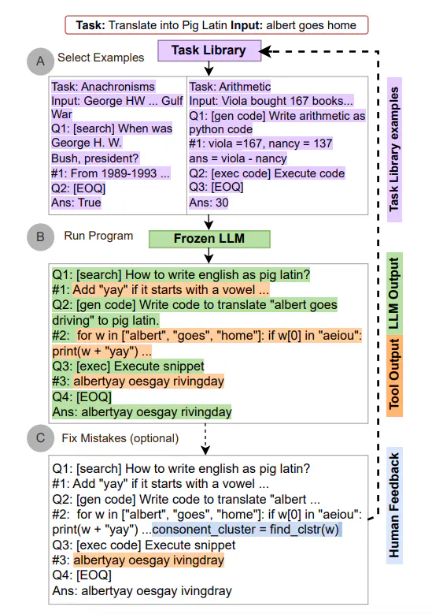

   图片来源：[Paranjape et al., (2023)](https://arxiv.org/abs/2303.09014)

3. **知识链（Chain-of-Knowledge, CoK）**

   该框架旨在通过动态整合来自多样来源的依据信息来增强 LLM，促成更有事实依据的理由，并降低生成时的幻觉风险。CoK 通过三个关键阶段运作：推理准备、动态知识适配和答案合并。它先形成初始理由与答案，同时识别相关知识领域；随后从所识别的领域中适配知识来增量精炼这些理由，最终为答案提供稳健基础。下图展示了与其他方法的对比，突出了 CoK 为知识检索而整合异构来源、以及动态知识适配的特点。

   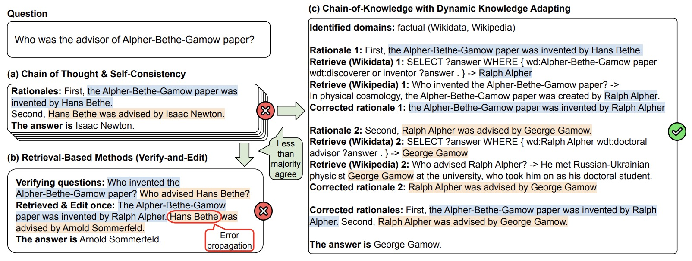

   图片来源：[Li et al. 2024](https://arxiv.org/abs/2401.04398)

## 风险

提示伴随着各种风险，其中提示攻击（Prompt Hacking）是利用 LLM 漏洞的突出问题。与提示相关的风险包括：

1. **提示注入（Prompt Injection）：**
   - *风险：* 恶意行为者可把有害或误导性内容注入提示，导致 LLM 生成不当、偏颇或虚假的输出。
   - *背景：* 提示中使用的不可信文本可被操纵，使模型说出攻击者想要的任何内容，危害生成内容的完整性。
2. **提示泄露（Prompt Leaking）：**
   - *风险：* 攻击者可能从 LLM 响应中提取敏感信息，带来隐私与安全顾虑。
   - *背景：* 修改 user_input 以尝试泄露提示本身，就是提示泄露的一种形式，可能暴露内部信息。
3. **越狱（Jailbreaking）：**
   - *风险：* 越狱允许用户绕过安全与审查功能，导致生成争议性、有害或不当的响应。
   - *背景：* 伪装等提示攻击方法会利用模型难以拒绝有害提示的弱点，使用户能问任何想问的问题。
4. **偏见与误信息：**
   - *风险：* 引入偏见或误导信息的提示会导致输出延续或放大既有偏见、传播误信息。
   - *背景：* 精心构造的提示可操纵 LLM 产出偏颇或不准确的响应，助长社会偏见的固化。
5. **安全顾虑：**
   - *风险：* 提示攻击构成更广泛的安全威胁，使攻击者能危害 LLM 生成内容的完整性，并可能为恶意目的利用模型。
   - *背景：* 包括基于提示的防御和持续监控在内的防御措施，对缓解与提示攻击相关的安全风险至关重要。

要应对这些风险，关键在于实施稳健的防御策略、定期审计模型行为，并对通过提示引入的潜在漏洞保持警惕。此外，持续的研究与开发对于增强 LLM 抵御提示攻击的韧性、并减少生成内容中的偏见必不可少。

## 常用工具

下面是一些知名的提示工程工具。有的作为端到端应用开发框架，有的则专为提示的生成、维护或评估而设。所列工具大多开源或免费使用，并展现出良好的适应性。需要说明的是，还有更多工具可用，只是可能知名度较低或需付费。

1. **[PromptAppGPT](https://github.com/mleoking/PromptAppGPT)：**
   - *简介：* 一个基于提示的低代码快速应用开发框架。
   - *特性：* 基于提示的低代码开发、GPT 文本与 DALLE 图像生成、在线提示编辑器/编译器/运行器、自动 UI 生成、支持插件扩展。
   - *目标：* 基于自然语言的应用开发（基于 GPT），降低 GPT 应用开发的门槛。
2. **[PromptBench](https://github.com/microsoft/promptbench)：**
   - *简介：* 一个基于 PyTorch 的 Python 包，用于评估 LLM。
   - *特性：* 友好的 API 用于快速评估模型表现、提示工程方法（少样本思维链、情感提示、专家提示）、对抗性提示评估、动态评估以缓解潜在测试数据污染。
   - *目标：* 方便地评估 LLM 的各项能力，包括提示工程与对抗性提示评估。
3. **[Prompt Engine](https://github.com/microsoft/prompt-engine)：**
   - *简介：* 一个 NPM 工具库，用于为 LLM 创建和维护提示。
   - *背景：* 旨在为 GPT-3、Codex 等 LLM 简化提示工程，提供用于构造能从模型引出特定输出的输入的工具集。
   - *目标：* 方便提示的创建与维护，把提示工程相关的模式与实践固化为代码。
4. **[Prompts AI](https://github.com/sevazhidkov/prompts-ai)：**
   - *简介：* 一个进阶的 GPT-3 试验场，专注于帮助用户发现 GPT-3 的能力，并协助开发者为特定用例做提示工程。
   - *目标：* 帮助 GPT-3 新用户、试验提示工程、并把产品优化用于创意写作、分类和聊天机器人等用例。
5. **[OpenPrompt](https://github.com/thunlp/OpenPrompt)：**
   - *简介：* 一个基于 PyTorch 构建的提示学习（prompt-learning）库，用于把 LLM 适配到下游 NLP 任务。
   - *特性：* 标准、灵活、可扩展的部署提示学习流水线的框架，支持从 HuggingFace Transformers 加载预训练语言模型。
   - *目标：* 为提示学习提供标准化方法，使 PLM 更易适配到具体 NLP 任务。
6. **[Promptify](https://github.com/promptslab/Promptify)：**
   - *特性：* LLM 提示测试套件、几行代码完成 NLP 任务、处理越界预测、输出以 Python 对象提供便于解析、支持自定义示例与样本、在 HuggingFace Hub 的模型上做推理。
   - *目标：* 方便 LLM 提示测试、简化 NLP 任务、优化提示以降低 OpenAI 的 token 成本。

## 扩展阅读（选读）

1. [https://www.promptingguide.ai/](https://www.promptingguide.ai/)
2. [https://aman.ai/primers/ai/prompt-engineering/](https://aman.ai/primers/ai/prompt-engineering/)
3. [https://www.deeplearning.ai/short-courses/chatgpt-prompt-engineering-for-developers/](https://www.deeplearning.ai/short-courses/chatgpt-prompt-engineering-for-developers/)
4. [https://learnprompting.org/courses](https://learnprompting.org/courses)

## 推荐论文（选读）

1. [https://arxiv.org/abs/2304.05970](https://arxiv.org/abs/2304.05970)
2. [https://arxiv.org/abs/2309.11495](https://arxiv.org/abs/2309.11495)
3. [https://arxiv.org/abs/2310.08123](https://arxiv.org/abs/2310.08123)
4. [https://arxiv.org/abs/2305.13626](https://arxiv.org/abs/2305.13626)
