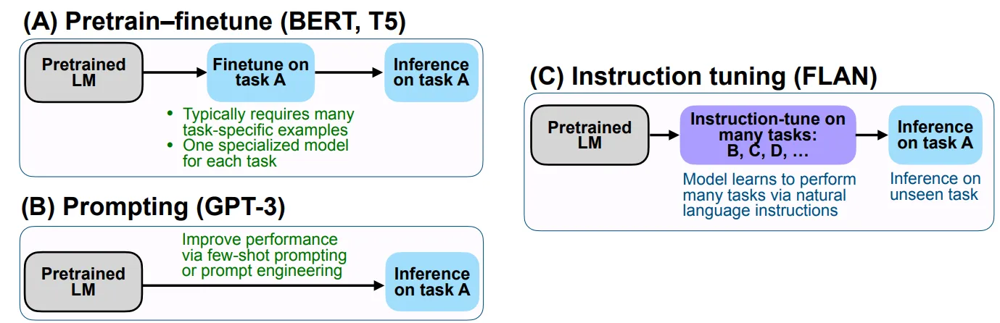
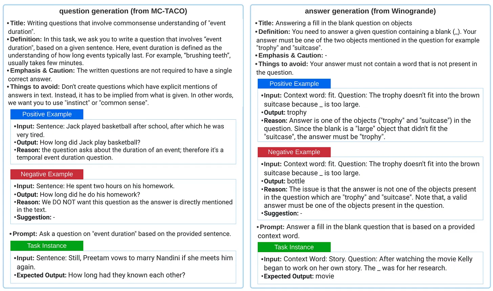
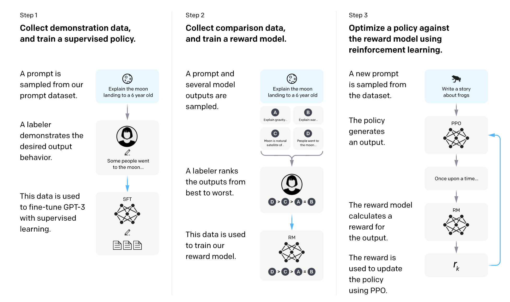
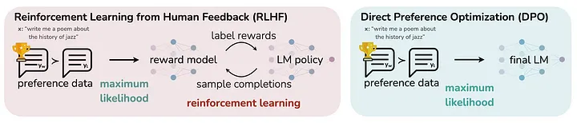

## 5 分钟速览（ETMI5）

本节我们将介绍 LLM 的微调（Fine-tuning）这一领域适配方法。微调是在预训练模型的基础上针对特定任务或领域进一步训练，使其适配新的数据分布，并通过复用已有知识来提升效率。对于通用模型表现不佳的任务，微调至关重要。微调主要分为两大类：无监督（在不改变模型行为的前提下更新模型）和有监督（用带标签数据更新模型）。我们将重点介绍流行的有监督方法——指令微调（Instruction Fine-tuning），它通过为输入-输出样例补充显式指令来获得更好的泛化能力。我们还会深入讲解基于人类反馈的强化学习（RLHF），它把人类反馈纳入模型微调过程；以及直接偏好优化（Direct Preference Optimization, DPO），它直接基于用户偏好来优化模型。此外，我们也会概述参数高效微调（PEFT）这一系列方法——它们只对模型参数做选择性更新，以应对算力挑战、提升内存效率，并在多种模态上保持通用性。

## 引言

微调（Fine-tuning）是指拿来预训练模型，并在更小、更具领域特性的数据集上对其进一步训练的过程。其目的是打磨模型的能力，提升它在某个特定任务或领域上的表现。这一过程把通用模型转化为专用模型，弥合了通用预训练模型与特定应用独特需求之间的鸿沟。

以 OpenAI 的 GPT-3 为例，这是一个为广泛 NLP 任务设计的前沿 LLM。为说明微调的必要性，设想一家医疗机构想用 GPT-3 协助医生根据文字记录生成患者报告。尽管 GPT-3 在通用文本理解上很在行，但它未必针对复杂的医学术语和特定的医疗行话做过优化。

在这种场景下，该机构会用一个充满医疗报告和患者记录的数据集对 GPT-3 进行微调。模型会越来越熟悉医学术语、临床语言的细微之处以及典型的报告结构。结果是，经过微调后，GPT-3 更适合协助医生生成准确、连贯的患者报告，展现出它针对特定任务的适配能力。

微调并非语言模型独有；任何机器学习模型在特定情形下都可能需要重新训练。它涉及调整模型参数，使其与新的、特定数据集的分布相一致。这一过程可以用一个例子来说明：一个被训练用于识别汽车图像的卷积神经网络，在被用来检测高速公路上的卡车时会面临的挑战。

微调背后的核心原理是：利用预训练模型，并用新数据重新校准其参数，使其适配新的语境或应用。当训练数据的分布与某个特定应用的需求差异显著时，微调尤其有用。基础通用模型的选择取决于任务的性质，比如是文本生成还是文本分类。

## 为什么要微调？

虽然大语言模型确实是在多样化的任务集上训练出来的，但仍然需要微调，原因在于：这些大型通用模型的设计目标是在各种应用上都能取得尚可的表现，而不一定在某个特定任务上出类拔萃。通用模型的优化目标是在一系列任务上取得不错的成绩，这让它们多才多艺，却并不专精。

要确保模型在某个特定任务或感兴趣的领域达到卓越的熟练度，微调就变得不可或缺。重点从"取得通用能力"转向"在特定应用上达到精通"。当模型面向某个聚焦的使用场景，且整体的通用性能并非首要考量时，这一点尤为关键。

本质上，通用大语言模型可以被看作样样通、但样样不精；而微调后的模型则经过量身定制的优化过程，成为某个特定任务或领域的专家。因此，是否微调模型，取决于在目标应用上取得卓越表现的需求，从而让它们成为各自指定领域里高效的专才。

为了更深入地理解，我们来看看为什么在新领域为任务微调模型被认为至关重要，背后有几条颇具说服力的理由。

1. **领域特定适配（Domain-Specific Adaptation）：** 预训练 LLM 未必针对特定任务或领域做过优化。微调能让模型适配新领域的细微特点，从而提升在领域特定任务上的表现。例如，大型通用 LLM 在法律领域的文档分析这类任务上可能训练不足。微调可以让模型理解法律术语和细微差别，胜任合同审查等任务。
2. **数据分布偏移（Shifts in Data Distribution）：** 在某个数据集上训练的模型，未必能很好地泛化到分布外（out-of-distribution）的样例。微调有助于让模型与新数据的分布对齐，应对数据特性的偏移，提升在特定任务上的表现。例如：为社交媒体评论微调一个情感分析模型。社交媒体上的语言和情感分布可能与原始训练数据差异显著，需要适配才能准确地进行情感分类。
3. **成本与资源效率（Cost and Resource Efficiency）：** 在一个新任务上从零训练模型往往需要大量带标签数据，既昂贵又耗时。微调则能复用预训练模型的知识，用更小的数据集就把它适配到新任务，使整个过程更高效。例如：为一个小型电商平台改造预训练模型，根据用户偏好推荐商品。相比用有限数据从零训练，微调在资源上更高效。
4. **分布外数据处理（Out-of-Distribution Data Handling）：**
    - 微调能缓解预训练模型在处理分布外样例时的次优表现。无需从头开始训练，微调可以在现有模型的基础上，用一个相对适中的数据集继续构建。例如：为一种新的地区口音微调语音识别模型。无需大规模重新训练，模型就可以被适配来识别该新口音特有的语音模式。
5. **知识迁移（Knowledge Transfer）：**
    - 预训练模型在预训练阶段从海量数据中捕捉到通用的模式与知识。微调促成了这些通用知识向特定任务的迁移，使其成为在新应用中借力既有知识的有力工具。例如：把预训练模型的医学知识迁移到一个新的医疗聊天机器人。用医学文献进行微调，能让模型在医疗对话中给出准确且贴合语境的回答。
6. **任务特定优化（Task-Specific Optimization）：**
    - 微调能够针对任务特定目标优化模型参数。例如在医疗领域，用医学文献微调 LLM 可以提升其在医疗应用中的表现。又如：为软件开发环境中的代码生成优化预训练模型。用代码样例微调能让模型更好地理解和生成代码片段。
7. **适配用户偏好（Adaptation to User Preferences）：** 微调能让模型适配用户偏好和特定任务需求，使其生成更贴合语境、更切合任务的回答。例如：微调一个虚拟助手模型，使其在语言和语气上贴合用户偏好，确保助手生成的回答与用户的沟通风格相匹配。
8. **持续学习（Continual Learning）：** 微调支持持续学习，让模型能随时间适应不断演变的数据和用户需求，在动态环境中保持相关性与有效性。例如：持续更新一个新闻摘要模型，使其适应不断变化的新闻话题和用户偏好。微调让模型保持相关性，并提供及时的摘要。

总而言之，微调是一项强大的技术，能让组织把预训练模型适配到特定任务、领域和用户需求，为在真实场景中部署模型提供了一种实用而高效的方案。

## 微调的类型

从高层次看，语言模型的微调方法可分为两大类：有监督和无监督。在机器学习中，有监督方法需要带标签数据，模型在带有对应目标输出的样例上训练；而无监督方法则使用无标签数据，专注于在没有显式标签的情况下提取数据中的模式和结构。

### **无监督微调方法**

1. **无监督全量微调（Unsupervised Full Fine-Tuning）：** 当需要更新 LLM 的知识库、同时又不改变其既有行为时，无监督微调就派上用场。例如，若目标是在法律文献上微调模型，或让其适配一门新语言，就可以使用一个包含法律文档或目标语言文本的非结构化数据集。在这类情况下，非结构化数据集由文章、法律论文或来自法律领域权威来源的相关内容组成。这种方法让模型无需依赖带标签样例，就能有效打磨自己的理解、适应法律语言的细微之处，展现了无监督微调在各种领域中的通用性。
2. **对比学习（Contrastive Learning）：** 对比学习是微调语言模型时使用的一种方法，强调训练模型在隐空间（latent space）中分辨相似与不相似的样例。其目标是优化模型分辨数据中细微差异和模式的能力。具体做法是：鼓励模型在隐空间中把相似的样例拉得更近，同时把不相似的样例推得更远。由此学到的表示能让模型捕捉输入数据中复杂的关系与差异。对比学习在那些需要对相似性与差异做细致理解的任务中尤其有益，使其成为为需要细粒度判别的特定应用打磨语言模型的一项有价值的技术。

### **有监督微调方法**

1. **参数高效微调（Parameter-Efficient Fine-Tuning, PEFT）：** 这是一种旨在降低更新语言模型参数所带来的算力开销的微调策略。PEFT 并不在微调时更新全部参数，而是专注于选择性地更新一小部分参数，这部分常被称为低维矩阵。PEFT 的一个突出代表是低秩适配（low-rank adaptation, LoRA）技术。LoRA 的前提假设是：为下游任务微调一个基础模型，只需要更新部分参数。低秩矩阵有效地表示了与目标任务相关的空间，训练这个矩阵即可，而无需调整整个模型的参数。PEFT，尤其是 LoRA 这类技术，能显著降低微调的成本，使整个过程更高效。
2. **有监督全量微调（Supervised Full Fine-Tuning）：** 它在训练过程中更新语言模型的全部参数。不同于 PEFT 只修改一部分参数，全量微调需要充足的内存和算力来存储和处理所有被更新的组件。这种全面的方法会产生一个所有层权重都被更新的新版本模型。虽然全量微调更耗资源，但它确保整个模型都被适配到特定任务或领域，适用于需要对语言模型做彻底调整的场景。
3. **指令微调（Instruction Fine-Tuning）：** 指令微调是指用一些明确演示模型应如何响应特定查询或任务的样例来训练语言模型。这种方法通过在训练数据中提供显式指令，来提升模型在目标任务上的表现。例如，若任务涉及摘要或翻译，就会精心构造数据集，纳入带有清晰指令的样例，如"总结这段文本"或"翻译这句话"。指令微调确保模型擅长理解并执行特定指令，适用于精确执行任务至关重要的应用。
4. **基于人类反馈的强化学习（Reinforcement Learning from Human Feedback, RLHF）：** RLHF 把有监督微调的理念又往前推进了一步，引入了强化学习的原理。在 RLHF 中，会招募人类评估者根据特定提示对模型输出打分。这些评分相当于一种奖励，引导模型优化其参数以最大化正面反馈。RLHF 是一个资源密集的过程，它借助人类偏好来打磨模型的行为。人类反馈用于训练一个奖励模型，该奖励模型再引导后续的强化学习阶段，最终得到一个与人类偏好对齐、表现更优的模型。

对比学习、有监督与无监督微调等技术并非 LLM 独有，早在 LLM 出现之前就已被用于领域适配。然而，随着 LLM 的兴起，RLHF、指令微调和 PEFT 等技术的重要性显著提升。在接下来的章节中，我们将更详细地探讨这些方法，以理解它们的应用与意义。

## 指令微调（Instruction Fine-Tuning）

指令微调是一种在让 LLM 更适用于真实应用方面日益受到重视的方法。在标准的有监督微调中，模型在输入样例和对应输出上训练；而指令微调则不同，它为输入-输出样例补充了显式指令。这种独特的方法让经过指令微调的模型能更有效地泛化到新任务上。指令微调的数据构造方式也不同，指令为模型提供了额外的上下文。

图片来源：[Wei et al., 2022](https://openreview.net/forum?id=gEZrGCozdqR)

一个值得关注的指令微调数据集是 "Natural Instructions"。该数据集包含 193,000 条指令-输出样例，来源于 61 个已有的英文 NLP 任务。它的独特之处在于其结构化的处理方式：来自各任务的众包指令被对齐到一个统一的模式（schema）上。每条指令都关联到一个任务，明确指导模型应如何响应。这些指令涵盖多个字段，包括定义、需要避免的事项，以及正面和负面示例。这种结构化的特性使该数据集对微调模型很有价值，因为它为目标任务提供了清晰而详尽的指令。不过值得注意的是，该数据集中的输出相对较短，这可能使其不太适合生成长文本内容。尽管存在这一局限，Natural Instructions 仍是通过指令微调训练模型、增强其对特定 NLP 任务适应性的丰富资源。下图展示了一个指令格式的示例。

图片来源：**[Mishra et al., 2022](https://aclanthology.org/2022.acl-long.244/)**

在不断演进的自然语言处理与机器学习版图中，指令微调已成为一项有价值的工具，让 LLM 能够借助细致的指令适配到特定任务。

## **基于人类反馈的强化学习（RLHF）**

基于人类反馈的强化学习（RLHF）是一种通过引入人类反馈来增强语言模型的方法，使模型更紧密地与复杂的人类价值观对齐。RLHF 过程包含三个基本步骤：

**1. 预训练语言模型（LMs）：**
RLHF 从一个预训练好的语言模型出发，该模型通常通过经典的预训练目标得到。初始语言模型的规模可大可小，选择上较为灵活。虽然并非必需，初始语言模型也可以在额外的数据上做微调。关键在于要有一个能对多样化指令做出积极响应的模型。

**2. 训练奖励模型（Reward Model）：**
接下来一步是生成一个与人类偏好校准的奖励模型（RM）。该模型为文本序列赋予标量奖励，以反映人类偏好。训练奖励模型的数据集是这样生成的：采样一批提示，将它们送入初始语言模型生成文本。人类标注者对生成的文本输出进行排序，这些排序被用于构建一个规整化的数据集来训练奖励模型。奖励函数结合了偏好模型，以及对 RL 策略与初始模型之间差异的惩罚项。

**3. 用强化学习微调：**
最后一步是用强化学习对初始 LLM 进行微调。近端策略优化（Proximal Policy Optimization, PPO）是这项任务中常用的 RL 算法。RL 策略就是接收提示并生成文本的语言模型，其动作对应于语言模型词表中的 token。奖励函数源自偏好模型，并带有对策略偏移的约束，用以引导微调。PPO 会更新语言模型的参数，以最大化当前这批"提示-生成"对的奖励指标。出于算力限制，语言模型的部分参数会被冻结，微调的目标是让模型与人类偏好对齐。

图片来源：[https://openai.com/research/instruction-following](https://openai.com/research/instruction-following)

💡如果你看不懂 PPO、策略（policy）等 RL 术语，不妨想想这个类比：用 RL（尤其是 PPO）做微调，类似于不断打磨指令来训练宠物，比如教狗狗学技能。设想狗狗一开始在大致的引导（策略）下学习，做对动作就得到零食（奖励）。现在想象狗狗在学一个新技能，但还没完全掌握。用 PPO 做微调，就像根据狗狗的表现略微调整你的指令，类似于在强化学习中微调模型的行为（策略）。这就好比不断打磨指令来优化学习过程，正如通过逐步调整和奖励来让宠物把技能练得更好一样。

## 直接偏好优化 DPO（*附加话题*）

直接偏好优化（Direct Preference Optimization, DPO）是 RLHF 的一种等价方案，近来正受到大量关注。DPO 提供了一种直接基于人类偏好微调大语言模型的简洁方法。它免去了复杂的奖励模型，直接把用户反馈纳入优化过程。在 DPO 中，用户只需比较两个由模型生成的输出并表达偏好，LLM 就会据此调整自己的行为。这种对用户友好的方式带来了若干优势，包括易于实现、计算高效，以及对 LLM 行为有更强的掌控力。

图片来源：[Rafailov, Rafael, et al.](https://arxiv.org/html/2305.18290v2)

💡在 LLM 的语境下，最大似然（maximum likelihood）是模型训练中使用的一条原理。设想模型就像一位作者，在尝试预测句子里的下一个词。最大似然训练就是调整模型的参数（影响其预测的各种因素），使其生成训练数据中实际观察到的词序列的可能性最大。这就像打磨作者的技艺，让他写出的句子尽可能贴近他以前见过的句子。因此，最大似然帮助 LLM 学会生成与训练样例最相似的文本。

***DPO**：* DPO 采取了一条直截了当的路径，直接基于用户偏好优化语言模型，无需单独的奖励模型。用户比较两个由模型生成的输出，表达偏好以引导优化过程。

***RLHF**：* RLHF 走的是更结构化的路线，借助强化学习的原理。它需要训练一个奖励模型，学会识别并奖励理想的语言模型输出。该奖励模型随后引导语言模型的训练过程，将其行为塑造成能取得正面结果的方向。

### **DPO（直接策略优化）对比 RLHF（基于人类反馈的强化学习）：理解两者的差异**

**DPO——更简单的方法：**
直接策略优化（DPO）走的是一条直截了当的路径，绕开了对复杂奖励模型的需求。它直接基于用户偏好优化大语言模型（LLM），用户比较两个输出并表明偏好。这种简洁性带来了几个关键优势：

1. **易于实现：** DPO 更易上手，因为它免去了设计和训练单独奖励模型的工作，让更广泛的人群都能使用。
2. **计算高效：** DPO 直接作用于 LLM 之上，相比涉及多个阶段的 RLHF，训练时间更短、算力成本更低。
3. **更强掌控力：** 用户能直接掌控 LLM 的行为，无需 RLHF 的种种复杂性，就能将其引导向特定目标和偏好。
4. **收敛更快：** 由于结构更简单、优化更直接，DPO 往往能更快取得理想结果，适合需要快速迭代的任务。
5. **性能更优：** 近期研究表明，在情感控制和回答质量等场景下，尤其是在摘要和对话任务中，DPO 的表现可能优于 RLHF。

**RLHF——更结构化的方法：**
RLHF 走的是更结构化的路线，借助强化学习的原理。它包含三个训练阶段：预训练、奖励模型训练，以及用强化学习微调。它虽然灵活，但也伴随着一些复杂性：

1. **复杂性：** RLHF 可能更复杂，有时还不稳定，需要更多算力，并要应对收敛、漂移或分布不相关等挑战。
2. **奖励定义的灵活性：** RLHF 允许更细致的奖励结构，对那些需要精确控制 LLM 输出的任务很有帮助。
3. **处理多样的反馈格式：** RLHF 能处理各种形式的人类反馈，包括数值评分或文本修改建议，而 DPO 主要依赖二元偏好。
4. **处理大规模数据集：** RLHF 在处理海量数据集时可能更高效，尤其是配合分布式训练技术时。

总而言之，如何选择取决于具体任务、可用资源以及期望的掌控程度，两种方法在不同情境下各有优劣。随着技术不断进步，这些方法都在持续演进，推动 LLM 微调流程的提升。

## 参数高效微调（PEFT）

参数高效微调（Parameter-Efficient Fine-Tuning, PEFT）旨在解决微调 LLM 时资源密集的问题。不同于会修改全部参数的全量微调，PEFT 只微调一小部分额外参数，而把绝大多数预训练模型权重冻结。这种选择性的方法降低了算力需求，缓解了灾难性遗忘，使得即便算力有限也能进行微调。整体而言，PEFT 提供了一种更高效、更实用的方式，无需大量算力和内存，就能把 LLM 适配到特定的下游任务。

**参数高效微调（PEFT）的优势**

1. **计算高效：** PEFT 用远少于全量微调的参数来微调 LLM。这降低了算力需求，使得在性能较弱的硬件上或资源受限的环境中也能进行微调。
2. **内存高效：** 通过冻结绝大多数预训练模型权重，PEFT 避免了修改全部参数所带来的高内存占用。这使 PEFT 特别适合内存受限的任务。
3. **缓解灾难性遗忘：** PEFT 能防止灾难性遗忘——这是全量微调中常见的现象，模型会丢失其预训练状态下的知识。PEFT 确保 LLM 在适配新任务的同时保留有价值的信息。
4. **跨模态的通用性：** PEFT 不止适用于自然语言处理任务，在计算机视觉、音频等多种模态上同样有效。这种通用性使其适用于广泛的下游任务。
5. **面向多任务的模块化适配：** PEFT 的模块化特性允许同一个预训练模型通过添加少量任务特定权重来适配多个任务。这避免了为不同应用存储完整副本的需求，提升了灵活性和效率。
6. **INT8 调优：** PEFT 的能力还包括 INT8（8 位整数）调优，展现了它对不同量化技术的适应性。这使得即便在算力有限的平台上也能进行微调。

总而言之，PEFT 为微调大语言模型提供了一种实用而高效的方案，在应对算力和内存挑战的同时，仍能在下游任务上保持性能。

下图汇总了最流行的 PEFT 方法。请下载查看以获得更好的清晰度。

[PEFT (1).pdf](https://github.com/aishwaryanr/awesome-generative-ai-resources/blob/main/free_courses/Applied_LLMs_Mastery_2024/img/PEFT_(1).pdf)

## 推荐阅读 / 观看资源（可选）

1. [https://www.superannotate.com/blog/llm-fine-tuning](https://www.superannotate.com/blog/llm-fine-tuning)
2. [https://www.deeplearning.ai/short-courses/finetuning-large-language-models/](https://www.deeplearning.ai/short-courses/finetuning-large-language-models/)
3. [https://www.youtube.com/watch?v=eC6Hd1hFvos](https://www.youtube.com/watch?v=eC6Hd1hFvos)
4. [https://www.labellerr.com/blog/comprehensive-guide-for-fine-tuning-of-llms/](https://www.labellerr.com/blog/comprehensive-guide-for-fine-tuning-of-llms/)

## 推荐阅读论文（可选）

1. [https://arxiv.org/abs/2303.15647](https://arxiv.org/abs/2303.15647)
2. [https://arxiv.org/abs/2109.10686](https://arxiv.org/abs/2109.10686)
3. [https://arxiv.org/abs/2304.01933](https://arxiv.org/abs/2304.01933)
