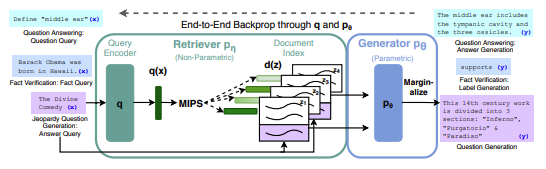
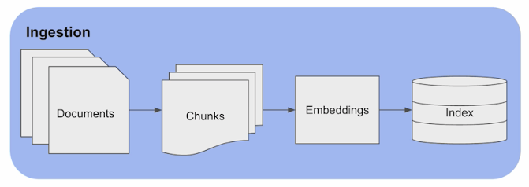
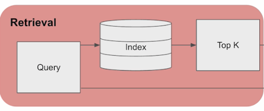
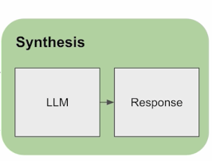
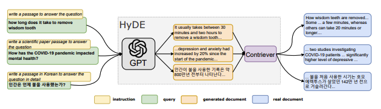
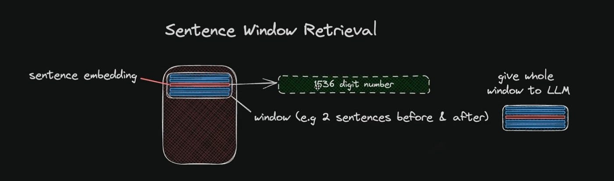
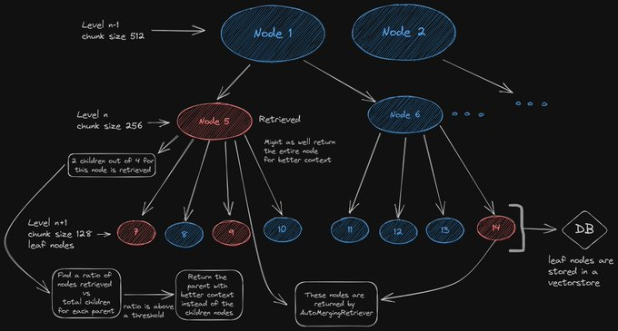
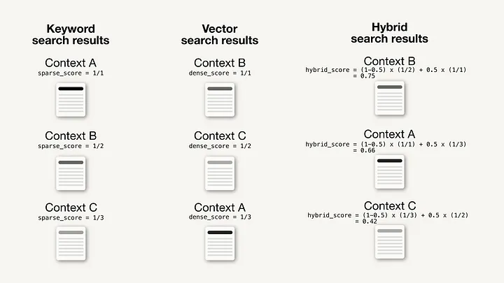
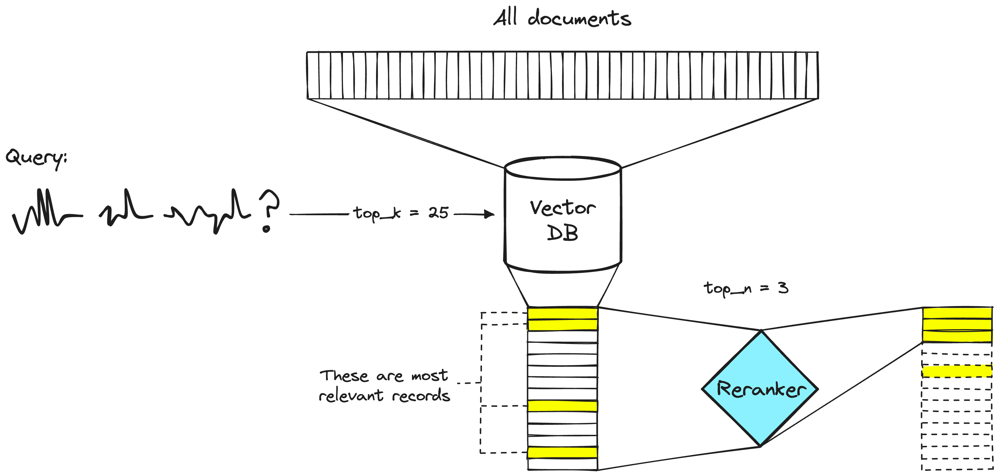

## 5 分钟速览（ETMI5）

本周内容将深入探讨检索增强生成（Retrieval Augmented Generation, RAG）。这是一种 AI 框架，它在生成回答的过程中，从外部来源整合实时、与上下文相关的信息，从而增强大语言模型（LLM）的能力。它解决了 LLM 的一些局限性，例如表现不一致、缺乏特定领域知识等问题，进而降低生成错误或幻觉（hallucinated）回答的风险。

RAG 的运作分为三个关键阶段：摄取（ingestion）、检索（retrieval）和合成（synthesis）。在摄取阶段，文档被切分成更小、更易管理的分块（chunk），随后这些分块被转换为嵌入（embedding）并存入索引以便高效检索。检索阶段在收到用户查询时，利用索引根据相似度指标检索出最相关的 top-k 文档。最后在合成阶段，LLM 结合检索到的信息与自身的内部训练数据，针对用户查询生成准确的回答。

我们将先回顾 RAG 的发展历史，再深入其核心组件，包括摄取、检索和合成，详细剖析每个阶段的处理流程以及改进策略。我们还会讨论 RAG 面临的各类挑战，例如数据摄取的复杂性、高效嵌入、为泛化而进行的微调等，并针对每个问题提出解决方案。

## 什么是 RAG？（回顾）

检索增强生成（RAG）是一种 AI 框架，它在生成过程中引入来自外部来源的最新且与上下文相关的信息，从而提升 LLM 生成回答的质量。它解决了 LLM 表现不一致、缺乏特定领域知识的问题，降低了产生幻觉或错误回答的概率。RAG 包含两个阶段：检索（retrieval），即搜索并取出相关信息；以及内容生成（content generation），即 LLM 基于检索到的信息及其内部训练数据合成答案。这种方法提升了准确性，允许对来源进行验证，并减少了对模型持续重新训练的需求。

图片来源：[https://www.deeplearning.ai/short-courses/langchain-for-llm-application-development/](https://www.deeplearning.ai/short-courses/langchain-for-llm-application-development/)

上图勾勒了 RAG 的基础管线，由三个关键组件构成：

1. **摄取（Ingestion）：**
    - 文档被切分成分块，从这些分块生成嵌入，随后存入索引。
    - 分块对于针对给定查询定位相关信息至关重要，类似于标准的检索方法。
2. **检索（Retrieval）：**
    - 利用嵌入索引，系统在收到查询时根据嵌入的相似度检索出 top-k 文档。
3. **合成（Synthesis）：**
    - 将分块作为上下文信息进行考察，LLM 利用这些知识来生成准确的回答。

💡与以往的领域适配方法不同，需要强调的是：RAG 完全不需要任何模型训练。在提供特定领域数据后，无需训练即可直接应用。

## 发展历史

RAG，即检索增强生成，首次亮相于 Meta 的[这篇](https://arxiv.org/pdf/2005.11401.pdf)论文。这一思路的提出，是为了回应人们观察到的大型预训练语言模型在有效访问和操纵知识方面的局限性。

图片来源：[https://arxiv.org/pdf/2005.11401.pdf](https://arxiv.org/pdf/2005.11401.pdf)

以下简要概述作者如何提出问题并给出解决方案：

RAG 的出现源于这样一个现象：尽管大型语言模型擅长记忆事实和执行特定任务，但在精确使用和操纵知识时却力不从心。这在知识密集型任务中尤为明显——其他专用模型在这些任务上的表现超过了它们。作者指出了现有模型的若干挑战，例如难以解释其决策、难以跟上现实世界的变化。在 RAG 之前，混合参数化（parametric）记忆与非参数化（non-parametric）记忆的混合模型已经取得了一些有前景的成果。例如 REALM 和 ORQA 将掩码语言模型与检索器结合，在这一方向上展示了积极的结果。

随后，RAG 横空出世，作为一种灵活的、用于检索增强生成的微调方法，成为游戏规则的改变者。RAG 将预训练的参数化记忆（如 seq2seq 模型）与来自 Wikipedia 稠密向量索引的非参数化记忆相结合，后者通过预训练的神经检索器（如 Dense Passage Retriever, DPR）来访问。RAG 模型旨在通过将预训练的参数化记忆生成模型与非参数化记忆相结合并进行微调，来增强前者。RAG 中的 seq2seq 模型使用神经检索器检索到的潜在文档，构成了一个端到端训练的模型。训练过程涉及在任意 seq2seq 任务上进行微调，同时学习生成器和检索器。潜在文档随后采用 top-K 近似处理，可以按输出（per output）或按 token（per token）进行。

RAG 的主要意义在于摆脱了过去那种把非参数化记忆附加到系统上的做法。相反，RAG 探索了一种新思路：参数化和非参数化记忆组件都经过预训练，并填充了大量知识。在实验中，RAG 证明了自身价值，在开放域问答任务上取得了顶尖成果，在事实验证和知识密集型生成任务上超越了以往模型。RAG 的另一大优势是展示了其适应能力——非参数化记忆可以被替换和更新，从而在不断变化的世界中保持模型知识的新鲜度。

## 核心组件

如前所述，RAG 的核心要素涉及摄取、检索和合成三个过程。现在，让我们深入了解每一个组件。

### 摄取（Ingestion）

在 RAG 中，摄取过程指的是在数据被模型用于生成回答之前，对数据进行处理和准备。

这一过程包含 3 个关键步骤：

1. **分块（Chunking）：** 将输入文本切分成更小、更易管理的片段或分块。切分可以基于大小、句子，或文本中其他自然的划分方式。我们将在后续章节中深入探讨分块策略。举个例子，设想一篇关于文艺复兴的综合性文章。分块过程就是根据自然断点（例如段落，或不同的历史时期，如文艺复兴早期、文艺复兴鼎盛期）将文章切分成可管理的片段。每个片段都成为一个分块，使语言模型能够进行聚焦的分析。
2. **嵌入（Embedding）：** 将文本或分块转换为向量格式，以一种对计算友好的方式捕捉其本质特征。这一步对语言模型的高效处理至关重要。承接前例——一旦识别出文章的各个片段，嵌入过程便把每个分块的内容转换为向量格式。例如，关于文艺复兴鼎盛期的章节可以被嵌入为一个捕捉关键艺术、文化和历史要素的向量。这种向量表示增强了模型理解和处理分块中细微信息的能力。
3. **索引（Indexing）：** 将嵌入后的数据组织成一种为快速高效检索而优化的结构化格式。这通常涉及为每个文档创建向量表示，并将这些向量存储在可搜索的格式中，例如向量数据库（Vector Database）或搜索引擎。在我们讨论的例子中——索引数据库通过组织这些历史事件的向量表示而创建。每个分块现在都被表示为一个向量，并被索引以便高效检索。当用户查询文艺复兴的某个特定方面时，索引能够快速识别并检索出最相关的分块，从而提供上下文丰富的回答。

### 检索（Retrieval）

检索组件包含以下步骤：

1. **用户查询（User Query）：** 用户用自然语言向 LLM 提出查询。例如，假设我们已经按上述方法完成了文艺复兴文章的摄取过程，一位用户提出查询：“跟我讲讲文艺复兴时期。”
2. **查询转换（Query Conversion）：** 查询被送入一个嵌入模型，该模型把自然语言查询转换为数值格式，创建出嵌入或向量表示。这里的嵌入模型与摄取阶段嵌入文章所用的模型相同。
3. **向量比较（Vector Comparison）：** 将查询的数值向量与前一阶段创建的知识库索引中的向量进行比较。这涉及度量查询向量与索引中存储的向量之间的相似度或距离指标（通常是余弦相似度）。
4. **Top-K 检索（Top-K Retrieval）：** 系统随后从知识库中检索出与查询向量相似度最高的 top-K 个文档或段落。这一步根据向量相似度选取预先定义数量（K）的最相关文档。这些嵌入可能包含文艺复兴不同方面的信息。
5. **数据检索（Data Retrieval）：** 系统从知识库中选出的 top-K 文档里检索出实际内容或数据。这些内容通常是人类可读的形式，代表与用户查询相关的信息。

因此，在检索阶段结束时，LLM 便能够获取与用户查询最相关的知识库片段的上下文。在本例中，检索过程确保用户得到一个关于文艺复兴的、信息充分的回答，并借助知识库中存储的历史文档提供上下文丰富的信息。

### 合成（Synthesis）

合成阶段与常规的 LLM 生成非常相似，区别在于此时 LLM 能够获取来自知识库的额外上下文。LLM 将最终答案呈现给用户，把自身的语言生成能力与从知识库检索到的信息结合起来。回答中可能包含对特定文档或历史来源的引用。

## RAG 的挑战

尽管 RAG 看起来是一种将 LLM 与知识整合的非常直接的方式，但它仍存在以下亟待研究和应用层面的挑战。

1. **数据摄取的复杂性（Data Ingestion Complexity）：** 处理大规模知识库的摄取复杂性需要克服工程挑战。例如，有效地并行化请求、管理重试机制、扩展基础设施都是关键考量。设想摄取大量多样化的数据源（如科学文献），并确保高效处理以支撑后续的检索和生成任务。
2. **高效嵌入（Efficient Embedding）：** 确保对大型数据集的高效嵌入面临诸多挑战，例如应对速率限制、实现稳健的重试逻辑、管理自托管模型。设想一个 AI 系统需要嵌入海量新闻文章的场景，这要求采取相应策略来处理变化的数据、同步机制以及优化嵌入成本。
3. **向量数据库的考量（Vector Database Considerations）：** 将数据存入向量数据库会引入一系列考量，例如理解计算资源、监控、分片（sharding）以及解决潜在的瓶颈。设想为一组多样化的文档维护向量数据库的挑战，这些文档各自具有不同程度的复杂性和重要性。
4. **微调与泛化（Fine-Tuning and Generalization）：** 针对特定任务微调 RAG 模型，同时确保其在多样化的知识密集型 NLP 任务上的泛化能力，这颇具挑战。例如，要在问答任务上取得最佳表现，所需的微调方法可能与涉及创意语言生成的任务不同，需要谨慎权衡。
5. **混合参数化与非参数化记忆（Hybrid Parametric and Non-Parametric Memory）：** 在 RAG 这类模型中整合参数化与非参数化记忆组件，会带来与知识修订、可解释性以及规避幻觉相关的挑战。设想要确保语言模型把预训练知识与动态检索到的信息结合起来，同时避免不准确并保持连贯性，这其中的难度可想而知。
6. **知识更新机制（Knowledge Update Mechanisms）：** 随着现实世界知识的演变，开发更新非参数化记忆的机制至关重要。设想 RAG 模型需要适应医学等领域不断变化的信息——新的研究发现和治疗方法层出不穷，要给出准确回答就需要及时更新。

## 改进 RAG 组件（摄取）

### 1. 更好的分块策略

在改进 RAG 组件的摄取过程时，采用先进的分块策略对于高效处理文本数据是必要的。在简单的 RAG 管线中，通常采用固定策略，即以固定数量的单词或字符构成单个分块。

考虑到大型数据集所涉及的复杂性，近来人们采用了以下策略：

1. **基于内容的分块（Content-Based Chunking）：** 利用词性标注（part-of-speech tagging）或句法分析（syntactic parsing）等技术，根据语义和句子结构来切分文本。这能保留文本的含义与连贯性。不过需要注意的是，这种分块需要额外的计算资源和算法复杂度。
2. **句子分块（Sentence Chunking）：** 利用句子边界识别或语音片段，将文本切分为完整且语法正确的句子。这能保持文本的统一性和完整性，但可能生成大小不一的分块，缺乏同质性。
3. **递归分块（Recursive Chunking）：** 将文本切分为不同层级的分块，形成层级化且灵活的结构。它提供了更高的粒度和文本多样性，但管理和索引这些分块会带来更高的复杂度。

### 2. 更好的索引策略

改进索引能让信息的搜索和检索更高效。当数据分块被妥善索引后，快速定位和检索特定信息就变得更容易。一些改进策略包括：

1. **细粒度索引（Detailed Indexing）：** 通过子部分（如句子）进行分块，并为每个分块赋予一个基于其位置的标识符，以及一个基于内容的特征向量。它提供了具体的上下文和准确性，但需要更多内存和处理时间。
2. **基于问题的索引（Question-Based Indexing）：** 通过知识领域（如主题）进行分块，并为每个分块赋予一个基于其类别的标识符，以及一个基于相关性的特征向量。它与用户请求直接对齐，提升了效率，但可能导致信息丢失和准确性下降。
3. **基于分块摘要的优化索引（Optimized Indexing with Chunk Summaries）：** 使用抽取或压缩技术为每个分块生成摘要，并赋予一个基于摘要的标识符以及一个基于相似度的特征向量。它提供了更强的综合能力和多样性，但在生成和比较摘要方面需要更高的复杂度。

## 改进 RAG 组件（检索）

### 1. 假设性问题与 HyDE

引入假设性问题（hypothetical questions）的做法是：为每个分块生成一个问题，将这些问题嵌入为向量，并针对这个问题向量索引执行查询搜索。由于查询与假设性问题之间的语义相似度高于查询与实际分块之间的相似度，这种做法提升了搜索质量。相对地，HyDE（Hypothetical Response Extraction，假设性回答抽取）则是针对查询生成一个假设性回答，通过利用查询及其假设性回答的向量表示来提升搜索质量。

图片来源：[https://arxiv.org/pdf/2212.10496.pdf](https://arxiv.org/pdf/2212.10496.pdf)

### 2. 上下文增强（Context Enrichment）

这里的策略旨在检索更小的分块以提升搜索质量，同时纳入周边上下文供语言模型进行推理。可以探索两种方案：

1. 句子窗口检索（Sentence Window Retrieval）：将文档中的每个句子分别嵌入，以在查询与上下文之间的余弦距离搜索中获得高准确性。在检索出最相关的单个句子后，通过纳入该句子前后指定数量的句子来扩展出一个上下文窗口。随后将这个扩展后的上下文发送给 LLM，供其针对给定查询进行推理。目标是增强 LLM 对所检索句子周边上下文的理解，从而给出更有依据的回答。

图片来源：[https://medium.com/@shivansh.kaushik/advanced-text-retrieval-with-elasticsearch-llamaindex-sentence-window-retrieval-cb5ea720aa44](https://medium.com/@shivansh.kaushik/advanced-text-retrieval-with-elasticsearch-llamaindex-sentence-window-retrieval-cb5ea720aa44)

2. 自动合并检索器（Auto-Merging Retriever）：在这种方法中，文档最初被切分成更小的子分块（child chunk），每个子分块都指向一个更大的父分块（parent chunk）。检索时，先取出较小的分块。如果在 top 检索结果中，有超过指定数量的分块都链接到同一个父节点（更大的分块），那么喂给 LLM 的上下文就会被这个父节点替换。这一过程可以理解为自动把若干个检索到的分块合并成一个更大的父分块，因此得名“自动合并检索器”。该方法旨在同时捕捉粒度和上下文，从而促成 LLM 给出更全面、更连贯的回答。

图片来源：[https://twitter.com/clusteredbytes](https://twitter.com/clusteredbytes)

### 3. 融合检索或混合搜索（Fusion Retrieval or Hybrid Search）

这一策略将传统的基于关键词的搜索方法与当代的语义搜索技术整合起来。通过在基于向量的搜索之外引入 tf-idf（词频-逆文档频率）或 BM25 等多样化算法，RAG 系统可以同时利用语义相关性和关键词匹配的优势，从而获得更全面、更包容的搜索结果。

图片来源：[https://towardsdatascience.com/improving-retrieval-performance-in-rag-pipelines-with-hybrid-search-c75203c2f2f5](https://towardsdatascience.com/improving-retrieval-performance-in-rag-pipelines-with-hybrid-search-c75203c2f2f5)

### 4. 重排序与过滤（Reranking & Filtering）

检索后的精炼通过过滤、重排序或变换来完成。LlamaIndex 提供了多种后处理器（Postprocessor），允许基于相似度分数、关键词、元数据来过滤结果，或使用 LLM、sentence-transformer 交叉编码器（cross-encoder）等模型进行重排序。这一步在把检索到的上下文最终呈交给 LLM 生成答案之前进行。

图片来源：[https://www.pinecone.io/learn/series/rag/rerankers/](https://www.pinecone.io/learn/series/rag/rerankers/)

### 5. 查询变换与路由 [[来源](https://blog.langchain.dev/deconstructing-rag/)]

查询变换方法通过将复杂查询分解为子问题（扩展）以及改写措辞不佳的查询来增强检索；而动态查询路由（Query Routing）则优化在多样化来源中的数据检索。以下是几种常用方法。

### 查询变换（Query Transformations）

1. **查询扩展（Query Expansion）：** 查询扩展将输入分解为子问题，每个子问题都是一个范围更窄的检索任务。例如，一个关于物理的问题可以“退一步”转化为一个关于用户查询背后物理原理的问题（以及由 LLM 生成的答案）。
2. **查询改写（Query Re-writing）：** 针对表述或措辞不佳的用户查询，[Rewrite-Retrieve-Read](https://arxiv.org/pdf/2305.14283.pdf?ref=blog.langchain.dev) 方法通过重新表述问题来提升检索效果。该方法在论文中有详细阐述。
3. 查询压缩（Query Compression）：在用户问题接续于更宽泛的聊天对话之后的场景中，可能需要完整的对话上下文才能回答该问题。查询压缩用于把聊天历史浓缩成一个最终的检索问题。

### 查询路由（Query Routing）

1. **动态查询路由（Dynamic Query Routing）：** 数据存放在哪里这个问题在 RAG 中至关重要，尤其是在拥有多样化数据存储的生产环境中。由 LLM 支持的动态查询路由能高效地把进入的查询导向恰当的数据存储。这种动态路由能适应不同来源，并优化检索过程。

## 改进 RAG 组件（生成）

最直接的 LLM 生成方法是：将所有超过预定义相关性阈值的相关上下文片段拼接起来，与查询一起一次性呈交给 LLM。然而，还存在更高级的替代方案，它们需要多次调用 LLM 来迭代地增强检索到的上下文，最终生成更精炼、更优质的答案。下面列举一些方法。

### 1. 回答合成方法（Response Synthesis Approaches）

包含 3 个步骤：

1. **迭代精炼（Iterative Refinement）：** 将检索到的上下文逐块发送给语言模型，从而精炼答案。
2. **摘要（Summarization）：** 对检索到的上下文进行摘要，使其能放入提示词，并生成简洁的答案。
3. **多答案与拼接（Multiple Answers and Concatenation）：** 基于不同的上下文分块生成多个答案，然后将它们拼接或摘要。

### 2. 编码器与 LLM 微调（Encoder and LLM Fine-Tuning）

这一方法涉及对 RAG 管线中的 LLM 模型进行微调。

1. **编码器微调（Encoder Fine-Tuning）：** 微调 Transformer 编码器，以获得更高质量的嵌入和上下文检索。
2. **排序器微调（Ranker Fine-Tuning）：** 使用交叉编码器（cross-encoder）对检索结果进行重排序，尤其是在对基础编码器缺乏信任的情况下。
3. **RA-DIT 技术：** 使用 RA-DIT 这类技术，在“查询、上下文、答案”三元组上同时调优 LLM 和检索器。

## 阅读/观看这些资源（可选）

1. 构建生产级 RAG 应用（Building Production Ready RAG Applications）：[https://www.youtube.com/watch?v=TRjq7t2Ms5I](https://www.youtube.com/watch?v=TRjq7t2Ms5I)
2. Amazon 关于 RAG 的文章：[https://docs.aws.amazon.com/sagemaker/latest/dg/jumpstart-foundation-models-customize-rag.html](https://docs.aws.amazon.com/sagemaker/latest/dg/jumpstart-foundation-models-customize-rag.html)
3. Huggingface 的 RAG 工具：[https://huggingface.co/docs/transformers/model_doc/rag](https://huggingface.co/docs/transformers/model_doc/rag)
4. RAG 的 12 个痛点及解决方案（12 RAG Pain Points and Proposed Solutions）：[https://towardsdatascience.com/12-rag-pain-points-and-proposed-solutions-43709939a28c](https://towardsdatascience.com/12-rag-pain-points-and-proposed-solutions-43709939a28c)

## 阅读这些论文（可选）

1. [面向大语言模型的检索增强生成：综述（Retrieval-Augmented Generation for Large Language Models: A Survey）](https://arxiv.org/pdf/2312.10997.pdf)

2. [构建检索增强生成系统时的七个失败点（Seven Failure Points When Engineering a Retrieval Augmented Generation System）](https://arxiv.org/abs/2401.05856)
