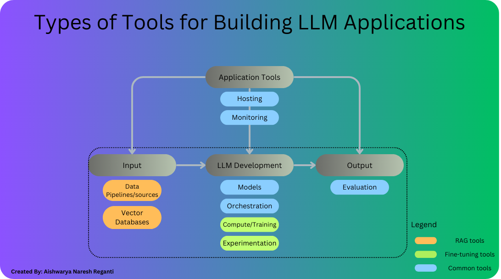
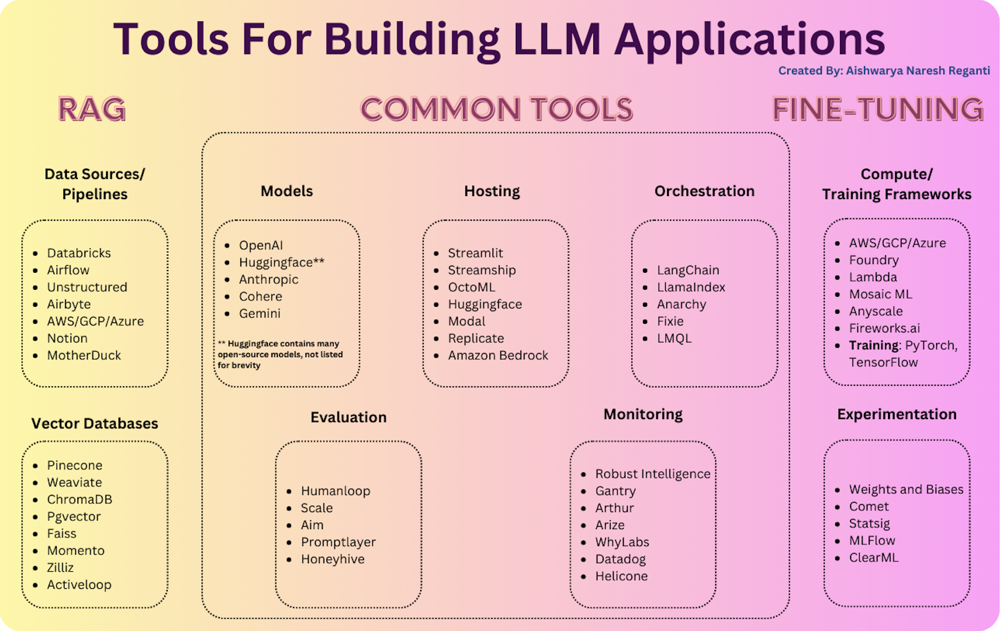
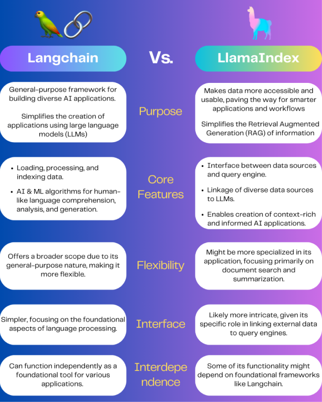

## 5 分钟速览（ETMI5）

在本课程的这一部分，我们将探讨那些能够促进 LLM 应用创建与增强的核心技术与工具。这包括用于定制化方案的「自定义模型适配（Custom Model Adaptation）」、用于生成上下文丰富回答的「基于 RAG 的应用」，以及一系列覆盖输入处理、开发、应用管理和输出分析的工具。通过这份全面的概览，我们希望帮助你掌握如何同时利用专有模型和开源模型，配合先进的开发、托管与监控工具，搭建自己的 LLM 应用。

## LLM 应用的类型

LLM 应用正在快速发展，越来越多的初创公司和企业将它们集成到自身业务中，用于各种用途。根据 LLM 的使用方式，这些应用大致可以分为三大类：

1. **自定义模型适配（Custom Model Adaptation）**：这既包括从零开发自定义模型，也包括对已有模型进行微调。自定义模型开发需要技术过硬的机器学习科学家和大量资源；而微调则是用额外数据来更新预训练模型。尽管得益于开源领域的创新，微调的门槛正在降低，但它仍然需要一支专业团队，并且可能带来意料之外的副作用。尽管存在挑战，这两种方法都在各行各业中被迅速采用。
2. **基于 RAG 的应用**：检索增强生成（Retrieval Augmented Generation，RAG）方法很可能是当前最简单、应用最广泛的方式，它在基础模型之上补充上下文信息。具体做法是从专用的向量数据库中检索 embedding（嵌入向量，即在多维向量空间中表示单词或短语）。通过把非结构化数据转换为 embedding 并存入这些数据库，RAG 能够在查询时高效检索相关上下文，从而无需大量的模型定制或训练，就能实现自然语言理解和及时洞察提取。RAG 的一个显著优势是能够绕过传统模型的限制，例如上下文窗口的约束。此外，它具有成本效益高、可扩展性强的特点，能服务于各类开发者和组织。更进一步，借助 embedding 检索，RAG 有效解决了数据时效性的问题，并能无缝集成到各种应用和系统中。

在前几周的[内容](https://www.notion.so/Week-1-Part-2-Domain-and-Task-Adaptation-Methods-6ad3284a96a241f3bd2318f4f502a1da?pvs=21)中，我们讲解了这些方法之间的区别，并讨论了如何根据你的具体需求选择最合适的方法。详情请回顾相关材料。

在接下来的章节中，我们会探讨这两种方法各自可用的工具选项。它们之间确实存在一些重叠，我们会一并说明。

## 工具的类型

我们大致可以把工具划分为四大类：

1. **输入处理工具（Input Processing Tools）**：用于为应用摄入数据和各类输入的工具。
2. **LLM 开发工具（LLM Development Tools）**：用于与大语言模型交互的工具，包括调用、微调、做实验和编排。
3. **输出工具（Output Tools）**：用于管理 LLM 应用输出的工具，核心关注输出之后的处理流程。
4. **应用工具（Application Tools）**：对上述三类组件进行整体管理的工具，包括应用托管、监控等。

如果你还记得前面内容里 RAG 的运作方式，一个应用通常会遵循以下步骤：

1. 接收用户的查询（用户对应用的输入）。
2. 利用 embedding 检索找到相关数据（这涉及一个 embedding LLM、数据源以及一个用于存储数据 embedding 的向量数据库）。
3. 把检索到的文档连同查询一起转发给 LLM 进行处理。
4. 将 LLM 的输出返回给用户。

LLM 响应的托管和监控也被整合进整体应用架构中，如下图所示。对于微调类应用，这套工作流大体不变，但需要一套专门用于模型微调的框架和计算资源。此外，应用可能用到也可能用不到外部数据，在不需要的情况下，向量数据库这一组件或许并非必需。下图中描绘了这些组件及其所属的分类。既然我们已经了解了每类工具的用途，接下来就深入剖析每一类工具。

> 💡 如果你仍不清楚为什么需要这些工具类别，请回顾前几周的内容，理解 RAG 应用和微调应用是如何运作的。

构建 LLM 应用可用工具的汇总

## 输入处理工具

### 1. 数据管道 / 数据源

在 LLM 应用中，对数据进行有效的管理和处理是提升性能与功能的关键。这类应用处理的数据类型多种多样，涵盖文本文档、PDF，以及 CSV 文件或 SQL 表等结构化格式。为了应对这种多样性，人们会选用一系列数据管道和数据源工具来加载和转换数据。

**A. 数据加载与 ETL（抽取、转换、加载）工具**

- **传统 ETL 工具**：成熟的 ETL 方案被广泛用于管理数据工作流。**[Databricks](http://databricks.com)** 因其强大的数据处理能力而备受青睐，尤其侧重机器学习与分析；而 **[Apache Airflow](https://airflow.apache.org/)** 则以可编程地编排、调度和监控工作流的能力见长。
- **文档加载器与编排框架**：主要处理非结构化数据的应用，通常会使用集成在编排框架内的文档加载器。值得一提的例子包括：
    - **[LangChain](https://www.langchain.com/)**：由 Unstructured 提供支持，帮助处理 LLM 应用中的非结构化数据。
    - **[LlamaIndex](https://www.llamaindex.ai/)**：作为 Llama Hub 生态的一部分，提供索引和检索功能，用于高效的数据管理。

关于 LlamaIndex 和 LangChain 的更多细节，将在编排（Orchestration）一节中展开。

**B. 专门的数据复制方案**

尽管现有的 LLM 应用数据管理技术栈已经可用，但仍有提升空间，尤其是在开发专门为 LLM 应用量身定制的数据复制方案方面。这类创新能够让数据的集成与运营更加顺畅，从而在效率和可实现的应用范围两方面都得到改善。

**面向结构化与非结构化数据的数据加载器**

能够整合来自各种来源的数据，靠的是那些既能处理结构化输入、又能处理非结构化输入的数据加载器。例如：

- **非结构化数据**：**Unstructured.io** 提供的方案可用于构建复杂的 ETL 管道。对于那些旨在生成个性化内容、或对存储在 PDF、文档和演示文稿等格式中的数据进行语义搜索的应用来说，这类管道至关重要。
- **结构化数据源**：人们会使用直接连接数据库及其他结构化数据仓库的加载器，从而实现无缝的数据集成与操作。

### 2. 向量数据库

回到关于 RAG 的内容，我们曾探讨过如何通过 embedding 相似度来识别最相关的文档。这正是向量数据库发挥作用的地方。

向量数据库的主要职责是高效地存储、比较和检索 embedding（即向量），其规模常常可达数十亿级别。在众多可选方案中，**[Pinecone](https://www.pinecone.io/)** 是一个突出的常见选择，因为它是云托管的，因而易于上手，并具备可扩展性、单点登录（Single Sign-On）以及正常运行时间的服务等级协议（SLA）等满足大型企业需求的特性。

向量数据库的谱系十分广泛，涵盖：

- **开源系统**，如 [Weaviate](https://weaviate.io/)、[Vespa](https://vespa.ai/) 和 [Qdrant](https://qdrant.tech/)：这些平台在单节点上能提供出色的性能，并可针对特定应用进行定制，因而成为那些有能力打造定制平台的 AI 团队的青睐之选。
- **本地向量管理库**，如 [Chroma](https://www.trychroma.com/) 和 [Faiss](https://github.com/facebookresearch/faiss)：它们以优秀的开发者体验著称，对于小规模应用和开发实验来说非常容易上手。不过，在大规模场景下，它们或许无法完全替代一个功能完备的数据库。
- **OLTP 扩展**，如 **[pgvector](https://supabase.com/docs/guides/database/extensions/pgvector)**：这一选项适合那些习惯把 Postgres 用于各种数据库需求的人，或者倾向于从单一云服务商采购大部分数据基础设施的企业，为向量支持提供了一种可行方案。不过，将向量负载与标量负载如此紧密地整合在一起，长期是否可行还有待观察。

随着技术的演进，许多开源向量数据库提供商也开始进军云服务。要在云端针对各类用例都实现高性能，是一项重大挑战。虽然短期内可用方案的格局可能不会发生剧烈变化，但长期来看，这一领域预计会持续演变。

## LLM 开发工具

### 1. 模型

开发者有多种模型可供选择，每种模型都因项目需求不同而各有优势。对许多人来说，起点是 OpenAI API，其中 GPT-4 或 GPT-4-32k 模型是热门之选，因为它们兼容性广，且几乎无需微调即可使用。

随着应用从开发阶段走向生产环境，关注点往往转向在成本与性能之间取得平衡。

除了专有模型之外，人们对开源替代方案的兴趣也在日益增长，其中大多数都可以在 **[Hugging Face](https://huggingface.co/)** 上获取。开源模型提供了一种灵活且具成本效益的方案，在搜索或聊天等高流量、面向消费者的应用中尤为有用。尽管在准确度和性能方面，开源模型传统上被认为落后于其专有对手，但这一差距正在缩小。像 Meta 的 LLaMa 系列模型这样的尝试，已经展示了开源模型达到高准确度的潜力，并激励了各种旨在匹敌甚至超越专有模型性能的替代方案不断涌现。

在专有模型与开源模型之间的取舍，并不仅仅取决于成本。需要考量的因素还包括应用的具体需求，例如准确度、推理速度、定制选项，以及为满足特定要求可能需要的微调能力。用户还可能权衡自行托管模型与使用基于云的方案各自的利弊——后者能简化部署，但可能涉及不同的成本结构和可扩展性考量。

> 💡 请注意，许多专有模型无法由应用开发者进行微调。

### 2. 编排（Orchestration）

在 LLM 应用语境下，编排工具是一类软件框架，旨在简化和管理那些涉及多个组件、并需要与 LLM 交互的复杂流程。下面拆解一下这些工具的作用：

1. **自动化提示工程（Prompt Engineering）**：编排工具自动完成提示词（prompt，即发送给 LLM 的查询或指令）的创建与管理。它们运用先进策略来构造提示词，从而有效地向模型传达当前任务，提升模型回答的相关性和准确度。
2. **整合外部数据**：它们便于把外部数据融入提示词中，用模型原本未曾训练过的上下文来增强其回答。这可能涉及从数据库、Web 服务或其他数据源拉取信息，为 LLM 生成回答提供最新或最相关的数据。
3. **管理 API 交互**：编排工具处理与 LLM API 对接时的种种复杂性，包括调用模型、管理 API 密钥以及处理模型返回的数据。这让开发者能够专注于更高层的应用逻辑，而不必纠结于 API 通信的繁琐细节。
4. **提示链与记忆管理**：它们支持提示链（prompt chaining），即把一次 LLM 交互的输出作为另一次交互的输入，从而实现更复杂的对话或数据处理序列。此外，它们还能维护对先前交互的「记忆」，帮助模型在过往回答的基础上构建出更连贯、更契合上下文的输出。
5. **简化应用开发**：通过把直接与 LLM 打交道的复杂性抽象掉，编排工具让开发者更容易构建应用。它们为聊天机器人、内容生成、信息检索等常见用例提供模板和框架，从而加快开发进程。
6. **避免厂商锁定**：这些工具的系统设计往往是模型无关（model-agnostic）的，意味着它们能与来自不同提供商的多种 LLM 协同工作。这种灵活性让开发者可以按需在不同模型之间切换，而无需重写大段应用代码。

像 **LangChain** 和 **LlamaIndex** 这样的框架，其工作方式是简化诸如提示链、对接外部 API、整合来自向量数据库的上下文数据、以及在多次 LLM 交互间保持一致性等复杂流程。它们为各类应用提供模板，因而在那些渴望快速上线应用的爱好者和初创公司中尤为流行，其中 LangChain 的使用量遥遥领先。

图片来源：[https://stackoverflow.com/questions/76990736/differences-between-langchain-llamaindex](https://stackoverflow.com/questions/76990736/differences-between-langchain-llamaindex)

检索增强生成（RAG）技术通过把特定数据嵌入到提示词中来个性化模型输出，展示了如何在不通过微调改动模型权重的前提下实现个性化。LangChain 和 LlamaIndex 这类工具提供了把数据编织进模型上下文的结构，从而促成了这一过程。

语言模型 API 的普及使强大的模型变得人人可用，让它们的应用范围从专业的机器学习团队扩展到更广泛的开发者群体。这种扩展很可能会催生更多面向开发者的工具。以 LangChain 为例，它通过抽象掉模型集成、数据连接、避免厂商锁定等复杂性，帮助开发者克服常见难题。它的用途从原型开发一直延伸到完整规模的生产应用，这预示着 LLM 应用开发生态正朝着更易用、更灵活的工具方向发生重大转变。

### 3. 计算 / 训练框架

计算与训练框架在 LLM 应用的开发和部署中扮演着至关重要的角色，尤其是在为满足特定需求而微调模型、或开发全新模型时。这些框架和服务提供了应对 LLM 庞大计算需求所必需的基础设施和工具。

**计算框架**

计算框架和云服务提供了高效运行 LLM 应用所需的可扩展资源。例如：

- **云服务商**：像 **[AWS](https://aws.amazon.com/)（Amazon Web Services）** 这样的服务提供了广泛的计算资源，包括 GPU 和 CPU 实例，这些对于 LLM 应用的训练和推理两个阶段都至关重要。这些平台提供了灵活性和可扩展性，让开发者能够根据项目需求调整资源。
- **LLM 基础设施公司**：像 **[Fireworks.ai](https://fireworks.ai/)** 和 **[Anyscale](https://www.anyscale.com/)** 这样的公司专注于提供为 LLM 量身定制的基础设施方案。这些服务旨在优化 LLM 应用的性能，提供专门的硬件和软件配置，可显著缩短训练和推理时间。

**训练框架**

对于 LLM 的开发和微调，人们会使用深度学习框架，包括：

- **PyTorch**：因其灵活性、易用性和动态计算图，成为研究人员和开发者训练 LLM 的热门之选。PyTorch 支持广泛的 LLM 架构，并提供了高效进行模型训练和微调的工具。
- **TensorFlow**：另一个被广泛使用的框架，为 LLM 的训练和部署提供了强大的支持。TensorFlow 以可扩展性著称，既适用于研究原型，也适用于生产部署。

> 💡 请注意，像采用 RAG 那样的 LLM API 应用，通常不需要直接访问用于训练的计算资源，因为它们使用的是通过 API 提供的预训练模型。在这类场景下，关注点更多在于把 API 集成进应用，并可能借助编排工具来管理与模型的交互。

### 4. 实验工具

实验工具对 LLM 应用至关重要，因为它们便于对超参数、微调技术乃至模型本身进行探索和优化。这些工具有助于跟踪和管理在开发与打磨 LLM 应用过程中产生的大量实验，从而以更系统、更数据驱动的方式改进模型。

> 💡 需要注意的是，上述工具主要在涉及模型微调或训练、需要做实验的场景下有用。如果你做的是应用层开发，这些工具可能就没那么大的用处，因为此时 LLM 就像一个黑盒。在这种情况下，LLM 的内部机制和训练过程由外部管理，关注点转向了通过 API 优化模型的使用，而不是直接操纵其训练或微调参数。

以下是一些实验工具：

- **实验跟踪**：像 **[Weights & Biases](https://wandb.ai/site)** 这样的工具提供了跟踪实验的平台，包括超参数、模型架构以及性能指标随时间的变化。这让实验过程更有条理，帮助开发者找出最有效的配置。
- **模型开发与托管**：像 **Hugging Face** 和 **[MLFlow](https://mlflow.org/)** 这样的平台，提供了开发、共享和部署机器学习模型（包括自定义 LLM）的生态。这些服务简化了对模型仓库（model hub）、计算资源和部署能力的访问，让开发周期更加顺畅。
- **性能评估**：像 **[Statsig](https://www.statsig.com/)** 这样的工具提供了在真实生产环境中评估模型性能的能力，让开发者能够进行 A/B 测试，并就模型表现收集来自真实世界的反馈。

## 应用工具

### 1. 托管（Hosting）

使用开源模型的开发者，有一系列托管服务可供选择。像 [OctoML](https://octo.ai/) 这样的公司带来的创新，已经把托管能力扩展到了传统服务器部署之外，使得在边缘设备上、乃至直接在浏览器内进行部署成为可能。这一转变不仅增强了隐私与安全性，还有助于降低延迟和成本。像 [Replicate](https://replicate.com/) 这样的托管平台正在引入相关工具，以简化软件开发者对这些模型的集成与使用——这反映出一种信念：经过精细调优的小型模型有潜力在特定领域内达到顶尖准确度。

除了 LLM 组件之外，LLM 应用中的静态部分——本质上是除模型本身以外的一切——同样需要托管方案。常见的选择包括 [Vercel](https://vercel.com/) 这类平台，以及各大云服务商提供的服务。不过，随着 [Steamship](https://www.steamship.com/) 和 [Streamlit](https://streamlit.io/) 等初创公司的涌现，这一格局也在演变——它们提供专为 LLM 应用量身定制的端到端托管方案，标志着托管选项正在拓宽，以支持开发者多样化的需求。

### 2. 监控（Monitoring）

监控与可观测性工具对于维护和改进应用至关重要，尤其是在应用部署到生产环境之后。这些工具让开发者能够跟踪模型性能、成本、延迟和整体行为等关键指标。从这些指标中获得的洞察，对于指导提示词的迭代和模型的进一步实验极具价值，能确保应用保持高效、经济，并贴合用户需求。

这一领域一个值得关注的进展，是 **WhyLabs 推出的 [LangKit](https://github.com/whylabs/langkit)**。LangKit 专门用于让开发者更清晰地洞察模型输出的质量。

其他一些例子：

**[Gantry](https://www.gantry.io/)** 提供了一种全面理解模型性能的方法，它在跟踪输入和输出的同时，也跟踪相关的元数据和用户反馈。它有助于揭示模型在真实场景中的运作方式、识别错误，并发现表现欠佳的人群分组或用例。

**[Helicone](https://www.helicone.ai/)** 旨在以极少的配置就提供关于应用性能的可执行洞察。它支持对模型交互进行实时监控，帮助开发者了解模型在各项指标上的表现。通过记录输入、输出，并用元数据和用户反馈加以丰富，Helicone 提供了对模型行为的全面视图。

## 输出工具

### 1. 评估（Evaluation）

在用 LLM 开发应用时，开发者常常需要在模型性能、推理成本和延迟之间寻求复杂的平衡。提升某一方面的策略——比如迭代提示词、微调模型或更换模型提供商——都可能影响到其他方面。鉴于 LLM 的概率性本质以及它们所执行任务的多样性，评估性能成了一项关键挑战。为帮助应对这一过程，人们开发了一系列评估工具。这些工具有助于打磨提示词、跟踪实验，并在离线和在线两种场景下监控模型性能。以下是可用工具类型的概览：

对于希望优化与 LLM 交互的人来说，无代码 / 低代码（No Code / Low Code）的提示工程工具极具价值。它们让开发者和提示工程师无需深厚的编码功底，就能尝试不同的提示词并在各种模型间对比输出。这类工具的例子包括 [Humanloop](https://humanloop.com/)、[PromptLayer](https://promptlayer.com/) 等。

应用一旦部署，持续监控其在真实世界中的表现就十分重要。性能监控工具能洞察模型在关键指标上的表现，识别随时间出现的潜在退化，并指出可改进之处。这些工具可以就那些可能影响用户体验或运营成本的问题向开发者发出预警，从而便于及时调整，以维持或提升应用的效能。一些性能监控工具包括 [Honeyhive](https://www.honeyhive.ai/) 和 [Scale AI](https://scale.com/)。

下方的信息图汇总了 LLM 应用流程中每个组件可用的工具。

## 推荐阅读 / 观看资源（选读）

1. [2024 年十大 LLM 工具](https://www.secopsolution.com/blog/top-10-llm-tools-in-2024)
2. [LLM 技术栈视角（Sequoia Capital）](https://www.sequoiacap.com/article/llm-stack-perspective/)
3. [介绍新兴的 LLM 技术栈](https://www.codesmith.io/blog/introducing-the-emerging-llm-tech-stack)
4. [StackShare：LLM 工具索引](https://stackshare.io/index/llm-tools)
