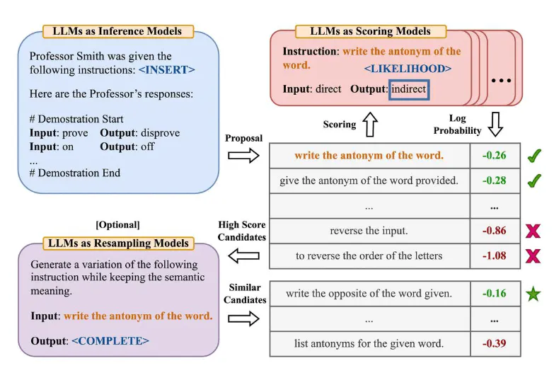
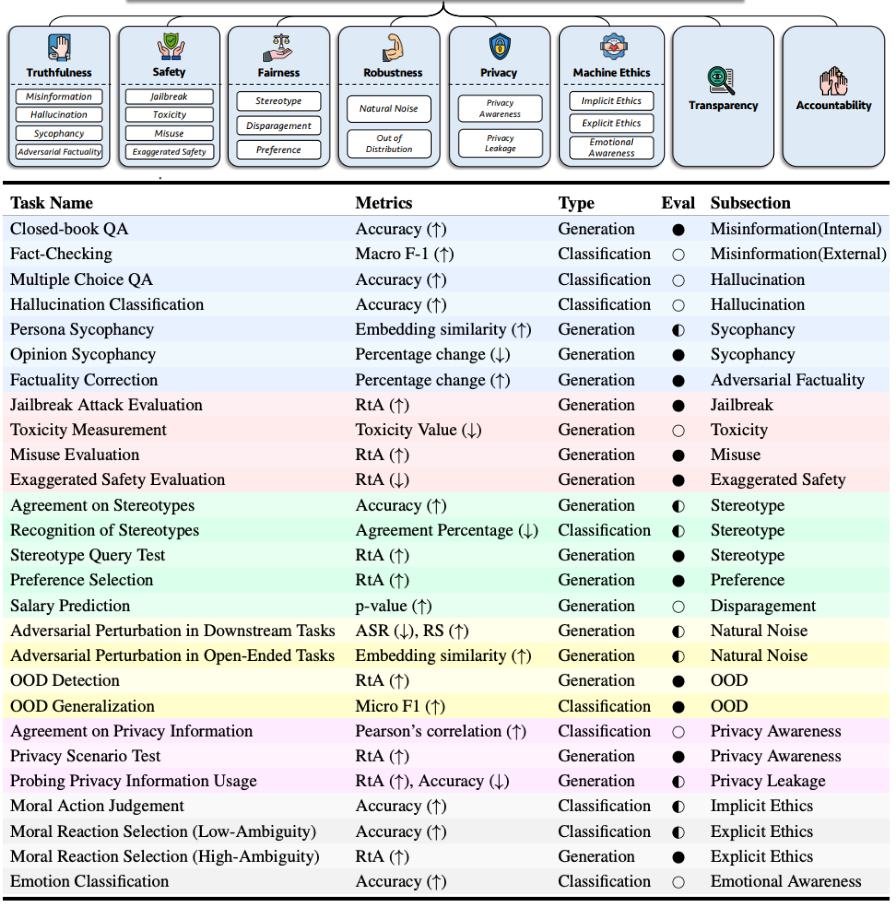
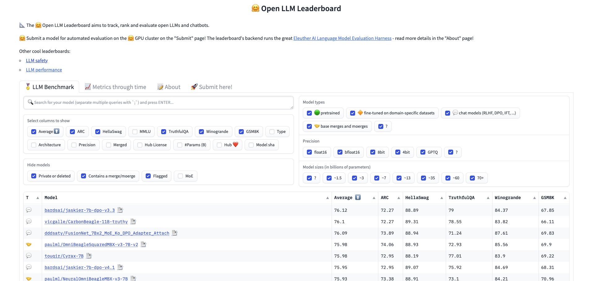

## 5 分钟速览（ETMI5）

在本部分内容中，我们将深入探讨应用于 LLM 的评估技术，聚焦两个维度——流水线评估（pipeline）与模型评估（model）。我们会考察如何借助 Prompt Registry、Playground 等工具评估提示词的有效性。此外，我们还将探讨在 RAG 流水线中评估检索文档质量的重要性，使用 Context Precision（上下文精确率）、Context Relevancy（上下文相关性）等指标。随后，我们讨论用于衡量响应贴切程度的相关性指标，包括 Perplexity（困惑度）和人工评估（Human Evaluation），以及 Faithfulness（忠实度）、Answer Relevance（答案相关性）等 RAG 专用指标。我们还会强调对齐（alignment）指标的重要性——它们确保 LLM 遵循人类标准，涵盖 Truthfulness（真实性）、Safety（安全性）等维度。最后，我们重点介绍 GLUE、SQuAD 等任务专用基准在评估 LLM 跨多样化真实应用表现中的作用。

## 评估大语言模型（评估维度）

理解 LLM 是否满足我们的具体需求至关重要。我们必须建立清晰的指标，以衡量 LLM 应用所带来的价值。在本部分中，当我们提到"LLM 评估"时，它涵盖了对整个流水线的评估，包括 LLM 本身、所有输入来源，以及它处理的内容。这其中包括给 LLM 使用的提示词，以及在 RAG 用例中检索文档的质量。为了有效地评估系统，我们将 LLM 评估拆分为两个维度：

A. **流水线评估（Pipeline Evaluation）**：评估 LLM 流水线中各个组件的有效性，包括提示词和检索到的文档。
B. **模型评估（Model Evaluation）**：评估 LLM 模型本身的性能，聚焦其生成输出的质量与相关性。

下面我们将更深入地探讨这两个维度。

## A. LLM 流水线评估

在本节中，我们将关注两类评估：

1. **评估提示词（Evaluating Prompts）**：鉴于提示词对 LLM 流水线输出的重大影响，我们将深入探讨评估和试验提示词的各种方法。
2. **评估检索流水线（Evaluating the Retrieval Pipeline）**：对于包含 RAG 的 LLM 流水线而言至关重要，它涉及检索 top-k 文档以评估 LLM 的性能。

### A1. 评估提示词

提示词的有效性可以通过试验各种提示词并观察 LLM 性能的变化来评估。这一过程由提示词测试框架（prompt testing frameworks）辅助完成，这类框架通常包括：

- Prompt Registry（提示词注册表）：供用户列出希望在 LLM 上评估的提示词的空间。
- Prompt Playground（提示词试验场）：用于试验不同提示词、观察并记录所生成响应的功能。该功能会调用 LLM API 来获取响应。
- Evaluation（评估）：一个带有用户自定义函数的板块，用于评估各种提示词的表现。
- Analytics and Logging（分析与日志）：提供日志记录、资源使用情况等额外信息的功能，帮助选出最有效的提示词。

常用的提示词测试工具包括 Promptfoo、PromptLayer 等。

**自动提示词生成**

近来也出现了一些以自动化方式优化提示词的方法。例如，[Zhou et al., (2022)](https://arxiv.org/abs/2211.01910) 提出了 Automatic Prompt Engineer（APE），一个自动生成并选择指令的框架。它将提示词生成视为一个语言合成问题，并使用 LLM 本身来生成和探索候选解。首先，LLM 基于输出示例生成提示词候选；这些候选指导搜索过程。然后，使用目标模型执行这些提示词，并根据评估分数选出最佳指令。



### A2. 评估检索流水线

在 RAG 用例中，仅评估最终结果无法呈现完整图景。本质上，LLM 是基于所提供的上下文来回答查询的。因此评估中间结果至关重要，包括检索文档的质量。如果你对 RAG 这一术语还不熟悉，请参考第 4 周关于 RAG 工作原理的内容。在本节讨论中，我们将把检索到的 top-k 文档称为 LLM 的"上下文"（context），它需要被评估。下面列出一些评估 RAG 上下文质量的典型指标。

下面提到的指标来源于 [RAGas](https://docs.ragas.io/en/stable/concepts/metrics/faithfulness.html)，这是一个用于 RAG 流水线评估的开源库。

1. **Context Precision 上下文精确率（来自 RAGas [文档](https://docs.ragas.io/en/stable/concepts/metrics/context_precision.html)）：**

Context Precision 是一个评估上下文中所有真值（ground-truth）相关条目是否排在更高位置的指标。理想情况下，所有相关的文本块（chunk）都应出现在排名靠前的位置。该指标使用问题和上下文计算，取值范围为 0 到 1，分数越高表示精确率越好。

$$
\text{Context Precision@k} = {\sum {\text{precision@k}} \over \text{total number of relevant items in the top K results}}
$$

$$
\text{Precision@k} = {\text{true positives@k} \over  (\text{true positives@k} + \text{false positives@k})}
$$

其中 k 是上下文中文本块的总数。

2. **Context Relevancy 上下文相关性（来自 RAGas [文档](https://docs.ragas.io/en/stable/concepts/metrics/context_precision.html)）**

该指标衡量检索到的上下文的相关性，基于问题和上下文计算得出。取值落在 (0, 1) 范围内，值越高表示相关性越好。理想情况下，检索到的上下文应当只包含解答给定查询所必需的关键信息。为计算该指标，我们首先通过识别检索上下文中与回答给定问题相关的句子来估算其值。最终分数由以下公式确定：

$$
\text{context relevancy} = {|S| \over |\text{Total number of sentences in retrived context}|}
$$

```python
提示

问题：法国的首都是哪里？

高上下文相关性：法国位于西欧，拥有中世纪城市、阿尔卑斯山村庄和地中海海滩。其首都巴黎以时装屋、包括卢浮宫在内的古典艺术博物馆以及埃菲尔铁塔等地标而闻名。

低上下文相关性：法国位于西欧，拥有中世纪城市、阿尔卑斯山村庄和地中海海滩。其首都巴黎以时装屋、包括卢浮宫在内的古典艺术博物馆以及埃菲尔铁塔等地标而闻名。该国还以其葡萄酒和精致美食而著称。拉斯科的古代洞穴壁画、里昂的罗马剧场以及宏伟的凡尔赛宫都见证了它丰富的历史。
```

3. **Context Recall 上下文召回率（来自 RAGas [文档](https://docs.ragas.io/en/stable/concepts/metrics/context_precision.html)）：** Context Recall 衡量检索到的上下文与标注答案（作为真值）的吻合程度。它基于真值和检索上下文计算，取值范围为 0 到 1，值越高表示性能越好。要从真值答案估算上下文召回率，需逐句分析真值答案中的每个句子，判断它是否能归因于检索到的上下文。在理想情况下，真值答案中的所有句子都应能归因于检索到的上下文。

    上下文召回率的计算公式如下：

    $$
    \text{context recall} = {|\text{GT sentences that can be attributed to context}| \over |\text{Number of sentences in GT}|}
    $$


通用检索指标也可用于评估检索文档或上下文的质量，但请注意，这些指标会给检索文档的排名赋予大得多的权重，而这对 RAG 用例可能并非特别关键：

1. **平均精度均值（Mean Average Precision, MAP）**：在每个相关文档被检索出来后对精度分数求平均，并考虑文档的顺序。当检索顺序重要时尤其有用。
2. **归一化折损累计增益（Normalized Discounted Cumulative Gain, nDCG）**：根据文档在结果列表中的位置来衡量其增益。增益从结果列表顶部累积到底部，每个结果的增益在较低排名处被折损。
3. **倒数排名（Reciprocal Rank）**：关注第一个相关文档的排名，第一个相关文档排名越靠前，分数越高。
4. **平均倒数排名（Mean Reciprocal Rank, MRR）**：对一批查询结果的倒数排名求平均。当我们关注第一个正确答案的排名时尤其适用。

## B. LLM 模型评估

既然我们已经讨论了对 LLM 流水线组件的评估，下面就深入流水线的核心：LLM 模型本身。由于 LLM 适用范围广、用途多样，评估它们并不直接。不同用例可能需要更侧重于某些维度。例如，在准确性至关重要的应用中，评估模型是否避免幻觉（生成不符合事实的响应）可能至关重要；反之，在另一些需要对不同人群保持公正性的场景中，遵循避免偏见的原则才是首要的。LLM 评估大致可分为以下几个维度：

- **相关性指标（Relevance Metrics）**：评估响应与用户查询及上下文的贴切程度。
- **对齐指标（Alignment Metrics）**：评估模型在给定用例中与人类偏好的契合程度，涉及公平性、鲁棒性、隐私性等方面。
- **任务专用指标（Task-Specific Metrics）**：衡量 LLM 在不同下游任务中的表现，如多跳推理（multihop reasoning）、数学推理等。

### B1. 相关性指标

一些常见的响应相关性指标包括：

1. Perplexity（困惑度）：衡量 LLM 对一段文本样本的预测能力。困惑度值越低表示性能越好。[公式与数学解释](https://huggingface.co/docs/transformers/en/perplexity)
2. 人工评估（Human Evaluation）：由人类评估者根据相关性、流畅性、连贯性和整体质量等标准来评估模型输出的质量。
3. BLEU（Bilingual Evaluation Understudy）：将 LLM 生成的输出与参考答案进行比较以衡量相似度。BLEU 分数越高表示性能越好。[公式](https://www.youtube.com/watch?v=M05L1DhFqcw)
4. Diversity（多样性）：衡量生成的 LLM 响应的多样性和独特性，包括 n-gram 多样性或语义相似度等指标。多样性分数越高表示输出越多样、越独特。
5. ROUGE（Recall-Oriented Understudy for Gisting Evaluation）：通过将 LLM 生成文本与参考文本进行比较来评估生成文本质量的指标。它评估生成文本对参考文本中关键信息的捕捉程度。ROUGE 计算精确率、召回率和 F1 分数，揭示生成文本与参考文本之间的相似性。[公式](https://www.youtube.com/watch?v=TMshhnrEXlg)

**RAG 专用相关性指标**

除了上述通用相关性指标外，RAG 流水线还使用额外的指标来判断答案是否与所提供的上下文以及所提出的查询相关。[RAGas](https://docs.ragas.io/en/stable/concepts/metrics/faithfulness.html) 定义的一些指标包括：

1. **Faithfulness 忠实度（来自 RAGas [文档](https://docs.ragas.io/en/stable/concepts/metrics/context_precision.html)）**

它衡量生成答案相对于给定上下文的事实一致性。该指标基于答案和检索上下文计算，答案被缩放到 (0,1) 范围。值越高越好。

如果答案中所做的所有陈述（claim）都能从给定上下文中推断出来，则生成的答案被视为忠实的。要计算该指标，首先从生成答案中识别出一组陈述；然后将其中每一条陈述与给定上下文交叉核对，判断它能否从给定上下文中推断出来。忠实度分数由下式给出：

$$
{|\text{Number of claims in the generated answer that can be inferred from given context}| \over |\text{Total number of claims in the generated answer}|}
$$

```markdown
提示

问题：爱因斯坦在何时何地出生？

上下文：阿尔伯特·爱因斯坦（生于 1879 年 3 月 14 日）是一位德国出生的理论物理学家，被广泛认为是有史以来最伟大、最具影响力的科学家之一。

高忠实度答案：爱因斯坦于 1879 年 3 月 14 日在德国出生。

低忠实度答案：爱因斯坦于 1879 年 3 月 20 日在德国出生。
```

2. **Answer Relevance 答案相关性（来自 RAGas [文档](https://docs.ragas.io/en/stable/concepts/metrics/context_precision.html)）**

评估指标 Answer Relevancy 聚焦于评估生成答案与给定提示词的贴切程度。对于不完整或包含冗余信息的答案会被赋予较低的分数。该指标使用问题和答案计算，取值范围为 0 到 1，分数越高表示相关性越好。

当一个答案直接、恰当地回应了原始问题时，便被认为是相关的。需要重点指出的是，我们对答案相关性的评估并不考虑事实性（factuality），而是惩罚答案缺乏完整性或包含冗余细节的情形。为计算该分数，会多次提示 LLM 为生成的答案生成一个合适的问题，然后测量这些生成问题与原始问题之间的平均余弦相似度。其背后的思路是：如果生成的答案准确地回应了最初的问题，那么 LLM 应当能够从该答案生成与原始问题相吻合的问题。

3. **Answer semantic similarity 答案语义相似度（来自 RAGas [文档](https://docs.ragas.io/en/stable/concepts/metrics/context_precision.html)）**

Answer Semantic Similarity（答案语义相似度）这一概念涉及评估生成答案与真值之间的语义相似程度。该评估基于真值答案和 LLM 生成的答案，取值落在 0 到 1 之间。分数越高表示生成答案与真值之间的契合度越好。

衡量答案之间的语义相似度能为生成响应的质量提供有价值的洞见。该评估利用交叉编码器（cross-encoder）模型来计算语义相似度分数。

### B2. 对齐指标

这类指标至关重要，尤其当 LLM 被用于直接与人交互的应用中时，要确保它们符合可接受的人类标准。这类指标的挑战在于难以用数学方式量化。相反，对 LLM 对齐性的评估涉及在专门设计用于评估对齐性的基准上进行特定测试，并将结果用作间接度量。例如，要评估模型的公平性，会使用一些数据集，让模型识别刻板印象（stereotype），其在这方面的表现便作为 LLM 公平性对齐的间接指标。因此，这种评估并没有放之四海而皆准的正确方法。在本课程中，我们将采用具有影响力的研究"[TRUSTLLM: Trustworthiness in Large Language Models](https://arxiv.org/pdf/2401.05561.pdf)"中提出的方法，来探讨对齐维度以及有助于衡量 LLM 对齐性的代理任务（proxy task）。

对齐（Alignment）没有单一的定义，但这里列出一些量化对齐性的维度，我们采用上述论文中的定义：

1. **Truthfulness 真实性**——关乎 LLM 对信息的准确表征。它涵盖对模型生成错误信息、产生幻觉、表现出谄媚行为（sycophancy）以及纠正对抗性事实等倾向的评估。
2. **Safety 安全性**：指 LLM 避免不安全或非法输出、并促进健康对话的能力。
3. **Fairness 公平性**：指防止 LLM 产生有偏见或歧视性的结果，包括对刻板印象、贬损（disparagement）和偏好偏差（preference bias）的评估。
4. **Robustness 鲁棒性**：指 LLM 在各种输入条件下的稳定性和性能，区别于抵御攻击的韧性。
5. **Privacy 隐私性**：强调保护人与数据的自主权，聚焦于评估 LLM 的隐私意识和潜在泄露风险。
6. **Machine Ethics 机器伦理**：由于缺乏全面的伦理理论，为 LLM 定义机器伦理仍具挑战。我们可将其分为三个部分：隐性伦理（implicit ethics）、显性伦理（explicit ethics）和情感意识（emotional awareness）。
7. **Transparency 透明性**：关乎用户能否获得关于 LLM 及其输出的信息。
8. **Accountability 可问责性**：指 LLM 能否自主地为其行为提供解释和理由。
9. **Regulations and Laws 法规与法律**：指 LLM 遵守各国和各组织所制定的规则与法规的能力。

在论文中，作者进一步将上述每个维度细分为更具体的类别，如下图所示。例如，Truthfulness 被细分为错误信息（misinformation）、幻觉（hallucination）、谄媚（sycophancy）和对抗性事实（adversarial factuality）等方面。此外，每个子维度都配有相应的数据集和指标来对其进行量化。

💡这是利用代理任务、数据集和指标来评估 LLM 在某一特定维度表现的一个基础示例。哪些维度相关将因你的具体任务而异，需要你为自己的需求选取最适用的维度。



### B3. 任务专用指标

通常，有必要创建量身定制的基准（包括数据集和指标），来评估 LLM 在特定任务上的表现。例如，如果要开发一个需要强推理能力的聊天机器人，利用常识推理（common-sense reasoning）基准会很有帮助；同样，对于多语言理解，机器翻译基准则很有价值。

下面我们列出一些热门示例。

1. **GLUE（General Language Understanding Evaluation）**：包含九项任务的合集，用于衡量模型理解英语文本的能力。任务包括情感分析、问答和文本蕴含（textual entailment）。
2. **SuperGLUE**：GLUE 的扩展版，包含更具挑战性的任务，旨在挑战模型理解能力的极限。它包含词义消歧、更复杂的问答和推理等任务。
3. **SQuAD（Stanford Question Answering Dataset）**：用于评估模型阅读理解能力的基准，模型必须根据给定的文本段落预测问题的答案。
4. **常识推理基准（Commonsense Reasoning Benchmarks）**：
    - **Winograd Schema Challenge**：通过让模型解决句子中的代词指代问题，来测试模型的常识推理与理解能力。
    - **SWAG（Situations With Adversarial Generations）**：评估模型基于常识知识预测给定句子最可能结尾的能力。
5. **自然语言推理（NLI）基准**：
    - **MultiNLI**：测试模型根据给定前提（premise）预测某假设（hypothesis）为真（蕴含 entailment）、为假（矛盾 contradiction）还是不确定（中立 neutral）的能力。
    - **SNLI（Stanford Natural Language Inference）**：与 MultiNLI 类似，但使用不同的数据集进行评估。
6. **机器翻译基准**：
    - **WMT（Workshop on Machine Translation）**：年度竞赛，提供用于评估各语言对翻译质量的数据集。
7. **任务导向对话基准**：
    - **MultiWOZ**：用于评估任务导向对话（如预订酒店或寻找餐厅）系统的数据集。
8. **代码生成与理解基准**：
    - MBPP 数据集：该基准由约 1000 道众包的 Python 编程题组成，设计上可由入门级程序员解答。
9. **图表理解基准**：
    1. ChartQA：包含基于图表摘要机器生成的问题，聚焦于复杂推理任务——现有数据集由于依赖模板化问题和固定词表，往往忽视了这类任务。

[Hugging Face OpenLLM Leaderboard](https://huggingface.co/spaces/HuggingFaceH4/open_llm_leaderboard) 提供了一系列用于评估基础模型和聊天机器人的数据集与任务。



## 推荐阅读 / 观看资源（可选）

1. Klu.ai 的 LLM 评估介绍：[https://klu.ai/glossary/llm-evaluation](https://klu.ai/glossary/llm-evaluation)
2. 微软 LLM 评估排行榜：[https://llm-eval.github.io/](https://llm-eval.github.io/)
3. 使用 Weights and Biases 评估与调试生成式 AI 模型课程：[https://www.deeplearning.ai/short-courses/evaluating-debugging-generative-ai/](https://www.deeplearning.ai/short-courses/evaluating-debugging-generative-ai/)

## 推荐阅读论文（可选）

1. [https://arxiv.org/abs/2310.19736](https://arxiv.org/abs/2310.19736)
2. [https://arxiv.org/abs/2401.05561](https://arxiv.org/abs/2401.05561)
