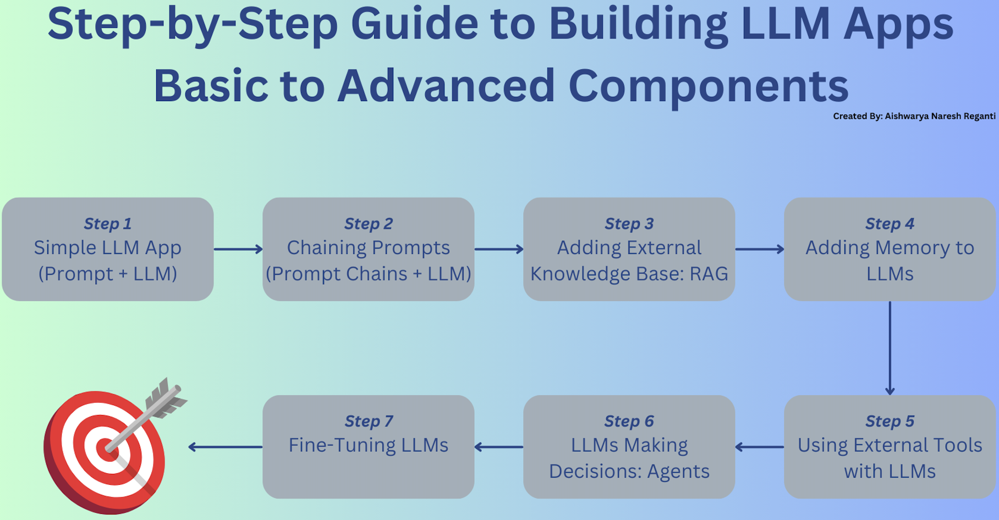

## 5 分钟速览（ETMI5）

在本课程前面的部分，我们介绍了提示（prompting）、RAG 和微调（fine-tuning）等技术。本篇将采用务实、动手的方式，展示如何把 LLM 应用到实际的应用开发中。我们会从最基础的示例开始，逐步加入更高级的能力，比如链式调用（chaining）、记忆管理（memory management）和工具集成（tool integration）。此外，我们还会探讨 RAG 与微调的实现。最后，通过把这些概念整合起来，我们将学习如何高效地构建 LLM 智能体（agent）。

## 引言

随着 LLM 的日益普及，如今使用它们的方式已经多种多样。我们会从最基础的示例入手，逐步引入更高级的特性，让你能够循序渐进地建立理解。

本指南旨在覆盖基础内容，目标是通过简单的应用让你熟悉这些底层要素。这些示例只是起点，并不适用于生产环境。关于如何大规模部署应用（包括对 LLM 工具、评估等内容的讨论），请参阅我们前几周的内容。随着各小节的推进，我们会逐步从基础组件走向更高级的组件。

在每一节中，我们不仅会描述对应的组件，还会提供资源，帮助你找到代码示例，从而开发出自己的实现。可用于开发应用的框架有不少，其中最知名的包括 LangChain、LlamaIndex、Hugging Face 和 Amazon Bedrock 等。我们的目标是从这一大批框架中提供丰富的资源，让你能选出最契合自己具体应用需求的那一个。

在浏览每一节时，请挑选几个资源来帮你用对应的组件构建应用，然后继续往下推进。



## 1. 简单的 LLM 应用（提示 + LLM）

**提示（Prompt）：** 在这里，提示本质上是一段精心构造的请求或指令，用来引导模型生成回应。它是给到 LLM 的初始输入，描述了你希望它执行的任务或需要它回答的问题。在第二周的内容里，我们已经深入探讨过提示工程（prompt engineering），请回到之前的内容了解更多。

LLM 应用开发最基础的环节，就是用户定义的提示与 LLM 本身之间的交互。这个过程包括构造一个能清晰传达用户请求或问题的提示，再交由 LLM 处理并生成回应。例如：

```python
# 定义带占位符的提示模板
prompt_template = "Provide expert advice on the following topic: {topic}."
# 用实际的主题填充模板
prompt = prompt_template.replace("{topic}", topic)
# 调用 LLM 的 API
llm_response = call_llm_api(topic)
	
```

注意，这里的提示是以模板而非固定字符串的形式存在的，这提升了它的可复用性，也便于在运行时进行修改。提示的复杂度可以变化：既可以写得很简单，也可以根据需求写得十分细致复杂。

### 资源 / 代码

1. [**文档 / 代码**] LangChain 简单 LLM 应用 cookbook（[链接](https://python.langchain.com/docs/expression_language/cookbook/prompt_llm_parser)）
2. [**视频**] AI Jason：5 分钟搞定 Hugging Face + LangChain（[链接](https://www.youtube.com/watch?v=_j7JEDWuqLE)）
3. [**文档 / 代码**] 在 LlamaIndex 中使用 LLM（[链接](https://docs.llamaindex.ai/en/stable/understanding/using_llms/using_llms.html)）
4. [**博客**] Leonie Monigatti：LangChain 入门（[链接](https://towardsdatascience.com/getting-started-with-langchain-a-beginners-guide-to-building-llm-powered-applications-95fc8898732c)）
5. [**Notebook**] LearnDataWithMark：在自己的笔记本电脑上运行 LLM（[链接](https://github.com/mneedham/LearnDataWithMark/blob/main/llm-own-laptop/notebooks/LLMOwnLaptop.ipynb)）

---

## 2. 链式提示（提示链 + LLM）

虽然使用提示模板并调用 LLM 已经很有效，但有时你可能需要向 LLM 接连提出多个问题，并用前面得到的答案来构造下一个问题。设想这样的场景：你先让 LLM 判断你的问题属于哪个主题，然后再用这个信息让它就该主题给出专家级的答案。这种"一个答案引出下一个问题"的逐步过程，就称为"链式调用"（chaining）。提示链（Prompt Chains）本质上就是用于执行一系列 LLM 动作的链条序列。

LangChain 已经成为构建 LLM 应用时广泛使用的库，它能够把与 LLM 的多次问答串联起来，最终产出一个统一的结果。这种方式对于需要多个步骤才能达成目标的大型项目尤其有用。前面讨论的例子展示的是一种基础的链式方法。LangChain 的[文档](https://js.langchain.com/docs/modules/chains/)提供了更复杂链式技巧的指引。

```python
prompt1 ="what topic is the following question about-{question}?"
prompt2 = "Provide expert advice on the following topic: {topic}."
```

### 资源 / 代码

1. [**文章**] Prompt Engineering Guide 上的提示链文章（[链接](https://www.promptingguide.ai/techniques/prompt_chaining)）
2. [**视频**] James Briggs：用 GPT-3.5 等 LLM 构建 LLM 链——LangChain #3（[链接](https://www.youtube.com/watch?v=S8j9Tk0lZHU)）
3. [**视频**] Sam Witteveen：LangChain 基础教程 #2 工具与链（[链接](https://www.youtube.com/watch?v=hI2BY7yl_Ac)）
4. [**代码**] Sam Witteveen：LangChain 工具与链 Colab notebook（[链接](https://colab.research.google.com/drive/1zTTPYk51WvPV8GqFRO18kDe60clKW8VV?usp=sharing)）

---

## 3. 接入外部知识库：检索增强生成（RAG）

接下来，我们要探讨另一类应用。如果你跟上了我们之前的讨论，就会知道：尽管 LLM 擅长提供信息，但它的知识仅限于最后一次训练时所能接触到的内容。要生成超出这一时间点的有意义的输出，它们就需要访问外部知识库。这正是检索增强生成（Retrieval-Augmented Generation，RAG）所扮演的角色。

检索增强生成（RAG）就像是在 LLM 回答之前先给它一座私人图书馆去查阅。在 LLM 生成新内容之前，它会先翻阅一大堆信息（比如文章、书籍或网页），找出与你的问题相关的内容；然后把找到的内容与它自身的知识结合起来，给你一个更好的答案。当你需要应用引入最新信息、或对特定主题做深入挖掘时，这一点尤其实用。

要实现 RAG（检索增强生成），除了 LLM 和提示之外，你还需要以下技术要素：

**一个知识库，具体来说是向量数据库（vector database）**

它是一份内容全面的文档、文章或数据条目集合，系统可以从中获取信息。这个数据库不仅仅是简单的文本集合，它通常会被转换成向量数据库。在这里，知识库中的每一项都被转换成一个高维向量（high-dimensional vector），用以表示该文本的语义含义。这种转换借助与 LLM 类似、但专注于把文本编码成向量的模型来完成。

让知识库向量化的目的，是为了支持高效的相似度搜索（similarity search）。当系统试图找到与用户查询相关的信息时，它会用相同的编码过程把查询转换成一个向量。然后，它在向量数据库中搜索与查询向量最接近的向量（即各条信息），通常会借助余弦相似度（cosine similarity）这类度量。这个过程能在庞大的数据库中快速定位出最相关的信息，而这是传统文本搜索方法难以做到的。

**检索组件（Retrieval Component）**

检索组件是实际执行知识库搜索、找出与用户查询相关信息的引擎。它负责以下几项关键任务：

1. **查询编码（Query Encoding）：** 它使用与向量化知识库相同的模型或方法，把用户查询转换成一个向量。这确保了查询与数据库条目处于同一个向量空间，从而可以进行相似度比较。
2. **相似度搜索（Similarity Search）：** 一旦查询被向量化，检索组件就会在向量数据库中搜索最接近的向量。这种搜索可以基于多种算法，这些算法专为高效处理高维数据而设计，确保整个过程既快速又准确。
3. **信息检索（Information Retrieval）：** 在识别出最接近的向量之后，检索组件会从知识库中取出对应的条目。这些条目就是被判定为与用户查询最相关的信息。
4. **聚合（可选）：** 在某些实现中，检索组件还可能对来自多个来源的信息进行聚合或汇总，以提供一个整合后的回应。这一步在更高级的、旨在综合信息而非直接引用来源的 RAG 系统中更为常见。

在 RAG 框架中，检索组件的输出（即检索到的信息）随后会与原始查询一并送入 LLM。这使得 LLM 能够生成既贴合上下文、又因检索信息而具备特定性与准确性的回应。最终得到的是一个混合模型，它兼取两者之长：LLM 的生成灵活性，以及专门知识库的事实精确性。

通过将向量化的知识库与高效的检索机制结合起来，RAG 系统能够给出既高度相关、又由广泛来源深度支撑的答案。这种方式在需要最新信息、领域专属知识、或超出 LLM 既有知识的详细解释的应用中尤为有用。

像 LangChain 这样的框架已经为构建 RAG 框架准备好了良好的抽象。

LangChain 的一个简单示例见[这里](https://python.langchain.com/docs/expression_language/cookbook/retrieval)。

### 资源 / 代码

1. [**文章**] Dominik Polzer：构建你的第一个 LLM 应用所需要知道的一切（[链接](https://towardsdatascience.com/all-you-need-to-know-to-build-your-first-llm-app-eb982c78ffac)）
2. [**视频**] LangChain：从零开始的 RAG 系列（[链接](https://www.youtube.com/watch?v=wd7TZ4w1mSw&list=PLfaIDFEXuae2LXbO1_PKyVJiQ23ZztA0x)）
3. [**视频**] 用 LlamaIndex 深入理解检索增强生成（[链接](https://www.youtube.com/watch?v=Y0FL7BcSigI&t=3s)）
4. [**Notebook**] 用 LangChain 配合 Amazon Bedrock Titan 文本与嵌入、并使用 OpenSearch 向量引擎实现 RAG 的 notebook（[链接](https://github.com/aws-samples/rag-using-langchain-amazon-bedrock-and-opensearch)）
5. [**视频**] Coding Crashcourses：LangChain——提升检索性能的高级 RAG 技巧（[链接](https://www.youtube.com/watch?v=KQjZ68mToWo)）
6. [**视频**] James Briggs：带 RAG 的聊天机器人——LangChain 完整演练（[链接](https://www.youtube.com/watch?v=LhnCsygAvzY&t=11s)）

---

## 4. 为 LLM 添加记忆

我们已经探讨过链式调用和接入知识。现在设想这样一个场景：在与 LLM 进行较长的对话时，我们需要记住过去的交互，因为之前的对话内容会起到作用。

这时，记忆（Memory）这一概念作为关键组件就登场了。记忆机制（比如 LangChain 这类平台上提供的那些）能够存储对话历史。例如，LangChain 的 ConversationBufferMemory 特性可以保存消息，这些消息随后可以被取出，并在后续交互中用作上下文。你可以在 LangChain 的[文档](https://python.langchain.com/docs/modules/memory/types/)中了解更多关于这些记忆抽象及其应用的内容。

### 资源 / 代码

1. [**文章**] Pinecone：用 LangChain 为 LLM 实现对话记忆（[链接](https://www.pinecone.io/learn/series/langchain/langchain-conversational-memory/)）
2. [**博客**] Nikolay Penkov：如何为聊天 LLM 模型添加记忆（[链接](https://medium.com/@penkow/how-to-add-memory-to-a-chat-llm-model-34e024b63e0c)）
3. [**文档**] LlamaIndex 文档中的 Memory（[链接](https://docs.llamaindex.ai/en/latest/api_reference/memory.html)）
4. [**视频**] Prompt Engineering：LangChain——为 LLM 赋予记忆（[链接](https://www.youtube.com/watch?v=dxO6pzlgJiY)）
5. [**视频**] 用 LangChain 构建带记忆的自定义医疗智能体（[链接](https://www.youtube.com/watch?v=6UFtRwWnHws)）

---

## 5. 在 LLM 中使用外部工具

设想一个 LLM 应用的场景，比如一个旅行规划器（travel planner），其中目的地或景点的可用性取决于季节性开放情况。假设我们能访问一个提供这类具体信息的 API。这时，应用必须查询该 API 来判断某个地点是否开放。如果该地点已关闭，LLM 就应相应地调整推荐，给出替代选项。这说明了一个关键情形：集成外部工具能够显著增强 LLM 的功能，使其能够给出更准确、更贴合上下文的回应。这类集成并不局限于旅行规划；在许多其他情形下，外部数据源、API 和工具都可以为 LLM 应用增色。例子包括：用于活动策划的天气预报、用于理财建议的股市数据，或用于内容生成的实时新闻——每一项都为 LLM 的能力增添了一层动态性与特定性。

在像 LangChain 这样的框架中，集成这些外部工具通过其链式框架得到了简化，使得 API、数据源以及其他工具等新元素能够被无缝纳入。

### 资源 / 代码

1. [**文档 / 代码**] LangChain 的 LLM 工具列表（[链接](https://python.langchain.com/docs/integrations/tools)）
2. [**文档 / 代码**] LlamaIndex 中的工具（[链接](https://docs.llamaindex.ai/en/stable/module_guides/deploying/agents/tools/root.html)）
3. [**视频**] Sam Witteveen：用 LangChain 构建自定义工具与智能体（[链接](https://www.youtube.com/watch?v=biS8G8x8DdA)）

---

## 6. 让 LLM 做决策：智能体（Agents）

在前面几节中，我们探讨了工具、记忆等复杂的 LLM 组件。现在，假设我们希望 LLM 能够有效地运用这些要素，来代表我们做出决策。

LLM 智能体（agent）正是做这件事的：它们是通过将 LLM 与规划（planning）、记忆（memory）、工具使用（tool usage）等其他模块相结合，来执行复杂任务的系统。这些智能体利用 LLM 理解并生成类人语言的能力，从而能够与用户交互并有效地处理信息。

举例来说，设想这样一个场景：我们希望 LLM 智能体协助进行财务规划。任务是分析某个人过去一年的消费习惯，并就预算优化给出建议。

为完成这项任务，智能体首先利用其记忆模块访问所存储的、关于此人支出、收入来源和财务目标的数据。然后它运用规划机制把任务拆分为若干步骤：

1. **数据分析（Data Analysis）：** 智能体使用外部工具处理财务数据，对支出进行分类、识别趋势，并计算总支出、储蓄率、支出分布等关键指标。
2. **预算评估（Budget Evaluation）：** 基于分析后的数据，LLM 智能体评估当前预算在实现此人财务目标方面的有效性。它会考虑诸如可自由支配的支出、必要开支以及潜在的削减成本空间等因素。
3. **建议生成（Recommendation Generation）：** 借助其对财务原理和优化策略的理解，智能体制定个性化的建议来改善此人的财务健康状况。这些建议可能包括把资金重新分配到储蓄、削减非必要开支，或探索投资机会。
4. **沟通（Communication）：** 最后，LLM 智能体以清晰易懂的方式把建议传达给用户，运用自然语言生成能力来解释每条建议背后的依据及其潜在收益。

在整个过程中，LLM 智能体把它的决策能力与外部工具、记忆存储和规划机制无缝整合，从而提供贴合用户财务状况的可执行洞见。

下面是 LLM 智能体如何组合各个组件来做决策：

1. **语言模型（LLM）：** LLM 充当智能体的中央控制器，也就是"大脑"。它解读用户查询、生成回应，并协调完成任务所需的整体操作流程。
2. **关键模块：**
    - **规划（Planning）：** 该模块帮助智能体把复杂任务拆分为可管理的小部分。它制定一套行动计划，以高效地实现既定目标。
    - **记忆（Memory）：** 记忆模块让智能体能够存储和检索与当前任务相关的信息。它有助于维护操作状态、跟踪进度，并基于过去的观察做出明智决策。
    - **工具使用（Tool Usage）：** 智能体可以利用外部工具或 API 来收集数据、执行计算或生成输出。与这些工具的集成增强了智能体应对各种任务的能力。

现有的框架为构建智能体提供了内置模块和抽象。请参考下面提供的资源来实现你自己的智能体。

### 资源 / 代码

1. [**文档 / 代码**] LangChain 中的智能体（[链接](https://python.langchain.com/docs/modules/agents/)）
2. [**文档 / 代码**] LlamaIndex 中的智能体（[链接](https://docs.llamaindex.ai/en/stable/module_guides/deploying/agents/root.html)）
3. [**视频**] Sam Witteveen：LangChain 智能体——用决策把工具与链连接起来（[链接](https://www.youtube.com/watch?v=ziu87EXZVUE&t=59s)）
4. [**文章**] Nvidia：构建你的第一个 LLM 智能体应用（[链接](https://developer.nvidia.com/blog/building-your-first-llm-agent-application)）
5. [**视频**] Sam Witteveen：OpenAI Functions + LangChain——构建一个多工具智能体（[链接](https://www.youtube.com/watch?v=4KXK6c6TVXQ)）

---

## 7. 微调（Fine-Tuning）

在前面的章节中，我们探讨了如何把预训练的 LLM 与额外的组件配合使用。然而，在某些场景下，必须先用相关信息更新 LLM 才能使用它，尤其是当 LLM 缺乏关于某个主题的特定知识时。在这类情况下，就有必要先对 LLM 进行微调，然后再应用第 1–5 节所述的策略来围绕它构建应用。

许多平台都提供微调能力，但需要注意的是：微调比单纯从 LLM 获取回应需要更多资源，因为它涉及训练模型去理解并生成所需主题上的信息。

### 资源 / 代码

1. [**文章**] philschmid：2024 年如何用 Hugging Face 微调 LLM（[链接](https://www.philschmid.de/fine-tune-llms-in-2024-with-trl)）
2. [**视频**] Shaw Talebi：微调大语言模型（LLM）| 含示例代码（[链接](https://www.youtube.com/watch?v=eC6Hd1hFvos)）
3. [**视频**] Sam Witteveen：用 PEFT 和 LoRA 微调 LLM（[链接](https://www.youtube.com/watch?v=Us5ZFp16PaU&t=261s)）
4. [**视频**] AI Anytime：LLM 微调速成课——1 小时端到端指南（[链接](https://www.youtube.com/watch?v=mrKuDK9dGlg)）
5. [**文章**] Weights and Biases：如何微调 LLM 系列（[链接](https://wandb.ai/capecape/alpaca_ft/reports/How-to-Fine-Tune-an-LLM-Part-1-Preparing-a-Dataset-for-Instruction-Tuning--Vmlldzo1NTcxNzE2)）

---

## 推荐阅读 / 观看（可选）

1. aishwaryanr：LLM notebook 列表（[链接](https://github.com/aishwaryanr/awesome-generative-ai-guide?tab=readme-ov-file#notebook-code-notebooks)）
2. Sam Witteveen：LangChain 操作指南与教程（[链接](https://www.youtube.com/watch?v=J_0qvRt4LNk&list=PL8motc6AQftk1Bs42EW45kwYbyJ4jOdiZ)）
3. codebasics：面向初学者的 LangChain 速成课 | LangChain 教程（[链接](https://www.youtube.com/watch?v=nAmC7SoVLd8)）
4. Build with LangChain 系列（[链接](https://www.youtube.com/watch?v=mmBo8nlu2j0&list=PLfaIDFEXuae06tclDATrMYY0idsTdLg9v)）
5. Maxime Labonne：LLM 动手课程（[链接](https://github.com/mlabonne/llm-course)）
