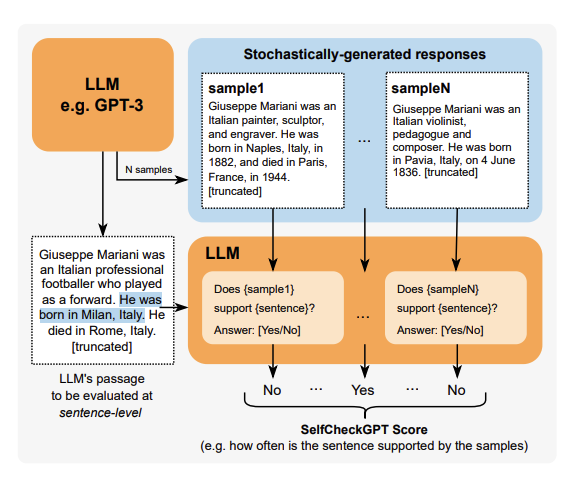
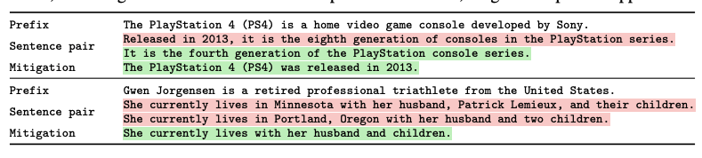
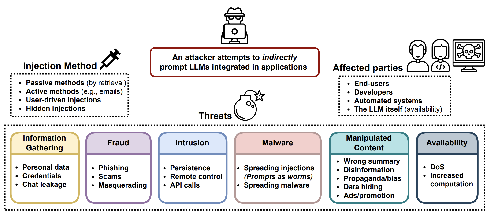
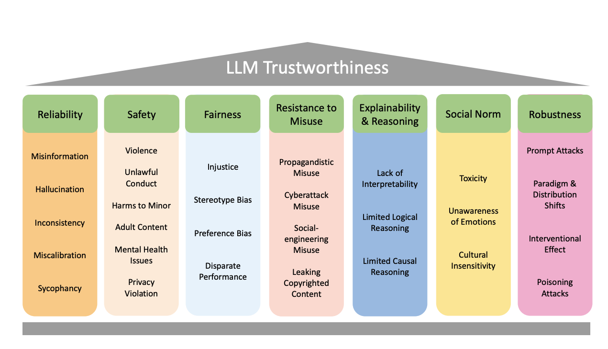
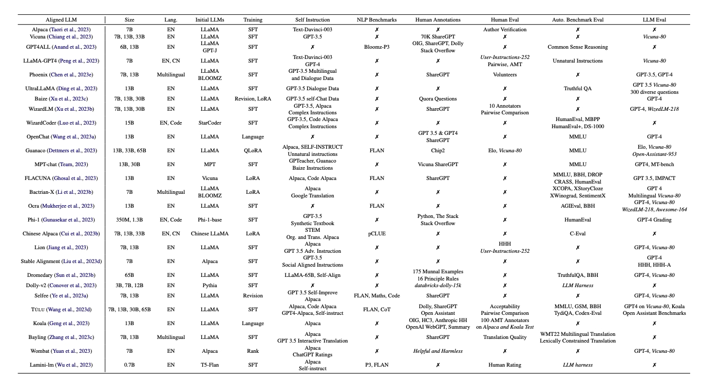
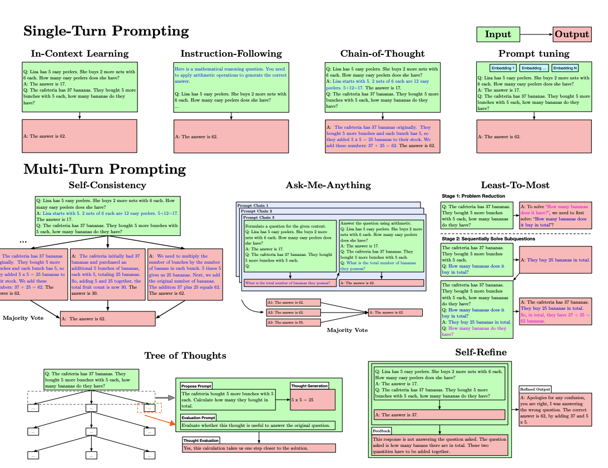
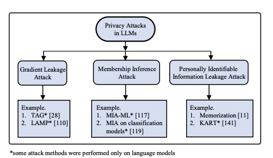

## 5 分钟速览

在本篇关于 LLM 挑战的部分，我们梳理出两大关注领域：行为挑战与部署挑战。行为挑战包括幻觉（LLM 生成虚构信息）和对抗攻击（精心构造输入以操纵模型行为）等问题；部署挑战则涵盖内存与可扩展性问题，以及安全与隐私顾虑——LLM 部署需要大量计算资源，且因其能处理海量数据集并生成文本而面临隐私泄露风险。为缓解这些挑战，我们讨论了多种策略，如对抗攻击的鲁棒防御、高效的内存管理，以及保护用户隐私的训练算法。此外还会介绍差分隐私、模型堆叠和预处理方法等技术，它们正被用于保障用户隐私、确保 LLM 在各类应用中可靠且合乎伦理地使用。

## 挑战的类型

我们把挑战归为两大领域：管理 LLM 的行为，以及部署时遇到的技术难题。鉴于这项技术仍在不断演进，当前的挑战很可能被缓解，同时新的挑战也会随时间浮现。不过截至 2024 年 2 月 15 日，以下是与 LLM 相关且被广泛讨论的突出挑战：

## A. 行为挑战

### 1. 幻觉

LLM 有时会生成看似合理但完全虚构的信息或响应，这被称为"幻觉（Hallucination）"。这一挑战在需要高事实准确性的应用中尤其有害，如新闻生成、教育内容或医疗建议——幻觉会侵蚀对 LLM 输出的信任，导致误信息传播或潜在有害建议被采纳。

### 2. 对抗攻击

LLM 可能易受对抗攻击（Adversarial Attacks）——输入被精心构造以诱骗模型出错或泄露敏感信息。这些攻击会危害 LLM 应用的完整性与可靠性，构成重大安全风险。

### 3. 对齐

确保 LLM 与人类价值观和意图对齐（Alignment）是一项复杂任务。当模型追求的目标未能完全涵盖用户目标或伦理标准时，就会出现错位。错位可能导致 undesirable 后果，如生成冒犯性、偏颇或伦理存疑的内容。

### 4. 提示脆弱性

LLM 可能对提示的精确措辞过于敏感，导致输出不一致或不可预测。提示结构的微小变化可能带来截然不同的响应。这种脆弱性（Brittleness）使开发可靠应用变得复杂，也要求用户深入理解如何有效与 LLM 交互。

## B. 部署挑战

### 1. 内存与可扩展性挑战

大规模部署 LLM 涉及巨大的内存和计算资源需求。在保持高性能与低延迟的同时高效管理这些资源，是一项技术难题。可扩展性挑战会限制 LLM 集成到实时或资源受限应用中的能力，影响其可用性与实用性。

### 2. 安全与隐私

保护 LLM 所用和所生成的数据至关重要，尤其在涉及个人或敏感信息时。LLM 需要稳健的安全措施来防止未授权访问并确保隐私。若没有足够的安全与隐私保护，将面临数据泄露、未授权数据使用以及用户信任丧失的风险。

下面我们更深入地逐一剖析这些问题及其现有解决方案。

## A1. 幻觉

幻觉指模型生成看似合理、实则虚假或编造的信息。之所以如此，是因为 LLM 被设计成去模仿训练数据中所见模式的文本，无论这些模式是否反映真实、准确的信息。幻觉在基于 RAG 的应用中尤其有害——模型可能生成数据无法支撑的内容，而要辨别真伪又非常困难。

幻觉可能由以下几种因素引发：

- **训练数据中的偏见：** 若用于训练模型的数据含有不准确或偏见，模型可能在其输出中复现这些错误或偏颇视角。
- **缺乏实时信息：** 由于 LLM 训练于会过时的数据，无法访问或纳入最新信息，导致基于已不再准确的数据给出响应。这是幻觉最常见的成因。
- **模型的局限：** LLM 并不真正"理解"它生成的内容，只是跟随数据模式。这可能导致语法正确、听起来合乎逻辑却与事实脱节的输出。
- **过度泛化：** 有时 LLM 会把宽泛的模式套用到并不适用的具体场景，生成看似可信却错误的信息。

**如何检测与缓解幻觉？**

我们需要自动化方法来识别幻觉，以便在无需持续人工检查的情况下了解模型表现。下面我们探索几项聚焦于检测这类幻觉的流行研究工作，其中部分还提出了缓解幻觉的方法。

这只是其中两项流行方法，清单绝非全面：

1. **SELFCHECKGPT：面向生成式大语言模型的零资源黑盒幻觉检测（[链接](https://arxiv.org/pdf/2303.08896.pdf)）**

   ✅ 幻觉检测

   ❌ 幻觉缓解

图片来源：[https://arxiv.org/pdf/2303.08896.pdf](https://arxiv.org/pdf/2303.08896.pdf)

SelfCheckGPT 用以下步骤检测幻觉：

1. **生成多个响应：** SelfCheckGPT 先让 LLM 针对同一问题或陈述生成多个响应。这一步利用模型基于相同输入产出多样输出的能力，借助其响应生成机制的随机性。
2. **分析响应间的一致性：** 核心假设是——事实性信息会在不同样本间导致一致的响应，因为模型依赖其对真实世界数据的训练；而幻觉（编造）内容则会导致不一致的响应，因为模型没有事实基础来生成它们，每次"猜测"都不同。
3. **应用一致性度量指标：** SelfCheckGPT 采用五种不同指标评估生成响应间的一致性，其中一些是流行的语义相似度指标，如 BERTScore、N-Gram Overlap 等。
4. **判定事实性 vs 幻觉内容：** 通过上述指标评估采样响应间信息的一致性，SelfCheckGPT 可推断内容是可能属实的还是幻觉。多项指标上高度一致提示事实性内容，而显著方差则提示幻觉。

该方法的一大优势在于无需外部知识库或数据库即可运作，这使其尤其适用于内部数据或处理机制不可访问的黑盒模型。

2. **LLM 的自相矛盾幻觉：评估、检测与缓解**（[链接](https://arxiv.org/pdf/2305.15852.pdf)）

   ✅ 幻觉检测

   ✅ 幻觉缓解

图片来源：[https://arxiv.org/pdf/2305.15852.pdf](https://arxiv.org/pdf/2305.15852.pdf)

这项研究提出了一个三步流水线来检测并缓解 LLM 中的幻觉，尤其是自相矛盾。

> 💡 自相矛盾（Self-contradiction）指在同一上下文中，一个或一组陈述之间逻辑上相互冲突、彼此不相容的情形。在 LLM 语境下，自相矛盾发生在模型生成两句或多句呈现对立事实、观点或主张的句子——在相同上下文下，若一句为真，另一句必为假。

流程拆解如下：

1. **触发自相矛盾：** 流程从生成可能含有自相矛盾的句子对开始。做法是施加一些约束，以诱发 LLM 在同一上下文中给出可能逻辑冲突的响应。
2. **检测自相矛盾：** 探索多种现有提示策略来检测这些自相矛盾。作者考察了此前已开发的不同方法，将它们应用于识别 LLM 何时产出了两句不可能同时为真的句子。
3. **缓解自相矛盾：** 一旦检测到自相矛盾，便采用迭代式缓解流程——做局部文本编辑以移除矛盾信息，同时确保文本保持流畅且信息完整。这一步对提升 LLM 输出的可信度至关重要。

该框架在四个现代 LLM 上做了广泛评估，揭示了其输出中自相矛盾的显著普遍性。例如，ChatGPT 生成的所有句子中有 17.7% 含自相矛盾，其中许多无法用 Wikipedia 等外部知识库加以验证。

## A2. 对抗攻击

对抗攻击通过提供精心构造的输入或提示来操纵 LLM 的行为，目的是造成非预期或恶意的后果。对抗攻击类型众多，这里讨论几种：

1. **提示注入（Prompt Injection, PI）：** 注入提示以操纵模型行为，覆盖原始指令与控制。
2. **越狱（Jailbreaking）：** 通过模拟模型无约束的场景或访问可绕过限制的开发者模式，来规避过滤或限制。
3. **数据投毒（Data Poisoning）：** 把恶意数据注入训练集，以在训练或推理期间操纵模型行为。
4. **模型反演（Model Inversion）：** 利用模型输出推断关于训练数据或模型参数的敏感信息。
5. **后门攻击（Backdoor Attacks）：** 在模型中嵌入隐藏模式或触发器，当特定条件满足时可被利用以达成某些结果。
6. **成员推断（Membership Inference）：** 判定某特定样本是否被用于模型的训练数据，可能揭示关于个人的敏感信息。

对抗攻击通过危害模型完整性与安全，对 LLM 构成重大挑战。这些攻击使对手能远程控制模型、窃取数据并传播虚假信息。此外，LLM 的适应性与自主性使其成为操纵用户的有力工具，加剧了社会危害的风险。

要有效应对这些挑战，需要稳健的防御与主动措施来防范对 AI 系统的对抗性操纵。

已有若干努力致力于开发鲁棒的 LLM 并针对对抗攻击进行评估。缓解这类攻击的一种思路是训练 LLM 习惯对抗输入、指示其不响应。[SmoothLLM](https://arxiv.org/pdf/2310.03684.pdf) 这篇论文给出了一个示例——它在字符层面扰动给定输入提示的多个副本，然后合并所得预测以识别对抗输入。利用对抗生成的提示对字符层面变化的脆弱性，SmoothLLM 显著地把多种主流 LLM 上越狱攻击的成功率降到 1% 以下。关键在于，这种防御策略避免了不必要的过度谨慎，并对攻击缓解提供了可证明的保证。

另一种对抗攻击的防御机制涉及困惑度过滤器（perplexity filter），如[这篇](https://arxiv.org/pdf/2309.00614v2.pdf)论文所述。该过滤器基于这样一个原理：对 LLM 的无约束攻击常导致困惑度很高、即缺乏流畅性、含语法错误或逻辑不通的乱码串。该方法考虑了困惑度过滤器的两种变体。第一种是简单的基于阈值的过滤器——若提示的对数困惑度低于预设阈值则通过。第二种是窗口式困惑度检查——把文本当作连续片段序列处理，若任一窗口困惑度较高则标记为可疑。

阅读对抗技术的一个好起点是 [Greshake et al. 2023](https://arxiv.org/abs/2302.12173)。该论文提出了攻击与潜在成因的一种分类，如下图所示。

## A3. 对齐

对齐（Alignment）指 LLM 理解指令并生成与人类期望相符的输出的能力。像 GPT-3 这样的基础 LLM 在海量文本数据集上训练以预测后续 token，从而获得广泛的世界知识。然而，它们在准确解读指令、产出符合人类期望的输出方面仍可能力有不逮，这可能导致偏颇或错误的内容生成，限制其实用性。

对齐是一个宽泛概念，可从多个维度阐释，[这篇](https://arxiv.org/pdf/2308.05374.pdf)论文给出了其中一种分类，提出了确保 LLM 对齐的多个维度与子类。例如，LLM 生成的有害内容可归为：对个体用户的伤害（如情感伤害、冒犯、歧视）、对社会的伤害（如制造暴力或危险行为的指令）、或对利益相关者的伤害（如提供导致错误商业决策的误信息）。

概括而言，LLM 对齐可通过以下流程改善：

- 根据具体用例确定最关键的对齐维度。
- 识别合适的基准用于评估。
- 采用监督微调（Supervised Fine-Tuning, SFT）方法来提升这些基准。

部分流行的对齐 LLM 与基准见下图。

图片来源：[https://arxiv.org/pdf/2307.12966.pdf](https://arxiv.org/pdf/2307.12966.pdf)

## A4. 提示脆弱性

在本课程的提示工程部分，我们探索了给 LLM 写提示的多种技术。这些精细方法之所以必要，是因为给 LLM 类似于人类的指令并不合适。常用提示方法的概览见下图。

LLM 需要精确的提示，即便细微改动也会影响模型、改变其响应。这在部署时构成挑战——不熟悉提示方法的人可能难以从 LLM 获得准确答案。

图片来源：[https://arxiv.org/pdf/2307.10169.pdf](https://arxiv.org/pdf/2307.10169.pdf)

一般而言，可通过以下高层策略降低 LLM 的提示脆弱性：

1. **标准化提示：** 建立标准化的提示格式与语法规范，有助于确保一致性、降低非预期变动的风险。
2. **稳健的提示工程：** 投入充分的提示工程，考虑各种提示表述及其对模型输出的潜在影响。这可能涉及测试不同提示风格与格式以找出最有效的。
3. **人在回路的验证：** 引入人工验证或反馈回路，评估提示有效性并在部署前识别潜在的脆弱性问题。
4. **多样化提示测试：** 在多样的数据集与场景中测试提示，评估其鲁棒性与泛化性，有助于发现不同上下文中可能出现的脆弱性问题。
5. **自适应提示：** 开发自适应提示技术，让模型能根据用户输入或上下文线索动态调整行为，减少对固定提示结构的依赖。
6. **持续监控与维护：** 在真实应用中持续监控模型表现与提示有效性，按需更新提示以应对随时间出现的脆弱性问题。

## B1. 内存与可扩展性挑战

本节我们聚焦部署 LLM 时与内存和可扩展性相关的具体挑战，而非其开发。

下面详细探讨这些挑战及可能的解决方案：

1. **微调 LLM：** 持续微调 LLM 对确保其与最新知识同步或适配特定领域至关重要。微调涉及在更小的、任务专属的数据集上调整预训练模型参数以提升表现。然而，对整个 LLM 微调需要大量内存，对许多用户而言不切实际，并在部署时带来计算低效。

   **解决方案：** 一种思路是借助 RAG 这类系统——信息可作为上下文被利用，使模型能从任意知识库学习。另一种是参数高效微调（PEFT），如适配器（adapters），只更新模型参数的一个子集，在维持任务表现的同时降低内存需求。前缀微调（prefix-tuning）和提示微调（prompt-tuning）等方法在输入前 prepend 可学习的 token 嵌入，无需为每个任务存储并加载单独的微调模型即可高效适配特定数据集。所有这些方法都已在之前几周的内容中讨论过，请阅读以获更深入见解。

2. **推理延迟：** LLM 常因可并行性低和内存占用大而承受高推理延迟。这源于推理时按顺序处理 token 以及解码所需的庞大内存。

   **解决方案：** 多种技术应对这些挑战，包括高效注意力机制。这些机制旨在通过减少内存带宽瓶颈、引入注意力矩阵的稀疏模式来加速注意力计算。[Multi-query attention](https://blog.fireworks.ai/multi-query-attention-is-all-you-need-db072e758055) 和 [FlashAttention](https://arxiv.org/abs/2205.14135) 优化内存带宽使用，而[量化](https://www.tensorops.ai/post/what-are-quantized-llms)和[剪枝](https://medium.com/@bnjmn_marie/freeze-and-prune-to-fine-tune-your-llm-with-apt-dc750b7bfbae)技术在不牺牲表现的前提下降低内存占用与计算复杂度。

3. **有限的上下文长度：** 有限的上下文长度指 LLM 在计算中能有效处理的上下文信息量的约束。这一限制源于计算资源与内存约束等实际考量，对需要理解更长上下文的任务（如长篇写作或摘要）构成挑战。

   **解决方案：** 研究者提出若干方案。[Luna](https://arxiv.org/abs/2106.01540) 和[膨胀注意力](https://arxiv.org/abs/2209.15001)等高效注意力机制通过降低计算需求来高效处理更长序列。长度泛化方法旨在让在短序列上训练的 LLM 在推理时对更长序列表现良好，这涉及探索不同的位置编码方案，如绝对位置嵌入与 [ALiBi](https://arxiv.org/abs/2108.12409)，以有效注入位置信息。

## B2. 隐私

隐私风险源于 LLM 基于海量且多样的训练数据集处理并生成文本的能力。像 GPT-3 这样的模型有可能无意中捕获并复现训练数据中的敏感信息，导致文本生成时的潜在隐私问题。无意的数据记忆、数据泄露，以及披露机密或个人可识别信息（PII）的可能性，都是重大挑战。

此外，当 LLM 针对特定任务微调时，会浮现额外的隐私考量。在利用这些强大语言模型的效用与保护用户隐私之间取得平衡，对于确保其在各类应用中可靠且合乎伦理地使用至关重要。

我们审视关键的隐私风险与攻击及可能的缓解策略。下面的分类改编自[这篇](https://arxiv.org/pdf/2402.00888.pdf)论文，它把隐私攻击归类为：

图片来源：[https://arxiv.org/pdf/2402.00888.pdf](https://arxiv.org/pdf/2402.00888.pdf)

1. **梯度泄露攻击（Gradient Leakage Attack）：**

   在这类攻击中，对手利用对梯度或梯度信息的访问来危害深度学习模型的隐私与安全。梯度指示函数最陡上升的方向，对训练时优化模型参数以最小化损失函数至关重要。

   缓解基于梯度的攻击可采用若干策略：

   1. **随机噪声插入：** 向梯度注入随机噪声，可扰乱对手准确推断敏感信息的能力。
   2. **差分隐私：** 应用差分隐私技术向梯度加噪，从而掩盖其中所含敏感信息。
   3. **同态加密：** 使用同态加密允许在加密数据上计算，阻止对手直接访问梯度。
   4. **防御机制：** 向梯度加高斯或拉普拉斯噪声，配合差分隐私与额外裁剪，可有效防御梯度泄露攻击，但可能略微降低模型效用。

2. **成员推断攻击（Membership Inference Attack）**

   成员推断攻击（MIA）旨在判定某特定数据样本是否属于某机器学习模型的训练数据，即便没有对模型参数的直接访问。攻击者利用模型过拟合训练数据的倾向——训练样本会有更低的损失值。这类攻击引发严重隐私顾虑，尤其是当模型在医疗记录或财务信息等敏感数据上训练时。

   缓解语言模型中的 MIA 涉及多种机制：

   1. **Dropout 与模型堆叠：** Dropout 在训练时随机删除神经元连接以缓解过拟合。模型堆叠则用不同数据子集训练模型的不同部分，以降低整体过拟合倾向。
   2. **差分隐私（DP）：** 基于 DP 的技术涉及数据扰动与输出扰动以防止隐私泄露。配备 DP 并用随机梯度下降训练的模型可在维持模型效用的同时减少隐私泄露。
   3. **正则化：** 正则化技术防止过拟合、改善模型泛化。标签平滑是其中一种，能防止过拟合，从而有助于防范 MIA。

3. **个人可识别信息（PII）攻击**

   这类攻击涉及可单独或与他信息组合来唯一识别个体的数据的暴露。这包括直接标识符（如护照信息）和间接标识符（如种族和出生日期）。敏感 PII 涵盖姓名、电话号码、地址、社会安全号（SSN）、财务与医疗记录等信息，非敏感 PII 则包括邮编、种族、性别等。攻击者可能通过钓鱼、社会工程或利用系统漏洞等手段获取 PII。

   缓解 LLM 中的 PII 泄露可采用若干策略：

   1. **预处理技术：** 预处理阶段的去重可显著减少 LLM 中被记忆的文本量，从而降低存储的个人信息。此外，对个人信息或可识别内容做过滤、配以限制性使用条款，可限制训练数据中敏感内容的存在。
   2. **保护隐私的训练算法：** 训练时可使用差分隐私随机梯度下降（[DP-SGD](https://assets.amazon.science/01/6e/4f6c2b1046d4b9b8651166bbcd93/differentially-private-decoding-in-large-language-models.pdf#:~:text=While%20the%20intersection%20of%20DP%20and%20LLMs%20is%20fairly%20novel%2C%20the%20prominent%20approach&text=vate%20Stochastic%20Gradient%20Descent%20(DP%2DSGD)%20(Song%20et%20al.%2C%202013;)）等技术来确保训练数据隐私，但 DP-SGD 可能带来显著计算成本并降低模型效用。
   3. **PII 清洗：** 这涉及过滤数据集以从文本中移除 PII，常借助命名实体识别（NER）来标注 PII。但 PII 清洗方法在保留数据集效用和准确移除全部 PII 方面可能面临挑战。
   4. **微调注意事项：** 在任务专属数据上微调时，务必确保数据不含敏感信息以防隐私泄露。虽然微调可能帮助语言模型"遗忘"部分预训练时记忆的数据，但若任务数据含 PII，仍会引入隐私风险。

## 扩展阅读（选读）

1. 大语言模型未被言说的挑战 - [https://deeperinsights.com/ai-blog/the-unspoken-challenges-of-large-language-models](https://deeperinsights.com/ai-blog/the-unspoken-challenges-of-large-language-models)
2. 大语言模型的 15 项挑战（LLM）- [https://www.predinfer.com/blog/15-challenges-with-large-language-models-llms/](https://www.predinfer.com/blog/15-challenges-with-large-language-models-llms/)

## 推荐论文（选读）

1. [https://arxiv.org/abs/2307.10169](https://arxiv.org/abs/2307.10169)
2. [https://www.techrxiv.org/doi/full/10.36227/techrxiv.23589741.v1](https://www.techrxiv.org/doi/full/10.36227/techrxiv.23589741.v1)
3. [https://arxiv.org/abs/2311.05656](https://arxiv.org/abs/2311.05656)
