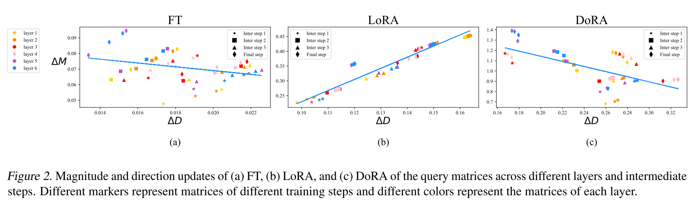
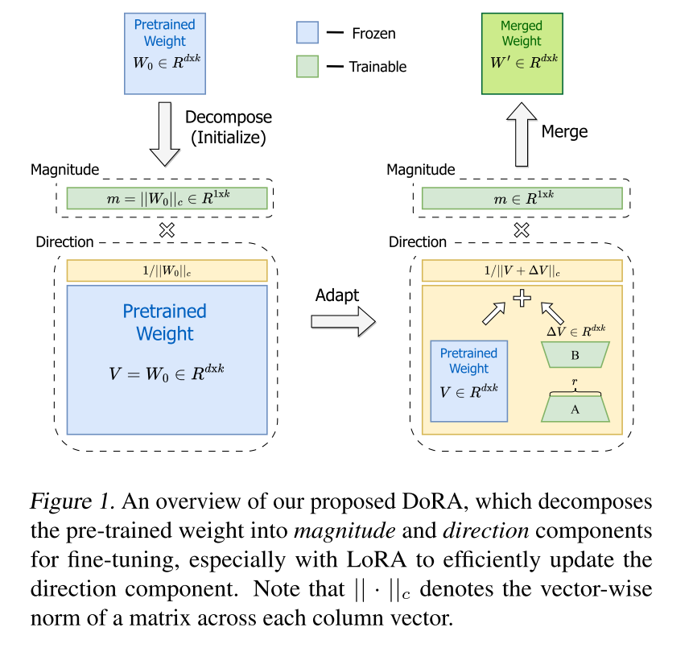
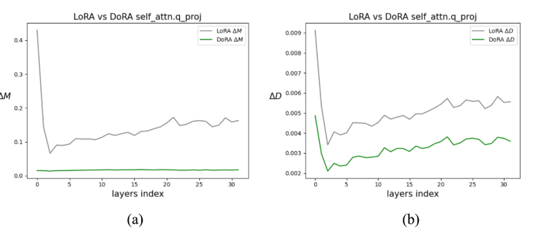

> **论文**：DoRA: Weight-Decomposed Low-Rank Adaptation
> **作者**：Shih-Yang Liu, Chien-Yi Wang, Hongxu Yin, Pavlo Molchanov 等（NVIDIA & HKUST）
> **发表**：ICML 2024
> **代码**：https://github.com/NVlabs/DoRA

## 摘要

DoRA（**W**eight-**D**ecomposed **L**ow-**R**ank **A**daptation）是 NVIDIA 提出的一种参数高效微调方法。其核心思想是将预训练权重分解为**方向（Direction）**和**幅度（Magnitude）**两个分量，分别进行微调，其中方向分量通过 LoRA 进行低秩更新。DoRA 在不增加任何推理开销的前提下，缩小了 LoRA 与全量微调（FT）之间的性能差距，在常识推理、视觉指令微调、图像/视频文本理解等多种任务上持续超越 LoRA。

## 1. 研究动机

### 1.1 LoRA 的局限性

LoRA 作为最流行的 PEFT 方法之一，通过低秩矩阵 $BA$ 来近似权重更新 $\Delta W$，具有不改变模型结构、不增加推理延迟的优点。然而，LoRA 与全量微调（FT）之间仍存在不可忽视的精度差距。以往研究通常将这一差距归结为**可训练参数数量有限**，但缺乏对深层原因的探究。

$$W' = W_0 + \Delta W = W_0 + BA \quad (r \ll \min(d, k))$$

### 1.2 核心洞察：权重分解分析

DoRA 的关键创新在于引入了一种**权重分解分析**方法，受 Weight Normalization [Salimans & Kingma, 2016] 启发，将权重矩阵重参数化为幅度和方向两个分量，进而对比 LoRA 和 FT 在这两个维度上的学习模式差异。

## 2. 权重分解分析

### 2.1 分解方法

将预训练权重矩阵 $W \in \mathbb{R}^{d \times k}$ 分解为：

$$W = \frac{m \cdot V}{\|V\|_c} = \frac{\|W\|_c \cdot W}{\|W\|_c}$$

其中：

- $m \in \mathbb{R}^{1 \times k}$ 是**幅度向量**（magnitude），每个标量定义对应列向量的幅度
- $V \in \mathbb{R}^{d \times k}$ 是**方向矩阵**（directional），每列经 $\|V\|_c$ 归一化后为单位向量
- $\|\cdot\|_c$ 表示矩阵的**按列向量范数**（vector-wise norm across each column）

### 2.2 分析方法

在 VL-BART 模型上，对预训练权重 $W_0$、全量微调权重 $W_{FT}$ 和 LoRA 合并权重 $W_{LoRA}$ 分别做权重分解，计算幅度差异 $\Delta M$ 和方向差异 $\Delta D$：

$$\Delta M^t_{FT} = \frac{\sum_{n=1}^{k} |m^{n,t}_{FT} - m^n_0|}{k}$$

$$\Delta D^t_{FT} = \frac{\sum_{n=1}^{k} (1 - \cos(V^{n,t}_{FT}, W^n_0))}{k}$$

### 2.3 关键发现

> Figure 2: FT、LoRA、DoRA 在不同层和训练步的 $(\Delta D, \Delta M)$ 分布。每个点代表某层某步的查询权重矩阵。

| 方法 | 方向变化与幅度变化的关系 | 相关系数 |
|------|------------------------|---------|
| **FT** | 负斜率趋势：方向变化大时幅度变化小，反之亦然 | -0.62 |
| **LoRA** | 正斜率趋势：方向与幅度成比例增减 | +0.83 |
| **DoRA** | 负斜率趋势：接近 FT 的学习模式 | -0.31 |

**核心结论**：LoRA 倾向于成比例地增减方向和幅度，缺乏精细调整能力。而 FT 能够在方向变化较大时仅做较小幅度调整，或反之。这种更灵活的学习模式反映了更强的学习能力。DoRA 的学习模式接近 FT，因此具备优于 LoRA 的学习容量。

> **深层原因**：预训练权重已包含大量适用于下游任务的知识。当学习容量充足时，**仅改变幅度或仅改变方向**即可完成下游适应，无需两者同时大幅变化。LoRA 的正比例更新模式限制了这种精细调节能力。

## 3. DoRA 方法

### 3.1 方法概述

> Figure 1: DoRA 将预训练权重分解为幅度和方向两个分量，使用 LoRA 高效更新方向分量。

DoRA 的核心流程：

1. **初始化**：用预训练权重 $W_0$ 初始化，令 $m = \|W_0\|_c$，$V = W_0$
2. **冻结方向基**：保持 $V$ 冻结，幅度 $m$ 作为可训练向量
3. **方向更新**：通过 LoRA（低秩矩阵 $BA$）学习方向增量 $\Delta V$
4. **合并**：训练后可将更新合并回预训练权重，推理零开销

### 3.2 数学公式

DoRA 的权重更新公式：

$$W' = \frac{m \cdot (V + \Delta V)}{\|V + \Delta V\|_c} = \frac{m \cdot (W_0 + BA)}{\|W_0 + BA\|_c}$$

其中：

- $m$：可训练的幅度向量（参数量 $1 \times k$，相比 LoRA 仅增加约 0.01%）
- $B \in \mathbb{R}^{d \times r}$、$A \in \mathbb{R}^{r \times k}$：低秩矩阵，初始化方式与 LoRA 一致
- $V$（即 $W_0$）冻结，$\Delta V = BA$ 为方向增量

> **与 Weight Normalization 的区别**：Weight Normalization 从随机初始化训练两个分量，对初始化敏感。DoRA 的两个分量均从预训练权重初始化，避免了初始化敏感性问题。

### 3.3 梯度分析

对损失 $L$，关于 $m$ 和 $V' = V + \Delta V$ 的梯度为：

$$\nabla_{V'} L = \frac{m}{\|V'\|_c} \left( I - \frac{V' V'^T}{\|V'\|_c^2} \right) \nabla_{W'} L$$

$$\nabla_m L = \nabla_{W'} L \cdot \frac{V'}{\|V'\|_c}$$

**梯度分析的意义**：

- 权重梯度 $\nabla_{W'} L$ 被 $m/\|V'\|_c$ 缩放，并被投影到远离当前权重矩阵的方向
- 这两个效应使梯度协方差矩阵更接近单位矩阵，**有利于优化** [Salimans & Kingma, 2016]
- 分解带来的优化优势完全传递给 $\Delta V$，**增强了 LoRA 的学习稳定性**

**负斜率模式的理论解释**：当方向更新较小时（$\Delta D_{S1}$），梯度与当前权重的夹角更小，导致幅度梯度 $|\nabla_{m^*} L|$ 更大，即幅度更新更大。反之方向更新较大时，幅度更新较小。这正是 FT 和 DoRA 呈现负斜率模式的数学根源。

## 4. 训练开销优化

### 4.1 问题

LoRA 中 $W'$ 和 $\Delta W$ 的梯度相同，但 DoRA 将低秩适应重定向到方向分量后，低秩更新的梯度与 $W'$ 的梯度不同（见公式 6），反向传播需要额外内存。

### 4.2 解决方案

将 $\|V + \Delta V\|_c$ 视为常量，**从计算图中分离**（detach），使其在反向传播中不接收梯度：

$$\nabla_{V'} L = \frac{m}{C} \nabla_{W'} L \quad \text{其中} \quad C = \|V'\|_c$$

> **效果**：
> - LLaMA 微调训练内存减少约 **24.4%**（37.3GB → 28.2GB）
> - VL-BART 训练内存减少约 **12.4%**（23.4GB → 20.5GB）
> - 精度几乎无损：VL-BART 精度不变，LLaMA 仅下降 0.2

## 5. 实验结果

### 5.1 常识推理（LLaMA 系列）

在 8 个常识推理数据集上微调 LLaMA-7B/13B、LLaMA2-7B、LLaMA3-8B：

| 模型 | 方法 | 可训练参数 (%) | 平均准确率 | 相对 LoRA 提升 |
|------|------|---------------|----------|---------------|
| LLaMA-7B | LoRA | 0.83 | 74.7 | - |
| LLaMA-7B | **DoRA** | 0.84 | **78.4** | +3.7 |
| LLaMA-7B | DoRA† (rank减半) | 0.43 | 77.5 | +2.8 |
| LLaMA-13B | LoRA | 0.67 | 80.5 | - |
| LLaMA-13B | **DoRA** | 0.68 | **81.5** | +1.0 |
| LLaMA2-7B | LoRA | 0.83 | 77.6 | - |
| LLaMA2-7B | **DoRA** | 0.84 | **79.7** | +2.1 |
| LLaMA3-8B | LoRA | 0.70 | 80.8 | - |
| LLaMA3-8B | **DoRA** | 0.71 | **85.2** | +4.4 |

> **关键结论**：
> - DoRA 在所有模型上持续超越 LoRA
> - DoRA†（rank 仅为 LoRA 一半）即可超越 LoRA，说明 DoRA 增强了 LoRA 的学习能力
> - LLaMA-7B 上 DoRA 甚至超过 ChatGPT (77.0)

### 5.2 图像/视频文本理解（VL-BART）

**图像文本任务**（VQAv2, GQA, NLVR2, COCO Caption）：

| 方法 | 平均准确率 |
|------|----------|
| FT | 77.3 |
| LoRA | 76.5 |
| **DoRA** | **77.4** |

**视频文本任务**（TVQA, How2QA, TVC, YC2C）：

| 方法 | 平均准确率 |
|------|----------|
| FT | 87.5 |
| LoRA | 83.5 |
| **DoRA** | **85.4** |

DoRA 在图像文本任务上达到 FT 水平，在视频文本任务上比 LoRA 高约 2%。

### 5.3 视觉指令微调（LLaVA-1.5-7B）

在 7 个视觉语言基准上评估：

| 方法 | 可训练参数 (%) | 平均准确率 |
|------|---------------|----------|
| FT | 100 | 66.5 |
| LoRA | 4.61 | 66.9 |
| **DoRA** | 4.63 | **67.6** |

### 5.4 与 VeRA 的兼容性（DVoRA）

将 DoRA 中的方向更新替换为 VeRA（共享冻结随机矩阵 + 可学习缩放向量），命名为 **DVoRA**：

| 模型 | 方法 | 可训练参数 (%) | MT-Bench 评分 |
|------|------|---------------|-------------|
| LLaMA-7B | LoRA | 2.31 | 5.1 |
| LLaMA-7B | **DoRA** | 2.33 | **5.5** |
| LLaMA-7B | VeRA | 0.02 | 4.3 |
| LLaMA-7B | **DVoRA** | 0.04 | **5.0** |
| LLaMA2-7B | LoRA | 2.31 | 5.7 |
| LLaMA2-7B | **DoRA** | 2.33 | **6.0** |
| LLaMA2-7B | VeRA | 0.02 | 5.5 |
| LLaMA2-7B | **DVoRA** | 0.04 | **6.0** |

> **DVoRA 的价值**：DVoRA 融合了 DoRA 和 VeRA 的优势，以极少参数达到与 LoRA 相当甚至更优的性能。

### 5.5 对不同 Rank 的鲁棒性

> Figure 3: DoRA/LoRA 微调权重与预训练权重在不同层的幅度和方向差异。

在 rank $r \in \{4, 8, 16, 32, 64\}$ 范围内，DoRA 持续超越 LoRA。**rank 越低，差距越大**：

- $r=8$：LoRA 40.7% vs DoRA 77.9%（+37.2%）
- $r=4$：LoRA 39.5% vs DoRA 61.9%（+22.4%）

Figure 3 进一步验证了核心假设：DoRA 微调后的权重在幅度和方向上偏离预训练权重更少，说明**强壮的基础模型不需要大幅改变即可完成下游适应**。

### 5.6 微调粒度分析

DoRA 允许只更新部分模块的方向和幅度，而其余模块仅更新幅度：

| 模型 | 方法 | 可训练参数 (%) | 方向更新模块 | 幅度更新模块 | 平均准确率 |
|------|------|---------------|------------|------------|----------|
| LLaMA-7B | LoRA | 0.83 | - | - | 74.7 |
| LLaMA-7B | DoRA (全) | 0.84 | QKVUD | QKVUD | 78.1 |
| LLaMA-7B | DoRA (精简) | 0.39 | QKV | QKVOGUD | 77.5 |
| LLaMA-13B | LoRA | 0.67 | - | - | 80.5 |
| LLaMA-13B | DoRA (全) | 0.68 | QKVUD | QKVUD | 81.5 |
| LLaMA-13B | DoRA (精简) | 0.31 | QKV | QKVOGUD | 81.3 |

> **精简配置**：仅更新注意力层（QKV）的方向和幅度 + MLP 层的仅幅度更新，DoRA 用不到 LoRA 一半的参数即超越 LoRA 2.8%（LLaMA-7B）。

## 6. 更广泛的影响

### 6.1 QDoRA：增强 QLoRA

将 QLoRA 中的 LoRA 替换为 DoRA，结合 FSDP 实现多 GPU 并行训练：

| 模型 | 方法 | 精确匹配分数 |
|------|------|------------|
| LLaMA2-7B | QLoRA | 0.32 |
| LLaMA2-7B | FT | 0.51 |
| LLaMA2-7B | **QDoRA** | **0.56** |
| LLaMA3-8B | QLoRA | 0.12 |
| LLaMA3-8B | FT | 0.26 |
| LLaMA3-8B | **QDoRA** | **0.31** |

QDoRA 在两个模型上均**略微超过全量微调**，同时使用显著更少的内存。

### 6.2 文本生成图像

在 SDXL + DreamBooth 微调场景下，DoRA 在 3D Icon 和 Lego 数据集上实现了比 LoRA 更好的个性化效果，更准确地反映训练目标特征。

## 7. 核心贡献总结

1. **提出 DoRA**：通过权重分解，将 LoRA 的学习行为从正比例更新转变为接近 FT 的负比例更新模式，在不增加推理开销的前提下增强学习容量
2. **引入权重分解分析**：揭示 LoRA 和 FT 在幅度/方向更新模式上的根本差异，为 PEFT 方法的设计提供了新的分析视角
3. **广泛验证**：在 NLP 到视觉语言、LLM 到 LVLM 的多种任务和骨干网络上持续超越 LoRA
4. **兼容性**：DoRA 可与 VeRA 等其他 LoRA 变体组合（如 DVoRA），也可与 QLoRA 框架结合（如 QDoRA）
5. **参数效率**：DoRA†（rank 减半）即可超越 LoRA，精简配置（仅更新部分模块方向）可用不到一半参数超越 LoRA

## 8. 个人思考

### 8.1 核心创新点

DoRA 的真正创新不在于权重分解本身（Weight Normalization 早已提出），而在于：

- **分析视角的创新**：通过分解分析发现 LoRA 和 FT 的学习模式差异（正斜率 vs 负斜率），这是理解 PEFT 性能差距的深层原因
- **解耦学习**：将幅度和方向的学习解耦，让 LoRA 专注于方向更新，简化了学习任务

### 8.2 实用价值

- DoRA 可作为 LoRA 的**无成本替代品**：参数量几乎不变、推理零开销、精度持续提升
- QDoRA 使得在消费级 GPU 上微调大语言模型更加可行且精度更高
- 与其他 LoRA 变体的兼容性使其具有很好的扩展性

### 8.3 局限与展望

- DoRA 的训练内存比 LoRA 略高（虽然有优化方案，但仍有额外开销）
- 论文未充分探讨方向和幅度解耦后各自的优化策略
- 未来可探索在音频等语言和视觉之外领域的泛化性

## 参考资料

- **论文**：[DoRA: Weight-Decomposed Low-Rank Adaptation](https://arxiv.org/abs/2402.09383)
- **代码**：https://github.com/NVlabs/DoRA
- **发表**：ICML 2024
- **作者**：Shih-Yang Liu, Chien-Yi Wang, Hongxu Yin, Pavlo Molchanov 等（NVIDIA & HKUST）
