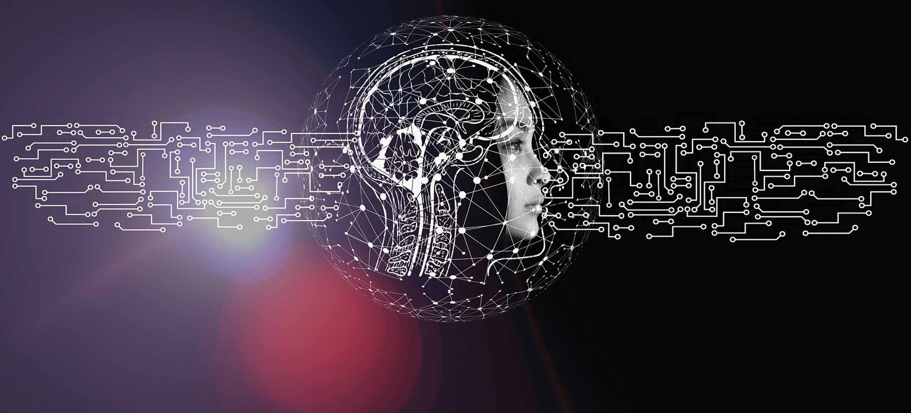
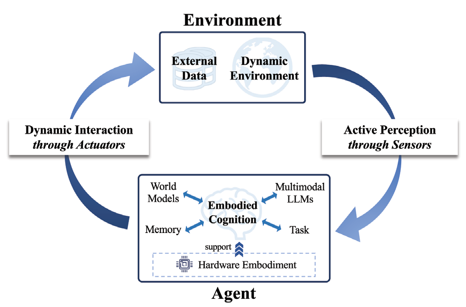
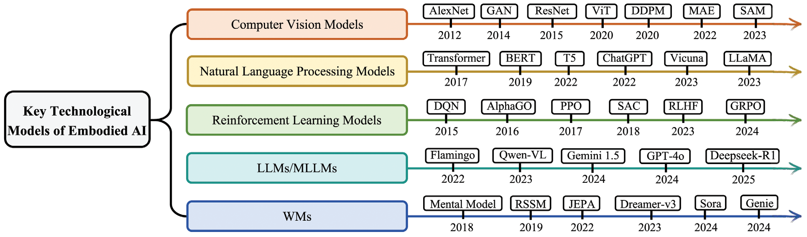
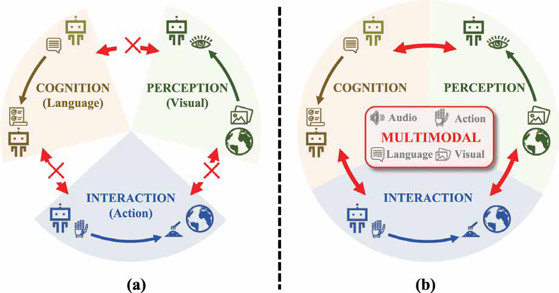
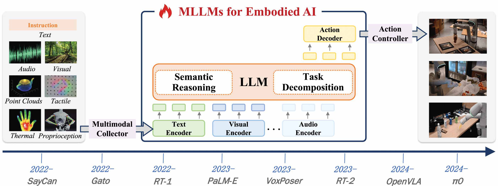
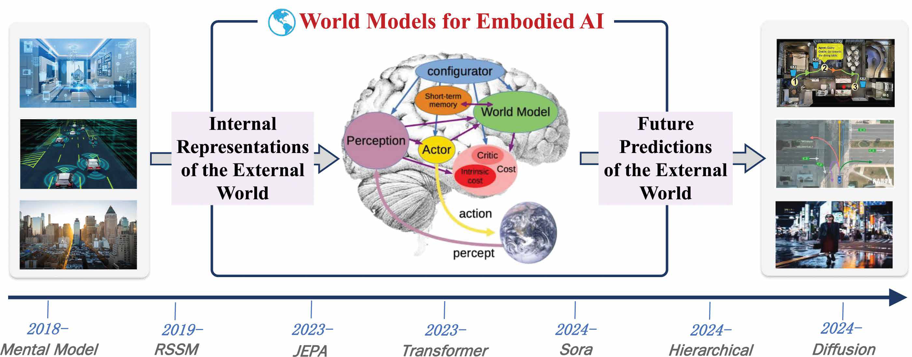
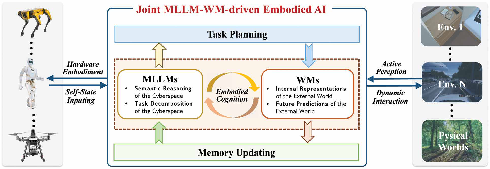

> 本文是对 IEEE Circuits and Systems Magazine 2025 年第四季度特刊文章 *Embodied AI: From LLMs to World Models*（Tongtong Feng、Xin Wang、Yu-Gang Jiang、Wenwu Zhu 著，DOI: 10.1109/MCAS.2025.3603693）的中文翻译整理，仅供学习交流，版权归原作者所有。原文共 24 页，此处翻译其正文部分（不含参考文献）。

## 摘要

具身智能（Embodied AI）是一种实现通用人工智能（Artificial General Intelligence, AGI）的智能系统范式，是各类应用的基石，推动着从网络空间到物理系统的演进。大语言模型（Large Language Models, LLM）与世界模型（World Model, WM）的近期突破使具身智能备受关注。一方面，LLM 通过语义推理（semantic reasoning）与任务分解（task decomposition）赋能具身智能，将高层自然语言指令与底层自然语言动作引入具身认知（embodied cognition）。另一方面，WM 通过构建外部世界的内部表示（internal representation）与未来预测（future prediction）赋能具身智能，促进符合物理规律的具身交互。

鉴于此，本文全面梳理了具身智能从基础到前沿的文献，涵盖 LLM 驱动与 WM 驱动两类工作。特别地，我们首先介绍具身智能的历史、关键技术、关键组件与硬件系统，并从单模态到多模态的视角讨论其发展。随后，我们审视具身智能的两个蓬勃方向，即基于 LLM/多模态大语言模型（Multimodal LLM, MLLM）的具身智能与基于 WM 的具身智能，细致刻画它们在端到端具身认知与物理规律驱动的具身交互中不可或缺的作用。基于上述进展，我们进一步分享关于联合 MLLM-WM 驱动的具身智能架构必要性的见解，揭示其在使能物理世界中复杂任务的深远意义。此外，我们考察具身智能的代表性应用，展示其在真实场景中的广泛适用性。最后，我们指出具身智能值得进一步研究的未来方向。

**关键词**：具身智能，LLM，世界模型。

## 一、引言

具身智能（Embodied AI）源自 Turing 提出的具身图灵测试（Embodied Turing Test）[1]，旨在探索智能体能否模仿人类智能以实现通用人工智能（AGI）。其中，仅在数字世界（网络空间）中求解抽象问题的智能体通常被定义为离身智能（disembodied AI），而能够与物理世界交互的智能体则被视为具身智能。具身智能建立在认知科学与神经科学的基础性洞见之上 [2]、[3]，主张智能源自感知、认知与交互的动态耦合。如图 1 所示，具身智能以闭环方式包含三个关键组件，即：1）主动感知（active perception，传感器驱动的环境观察）；2）具身认知（历史经验驱动的认知更新）；3）动态交互（dynamic interaction，执行器介导的动作控制）。此外，硬件具身 [4]、[5]、[6] 同样至关重要，原因在于不断攀升的计算与能耗需求，尤其是在真实部署场景中设备的时延与功耗约束下。

具身智能的发展经历了从单模态到多模态范式的演进。在早期阶段，具身智能主要通过聚焦视觉、语言或动作等单一模态的个别组件进行研究，其中感知、认知或交互组件由一种感官输入驱动 [7]、[8]，例如感知倾向于以视觉模态为主导 [9]，认知倾向于以语言模态为主导 [10]、[11]，交互倾向于以动作模态为主导 [12]、[13]。尽管这些方法在各个组件内表现良好，但受限于每种模态所提供信息的狭窄范围以及组件间不同模态之间固有的鸿沟。具身智能的持续发展揭示了单模态方法的局限，推动其向整合多种感官模态的显著转变 [14]、[15]、[16]。因此，多模态具身智能 [17]、[18] 自然兴起，以构建能够在动态环境中执行复杂任务的更具适应性、灵活性与鲁棒性的智能体。

大语言模型（LLM）通过语义推理 [19] 与任务分解 [20]、[21] 赋能具身智能，将高层自然语言指令与底层自然语言动作引入具身认知。代表性的 LLM 驱动工作包括 SayCan [22]，其 i）提供一个在真实世界预训练的自然语言动作库，以约束 LLM 不提出不可行且不合语境的动作；ii）使用 LLM 将自然语言指令转换为自然语言动作序列；iii）利用价值函数验证自然语言动作序列在特定物理环境中的可行性。这些工作表明，LLM 对于旨在依循以自然语言表达的、高层的、时间跨度较长的指令行动的机器人极为有用。然而，LLM 仅为整个具身智能系统（例如具身认知）的一部分，受限于固定的自然语言动作库与特定的物理环境，使得 LLM 驱动的具身智能难以针对新机器人与新环境实现自适应扩展。

多模态大语言模型（MLLM）[23]、[24] 与世界模型（WM）[25]、[26]、[27] 的近期突破开辟了具身智能研究的新前沿。MLLM 能够作用于整个具身智能系统，将高层多模态输入与底层运动动作序列桥接为端到端的具身应用。语义推理 [28]、[29]、[30] 借助 MLLM 的跨模态理解能力，从视觉、听觉或触觉输入中解读语义，例如识别物体、推断空间关系、预测环境动态。同时，任务分解 [31]、[32]、[33] 利用 MLLM 的顺序逻辑将复杂目标拆解为子任务，并基于传感器反馈动态调整计划。然而，MLLM 往往难以将预测建立在符合物理规律的动力学之上 [34]，且对环境反馈的实时适应性较差 [35]。

另一方面，WM 通过构建外部世界的内部表示 [36]、[37]、[38]、[39]、[40] 与未来预测 [41]、[42]、[43]、[44] 赋能具身智能。此类 WM 驱动的具身智能能够在动态环境中促进符合物理规律的具身交互。内部表示将丰富的感官输入压缩为结构化的潜在空间，捕捉物体动力学、物理定律与空间结构，使智能体能够推理其周围"存在什么"以及"事物如何行为"。同时，未来预测在多个时间尺度上模拟序列动作的潜在回报且符合物理定律，从而预先规避有风险或低效的行为。然而，WM 驱动的方法在开放式语义推理 [45] 上面临困难，且在没有显式先验的情况下缺乏可泛化的任务分解能力 [26]。

基于上述进展，我们进一步分享关于开发联合 MLLM-WM 驱动的具身智能架构必要性的见解，揭示其在使能物理世界中复杂任务的深远意义。MLLM 能够进行情境化任务推理，却忽视物理约束；而 WM 擅长物理感知的模拟，却缺乏高层语义。MLLM 与 WM 的联合能够将语义智能与扎根物理的交互桥接起来。例如，EvoAgent [46] 设计了一种具有联合 MLLM-WM 驱动具身智能架构的自演化智能体，能够通过自规划、自反思与自控制，在无人工干预的情况下跨环境自主完成各类长时程任务。我们相信，设计联合 MLLM-WM 驱动的具身智能架构将主导下一代具身系统，弥合专用 AI 智能体与通用物理智能之间的鸿沟。

我们将具身智能的代表性应用总结为服务机器人、救援无人机、工业机器人等，展示其在真实场景中的广泛适用性。我们还指出具身智能潜在的未来方向，包括但不限于自主具身智能、具身智能硬件与群体具身智能等。

如图 2 所示，本文其余部分组织如下。第二节介绍具身智能的历史、关键技术、关键组件与硬件系统，从单模态到多模态的视角讨论具身智能的发展。第三节介绍基于 LLM/MLLM 的具身智能，第四节介绍基于 WM 的具身智能。第五节介绍我们对设计联合 MLLM-WM 驱动的具身智能架构的见解。第六节简要考察具身智能的应用。第七节讨论潜在的未来方向。

**图 1.** 具身智能的概念。

**图 2.** 本文全面介绍具身智能（Embodied AI, EAI）的基础，以及基于 LLM/MLLM 与 WM 的 EAI 最新进展。MLLM 能够进行情境化任务推理，却忽视物理约束；而 WM 擅长物理感知的模拟，却缺乏高层语义。基于上述进展，本文提出联合 MLLM-WM 驱动的 EAI 架构。最后，本文讨论 EAI 的应用与未来方向。

## 二、具身智能

本节对具身智能进行全面概述。我们首先以历史视角介绍具身智能的发展。基于与具身智能相关的五个基础领域的技术进展，接下来分别回顾软件算法与硬件设计中核心模块的发展轨迹。最后讨论从单模态到多模态发展趋势的整体分析。

### 1. 历史视角

具身智能的历史演变反映了从早期哲学基础到机器人技术突破、再到学习驱动范式兴起的连续转变，而 LLM 与 WM 的近期进展正推动其向下一个发展阶段持续演进。

具身智能的理论根源可追溯至 1950 年，当时 Turing 提出了智能与物理经验内在关联的基础性思想 [1]。20 世纪 80 年代，认知科学进一步将这一观点形式化。Lakoff 与 Johnson 强调人类认知源于身体经验，而非离身的符号计算 [47]；Harnad 的符号接地问题（symbol grounding problem）则凸显了将符号表示连接到感觉-运动现实的必要性 [48]。20 世纪 80 年代末至 90 年代，机器人学的技术进展将这些思想付诸实践。Brooks 提出包容式架构（subsumption architecture）[49]、[50]，通过扎根于感觉运动回路的分层式、反应式模块推进基于行为的控制。Cog 项目 [51] 通过构建具备发育学习、模仿与社交交互能力的人形机器人推进了这一路线。近年来，学习驱动范式的成功推动具身智能从机器人运动控制向自适应交互转变 [52]。特别是，深度学习的发展使机器人能够学习从原始传感器数据到动作策略的复杂非线性映射，显著提升了导航与操作任务 [53]、[54]。

尽管具身智能已取得显著进展，但在动态、不确定环境中实现自我反思智能仍是一项关键挑战。LLM/MLLM [23]、[24] 与 WM [25]、[26]、[27] 的近期进展逐步展现出克服这些挑战的前景。

### 2. 关键技术与组件

在讨论持续变化之前，我们系统地回顾关键技术与组件的发展。

#### （1）具身智能的关键技术

具身智能的快速发展与计算机视觉（Computer Vision, CV）模型、自然语言处理（Natural Language Processing, NLP）模型、强化学习（Reinforcement Learning, RL）模型、LLM/MLLM 与 WM 等基础技术模型的进展密切相关（如图 3 所示），这些模型能够显著增强智能体在感知、认知与交互方面的能力。

具体而言，计算机视觉中的经典模型，如 AlexNet [55]、GAN [56]、ResNet [57]、ViT [58]、DDPM [59]、MAE [60] 与 SAM [61]，为具身智能体在复杂环境中解读高维感官输入提供了感知基础。在 NLP 领域，从 Transformer [62]、BERT [63]、T5 [64] 等基础架构到 ChatGPT [65]、Vicuna [66]、LLaMA [67] 等大规模系统的演进，使具身智能体在语言理解、任务规划与指令遵循方面具备了更强的能力。RL 为智能体通过与环境的交互进行学习提供了核心算法框架，代表性方法包括 DQN [68]、AlphaGo [69]、PPO [70]、SAC [71]、RLHF [72] 与 GRPO [73]。

除这些经典领域之外，具身智能最具前景的方向之一在于 LLM/MLLM 与 WM 的整合。LLM 与 MLLM（如 Flamingo [20]、Qwen-VL [74]、Gemini-1.5 [75]、GPT-4o [76] 与 Deepseek-R1 [77]）为智能体提供了理解指令、对多模态输入进行推理以及跨任务与跨环境泛化的能力。相比之下，WM（如 Mental Model [26]、RSSM [78]、JEPA [27]、Dreamerv3 [79]、Sora [80] 与 Genie [36]）使智能体能够建模并预测环境动态，支持基于想象的规划与预期决策，从而应对动态、不确定环境。

**图 3.** 具身智能的关键技术模型。计算机视觉（CV）模型、自然语言处理（NLP）模型、强化学习（RL）模型、LLM/MLLM 与 WM 的进展推动了具身智能的发展。

#### （2）具身智能的关键组件

在这些关键技术的推动下，具身智能取得了快速进展。下面我们对三个关键组件的发展进行结构化概述。

##### 主动感知

主动感知指智能体从环境观测中选择性获取信息 [16]、[81]、[82]。现有主动感知方法大致可分为三类：视觉 SLAM、3D 场景理解和主动环境探索。为对主动感知方法提供有效视角，如表 1 所示，我们从传感器类型、特征类型和适用场景三个实用维度分析代表性方法。

**表 1.** 三类主动感知方法（视觉 SLAM、3D 场景理解和主动环境探索）的比较。

| 类别 | 方法 | 年份 | 传感器类型 | 特征类型 | 适用场景 |
|---|---|---|---|---|---|
| 视觉 SLAM | CoSLAM [89] | 2012 | RGB-D | 几何 + 体积 | 动态 SLAM |
| 视觉 SLAM | SLAM++ [92] | 2013 | RGB-D | 语义 | 物体级建图 |
| 视觉 SLAM | ORB-SLAM [8] | 2015 | RGB-D + 立体 | 几何 | 动态 SLAM |
| 视觉 SLAM | DS-SLAM [93] | 2018 | RGB-D | 几何 + 语义 | 动态 SLAM |
| 视觉 SLAM | TwistSLAM [94] | 2022 | RGB-D + 立体 | 几何 + 语义 | 动态 SLAM |
| 视觉 SLAM | GS-SLAM [95] | 2024 | RGB-D | 体积 | 物体级建图 |
| 3D 场景理解 | Gaudi [96] | 2022 | RGB | 体积 | 通用场景理解 |
| 3D 场景理解 | Clip2Scene [97] | 2023 | RGB + 点云 | 多模态 | 语言引导场景理解 |
| 3D 场景理解 | OpenScene [98] | 2023 | RGB + 点云 | 多模态 | 通用场景理解 |
| 3D 场景理解 | Lexicon3D [99] | 2024 | RGB-D | 语义 | 语言引导场景理解 |
| 3D 场景理解 | GraphDreamer [100] | 2024 | RGB | 拓扑 + 语义 | 结构化场景推理 |
| 3D 场景理解 | HUGS [101] | 2024 | RGB-D | 多模态 | 通用场景理解 |
| 3D 场景理解 | RegionPLC [102] | 2024 | RGB + 点云 | 多模态 | 语言引导场景理解 |
| 主动环境探索 | MAX [103] | 2019 | RGB | 语义 | 语义引导探索 |
| 主动环境探索 | Active Neural SLAM [104] | 2020 | RGB-D | 体积 | 基于几何的探索 |
| 主动环境探索 | APT [105] | 2021 | RGB | 语义 | 语义引导探索 |
| 主动环境探索 | Conan [106] | 2023 | RGB | 拓扑 | 基于几何的探索 |
| 主动环境探索 | DBMF-BPI [107] | 2023 | RGB-D | 体积 | 基于几何的探索 |
| 主动环境探索 | ActiveRIR [108] | 2024 | RGB + 音频 | 多模态 | 跨模态主动感知 |

**视觉 SLAM。** 同时定位与建图（SLAM）是使智能体在未知环境中同时实现自身定位并构建环境地图的一项关键技术 [9]、[83]。作为主动感知的基础技术，视觉 SLAM 已被广泛研究 [84]、[85]。根据 Wang 等人 [86] 的总结，现有方法可分为基于几何和基于语义两类。几何方法利用空间或时间线索 [8]，如密集场景流 [87]、[88]、三角化一致性 [89] 和图结构 [90]、[91]，在静态场景中表现良好但在动态场景中表现欠佳。相对地，语义方法通过利用高层信息改进动态环境中的定位与建图。代表性的早期方法包括集成物体级语义的 SLAM++ [92]，以及将深度学习应用于动态场景理解的 DS-SLAM [93]。近期模型如 TwistSLAM [94] 和 GS-SLAM [95] 通过将几何优化与语义或生成式建模相结合，进一步增强了鲁棒性。

**3D 场景理解。** 场景理解关注使智能体以结构化、语义上有意义的方式感知、分割和推理复杂环境。近期工作通过集成视觉-语言模型和生成式先验推进了该领域。早期努力如 Gaudi [96] 引入了用于 3D 感知场景合成的生成式模型。Clip2Scene [97] 和 OpenScene [98] 利用视觉-语言嵌入促进标签高效和开放词表的 3D 理解。Lexicon3D [99] 和 GraphDreamer [100] 通过场景图或语义词典等结构化表示对 3D 空间中的物体级关系进行建模，进一步增强了结构化场景理解。同时，以 HUGS [101] 和 RegionPLC [102] 为代表的区域级多模态定位技术结合提示和空间定位，实现了细粒度、目标条件的 3D 感知。这些方法推进了整体性、语言对齐的 3D 理解。

**主动环境探索。** 主动探索关注使智能体通过与环境的交互自主获取信息丰富的观测。早期方法依赖于构建显式或隐式的环境模型。代表性的基于模型的方法包括 MAX [103] 和 Active Neural SLAM [104]，它们利用预测式建模和地图构建来支持在未见空间中的高效导航。相对地，APT [105] 和 DBMF-BPI [107] 关注通过直接环境交互进行无模型探索，以减少对显式建模的依赖。近期工作进一步通过引入多模态感知 [108] 和语义推理 [106] 增强探索能力。

##### 具身认知

具身认知指在交互过程中涌现的内部表征和推理能力，由智能体对其感知和累积经验的自我反思驱动 [146]、[147]、[148]。这一组件构成具身智能的核心，使智能体能够执行任务规划 [149]、因果推理 [150] 和长时程推理 [151]、[152]。近期具身认知的研究主要关注三个方面：任务驱动自规划、记忆驱动自反思和具身多模态基础模型。表 2 从输入模态、认知类型、推理模式和输出类型四个视角展示了代表性方法。这些维度反映了具身智能体如何感知信息、形成内部模型并进行推理。

**任务驱动自规划。** 在任务驱动自规划中，智能体基于任务目标、环境上下文与内部知识自主生成结构化规划，而无需显式人工指令 [153]、[154]、[155]。结构化学习是经典方案，它发展出潜在规划空间或直接的策略映射，在训练分布内高效但缺乏对分布外场景的鲁棒性，代表性方法包括 L3P [109]、Ego-planer [111] 与 ETPNav [114]。近期进展将 LLM 或生成式模型纳入自规划：LLM-Planner [110] 与 AutoAct [112] 把语言引导的推理落地到各类任务中，而 RPG [113] 提出生成式视角，意图通过多模态推理统一规划与内容创造。

**记忆驱动自反思。** 记忆驱动自反思使智能体能够利用过往经验进行长时程推理、纠错与自我改进 [46]、[156]。早期研究聚焦记忆处理，包括固定大小的回放缓冲区 [157]、[158]、[159] 与可微记忆架构 [160]、[161]。近期进展引入反思机制，智能体总结或言语化过往经验以指导未来决策。Reflexion [115] 与 Reflect [116] 通过将言语化反馈纳入动作规划使智能体迭代式自纠错，RILA [117] 则把反思推理扩展到多模态语义导航。除个体反思外，Optimus-1 [118] 与 REMAC [119] 整合多模态或多智能体记忆以支持长时程协作。EvoAgent [46] 进一步将持续的世界建模与记忆驱动的规划器耦合，使智能体能在序列任务上实现完全自主的演化，推进了这一方向。

**具身多模态基础模型。** 在 MLLM 时代，具身多模态基础模型 [162]、[163]、[164] 已成为统一规划、推理与其他具身认知能力最有前景的方案之一。近期进展由数据构建与模型发展共同驱动。数据方面聚焦构建高质量基准以支持可扩展、认知有意义的评测，如 MuEP [165]、ECBench [166]、MFE-ETP [167] 与 EmbodiedBench [18]。模型方面，近期进展包括将语言理解与具身动作空间对齐的可供性接地智能体（如 SayCan [120] 与 GATO [121]）、促进可扩展具身推理的视觉-语言预训练方法（如 EmbodiedGPT [122] 与 Kosmos-2 [123]），以及增强操作与交互能力的以物体为中心的设计（如 MultiPLY [124] 与 ManipLLM [28]）。这些模型共同致力于构建可迁移、可泛化的具身 AI。

**表 2.** 三类具身认知方法（任务驱动自规划、记忆驱动自反思和具身多模态基础模型）的比较。I、L 和 P 分别表示图像、语言和点云模态。

| 类别 | 方法 | 年份 | 输入模态 | 认知类型 | 推理模式 | 输出 |
|---|---|---|---|---|---|---|
| 任务驱动自规划 | L3P [109] | 2021 | I + L | 规划器 | 神经 + 符号 | 动作 |
| 任务驱动自规划 | LLM-Planner [110] | 2023 | I + L | 规划器 | 神经 + 符号 | 动作 |
| 任务驱动自规划 | Egoplaner [111] | 2023 | I | 规划器 | 符号 | 动作 |
| 任务驱动自规划 | AutoAct [112] | 2024 | L | 规划器 | 神经 | 动作 |
| 任务驱动自规划 | RPG [113] | 2024 | I + L | 规划器 | 神经 | 策略 |
| 任务驱动自规划 | ETPNav [114] | 2024 | I + L | 规划器 | 神经 + 符号 | 策略 |
| 记忆驱动自反思 | Reflexion [115] | 2023 | L | 记忆 | 束搜索 + 回放 | 策略 |
| 记忆驱动自反思 | Reflect [116] | 2023 | I + L | 记忆 | 神经 + 符号 | 策略 |
| 记忆驱动自反思 | RILA [117] | 2024 | L | 记忆 | 神经 | 策略 |
| 记忆驱动自反思 | Optimus-1 [118] | 2024 | I + L | 记忆 | 神经 | 策略 |
| 记忆驱动自反思 | EvoAgent [46] | 2025 | I + L | 记忆 | 神经 | 策略 |
| 记忆驱动自反思 | REMAC [119] | 2025 | L | 记忆 | 神经 + 符号 | 策略 |
| 具身多模态基础模型 | SayCan [120] | 2022 | I + L | 规划器 + 对齐器 | 神经 | 答案 + 动作 |
| 具身多模态基础模型 | GATO [121] | 2022 | I + L + P | 对齐器 | 神经 | 动作 |
| 具身多模态基础模型 | EmbodiedGPT [122] | 2023 | I + L | 对齐器 | 神经 | 答案 + 动作 |
| 具身多模态基础模型 | Kosmos-2 [123] | 2023 | I + L | 对齐器 | 神经 | 答案 |
| 具身多模态基础模型 | MultiPLY [124] | 2024 | I + L | 对齐器 | 神经 | 答案 |
| 具身多模态基础模型 | ManipLLM [28] | 2024 | I + L | 对齐器 | 神经 | 答案 + 动作 |

##### 动态交互

动态交互指智能体基于其感知与认知，通过动作或行为影响环境的过程 [168]、[169]。现有研究强调这一能力在使智能体不仅响应、还能改变其周围环境方面的意义 [170]、[171]。动态交互的研究涵盖动作控制、行为交互与协同决策。为更好理解现有方法，我们如表 3 所示，从输入模态、交互类型、学习范式与任务类型四个视角分析代表性方法。这些维度反映了智能体如何感知环境、确定交互的层次与结构，并在动态多智能体或人在回路场景中生成恰当行为。

**动作控制。** 动作控制为具身交互生成运动指令。早期方法基于带动态系统建模的控制理论 [172]、[173] 或通过试错的 RL [174]、[175]。前者对结构化或重复性任务有效，后者则适应高维非线性问题。近期进展主要沿三个方向：视觉-语言-动作（VLA）模型如 PaLM-E [14]、RT-2 [24]、OpenVLA [126] 与 CogAgent [127] 整合语言引导推理以实现灵活控制，Ma 等人 [176] 已对此做了全面综述；开放式框架如 MineDojo [125] 促进从开放世界知识中持续习得技能；跨具身形态学习，包括 CrossFormer [129]、HPT [130] 与 Octo [128]，旨在跨多样机器人与模态统一策略学习。

**行为交互。** 智能体的行为由一串动作序列构成。相较于动作控制，它强调通过有意义的动作模式进行高层控制，使智能体以灵活、目标导向的方式交互。近期进展主要分两个方向：模仿学习，包括 GAIL [131]、MGAIL [132]、TrafficSim [133] 与 TrajGen [134]，能高效习得与仿真复杂行为；BEHAVIOR-1K [135] 提供大规模基准，在 1000 项具身任务上评估行为泛化；行为感知增强方法如 AgentLens [136] 与 ECL [137] 提升策略鲁棒性与可解释性。尽管有这些进展，在稀疏反馈下实现可靠的长时程行为交互仍具挑战。

**协同决策。** 协同决策聚焦协调多个智能体以达成共享目标，对多智能体系统与人机协作至关重要 [177]、[178]、[179]。多智能体 RL 是经典方案，QMIX [138]、QTRAN [139]、QPLEX [140] 与 Qatten 等通过集中训练-分布执行解决合作问题；MAT [141] 把 MARL 重构为序列建模问题以缓解多智能体 RL 的可扩展性局限。近期进展整合 LLM 与 WM 以增强多智能体协作：MetaGPT [144]、CoELA [142] 与 AgentVerse [143] 利用 LLM 进行任务推理与协调，而 COMBO [145] 组合模块化 WM 以支持可扩展的协同具身决策。

**表 3.** 三类动态交互方法（动作控制、行为交互、协同决策）在输入模态、交互类型、建模范式与任务类型上的比较。I、L、S、P、T 分别表示图像、语言、状态、本体感受与轨迹。IL 表示模仿学习。

| 类别 | 方法 | 年份 | 输入模态 | 交互类型 | 学习范式 | 任务类型 |
|---|---|---|---|---|---|---|
| 动作控制 | MineDojo [125] | 2022 | I + L | 高层规划 | LLM | 指令遵循 |
| 动作控制 | PaLM-E [14] | 2023 | I + L + P | 底层控制 | MLLM | 具身操作 |
| 动作控制 | RT-2 [24] | 2023 | I + L | 底层控制 | VLA | 具身操作 |
| 动作控制 | OpenVLA [126] | 2024 | I + L | 底层控制 | VLA | 具身操作 |
| 动作控制 | CogAgent [127] | 2024 | I + L | 底层控制 | MLLM | 指令遵循 |
| 动作控制 | Octo [128] | 2024 | I + L + P | 底层控制 | VLA | 具身操作 |
| 动作控制 | CrossFormer [129] | 2024 | I + L | 底层控制 | VLA | 具身操作 |
| 动作控制 | HPT [130] | 2024 | I + L | 底层控制 | VLA | 具身操作 |
| 行为交互 | GAIL [131] | 2016 | T | 行为 | IL | 轨迹学习 |
| 行为交互 | MGAIL [132] | 2017 | T | 行为 | IL | 轨迹学习 |
| 行为交互 | TrafficSim [133] | 2021 | T | 行为 | RL | 轨迹学习 |
| 行为交互 | TrajGen [134] | 2022 | I + T | 行为 | RL | 轨迹学习 |
| 行为交互 | BEHAVIOR-1K [135] | 2023 | I | 轨迹 | IL | 行为理解 |
| 行为交互 | AgentLens [136] | 2024 | I + S | 轨迹 | IL | 行为理解 |
| 行为交互 | ECL [137] | 2024 | I + L | 高层规划 | IL | 具身操作 |
| 协同决策 | QMIX [138] | 2018 | S | 行为 | RL | 合作决策 |
| 协同决策 | QTRAN [139] | 2019 | S | 行为 | RL | 合作决策 |
| 协同决策 | QPLEX [140] | 2019 | S | 行为 | RL | 合作决策 |
| 协同决策 | MAT [141] | 2022 | S | 行为 | RL | 合作决策 |
| 协同决策 | CoELA [142] | 2024 | I + L | 底层控制 | LLM | 合作操作 |
| 协同决策 | AgentVerse [143] | 2024 | L | 高层规划 | LLM | 智能体社会仿真 |
| 协同决策 | MetaGPT [144] | 2024 | L | 高层规划 | LLM | 智能体社会仿真 |
| 协同决策 | Combo [145] | 2024 | L | 高层规划 | LLM | 合作规划 |

### 3. 硬件

随着具身智能演进，模型复杂度与规模不断增长，计算与能耗需求随之攀升。具身系统常运行于动态、真实的现实环境中，面临严格的时延与功耗约束——尤其是在边缘侧。因此，发展在保持性能的同时优化效率的硬件友好方向，对于打造响应灵敏、能耗可感知的具身智能体至关重要。具身智能中的硬件优化通常包含四个部分：硬件感知的模型压缩、编译器层优化、专用加速器与软硬件协同设计。

**硬件感知的模型压缩。** 量化与剪枝 [4] 是降低模型规模与计算成本的关键技术。在频繁运行于低功耗嵌入式硬件的具身智能体中，这些技术对实现快速高效推理至关重要。量化 [180] 把权重和激活映射到更低比特位宽，剪枝 [181] 移除冗余参数。为支持机器人控制或视觉导航等真实具身任务，功率、性能与面积（PPA）等硬件效率指标可指导比特位宽分配或剪枝比例 [182]，在物理平台上实现精度与可部署性的任务特定权衡。

**编译器层优化。** 编译器桥接高层具身 AI 模型与硬件执行。在实时具身系统中，编译器工具链对高效处理传感器数据与决策至关重要。基于 LLVM [183] 与 CUDA 构建的 TVM [5] 可跨平台生成优化代码。这些编译器通过算子融合与冗余计算消除 [184] 变换计算图，实现响应式行为。循环重排与分块等映射策略增强数据局部性、并行性与访存 [185]，这些对在具身智能体中维持低延迟推理都至关重要。

**专用加速器。** 随计算需求增长，专用加速器（DSA）是具身 AI 颇具前景的方案。从机器人到 AR/VR 智能体，这些系统受益于为频繁操作量身定制的快速、高能效硬件。Google 的 TPU [6] 通常经 PCIe 与 CPU、GPU 集成，加速矩阵乘法等关键运算；基于 FPGA 的加速器 [186] 提供可重构性以适应新任务或变化的工作负载；CGRA 加速器 [187] 改善感知或控制中常见的结构化、数据流密集计算；基于 ASIC 的加速器 [188] 则提供高吞吐与高能效，适合在真实环境中部署高性能具身模型。

**软硬件协同设计。** 分离算法与硬件设计会降低运行时效率。软硬件协同设计通过算法-系统与算法-硬件协同优化来解决。算法-系统协同优化聚焦如何充分利用张量核与 CUDA 核等 GPU 资源以更好支持算法 [198]。算法-硬件协同优化旨在通过同时调整模型与硬件架构来改进部署效率——例如基于网络中算子类型与硬件配置参数做多目标优化 [190]，或设计与匹配硬件加速器的不同数值量化方案以更好支持具身 AI 任务 [191]。

### 4. 基准与评估指标

标准化基准与评估指标对客观评估具身 AI 系统性能至关重要。广泛采用的测试平台包括 Habitat [192]（为导航与交互任务提供真实感 3D 室内环境）和 ManiSkill [192]（提供带多样物体集的基于物理的操作场景）。MuJoCo [194] 等仿真平台能在连续状态空间中精确评估控制，EmbodiedBench [18] 支持对视觉驱动智能体在感知、认知与交互上的整体评估。对无人机应用，AirSim [195] 提供带动态障碍物的高保真空中环境。这些测试平台复杂度各异：Habitat 在视觉真实性上见长，ManiSkill 在物体多样性上见长，MuJoCo 在物理准确性上见长，EmbodiedBench 在多模态整合上见长。BEHAVIOR-1K [135] 等领域专属基准进一步在真实约束下对 1000 项日常活动做细粒度评估。

关键评估指标涵盖三个关键维度：任务成功率衡量目标导向目标（如物体操作或导航）的完成精度 [24]；实时响应性量化决策时延与对环境变化的适应速度 [35]；能效评估部署期间的计算成本（FLOPS）与功耗（瓦特）[4]。其他指标包括衡量导航效率的路径长度 [104]、衡量未见场景的泛化分数 [196]，以及衡量物理合规的安全违规次数 [170]。对多智能体系统，协调效率 [177] 与通信开销 [197] 提供关键洞察。MFE-ETP [167] 等标准化评估协议确保公平的跨模态比较，尽管仿真到现实（sim-to-real）的迁移验证 [176] 仍存挑战。

### 5. 从单模态到多模态

如图 4 所示，具身智能的发展已从单模态系统演进到多模态系统。最初，具身智能主要关注视觉、语言或动作等个别模态，感知、认知与交互由一种感官输入驱动 [7]、[8]。随着领域成熟，单模态具身 AI 的局限显现，出现了向整合多种感官模态的显著转变 [14]、[15]、[16]。多模态具身 AI 现被视为打造能够在动态环境中执行复杂任务的更自适应、灵活、鲁棒智能体的关键 [17]、[18]。

单模态具身 AI 受益于计算机视觉、自然语言处理与强化学习等基础领域的快速发展 [12]、[13]。这些单模态方法擅长处理具身 AI 中的特定模块。例如，计算机视觉技术推动了主动感知模块中视觉 SLAM 与 3D 场景理解的进展 [9]；自然语言处理技术，尤其是 LLM，已成为解决具身认知模块中任务规划与长时程推理的流行方案 [10]、[11]。尽管单模态具身 AI 在独立模块中表现良好，它始终面临两个固有局限：一方面，单一模态所含信息有限，阻碍感知、认知与交互的表现——例如纯视觉系统在动态或模糊环境中难以理解环境，而听觉系统在真实噪声与信号处理上面临挑战 [17]、[198]；另一方面，多样且异构的模态阻碍模块间的信息传递与共享，智能体对环境的感知无法促进其认知的形成，而认知的演化也无法促进与环境的交互。

相比之下，多模态具身 AI 作为更有前景的范式兴起 [18]。通过整合来自视觉、听觉、嗅觉反馈等多种感知模态的数据，这些方法能提供对环境更整体、更精确的理解。更重要的是，多模态具身 AI 能促进感知、认知与交互间更深度的整合。MLLM 与 WM 的近期进展使智能体能更有效地处理多种模态，有望提升具身 AI 的能力 [44]、[80]、[199]。这些模型的整合被视为在动态、不确定环境中使能多模态具身 AI 的关键一步。

**图 4.** 单模态具身智能与多模态具身智能。(a) 单模态方法聚焦于具身智能的特定模块，受限于每种模态所提供信息的狭窄范围以及模块间跨模态的固有鸿沟。(b) 多模态具身智能方法打破了这些限制，使各模块之间能够相互增强。

## 三、基于 LLM/MLLM 的具身智能

本节全面综述基于 LLM/MLLM 的具身智能。我们首先详述 LLM 如何赋能具身智能，随后阐述 MLLM 如何赋能具身智能，最后讨论面向具身智能的 MLLM 分类。

### 1. LLM 赋能具身智能

LLM 通过语义推理和任务分解赋能具身智能，将高层自然语言指令与底层自然语言动作引入具身认知。

#### （1）语义推理

语义推理 [19] 利用 LLM，通过分析语言模式、上下文关系和隐含知识来解读文本指令中的语义。借助 Transformer 架构 [62]，LLM 将输入 token 映射到潜在表示，从而在句法和语用层面实现对含义的层次化抽象。它们采用注意力机制对相关语义线索进行加权并抑制噪声，进而支持逻辑推理与类比推理。通过将预训练语料中的世界知识与任务特定提示相结合，LLM 动态构建概念图，使文本输入与预期结果相对齐。这一过程通过概率性的 token 预测支持多跳推理，并通过评估上下文连贯性与语义合理性来消解歧义。

#### （2）任务分解

任务分解 [20]、[21] 利用 LLM 的顺序逻辑，通过层次化分析上下文依赖关系与目标一致性，将复杂目标拆解为子任务。借助思维链（Chain-of-Thought）提示，LLM 迭代地将指令解析为可执行步骤，在通过语义连贯性检查消解歧义的同时优先处理相互依赖关系。

代表性工作如 SayCan [22] 首先提供一个在真实世界中预训练的自然语言动作库，用于约束 LLM 提出既可行又符合上下文的动作；随后利用 LLM 将自然语言指令转换为自然语言动作序列；最后使用价值函数验证自然语言动作序列在特定物理环境中的可行性。这些工作表明，对于旨在执行以自然语言表达的高层、长时间跨度指令的机器人而言，LLM 极为有用。然而，LLM 只是整个具身智能系统的一部分，它受限于固定的自然语言动作库和特定的物理环境，难以在新机器人和新环境中实现自适应扩展。

### 2. MLLM 赋能具身智能

MLLM 可作用于整个具身智能系统，通过将高层多模态输入与底层运动动作序列桥接为端到端具身应用，能够很好地解决 LLM 所存在的问题（如图 5 所示）。与 LLM 相比，语义推理 [28]、[29]、[30] 利用 MLLM 的跨模态理解能力，从视觉、听觉或触觉输入中解读语义，例如识别物体、推断空间关系或预测环境动态。同时，任务分解 [31]、[32]、[33] 利用 MLLM 的顺序逻辑将复杂目标拆解为子任务，并根据传感器反馈动态调整规划。MLLM 主要包括视觉语言模型（VLM）和视觉-语言-动作模型（VLA）。

#### （1）面向具身智能的 VLM

面向具身智能的 VLM 整合视觉与语言指令理解，使物理或虚拟智能体能够在目标驱动任务中感知其环境。代表性工作如 PaLM-E [14] 首先端到端地训练视觉与语言编码，并与预训练大语言模型相结合；随后将真实世界连续传感器模态编码的结果纳入 VLM，建立词语与感知之间的联系；最终通过固定动作空间映射实现多任务完成。在导航方面，ShapeNet [200] 通过微调用于 3D 空间推理的对比嵌入，大幅降低了路径规划误差。这些工作表明，VLM 能够在具身智能中将感知与推理相结合，以固定动作空间解决大量任务。

#### （2）面向具身智能的 VLA

VLA 通过可微流水线将多模态输入与底层动作控制相集成。代表性工作如 RT-2 [24] 首先对机器人当前图像、语言指令以及特定时间步的机器人动作进行编码，并将其转换为文本 token；随后利用 LLM 进行语义推理与任务分解；最后将生成的 token 反向解码为最终动作。Octo [128] 在带有语言标注的 10 万次机器人演示上进行预训练，实现了跨具身形态的工具使用。在灵巧操作方面，PerAct [201] 利用 3D 体素表示达到毫米级抓取精度。这些工作表明，VLA 能够作用于整个具身智能系统，并在新机器人和新环境中实现自适应扩展。

**图 5.** 面向具身智能的 MLLM 发展路线图。该路线图突出了其在概念与实践发展中的关键里程碑。

### 3. 面向具身智能的 MLLM 分类

MLLM 可赋能具身智能的主动感知、具身认知和动态交互。

#### （1）用于主动感知的 MLLM

首先，MLLM 可增强 3D SLAM。通过将视觉观测落地为语义表示，MLLM 用物体类别、空间关系和场景语义等高层上下文信息增强传统 SLAM 流水线。代表性工作如 SEO-SLAM [202] 利用 MLLM 为物体生成更具体、更具描述性的标签，同时动态更新多类混淆矩阵以缓解物体检测中的偏差。其次，MLLM 可增强 3D 场景理解。基于相机的感知 [30] 仍是 MLLM 驱动的具身智能中的主流配置，因为 RGB 输入与许多基础模型 [203] 的视觉-语言预训练天然契合。代表性工作如 EmbodiedGPT [122] 利用这种协同作用，将 2D 视觉输入映射为与基于语言的目标相对齐的语义丰富特征。最后，MLLM 可增强主动环境探索。MLLM 还彻底改变了机器人与环境交互的方式，尤其是在反馈驱动的闭环交互中。代表性工作如 LLM3 [201] 聚焦于结构化的运动级反馈，将碰撞检测等信号纳入规划循环，使模型能够迭代修正符号化动作序列；而 MART [204] 则利用交互反馈来提升检索质量。

#### （2）用于具身认知的 MLLM

首先，MLLM 可增强任务驱动的自规划。配备 MLLM 的具身智能体既可以直接将高层目标映射为结构化动作序列 [31]，也可以采用一种持续与环境交互以完善其规划的中间规划策略 [32]。代表性工作如 CoT-VLA [33] 预测中间子目标图像，这些图像描绘子任务的预期结果，帮助智能体对复杂任务的每一步进行可视化与推理。其次，MLLM 可增强记忆驱动的自反思。MLLM 允许智能体利用其固有的记忆模块从经验中学习 [128]。代表性工作如 Reflexion [115] 通过自生成的语言反馈提升智能体性能，这些反馈被存储在情景记忆缓冲区中，并用于指导未来的规划。最后，MLLM 可增强具身多模态基础模型。通过在具身场景下的持续预训练或微调，MLLM 可被适配到物理世界。代表性工作包括 QwenVL [74] 和 InternVL [205]，以及支持更广泛模态对齐的模型，如 Qwen2.5-Omni [206]。

#### （3）用于动态交互的 MLLM

首先，MLLM 可增强动作控制。MLLM 具备将复杂任务分解为可执行子任务的能力 [32]。为进一步为每个子任务生成连续控制信号，MLLM 要么以顺序方式自回归地生成动作 [126]、[207]，要么采用辅助策略头进一步处理其内部表示 [128]。近期进展还探索用 MLLM 生成可执行代码 [208]，使机器人能够遵循可解释且可适应的控制策略。其次，MLLM 可增强行为交互。通过与环境的交互，MLLM 还能够在单步内生成行为动作序列。代表性工作如 π-0 [31] 将视觉-语言骨干网络与流匹配解码器相结合，生成平滑且时间跨度较长的行为轨迹。最后，MLLM 可增强协同决策。一条研究路线聚焦于旨在实现人类水平协调并快速适应未预见挑战的多智能体系统 [209]。例如，Combo [145] 提出了一个新框架，增强仅依靠以自我为中心的视觉观测进行操作的分布式智能体之间的协作。其他工作则研究人-智能体协作：VLAS [210] 通过语音编码器和 LLaVA 风格的 MLLM [211] 将人类语音指令与视觉上下文相对齐，实现了流畅、对话式的人-智能体交互，正是这方面的典范。

## 四、基于世界模型的具身智能

本节全面综述基于世界模型（WM）的具身智能。我们首先详述世界模型如何赋能具身智能，随后讨论面向具身智能的世界模型分类。

### 1. 世界模型赋能具身智能

世界模型通过构建外部世界的内部表示与未来预测（如图 6 所示），赋能具身智能在动态环境中实现物理定律一致的具身交互。

#### （1）外部世界的内部表示

内部表示将丰富的感官输入压缩为结构化的潜在空间，捕捉物体动态、物理定律与空间结构，使智能体能够在其所处环境中推理"存在什么"以及"事物如何行为"。这些潜在嵌入保留了实体与环境之间的层次关系 [212]，映射出现实本身所具有的组合性质。这种结构化的表示有助于跨环境泛化，因为抽象原理（如重力或物体恒存性）能够超越具体实例。此外，它们通过为物体的内在属性 [38] 与外在关系 [39] 维持解耦变量，支持反事实推理 [40]，从而能够对单个组成部分进行灵活的心理操作。这种解耦也提升了学习时的样本效率，因为智能体可以在任务之间迁移知识、共享潜在因子。具备丰富内部表示的世界模型能够反思自身对环境状态的不确定性，并主动寻求信息以消除歧义。通过编码时间连续性与空间拓扑 [36]，这些模型在规划时自然地施加一致性约束，在执行之前过滤掉物理上不合理的动作。最终，此类结构化潜在空间作为构建因果理解的认知支架 [37]，映射出人类如何通过压缩的感官经验发展出关于世界的直觉理论。

#### （2）外部世界的未来预测

未来预测在与物理定律对齐的多个时间尺度上模拟序列动作的潜在回报，从而预先规避有风险或低效的行为 [41]、[42]。这种预测能力将短期动作与长期目标联系起来 [43]，过滤掉违反物理合理性（如穿墙行走）或策略一致性（如过早耗尽资源）的轨迹。长程预测 [44] 能够自适应地平衡探索-利用的权衡，通过模拟遥远的后果来避免陷入局部最优，同时保持对可执行的近期步骤的关注。至关重要的是，这些预测融入了不确定性量化 [41]、[213]，将可预测的规律性（日常模式）与随机事件（突发变化）区分开来，以优化风险感知规划。这种仿真预测通过用心理预演替代昂贵的试错来提升样本效率 [39]、[214]、[215]、[216]，在自动驾驶或机器人手术等安全攸关领域尤为宝贵。此外，持续的预测误差最小化驱动模型的迭代式精化 [169]、[217]、[218]、[219]，构建出能够将内部物理仿真器与观测现实对齐的自我修正系统。这种预期决策能力最终赋予人工智能体类人的远见，将反应式响应转化为有目的的、面向未来优化的行为。

### 2. 面向具身智能的世界模型分类

基于世界模型的具身智能主要可划分为三种关键结构：基于循环状态空间模型（RSSM）的具身智能世界模型、基于联合嵌入预测架构（JEPA）的具身智能世界模型，以及基于 Transformer 的具身智能世界模型。基于层次结构的世界模型 [220] 与基于扩散模型的世界模型 [221] 与其他结构相似，如图 6 所示。

**图 6.** 面向具身智能的世界模型发展路线图。该路线图凸显了其在概念与实践发展中的关键里程碑。

#### （1）基于 RSSM 的世界模型

RSSM 构成了支撑 Dreamer 算法族 [41]、[42]、[43]、[44] 的基础架构。该框架通过视觉输入获取时间环境动态，进而通过潜在轨迹优化实现动作选择，从而增强了潜在表示中的预测能力。通过对隐藏状态进行概率成分与确定性成分的正交分解，该架构显式地同时顾及系统性模式与环境不确定性。其在机器人运动控制应用中所展现的有效性，催生了大量在其理论框架之上展开的衍生研究。

#### （2）基于 JEPA 的世界模型

JEPA [27] 为开发自主机器智能系统提供了一种结构。该架构通过表示学习在输入数据与预期结果之间建立映射关系。不同于传统的生成式方法，JEPA 在抽象的潜在空间中运作，而非产生逐像素的重建，从而优先进行语义特征提取，而非低层信号合成。JEPA 的一个关键方法论基础 [213] 涉及自监督训练范式，其中神经网络学习推断被遮挡或未被观测到的数据片段。这种在海量无标注数据集上的预训练能够实现向下游应用的迁移学习，在视觉 [222]、[223] 与非视觉领域 [224] 均展现出增强的泛化能力。

#### （3）基于 Transformer 的世界模型

起源于自然语言处理研究的 Transformer 结构 [62] 从根本上依赖注意力机制，通过并行化的上下文加权来处理输入序列。这一设计允许同时计算元素间的依赖关系，克服了循环神经网络（RNN）固有的顺序处理约束。实证证据表明，在需要持久记忆保持与显式记忆寻址以进行认知推理的领域 [225]，其表现更为优越，这推动了自 2020 年以来其在强化学习研究中的采用。现有进展已成功利用 Transformer 变体实现了世界模型 [38]、[40]、[226]，在记忆密集的交互场景中优于 RSSM 架构 [37]。值得注意的是，Google 的 Genie 框架 [36] 采用时空 Transformer（ST-Transformer）[227]，通过大规模自监督视频预训练创建合成式交互环境。这一突破为可执行的世界建模确立了新范式，揭示了世界模型发展轨迹的变革性潜力。

## 五、基于 MLLM 与世界模型的具身智能

本节全面概述基于 MLLM 与世界模型（WM）的具身智能。我们首先详述 MLLM 与 WM 在具身智能中的局限性，并说明 MLLM 如何增强 WM 推理、WM 如何增强 MLLM 交互；随后设计一种联合 MLLM-WM 驱动的具身智能架构；最后讨论该新架构的优势与挑战。

### 1. MLLM 与世界模型

MLLM 能够进行上下文任务推理，但忽视物理约束；而 WM 擅长物理感知的仿真，却缺乏高层语义。两者联合可将语义智能与接地的物理交互桥接起来。

#### （1）MLLM 在具身智能中的局限（缺少物理）

MLLM 在具身智能应用中存在两个关键局限。首先，它们常常无法将预测 [34] 接地到符合物理规律的动力学中，导致规划不切实际。例如，在操作物体时忽略摩擦或材料属性可能导致滑移或任务失败。其次，它们对环境反馈的实时适应能力较差，限制了响应性 [35]。虽然 MLLM 擅长语义任务分解，但当环境发生剧烈变化时，它们难以自适应地调整动作。这些局限源于其依赖静态的预训练知识，而非持续的物理交互。

#### （2）WM 在具身智能中的局限（缺少语义）

WM 在抽象推理与泛化方面存在局限。由于专注于物理仿真而非上下文理解，它们难以处理开放式语义任务 [45]。此外，缺少显式先验时 WM 缺乏可泛化的任务分解 [26]。例如，在刚体操作上训练的 WM 模型若不经过大量重训练，可能无法适应可变形材料。其预测精度高度依赖特定领域的交互记录，阻碍了在多样化环境中的可扩展性。

#### （3）MLLM 增强 WM 推理

通过利用跨模态对齐与语义接地，MLLM 使 WM 能够动态处理复杂环境，从而改善语义推理、任务分解和人机交互。1) MLLM 可通过将视觉、听觉和文本数据融合为统一的语义表示来丰富 WM。例如，基于 CLIP 的架构 [228] 使智能体能够将视觉场景与语言线索对齐，降低物体识别中的歧义 [229]。2) MLLM 可通过将高层目标分解为可执行的子任务来增强 WM 的任务分解能力。诸如 GPT-4V [65] 等模型利用 WM 中存储的环境上下文生成逐步规划。在机器人操作方面，Code-as-Policies [230] 将自然语言指令翻译为代码片段，并利用 WM 跟踪中间状态。3) MLLM 使 WM 能够通过人类反馈精炼内部表示。诸如基于人类反馈的强化学习（RLHF）[72] 等技术允许智能体根据纠正性输入更新 WM 先验 [115]。本节中这些工作都是 MLLM 增强 WM 推理的可能途径，在现有工作中尚未实现。

#### （4）WM 增强 MLLM 交互

WM 可通过提供物理定律、时空关系和闭环交互经验，在精炼 MLLM 方面发挥关键作用。WM 能够缓解 MLLM 在时间连贯性与环境接地方面的固有局限，使其在动态具身任务中做出更鲁棒的决策。1) WM 可向 MLLM 提供物理定律（如重力、摩擦）和常识规则的显式表示，以约束动作提议。例如，集成 WM 存储的生物力学模型的 Physion++ [231] 可用于过滤违反力矩限制的 MLLM 生成机器人运动；RoboGuide [232] 将空间占用图注入 MLLM 规划器，防止导航过程中发生碰撞。2) WM 可通过在多模态处理期间维持时空上下文来稳定 MLLM 推理。例如，MemPrompt [233] 可使用 WM 缓冲区将视觉物体轨迹与语言描述对齐，解决杂乱环境中的歧义；RoboMem [234] 可利用 WM 优先的注意力过滤无关的感官噪声，改善基于 MLLM 的场景理解。3) WM 可通过闭环交互实现 MLLM 输出的迭代精炼。Reflexion [115] 可将任务执行历史存储在 WM 中，允许 MLLM 利用失败模式纠正运动学错误 [230]。本节中这些工作都是 WM 增强 MLLM 决策的可能途径，在现有工作中尚未实现。

### 2. 联合 MLLM-WM 驱动的具身智能架构

我们提出一种联合 MLLM-WM 驱动的具身智能架构（如图 7 所示），揭示其在物理世界中完成复杂任务方面的深远意义。具体工作流程如下，箭头标示了数据交换过程。

**图 7.** 基于 MLLM 与世界模型的具身智能。MLLM 可通过为 WM 注入语义知识以支持任务分解和长程推理来增强 WM，而 WM 可通过构建物理世界的内部表示与未来预测来辅助 MLLM，使 MLLM-WM 联合成为具身系统颇具前景的架构。WM 可通过提供物理定律、时空关系和闭环交互经验，在精炼 MLLM 方面发挥关键作用。

#### （1）机器人

机器人流程：自状态输入 → MLLM/WM → 硬件本体 → 机器人。该过程从自状态输入开始，跟踪自由度、传感器数量等本体感受指标。这些指标同时输入 WM 和 MLLM：WM 利用它们构建智能体物理状态的内部表示，而 MLLM 将这些状态置于上下文中以实现任务对齐。硬件本体专注于将 WM 和 MLLM 部署到物理设备中，以解决仿真到现实（sim-to-real）的问题。这一双向流动确保动作既尊重机械限制，又符合高层目标。

#### （2）MLLM → 任务规划 → WM → 记忆更新

MLLM 将抽象指令分解为子任务。一个前向箭头将该规划传递给 WM，WM 基于现有的环境建模预测结果。在执行过程中，WM 将结果记录到记忆中。一个纵向箭头将这些日志传递给记忆更新模块，后者将记忆结构化为经验，表示对过去任务记忆的遗忘、对当前任务记忆的更新，以及对未来任务记忆的预测。随后这些内容通过箭头反馈给 MLLM，丰富其知识库。这使得终身学习成为可能——过去的失败可直接指导未来规划。

#### （3）环境

环境流程：主动感知 → MLLM/WM → 动态交互 → 环境。WM 首先通过预测关键环境变化来驱动主动感知。随后，多模态输入被用于通过 WM 构建外部世界的内部表示，并通过 MLLM 进行语义推理。接着，MLLM 的任务分解与 WM 的未来预测使动作选择和环境交互成为可能。通过持续迭代，实现对动态环境的自适应感知与交互。

### 3. 讨论

联合 MLLM-WM 为具身智能提供了一种颇具前景的架构。如表 4 所示，MLLM 擅长语义推理，可利用多模态输入实现高层任务分解、上下文理解和自适应规划。同时，WM 提供接地的、基于物理的环境仿真，确保动作与现实世界约束保持一致。这种协同使智能体能够平衡抽象推理与实时物理交互，从而增强动态场景中的决策能力。例如，MLLM 可生成任务规划，而 WM 验证可行性，实现迭代精炼。此外，联合架构支持跨模态泛化，通过桥接符号化知识与感觉运动经验，提升在部分可观测或新颖场景中的鲁棒性。

**表 4.** 具身智能中仅 MLLM、仅 WM 与联合 MLLM-WM 架构的定性比较（低、中、高）。

| 维度 | 仅 MLLM | 仅 WM | 联合 MLLM-WM |
|---|---|---|---|
| 语义理解 | 在上下文任务推理和自然语言理解方面具有优势 | 在开放式语义理解方面受限 | 将高层语义抽象与接地的上下文对齐相结合 |
| 任务分解 | 顺序逻辑通过语言提示实现子任务规划 | 缺乏可泛化的任务分解机制 | 通过联合规划-执行循环，以物理可行性精炼语义规划 |
| 物理约束 | 在现实世界交互中忽视物理约束与动力学 | 具有时间一致性的物理感知仿真 | 强制语义-物理对齐，确保规划安全可执行 |
| 未来预测 | 缺乏基于想象的推理 | 具有不确定性建模的长程多步预测 | 结合符号预见与物理接地的想象 |
| 实时交互 | 对环境反馈响应性差，推理延迟显著 | 通过未来状态仿真支持实时预测控制 | 通过迭代规划精炼与记忆更新实现在线适应 |
| 记忆结构 | 稀疏且非结构化的记忆 | 结构化潜在空间编码物体动力学与因果关系 | 整合语义记忆与世界建模，支持终身学习与反思 |
| 可扩展性 | 局限于预训练任务空间 | 不经重训练难以迁移到未见任务 | 通过符号与感觉运动协同实现跨任务、跨领域泛化 |

联合 MLLM-WM 驱动的具身智能架构所面临的挑战包括：1) MLLM 的高延迟语义处理与 WM 的基于物理的表示之间的实时同步，常导致动态环境中的响应延迟；2) 语义-物理失配，即 MLLM 生成的规划违反未被建模的物理约束；3) 可扩展的记忆管理，因为对 WM 内部状态的持续更新可能用无关上下文淹没 MLLM。此外，训练此类系统需要涵盖罕见边缘案例的大规模多模态数据集，而确保对传感器噪声和部分可观测性的鲁棒性仍是未解之谜。这些挑战需要轻量级 MLLM 推理、更紧密的反馈回路以及动态上下文过滤机制来将延迟降至最低。

## 六、具身智能的应用

本节概述具身智能在服务机器人、救援机器人及其他领域的应用，重点介绍 MLLM 与 WM 联合的发展趋势，以推动主动感知、具身认知与动态交互。

### 1. 服务机器人

具身智能正成为服务领域的一项重要技术。它帮助服务机器人超越固定规则，利用不同类型的信息以灵活方式执行任务。近期研究凸显了其在多个领域的灵活应用。在家庭场景中，RT-2 [207] 和 SayCan [120] 等系统将语言指令与机器人控制相结合，使机器人能够完成堆叠餐具或烹饪等任务。AED [235] 等少样本学习方法可从少量演示中习得新技能。在医疗健康领域，具备多种输入的机器人可协助提醒、康复与陪伴 [236]、[237]。在公共环境中，Habitat [192] 和 RT-X [238] 等平台支持导航与物品配送，即使在变化的环境中亦无需为每个任务单独训练，从而使系统更具通用性并更适用于真实生活。

然而，当前方法在处理长时程任务方面仍存在局限。如图 7 所示，WM 与 MLLM 的联合正成为提升服务机器人自主性与长期推理能力的关键策略。WM 维护一个不断演进的环境模型以用于规划与仿真，而 MLLM 将"打扫客厅"等指令落地为可自适应的子任务。这种协作支持灵活推理、目标自适应以及稳健的真实世界执行。

### 2. 救援无人机

具身智能技术正在改变无人机在灾害场景中的使用方式。传统无人机在使用时要么由人工操控，要么依赖预先构建的地图，这导致其无法自主适应环境。而具身无人机能够实时感知环境并对突发变化做出响应。这一能力使其在地震灾区、森林火灾或洪水等危险场所中极为有用。近期研究表明，具身无人机可执行诸多复杂任务。例如，在语言模型的帮助下，它们能够理解并遵循人类语音指令，帮助无人机快速调整动作并增强其在紧急情况下的响应能力，例如"在坍塌的桥梁附近搜索"[114]、[239]、[240]、[241]、[242]。其次，部分工作利用世界模型对危险环境进行仿真，从而帮助其规避危险并规划更安全的路径 [243]、[244]。其他研究则探索多架无人机如何协同工作，以搜寻幸存者并测绘受损区域 [197]、[245]。

然而，尽管取得了这些进展，当前方法在不确定性下的长时程推理与自主决策方面仍存在局限。如图 7 所示，WM 与 MLLM 的联合已成为进一步提升 UAV 自主性的关键策略。WM 维护着不断演进的环境时空表征，即便在 GPS 拒止条件下也能支持规划与风险预测。MLLM 基于无人机的信念状态将指令落地为结构化子任务。这种协同提升了任务关键条件下的泛化能力、长时程推理与高层自主性。

### 3. 工业机器人

具身智能正在改变机器人在工厂中的工作方式。借助具身智能，工业机器人能够根据周围环境做出更智能的决策。传统工业机器人通常固定在某一位置，使用专用传感器与工具，并被要求以极高的精度完成任务。正因如此，它们更擅长重复执行相同动作的工作。

然而，借助具身智能，这些机器人不再仅限于重复动作。通过结合 MLLM 与 WM，工业机器人能够调整抓握易碎物品的力度，或在遇到障碍时寻找新路径。这已在现实中得到应用。例如，Tesla 工厂中的机器人无需人工协助即可发现并修正未对齐的零部件。在 JD，机器人 [246]、[247] 利用不同传感器按尺寸与地址分拣包裹。在 Tmall 仓库 [248] 中，机器人使用热成像相机、LiDAR 与 RGB 传感器检查库存问题，并在出现异常时发出警报。这些例子表明，具身智能正帮助工厂中的机器人变得更加灵活、可靠与智能。

### 4. 其他应用

除了在家庭、医疗与救援任务中的应用外，具身智能还正被应用于教育、虚拟与太空环境。在智能制造中，它支持机器人与人类协同工作、执行精确的装配任务，并根据工作空间或人类行为的变化调整自身动作。借助视觉与触觉反馈，这些机器人能够安全地处理易碎物品 [249]、[250]。在教育领域，具身智能被用于社交机器人，后者可根据学生的专注度与情绪调整其言语、视线与手势。这有助于创造更具个性化的学习体验，并在学生与机器人之间建立长期信任 [251]、[252]。在虚拟环境中，具身智能体学习移动、与物体交互并完成需要多个步骤的任务，同时随时间积累记忆以提升表现 [253]。在太空探索中，由于条件未知且与地球的通信存在延迟，具身智能使机器人能够自主决策并适应新环境 [254]。这些例子表明，具身智能正变得愈发灵活并在众多领域发挥作用，帮助机器人在真实与虚拟世界中感知、行动与学习。

## 七、未来方向

随着具身智能从仿真走向真实世界部署，未来研究必须优先在若干核心领域发展统一且可靠的系统。关键方向包括自主具身智能、具身智能硬件、群体具身智能以及评测基准。

### 1. 自主具身智能

自主具身智能旨在使智能体能够在动态、开放的环境中长时间独立运行。未来研究预计将沿若干关键方向发展。首先，自适应感知可赋予系统自主选择输入数据的能力，这可通过动态选择与整合来自不同感知模态的信息来实现。其次，在此基础上构建环境意识至关重要。环境意识帮助智能体快速适应变化、预测自身行为的后果，并将其行为迁移到新环境。这需要能够捕获时空模式并对因果关系进行建模的记忆架构。第三，未来系统应将 MLLM 与实时物理交互相结合，使智能体能够将高层语言指令与底层控制相衔接，并精确建模真实物理世界。

### 2. 具身智能硬件

具身智能硬件的未来研究预计将在以下四个方向取得进展。首先，硬件感知的模型压缩将继续把量化与剪枝等技术与硬件性能指标相结合，从而精确控制模型精度与部署效率之间的权衡。其次，图级编译优化将在弥合高层具身模型与底层硬件执行之间的差距中发挥关键作用，其重点在于更有效的算子融合、调度策略与访存效率，以降低执行开销。第三，专用加速器将日益针对具身任务的计算特征进行定制。FPGA 与 CGRA 等可重构架构提供灵活性与适应性，而基于 ASIC 的设计则提供高效率与高性能。第四，软硬件协同设计将成为消除算法行为与硬件架构之间失配的关键。模型结构与硬件架构的联合优化，对于在具身系统中实现实时、高能效的执行至关重要。

### 3. 群体具身智能

群体具身智能指多个智能体的协同感知与决策。由于多个智能体在协作时能展现出比单个智能体更强的能力，这种"集体智能"引起了许多研究者的兴趣，也被视为智能体趋近人类水平的重要一步。首先，为使多个智能体顺利协作，需要开发协同式世界模型。该模型可基于各智能体的观测建立共享且动态的环境表征，构成集体理解的基础。其次，多智能体表征学习十分重要。它可帮助智能体理解自身状态，同时理解其他智能体的处境，这是智能体间通信与协作的基础。此外，对智能体之间的社会行为进行建模也至关重要。通过行为建模可更好地实现角色分配与群体决策。最后，为无缝融入真实世界应用，设计自然的人-群体交互接口也很重要。它可能包括多模态语言基础与基于目标的控制方法，使人类更易于指挥和引导整个智能体群体。

### 4. 可解释与可信的具身智能

可解释性与可信性是具身智能的关键前沿，随着智能体日益与人类及动态环境进行物理交互，这对于其安全、合乎伦理且广泛的真实世界部署至关重要。未来研究必须应对若干关键挑战：首先，设计能够为智能体行为提供实时、人类可理解之解释的基准，尤其是在意外情况或失败期间，对于用户信任与调试至关重要。其次，建立稳健的机制以确保智能体在自主决策过程中遵循伦理原则与人类价值观，尤其是在救援或医疗应用中常见的道德模糊场景下，仍需取得显著进展。第三，为在非结构化物理环境中运行的智能体建立可验证的安全保证与认证标准，以缓解不可预测交互带来的风险，仍是一个开放问题。最后，增强对对抗攻击、传感器噪声与分布偏移的鲁棒性，确保在面对真实世界固有的不确定性时仍能可靠运行，是可信操作的基础。解决可解释性与可信性方面这些多层面的研究问题至关重要，因为该方向的进展将通过培养用户信心、促进负责任的创新以及推动监管接受度，释放具身智能的全部潜力。

### 5. 其他方向

若干新方向可能影响具身智能的未来发展。一个重要方向是终身学习。智能体需要在不断学习新技能的同时不遗忘已学内容。唯有如此，才能适应动态环境并保持此前已完成任务的准确性。另一个关键方向是人在回路（human-in-the-loop）学习。人类反馈是十分重要的监督信息，少量反馈即可显著提升智能体表现并使其更像人类。为实现这一目标，需要更好的方法使智能体理解人类目标与偏好。最后，随着智能体变得更加自主，道德决策变得愈发重要。未来系统应学会谨慎识别道德风险并遵循人类价值观。这将有助于确保所嵌入的人工智能既安全又可靠。

## 致谢

作者感谢 Ren Wang 博士对第二节的贡献。同时也感谢詹宇蔚（Yu-Wei Zhan）博士对第六节与第七节的贡献。
