> 本文整理自微信公众号「AI泡哥」同名文章（原文发布于 2026 年 7 月 20 日），在保持原意的前提下对排版与图注做了整理，便于查阅。文中所有配图均来自原文。

## 前言

在今年的 ICML 上，AI Infra 已经悄悄形成了三条清晰主线：GPU / Training System、LLM Serving 和 Agent Infra：

- **GPU / Training System** 研究如何让模型结构、编译器、通信和 GPU 集群真正协同起来；
- **LLM Serving** 开始从单纯追求吞吐，转向围绕 KV Cache、长上下文和异构请求做全局资源调度；
- **Agent Infra** 更进一步已经开始讨论 Workflow、编译、状态、恢复和安全。

这背后反映出的信号很明确：AI Infra 正在从"把 GPU 跑满"，升级为"管理一个越来越复杂的 AI 系统"。目前，真正拉开差距的越来越聚焦在谁能用更低的成本，让训练、推理和 Agent 在真实环境中稳定运行。

为此，本文用这三个 AI infra 主线去分析 ICML 2026 相关趋势、Insight 和推荐 paper 分析（每个主题入围 10 篇，从中精选 3 篇文章做深入且简洁地分析，目的了解涉及问题的 landscape、核心思路和意义；部分图是 AI 辅助生成），便于相关同学快速了解。

## ICML 2026 GPU/Training Systems —— GPU 训练系统正在从"资源切分"走向"全局执行优化"

从论文分布来看，ICML 2026 的 GPU / Training Systems 涉及技术线包括：分布式编译器与 Runtime、并行策略、通信优化、训练显存与优化器、低精度训练，以及自动 GPU Kernel 生成（如下图）：

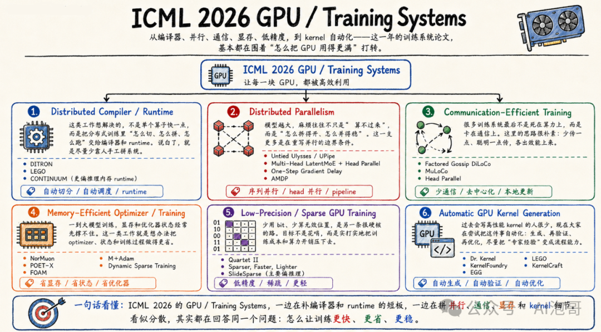

整体上，从文章上看有几个趋势或特点：

1. **通信正在成为编译器的对象**，例如 DITRON 将计算、通讯和同步联合编译；也就是说，通信像计算 tile 一样被提前安排、交错执行。
2. **训练算法直接适配硬件数据格式**，例如 Quartet II 围绕 Blackwell 的 NVFP4 重新设计无偏梯度量化。
3. **并行策略开始和模型结构共同设计**，Head Parallel、UPipe 与异步 Pipeline 都说明，很难再找到一种"万能并行方案"（因为 MoE、长上下文和 Dense Transformer 的最佳切法都不会完全相同）。

整体上看，ICML 2026 围绕 GPU/Training Systems 的 paper 说明，训练系统像个野兽不断长大（**头变大**：要求更全面和系统理解模型，例如计算、通讯、显存的一体考虑等等；**脚也变大**：更贴近硬件，例如 GPU Kernel、硬件数据格式或任何可能炸出性能的硬件和规格）。为了更深入理解相关文章，本文选取了此主题的三篇 paper 详细解析。

---

### DITRON: Distributed Multi-level Tiling Compiler for Parallel Tensor Programs

**作者**：Size Zheng、Xuegui Zheng、Hanshi Sun、Qi Hou、Wenlei Bao、Shiyu Li、Haojie Duanmu、Jin Fang、Chenli Xue、Chenhui Huang、Yuanqiang Liu、Renze Chen、Ningxin Zheng、Dongyang Wang、Li-Wen Chang、Liqiang Lu、Yun Liang、Jidong Zhai、Xin Liu（ByteDance Seed、北京大学、清华大学、浙江大学和上海交通大学）。

#### 背景

现在大模型训练，计算由 Triton、cuBLAS 等系统优化，跨 GPU 通信则交给 NCCL；两边各自很快，但编译器【本文是编译视角】看不到完整的数据流，因此很难把计算和通信真正编排到一起。

一般而言，这种分工并没有太大问题（这是因为模型主要由规则的矩阵乘法组成，GPU 算完一整个算子，再统一做一次 All-Reduce 或 All-Gather，虽然会等待，但系统仍能正常扩展）。到了 MoE、长上下文和多维并行时代，一个算子的中间结果往往需要一边计算、一边通过 NVLink 或 RDMA 发往其他 GPU；如果仍然等整个算子完成后再通信，昂贵的计算单元和网络就会轮流闲置。

现有工作已经从不同方向尝试解决这个问题：CoCoNet、DISTAL 等开始把通信写进编译器的程序表示，但处理粒度仍然偏大；FLUX、COMET 可以把计算和通信拆得很细，性能很好，却依赖专家手写复杂的 CUDA kernel；TileLink 更进一步，尝试用 tile 作为统一单位自动生成重叠 kernel，但主要聚焦节点内相对静态的执行，尚未完整覆盖跨节点传输、动态数据量和模型级任务调度（如下图）：

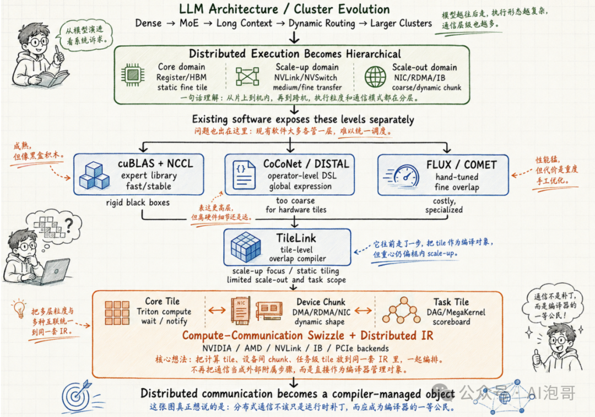

DITRON 的 insight 是：主要问题是缺少一种适合分布式 GPU 的编译器抽象。GPU 内部计算、节点内通信、节点间通信以及模型任务调度，粒度和硬件机制完全不同，不能继续被压进同一个"算子"或同一种 tile 里。

#### 方案

DITRON 的核心直觉是：**分布式训练需要编译成一个统一的数据流程序**（白话文，过去必须等一整批数据算完后再统一传输；DITRON 则让一小块数据刚算完就立刻发送，另一张 GPU 收到这一小块后也可以马上开始后续计算，这样粒度变小就不用等太长【但通讯是不是频繁了，可能是，但这个度上层把握】）。

具体地，它在编译器前端引入 **Core Tile、Device Chunk 和 Task Tile** 三层抽象，分别表示 GPU 内计算、跨设备数据搬运和模型级任务依赖。在编译器中端，它通过 distributed swizzling（白话文，把分布式训练中的"大计算、大通信"打碎，在时间线上交错编排，让 GPU 的计算单元和网络总线同时跑满，从而榨干集群的性能）、依赖分析和 wait/notify 插入，决定每个 tile 的计算顺序、通信时机和 rank 映射，使计算与通信形成流水线。在编译器后端，Distributed IR 被映射到 NVSHMEM、rocSHMEM（白话文，传统 NCCL 更像"组织所有 GPU 一起开会，统一完成一次 All-Reduce 或 All-Gather"；NVSHMEM【NVIDIA GPU】、rocSHMEM【AMD GPU】更像"某张 GPU 可以直接给另一张 GPU 送一小块数据，并告诉它数据已经到了"）、NVLink、RDMA 等具体硬件原语，从同一程序生成面向 NVIDIA 或 AMD 集群的执行代码。白话文，之前工作考虑粒度没这么小、没这么全、没这么系统，为此 DITRON 从编译器的角度统统考虑，进而可以从"库调用的组合"变成编译器可以分析、变换和生成代码的目标机器。参考下图：

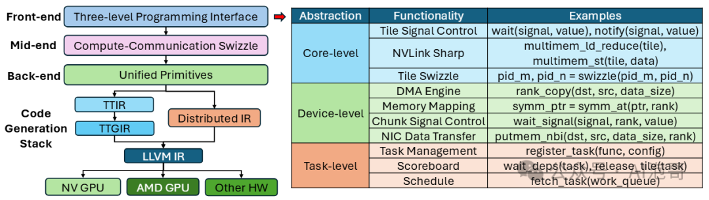

如上图，过去编译器的终点是 GPU 上的 kernel；而 DITRON 希望让编译器继续向下管理 NVLink、RDMA 和远程显存，向上管理模型任务依赖，最后直接生成整个 GPU 集群的执行方案（这是什么意思呢？它不是还是生成 GPU 的 kernel 吗？对，但这个 kernel 里可以利用 NVSHMEM 或 rocSHMEM【或 NVLink、RDMA】远程读写其他 GPU 的内存【即通信原语的"超级 Kernel"（MegaKernel / Persistent Kernel）】；同时，利用硬件级控制流（DMA / TMA 信号量）搬运其他 GPU 的数据（如 TMA，张量内存异步加速器））。

#### 意义

DITRON 旨在将 GPU 集群统一编译，这样可以把 GPU 内计算、GPU 间传输和模型任务分别拆成不同层级，再交给同一个编译器统一安排。从学术上看，DITRON 把分布式通信从一个外部库调用，进一步变成了编译器能够理解的程序对象。同时，这些工作将为"分布式 Triton"提供了一套可借鉴的框架。对产业界而言，DITRON 可能会启发一种新的 AI infra 训练方式：训练框架只负责刻画模型，而分布式编译器负责消化这些计算和通讯的难题的实现——如何实现跨 GPU 执行和如何高效通讯。

---

### Quartet II: Accurate LLM Pre-Training in NVFP4 by Improved Unbiased Gradient Estimation

**作者**：Andrei Panferov、Erik Schultheis、Soroush Tabesh 和 Dan Alistarh（Institute of Science and Technology Austria（ISTA）与 Red Hat AI）。

#### 背景

Blackwell 已经提供了原生 NVFP4 Tensor Core，但把大模型训练从 BF16 降到 4 bit（为什么非要降低精度呢？因为要减低 GPU 的功耗和提高吞吐量），这样的低精度误差会不会在更新中不断累积，最终改变模型的训练效果。

现有 FP4 训练方法大致沿着两条路线发展：

- **a. 前向传播尽可能准确地表示权重和激活**，通常采用 Round-to-Nearest（也就是把数值舍入到最近的 FP4 刻度），这种方式单次量化误差较小；但它可能给梯度引入系统偏差。
- **b. 在反向传播中使用 Stochastic Rounding**，即按照数值与上下刻度之间的距离随机舍入（目的是克服系统误差，多次平均之后不会偏向某一侧，理论上能够保持梯度无偏），但问题是 FP4 的刻度太稀疏，每个元素都随机跳动，会给梯度带来很大的方差。

所以，如上方法就陷入了一个两难：Round-to-Nearest 低误差，但有偏；Stochastic Rounding 无偏，但噪声很大。

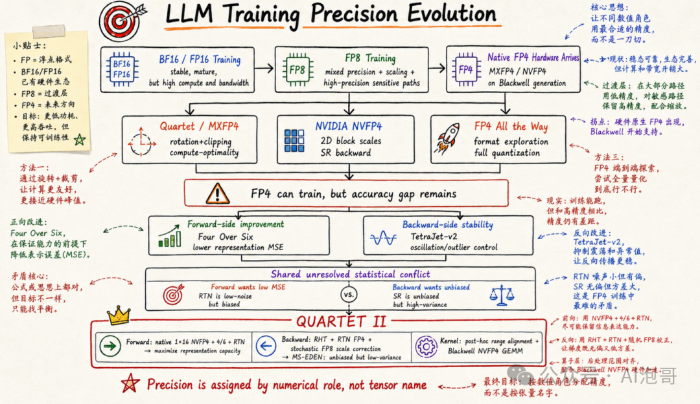

Quartet II 的思路是两条路可以同时走：前向传播和反向传播本来就在解决两个不同的问题，没有必要强迫它们使用同一种量化方法。【为什么前向和反向传播用不同近似方法呢？白话文，前向要计算 loss，需要尽量精确（所以用 Round-to-Nearest），如果加入随机噪声，loss 可能会不收敛；而反向传播是计算梯度，本质是一个长期修正的过程，不敏感一次两次的精确度，更希望在大趋势上别偏差，所以可以引入随机量，这样可以长期的无偏】

#### 方案

Quartet II 把前向和反向分开设计：

- **前向**使用原生 1×16 NVFP4 scale（因为 4-bit 的数值因为精度太低，必须依赖"比例因子（Scale）"来放大或缩小数值范围，避免精度崩盘；而原生 1×16 指的是：每 16 个 FP4 数值共享一个标定范围的 Scale。这样既能让硬件跑得极快，又能让这 16 个数在各自的局部范围内"看得很清楚"，把量化带来的损失降低）和 Four-over-Six（对每一小块数据，分别用最大值为 4 和 6 的两套量化范围进行编码，然后选择误差更小的一套。其中范围 4 更适合数值较集中的数据，精度更细；范围 6 能覆盖更大的数值，减少截断；它的本质是让每个数据块自行选择更合适的量化范围，从而减少前向传播中权重和激活的精度损失），尽量保留权重、激活中的信息；
- **反向**使用 MS-EDEN，重点保证梯度估计准确且不会长期偏向错误方向。

本文最核心的创新，是提出 **MS-EDEN**，用来解决 NVFP4 反向传播中"梯度必须无偏，但随机舍入误差又太大"的矛盾：先用 Hadamard 旋转打散异常值（用 Hadamard 旋转目的是让数据分布更均匀，这样压到 FP4 时损失的信息更少），再用误差更小的就近舍入完成 FP4 量化。为了继续保证梯度无偏，它不再随机改变每个 FP4 数值，而是把 EDEN 的修正量写入每 16 个数共享的 FP8 scale，并只对这些 scale 做随机舍入，因此量化误差比传统 SR 降低一半以上。如下展示了完整计算流程：

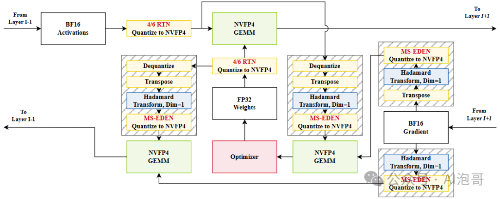

如上图分成三条信息流：前向计算输出激活、反向计算输入梯度、反向计算权重梯度（解释略）。其中：

**前向计算输出激活**：From Layer I−1（接收上一层输出的激活，也就是当前层的输入数据）→ BF16 Activations（输入激活暂时使用 BF16 保存，保留较完整的数值信息）→ 4/6 RTN Quantize to NVFP4（在两种量化尺度中选择误差更小的一种，再把 BF16 激活就近映射成 NVFP4）→ FP32 Weights（高精度主权重，参数更新仍然在 FP32 中完成，避免误差不断累积）→ 4/6 RTN Quantize to NVFP4（FP32 权重在参与矩阵乘法前也被压缩成 NVFP4；原始 FP32 权重不会因此被替换）→ NVFP4 GEMM（量化后的激活和权重进入 Blackwell Tensor Core，执行低精度矩阵乘法）→ To Layer I+1（矩阵乘法结果作为当前层的输出，继续传给下一层）。

**反向计算输入梯度**：From Layer I+1（下一层传回来的梯度，表示当前层输出发生变化时，损失会怎样变化）→ BF16 Gradient（梯度最初以 BF16 保存，然后再根据不同的反向矩阵乘法进行量化）→ Hadamard Transform, Dim=1（对梯度做旋转，把集中的大值分散开，使后续 FP4 量化更稳定）→ MS-EDEN Quantize to NVFP4（把旋转后的梯度量化为 NVFP4，同时通过 FP8 scale 修正量化误差，保持梯度在平均意义上不偏）→ Dequantize（权重分支）（前向阶段保存的 NVFP4 权重先恢复为可继续处理的数值形式）→ Transpose（权重分支）（调整权重的矩阵方向【因为前向和反向权重不同，需要转置】和数据布局，使其符合输入梯度 GEMM 的计算要求）→ Hadamard Transform, Dim=1（权重分支）（权重沿与梯度相同的内维进行旋转，并使用匹配的旋转方式）→ MS-EDEN Quantize to NVFP4（权重分支）（旋转后的权重重新量化为 NVFP4，以便整个输入梯度计算继续使用 FP4 Tensor Core）→ NVFP4 GEMM（量化后的梯度和权重相乘；两侧使用的旋转会在矩阵乘法中自然抵消）→ To Layer I−1（得到的输入梯度继续传回上一层，让更早的网络层也能进行反向传播）。

#### 意义

这篇论文的重要性在于，较完整地回答了"FP4 原生训练怎样落地"这个问题。对产业而言，它意味着 Blackwell 的 NVFP4 有了一个实现思路；对学界而言，低精度训练中误差结构、梯度统计性质与硬件执行路径的协同设计是否可以成为一个新的研究方向。

---

### Untied Ulysses: Memory-Efficient Context Parallelism via Headwise Chunking

**作者**：Ravi Ghadia、Maksim Abraham、Sergei Vorobyov、Max Ryabinin（Together AI）。

#### 背景

长上下文训练中，序列长度 S 一旦继续增长，显存压力会沿着三条路径同时上升：Attention score 原本按 $O(S^2)$ 增长，QKV 与通信 buffer、FFN 和 loss 的中间张量则按 $O(S \cdot d_{model})$ 增长（$d_{model}$ 就是 embedding 的维度）。

针对最早出现的平方级瓶颈，FlashAttention 用分块计算和 online softmax，避免把完整的 S×S Attention 矩阵写入 HBM；而 ALST、Liger Kernel 和 Activation Checkpointing，则分别通过 tiling、算子融合、重计算和 offloading，继续压低 FFN、loss 与跨层激活的显存占用。但 Attention 还有一个无法绕开的要求：每个 Query 仍然需要访问完整序列上的 Key 和 Value，因此单卡优化之后，系统必须进一步把序列切到多张 GPU 上，这就是 Context Parallelism：Ring Attention 让 KV 在 GPU 之间沿环传递，显存较省，但需要多轮通信；DeepSpeed-Ulysses 则用一次 All-to-All，把按序列切分的数据重新按 Attention Head 分配，因此吞吐更高。

但是问题在于，这种方法会同时生成所有 Heads 的 QKV，并额外申请同等规模的 All-to-All buffer；当上下文达到百万 token 后，这两批中间张量会一起占住 HBM，成为 FlashAttention 之后新的显存瓶颈。为此，FPDT 选择继续沿 sequence 维切块，并把部分数据卸载到 CPU，虽然能够进一步拉长上下文，但频繁的 CPU–GPU 数据搬运也明显降低了训练速度。

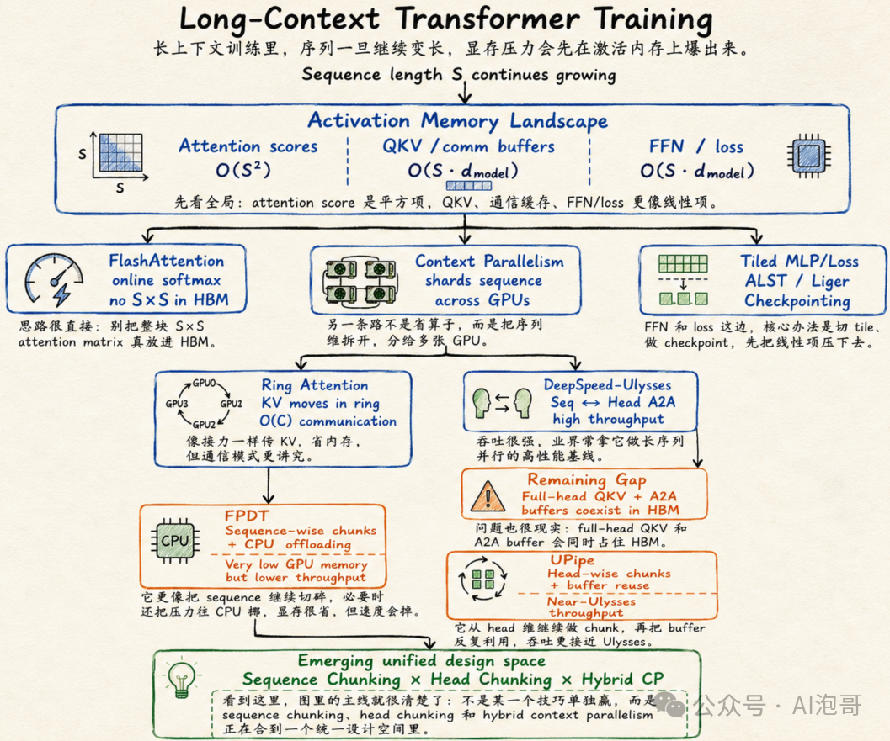

本文 Untied Ulysses / UPipe 的关键判断是：**长序列本身已经提供了足够大的计算量，因此没有必要让全部 Heads 同时驻留显存**；只需按 Head 分批执行，并让不同批次反复复用同一组 QKV 和通信 buffer，就能在接近 Ulysses 吞吐的同时，把 Attention 的峰值显存显著压低。

#### 方案

本文的核心创新是 **UPipe（Untied Ulysses）**：把原本一次完成的 Attention 拆成多个阶段，每个阶段只处理一小组 Heads。每个阶段依次完成 QKV 投影、输入 All-to-All、FlashAttention 和输出 All-to-All；这一组 Heads 处理完成后，下一组 Heads 直接复用之前的 QKV 和通信缓冲区。因此，DeepSpeed-Ulysses 的中间显存取决于全部 H 个 Heads，而 UPipe 只取决于当前处理的 U 个 Heads；当 U 取 GPU 数量时，显存开销甚至不再随总 Head 数量增长。

论文还设计了兼容 GQA（Grouped-Query Attention）的调度方法：先发送不同的 KV Heads，再调整 Query Heads 的执行顺序，让后续阶段直接复用已经通信过的 K、V，避免重复传输。具体流程，请参考下图：

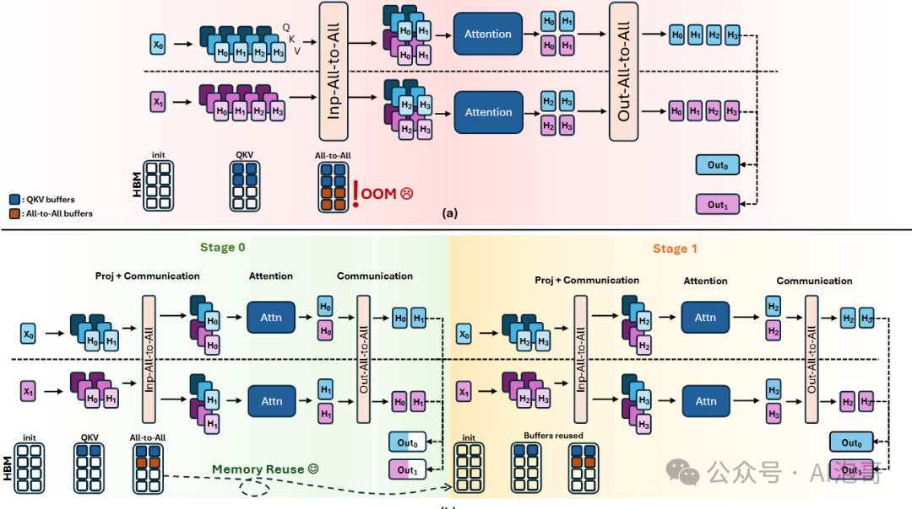

如上图，比较 DeepSpeed-Ulysses 和本文的 UPipe（图中有两张 GPU：蓝色数据来自 GPU0，紫色数据来自 GPU1；输入序列已经被切成 X0 和 X1，Attention 一共有 H0–H3 四个 Heads）。

**图 a [DeepSpeed-Ulysses]**：序列分片输入（GPU0 保存 X0，GPU1 保存 X1，每张 GPU 只持有一部分序列）→ 生成全部 QKV（每张 GPU 一次性为 H0–H3 四个 Heads 生成 Q、K、V，因此全部 Heads 的中间张量会同时进入 HBM）→ Input All-to-All（GPU 交换 QKV，这样"每张卡保存部分序列的全部 Heads"，变成"每张卡保存部分 Heads 的完整序列"）→ Attention（GPU0 计算完整序列上的 H0, H1，GPU1 计算 H2, H3）→ Output All-to-All（Attention 结果再次交换，从按 Head 分布恢复成按序列分布）→ 输出（GPU0 得到 Out0，GPU1 得到 Out1，继续进入后续 Transformer 层）。

DeepSpeed-Ulysses 的问题是：全部 Heads 的 QKV 和 All-to-All 通信 buffer 同时驻留显存，长序列下很容易达到 HBM 峰值并 OOM（Out Of Memory，这里是显存溢出）。

为此，UPipe 做了如下调整：

- **Stage 0：只处理第一组 Heads**（两张 GPU 先只生成 H0, H1 的 QKV，而不是一次生成全部四个 Heads）→ Input All-to-All（交换这一小组 QKV，使 GPU0 获得完整序列的 H0，GPU1 获得完整序列的 H1）→ Attention 与 Output All-to-All（两张 GPU 分别完成 H0, H1 的 Attention，再把结果交换回原来的序列分片，并写入最终输出 buffer）。
- **Stage 1：处理下一组 Heads**（系统继续生成 H2, H3 的 QKV，并重复同样的通信和 Attention 流程）→ Buffer Reuse（由于 H0, H1 已经计算完成，Stage 1 直接复用 Stage 0 的 QKV 和通信 buffer，无需重新申请同等大小的显存）→ 合并输出（H0–H3 的结果依次写入预先分配的 Out0 和 Out1，不需要最后再做一次大规模拼接）。

说白了，Ulysses 是全部 Heads 同时计算，UPipe 则是按 Head 分阶段计算，并反复复用同一组显存。两者完成的 Attention 数学计算相同，但 UPipe 把峰值显存从"全部 Heads 的中间张量"降到"当前这一组 Heads 的中间张量"。

#### 意义

这篇论文值得推荐，因为长上下文训练中一个容易被忽略的问题：Attention 矩阵已经被 FlashAttention 优化后，下一道所谓显存墙是全量 QKV 与 All-to-All buffer 同时驻留。本文没有要求更多 GPU 或重度依赖 CPU offloading，而是通过 Head 维度切块，把 Ulysses 的高吞吐和分块方法的低显存结合起来。

对产业而言，UPipe 能在现有 TorchTitan、FlashAttention 和 Context Parallelism 软件栈中直接使用，用相同硬件训练更长的代码、文档、音频与视频序列。对学界而言，Sequence Chunking × Head Chunking × Hybrid Context Parallelism 的多维联合设计可能是一个新的方向。

---

## LLM Serving

过去几年，LLM Serving 的技术路径相对比较明确：Orca、vLLM / PagedAttention 解决动态批处理和 KV Cache 显存碎片，Sarathi-Serve 用 Chunked Prefill 缓解长 Prompt 对 Decode 的阻塞，DistServe 将 Prefill 与 Decode 拆到不同 GPU，Mooncake 则进一步把 KV Cache 扩展成跨 HBM、DRAM、SSD 和网络的数据层。整体上，这些工作都是解决：当请求来了以后，怎么能高效地完成 Batching、KV 管理、阶段执行和硬件分配。

而今年 ICML 2026 的新变化在于，Serving 系统开始面对更复杂的情况（必然涉及多轮对话、Reasoning、RAG 和 Agent workflow），例如同一个任务可能反复进入 Prefill 和 Decode，持续积累 KV Cache，中间等待工具返回，并在请求长度、状态位置和资源需求不断变化的情况下继续执行。如果这样的话，系统优化的对象变成了带有历史状态和执行阶段的长期 Workflow（过去只是 request：只是"一次性"模型调用跑快；而现在是长期作战，需要把一整条不断暂停、恢复和增长的推理链跑好）。

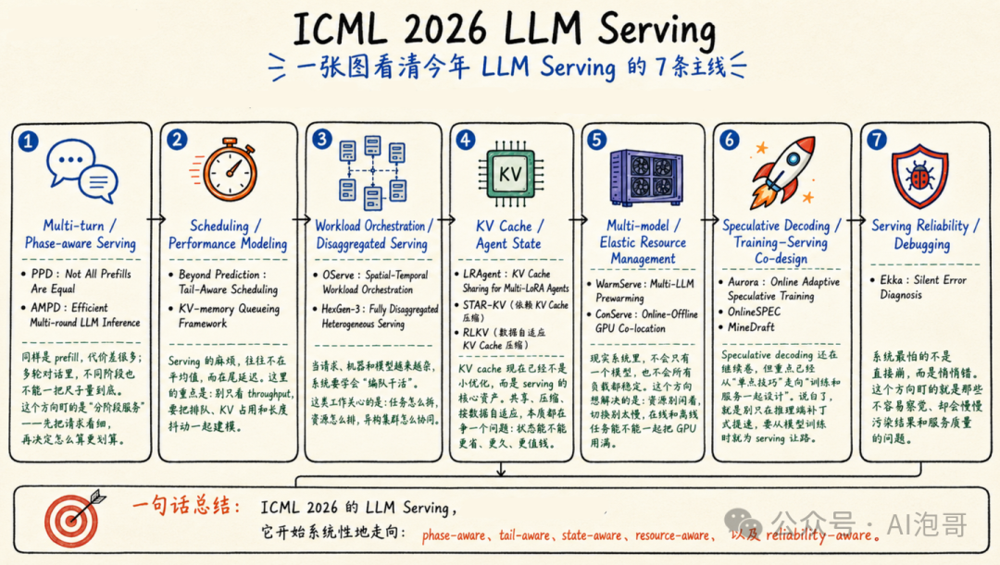

具体地，ICML 2026 呈现出如下趋势或 Insight：

1. **Request-centric → Phase-aware**，例如 PPD 和 AMPD 等表明，现有的方法将请求拆成 Prefill 和 Decode 仍然太粗，可能需要进一步区分：full prefill、append-prefill、decode、verification、retrieval return、tool-call resume、cache reload 等阶段；
2. **Stateless → Stateful**，例如 LRAgent 表明，Agent、LoRA adapter 和 KV Cache 没必要被独立处理，假如多个 Agent 共享 backbone 和历史 trajectory 时，KV Cache 也应拆成共享基础状态和 adapter-specific 状态。白话文，多个 LoRA Agent 共享同一个基础模型和大部分对话历史时，就没有必要分别存一份完整 KV，更合理的做法是共享同源产生的公共 KV，只为每个 Adapter 保存差异即可；
3. **从长度预测走向 Risk-aware Scheduling**，例如 Beyond Prediction 讨论即使 Scheduler 获得准确的 Decode Length，SRPT 仍可能因 Bursty Arrival（突发流量）、KV 显存压力和高抢占成本而产生较差的 P99 延迟；Uncertainty-Aware Output Length Predictions 则把输出长度建模为重尾分布，并用 Tail Inflated Expectation 代替单点长度预测进行 SJF（Shortest Job First）调度。这是什么意思呢？输出长度预测不是越准越好这么简单【为什么要预测长度呢【Decode Length】？为了降低延迟（尤其是平均延迟）并提高吞吐量。白话文，就是如果预测输出短，就先处理，这样吞吐量就好，也相对公平】，因为调度代价还取决于请求占用了多少 KV、是否值得被抢占，以及错误决策会不会把少数长请求放大成 P99 延迟；
4. **从静态部署走向 Workload-adaptive Cluster Control**，传统 Serving 通常提前确定：模型放在哪些 GPU、Prefill 与 Decode 各有多少 GPU、每个模型保留多少副本。但是，这种部署适合请求组成相对稳定的情况，实际却有很多异构情况：有些请求 Prompt 长、输出短；有些请求 Prompt 短、输出长；有些模型白天繁忙、夜间空闲等等。为此，OServe 根据实时请求决定模型部署，并在请求变化时切换并行和配置；HexGen-3 则使不同执行组件可以在异构 GPU 上独立伸缩。也就是说，当请求和模型流量随时间变化时，静态部署不会一直最优，需要根据当前 workload 重新选择执行计划。

---

### Not All Prefills Are Equal: PPD Disaggregation for Multi-turn LLM Serving

**作者**：Zongze Li、Jingyu Liu、Zhen Xu、Yineng Zhang、Tahseen Rabbani、Ce Zhang（University of Chicago）。

#### 背景

LLM Serving 最早主要解决"请求怎么排队、显存怎么装得下"：Orca 把调度粒度从整条请求缩小到生成迭代，旨在让长短请求不必互相等；vLLM / PagedAttention 再用分页机制管理动态增长的 KV Cache，减少显存的浪费；Sarathi-Serve 发现 Prefill 会阻塞正在生成 token 的 Decode，于是把长 Prefill 切成小块，与 Decode 交错执行；而 DistServe、Splitwise、Mooncake 进一步把 Prefill 与 Decode 拆到不同 GPU Pool，但所有 Prefill 都先到 P Pool，再把 KV 传给 D Pool（也就是说，没有区分增量 prefill 和全量 prefill，多轮对话每次重新来 prefill，浪费显存和计算、通讯）。

为此，SGLang、Pensieve、MemServe 通过建立前缀缓存或共享 KV 层，让不同请求和节点可以复用状态，但这样处理增加了缓存目录、内存层级和网络传输（因为要复用状态，所以要建立类似检索数据结构（如树/哈希表/Radix Tree）便于查询以复用；另外，GPU 内存容不下这么多复用内容时，则 offloading 到 CPU RAM 或存储系统中去），如下图：

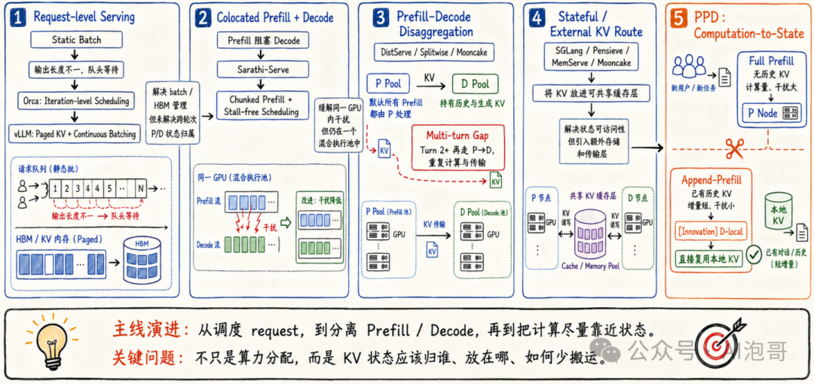

而本文的 PPD 主要针对多轮对话中，如果 KV 已经在 Decode 节点，若仍强制走 P→D，就会重复计算、重复传输，而是"计算应该靠近哪份状态"。白话文，之前的原则是 Prefill 节点 GPU 就是专职 prefill【GPU 显存里都是 prefill 矢量或中间结果】，而 Decode 节点就是专职 Decode【但是，GPU 显存里为了 decode，必然有 prefill 的数据】；但是多轮对话中，增量的 prefill 就不用再去 prefill 节点计算了，直接 Decode 节点做 prefill，就可以省去 prefill 计算，再传输到 decode 节点来。

#### 方案

PPD 的核心直觉是：**把 Prefill 区别对待**，Full Prefill 与 Append-Prefill 虽然都叫 Prefill，但负载情况不同（前者处理完整上下文、计算重，后者只处理新增 token 并复用历史 KV、干扰小）。因此，对于多轮请求，PPD 要根据 workload、P:D 资源配置及 TTFT/TPOT 的 SLO 权重，动态选择 P 远程执行或 D-local Append-Prefill（理由不赘述，参考【背景】的解释）。选择 D-local 时，系统直接复用本地历史 KV，省去上下文重算和 P→D 传输；选择 P 时，则避免 Append-Prefill 抢占繁忙的 Decode GPU（也就是，除了考虑就近处理外，也同时考虑 workload 的情况进行路由）。

方法上，PPD 先离线 profiling 不同负载和资源配置的 TTFT–TPOT 权衡，再由在线 Router 查表完成低开销决策，而不是运行复杂的实时优化器（也就是，离线做各种实验 profiling，形成类似"决策树"的结论，在线就可以直接用，不用再耗费计算资源和时间了）。它最核心的创新可以概括为 **Computation-to-State**：把增量计算放到已经持有 KV 的节点。具体过程，请参考如下图：

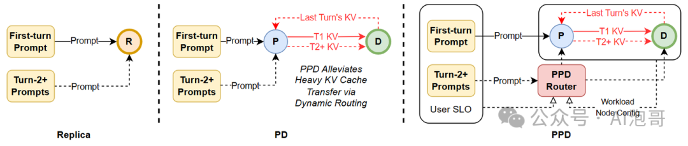

#### 意义

学术上，PPD 把 Serving 的调度粒度从 request-aware、phase-aware 推进到 phase-subtype-aware 与 state-aware：调度器感知当前是 Prefill，还要细分它是 Full 还是 Append、KV 在哪里。工业上，PPD 可能先成为 vLLM、SGLang 等系统 Router 中的一个策略，无需改变模型或重新训练就可以实现。

---

### Efficient Multi-round LLM Inference over Disaggregated Serving

**作者**：Wenhao He、Youhe Jiang、Penghao Zhao、Quanqing Xu、Eiko Yoneki、Bin Cui、Fangcheng Fu（东南大学、剑桥大学、北京大学、蚂蚁集团、上海交通大学）。

#### 背景

多轮 Agent 的执行是 Initial Prefill → Decode → Tool → Incremental Prefill → Decode，Prefill 会在工作流中反复出现。现有方法主要有三条路线：vLLM 同机执行保持 KV 本地，但 Prefill 会打断 Decode；DistServe 和 NVIDIA Dynamo 静态分离 P/D，减少干扰，却把所有 Incremental Prefill 都送进 P Pool；InferCept 和 KVFlow 重点管理历史 KV，但没有联合决定 P/D 规划。

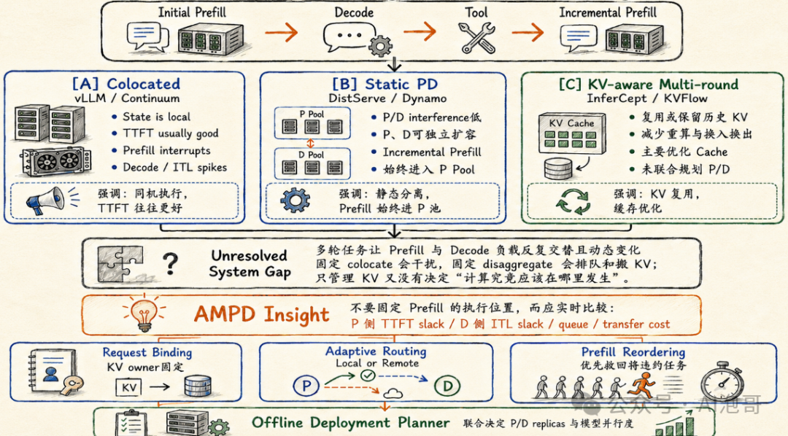

AMPD 的观察是：**本地增量 prefill 可以复用 Decode 节点上的历史 KV、降低 TTFT，但会暂停 Decode；远程执行能保护 ITL**（Inter-Token Latency，因为会打断 Decode 现有的速度），却会增加 P 队列和双向 KV 传输。白话文：放 D 上做，首字出来快但可能让正在输出的请求卡一下；放 P 上做，不打断输出，但新一轮开始得更慢。

因此，固定 colocate 或固定 disaggregate 都不是答案（colocate 就是不区分专用的 Prefill 服务器和 Decode 服务器，一台机器既要负责处理新进来的请求；disaggregate 就是 PD 分离），真正的问题是：每个增量 Prefill 到达时，P 和 D 哪一侧还有更多 SLO 余量？白话文：不提前定死位置，而是看当时哪边更空、放哪边更不容易超时。这个思路与上篇 PPD 的出发点类似。

#### 方案

AMPD 的核心 insight 是 **PD Disaggregation 应该根据实时负载动态而决定**：

- **Request Binding**：请求首先绑定一个 Decode Worker，使其成为该 Session 的 KV owner，后续所有轮次都能明确状态在哪里（先给每段对话固定一个"KV 老家"，一直由特定 D 节点管理）；
- **Adaptive Routing**：根据 P 侧 TTFT slack、D 侧 ITL slack、两边队列、Prefill 计算量和 KV 传输成本，选择在 P 上远程执行，或在 D 上本地执行（也就是，P 不忙就走 P；P 忙但 D 还有余量就走 D；两边都忙时，再算哪条路总体更便宜）；
- **Prefill Reordering**：不再严格 FIFO，而是优先执行最可能违反 TTFT SLO 的任务，避免长任务一直饿死（不是谁先来谁先做，而是谁快超时先救谁）；
- **Offline Deployment Planner**：根据模型、GPU、网络和多轮 workload，决定 P/D replica 数量与模型并行度，避免运行时路由合理、底层资源比例失衡。

如下图：

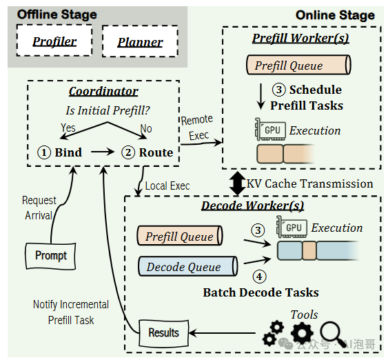

如上图，其信息流为：Profiler/Planner → Session Binding → Adaptive Routing → P 或 D 的 Prefill Queue → TTFT-aware Reordering → Decode → Tool 结果 → 下一轮。

比较 PPD 和本文 AMPD：PPD 更侧重学术价值的明确结论（Full Prefill 与 Append-Prefill 不是同一种负载）；AMPD 更侧重于工程化（如何通过路由、重排和资源规划把整个系统管起来）。

#### 意义

学术上，AMPD 将 LLM Serving 聚焦"用户体验（TTFT/ITL）驱动增量任务执行的放置"，也就是用户体验指标做控制，不单看 GPU 的利用率。工业上，AMPD（PPD 也一样）可以作用于 Dynamo、vLLM 等 PD Serving 控制面，做 PD 路由。

---

### Beyond Prediction: Tail-Aware Scheduling for LLM Inference

**作者**：Yueying Li、Yuanfan Chen、Jiayang Chen、Esha Choukse、Haoran Qiu、G. Edward Suh、Rodrigo Fonseca、Ziv Scully、Udit Gupta（Cornell University、Microsoft Azure Systems Research、NVIDIA）。

#### 背景

在线 LLM Serving 同时混入短对话、长推理和突发请求等情况下，常导致请求的 P95/P99 延迟失控（绝大多数用户用起来都挺快，但有极少数用户（最倒霉的 5% 或 1%）遇到了极长的等待时间，甚至卡死）。

为此，现有调度大致分三类：

- **FCFS**（First-Come, First-Served / 先来先服务）保护早到和长请求，但容易被超长任务堵住；
- **SJF/SRPT**（Shortest Job First / 最短任务优先、Shortest Remaining Processing Time / 最短剩余时间优先）预测输出长度并优先短任务，但可能饿死长任务；
- **LAS/MLFQ**（Least Attained Service / 最小已达服务、Multi-Level Feedback Queue / 多级反馈队列）不预测长度，却可能让大量新请求持续抢占，制造更多活跃 KV Cache（这是因为只要新来一个 request，优先处理，但随着处理时间变长【占用的 GPU 计算量变多】，优先级就会不断降低，被降级到慢速队列里）。

因此，"短任务加速"和"长任务尾延迟保护"之间就存在调度上的矛盾。如下图：

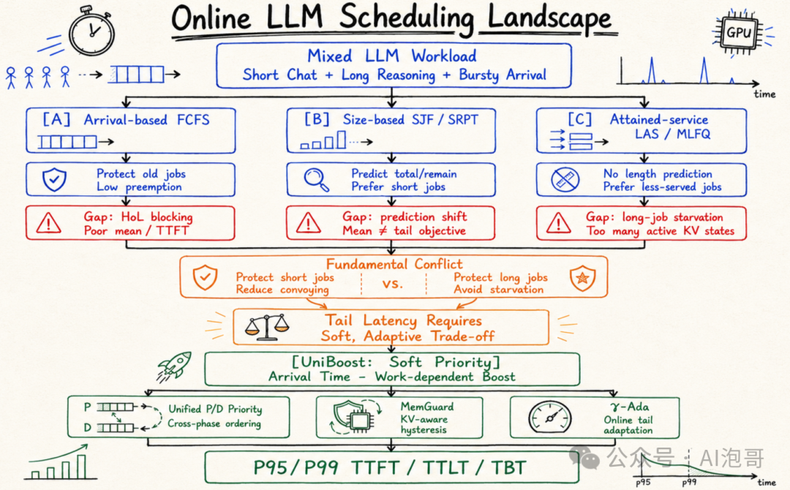

本文 Beyond Prediction 的判断是：**即使准确知道每个请求最终会生成多少 token，SRPT 仍主要优化平均延迟，无法天然控制 P99**；同时，LLM 抢占还会引发 KV Cache 换出、重算和显存压力。

白话文，"猜不准任务多长"是个问题，但即使"知道多长以后，排序目标仍可能选错"。这是因为按照 SRPT（最短剩余时间优先）排队调度理论中，比如：Request A 需要 10 秒（短任务）；Request B 需要 10 分钟（长任务）。不用说，肯定要先让 Request A，因为 10 秒就搞定了。这样的调度确实能让"平均等待时间"（Average Latency）变得非常漂亮。但是，系统追求的真的是"平均时间"吗？如果队伍里突然来了 99 个只需要 10 秒的类似 Request A，全部插队排在 B 前面。这样，均值确实很棒：99 个 request 的体验都极好，平均等待时间只有几秒。但 P99 彻底崩溃了：那个悲剧的 Request B（最慢的 1% 尾部延迟）被整整插队了 99 次，等了快 20 分钟！在实际业务中，Request B 可能是一个超级 VIP 客户，却因为调度器一味追求"平均分"，直接被"饿死"超时了。

#### 方案

论文提出 **UniBoost**：Request 在到达队列时，加入一个 soft priority boost（目的是：新任务可以适度插队，但跑久以后优势会消失，不能一直压着老任务；这里的 Boost 是给某些请求一个临时的优先级加成，让它们比原本的到达顺序更早获得 GPU），其核心控制参数 γ 在两种策略间调节：一端接近 FCFS、保护长任务，另一端更接近 LAS/SJF、快速完成短任务，这样便可以根据流量在"照顾短任务"和"别饿死长任务"之间移动。

并且，UniBoost 把 Prefill 和 Decode 放进同一优先级空间，避免 Decode 永远压住新 Prefill，也避免 Prefill 无条件打断正在生成的请求。同时，**MemGuard** 负责从空间与显存成本的角度判断这次抢占动作是否划算（而 UniBoost 负责从时间与延迟 SLO 的角度判断任务有多紧急；两者结合，才实现了既能照顾短任务、优化 P99 尾延迟，又不会因为"反复搬运数 GB 的 KV Cache"而拖垮系统的调度闭环）。

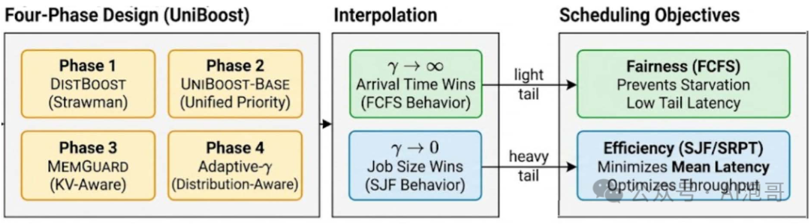

具体地，如上图说明了 UniBoost 处理过程：

- **请求状态与工作量评估**：首先读取请求的到达时间、Prefill 长度和已经完成的 token 数，将其转换为可比较的 effective work。也就是，调度器先判断每个请求"来了多久、已经跑了多少、还处在哪个阶段"；UniBoost 是通过参数 γ 控制长短任务权衡，如果大的 γ 更接近 FCFS、保护早到和长请求，较小的 γ 更偏向优先完成短请求。
- **Phase 1：DistBoost**（分别在 Prefill Queue 和 Decode Queue 内使用 Boost 排序，再优先组成 Decode batch、用剩余容量执行 Prefill。此时在两个队伍内部排顺序，但 Prefill 和 Decode 仍然是两套队伍，彼此不能直接比较）；
- **Phase 2：UniBoost-Base**（UniBoost-Base 将 Prefill 和 Decode 映射到同一个 soft-priority 空间，按照"到达时间减去 work-dependent boost"统一选择下一批任务。也就是，不再严格按照 Decode 永远比 Prefill 优先，而是要看实际情况判断）；
- **Phase 3：MemGuard**（将优先级更新限制在离散的 work threshold 上【不能随时随地调整优先级，只能在特定节点调整，例如将连续的 Token 生成过程切分成离散的"工作量门槛"（Work Threshold），例如每生成 16、32 或 64 个 Token 才算触发一个门槛。】，并设置 minimum-run hysteresis【"Hysteresis"（迟滞）是一个物理和工程学概念，就是"即便你达到了触发条件，我也让你稍微飞一会儿，不马上做反应"，类似于防抖动机制】，避免请求每生成一个 token 就被抢占和搬移 KV Cache）；
- **Phase 4：γ-Ada**（适应性参数估计：统计近期 P95/P99 TTFT、TTLT 和 TBT，根据实际尾部分布更新 γ，便于调度策略适应性调整。主要目的是：如果长请求开始严重卡顿，系统就多保护它们；如果短请求被堵住，就提高短请求的优先级）。

注意，运行时真正同时工作的是 Phase 2 的统一优先级、Phase 3 的 MemGuard 和 Phase 4 的 γ-Ada；Phase 1 主要是早期设计和消融实验中的对照版本。

#### 意义

学术上，UniBoost 把 LLM 调度问题转化为"如何联合控制尾延迟、抢占和 KV 状态"的问题，将排队论中的 soft priority 与真实运行时的 continuous batching、Prefill/Decode 和 KV Cache 约束连接起来，为后续调度提供了新的基础。工业上，UniBoost 是实现本地 scheduler 和 KV eviction 模块一个有效的思路，尤其面对 reasoning 请求、突发流量和显存接近饱和时，以避免出现 P99 latency 严重问题。

---

## Agent Infra

ICML 2026 的 Agent Infra 需要面对一个长期运行、持续积累状态并反复调用工具的 Agent Program 的问题，例如 GraphFlow、Agent JIT 和 EvoC2F 分别关注 Workflow IR、程序编译和工具编排层等问题，ThunderAgent 与 CONCUR 则面对管理程序生命周期和运行并发等情况。

整体上，ICML 2026 此主题有如下观察：

1. **从固定策略转向运行时闭环控制**（例如：CONCUR 根据 KV Cache 压力调整活跃 Agent 数量；BudgetMem 根据 Query 难度分配 Memory 计算预算；R³DAO 则根据故障信息修改局部工作流）。白话文，Agent 运行环境变化太快，系统不能在开始时做一次决定，而要边执行、边观察、边调整；
2. **从完整私有状态转向"共享公共状态＋保存少量差异"**（例如 LRAgent 共享基础 KV Cache，GraphFlow 共享 Workflow Operation 和状态残差）。白话文，多个 Agent 经常重复读取相同历史，为此没必要为每个 Agent 完整复制一份状态。

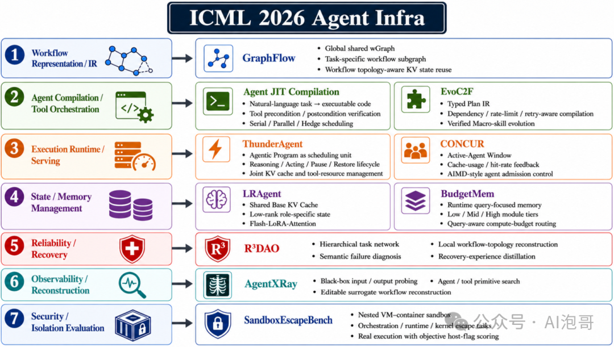

如果内容简单划分，ICML 2026 Agent Infra 主题可以分为七层（只选了 10 篇 paper 为例）：Workflow Representation、Compilation、Execution Runtime、State and Memory、Recovery、Observability，以及 Security。其中 GraphFlow 属于 Workflow IR；Agent JIT 与 EvoC2F 属于 Compiler；ThunderAgent 与 CONCUR 属于 Runtime 和 Scheduling；LRAgent 与 BudgetMem 属于 State and Memory；R³DAO、AgentXRay 和 SandboxEscapeBench 分别补充 Recovery、Observability 与 Security。

最关键的 Insight 是，**Agent Infra 的主要瓶颈正在从单纯的模型计算，转向 Workflow、模型状态、工具状态、记忆状态和失败状态之间的协调**。白话文，系统效率评估更要看有多少工作被重复执行、多少状态可以复用、失败后能否从原进度继续。同时，当前这些论文已经从不同侧面显现出 Agent OS 的主要零部件的"模样"，但仍然不是真正的 Agent 操作系统。可能下一阶段必然会迈向：可持久化、可事务恢复、可验证并能够跨模型和工具运行的 Agent-native Runtime。

---

### ThunderAgent: A Simple, Fast and Program-Aware Agentic Inference System

**作者**：Hao Kang、Ziyang Li、Weili Xu、Xinyu Yang、Yinfang Chen、Junxiong Wang、Beidi Chen、Tushar Krishna、Chenfeng Xu、Simran Arora（Georgia Institute of Technology、University of Illinois Urbana-Champaign、Carnegie Mellon University、Together AI）。

#### 背景

传统 LLM Serving 的基本对象是一条请求：Prompt、Prefill、Decode、Response；请求完成，系统就认为工作结束。但 Agent 的一次任务并不是一条请求，而是一串交替发生的模型调用和外部执行（例如如下一个流程：Reasoning > Tool Call > 等待编译器 / 浏览器 / API > Reasoning > Tool Call > 等待结果 > Validation / Replanning）。

同时，在传统 AI infra 眼里，Agent 通常被拆成：LLM Serving Engine（看到若干相互独立的 request）、Kubernetes（看到若干 container / process Tool Runtime）、Tool Runtime（看到若干 shell / browser / API call）。这三个系统都看到了局部操作，却没有任何一个系统看到完整的 Agent 生命周期。

例如，vLLM / PagedAttention 的对象是单次 request、token 和 KV block，以解决显存碎片与批处理效率问题，但却不知道多次请求是否属于同一个 Agent 任务；Pensieve 开始跨轮保存 conversation state，避免重复计算历史上下文，但它主要理解"模型聊过什么"，而看不到 Agent 正在等待浏览器、代码执行或外部 API；Autellix 将 Agent 看作由多次 LLM call 构成的 program，但只管模型，不管 Docker、浏览器和磁盘；Continuum 可以根据预测的 tool 执行时间为 KV cache 设置 TTL，以减少工具调用期间的缓存丢失，但是预测可能不准，也没有覆盖完整的程序资源生命周期。如下图：

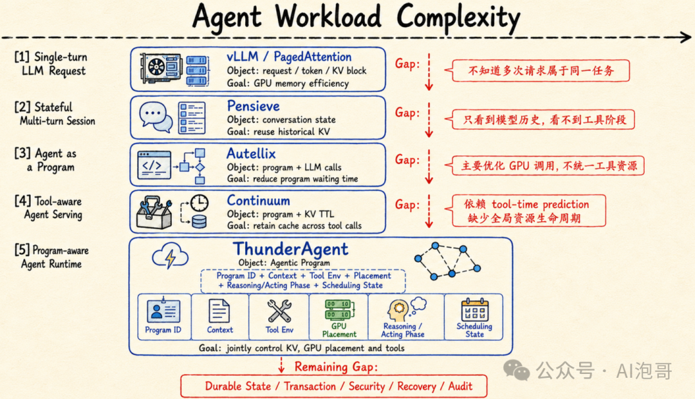

而 ThunderAgent 的核心判断是：**系统应以 Agentic Program 为单位，同时观察 Program ID、上下文、工具环境、GPU 位置、Reasoning/Acting 阶段和调度状态**。

#### 方案

ThunderAgent 的整体思路是：**给每个 Agent 任务建立一个持续存在的 Program object**，让模型请求、工具调用和资源都归属于同一个程序。

具体地，每次 LLM call 和 tool call 都携带相同的 program_id，runtime 因而能够跨多轮恢复完整任务关系；系统持续记录 context size、tool environment、GPU placement、Reasoning/Acting phase 和 Active/Paused/Terminated 状态，不再把每次请求当作孤立事件；当 GPU KV cache 压力过高时，scheduler 优先暂停正在等待工具的 Program，并在其他节点有空间时恢复或重新放置；tool manager 同时提前准备环境，并在程序结束后回收磁盘、端口和 sandbox。如下图：

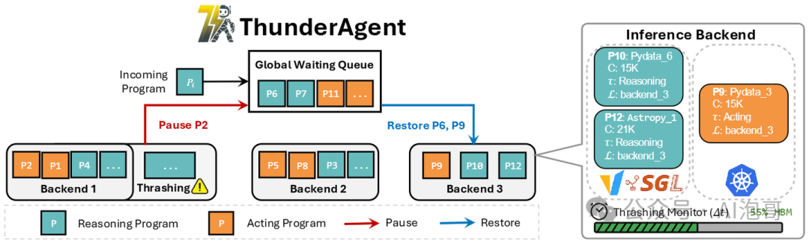

如上图，ThunderAgent 的处理流程：Agent request → Program State Table → Global Waiting Queue / Scheduler → vLLM、SGLang 与 Tool Environment → 资源状态反馈。这条信息流形成闭环：backend 报告 KV 压力，scheduler 决定 Pause/Restore，更新后的 Program 状态再进入下一轮调度；也就是从一次性 routing 变成持续管理 Agent 生命周期。

#### 意义

ThunderAgent 改写 Agent Serving 的核心对象是一个跨模型、工具和持续存在的 program。

- **学术意义**：将 Agent lifecycle 和执行阶段纳入系统调度考虑的范畴，使问题聚焦为"如何高效执行完整 Agent workflow"；
- **工业意义**：可以作为 vLLM、SGLang 与现有工具平台之间的控制机制，减少重复 prefill、跨节点显存失衡以及 sandbox 和磁盘资源泄漏。

---

### CONCUR: High-Throughput Agentic Batch Inference of LLM via Congestion-Based Concurrency Control

**作者**：Qiaoling Chen、Zhisheng Ye、Tian Tang、Peng Sun、Boyu Tian、Guoteng Wang、Shenggui Li、Yonggang Wen、Zhenhua Han、Tianwei Zhang（Nanyang Technological University, Singapore；Independent Researcher；Shanghai Qiji Zhifeng Co., Ltd.）。

#### 背景

传统 LLM 批量推理的生命周期：Request arrives > Prefill > Decode > Request finishes > KV Cache released；而 Agent workload 则不同：Reasoning Step 1 > Tool Call > 等待工具返回 > Reasoning Step 2 > Tool Call > 等待工具返回 > Reasoning Step 3 > ...；Agent 每进行一轮 Reasoning 和 Acting，新的思考、工具结果和环境观测都会继续附加到上下文中。

因此，Agent 的输入长度和 KV Cache 占用不是固定的，而是随着执行步数持续增长。同时，不同 Agent 的执行进度并不同步：Agent A 正在 GPU 上生成；Agent B 正等待搜索 API；Agent C 正等待代码执行；Agent D 刚返回，准备继续推理。这使 GPU KV Cache 变成一种长期存在、动态增长且被大量 Agent 共同争抢的资源。

例如，vLLM 和 SGLang 主要按 request、token 和 KV block 做调度，但看不到多次模型调用其实属于同一个长期运行的 Agent；CPU Offload、SGLang HiCache 等分层缓存方案把被驱逐的 KV 放到 CPU 或外部存储，但高并发时又会把瓶颈转移到 PCIe 和缓存搬运；Parrot、Teola、Autellix 和 Kairos 开始利用 workflow、依赖关系和程序级信息调度请求，但重排顺序仍扛不住；固定 Agent 并发上限也不合适，因为 Agent 的 context 会在运行中持续增长：上限低时前期浪费 GPU，上限高时中期发生缓存抖动。如下图：

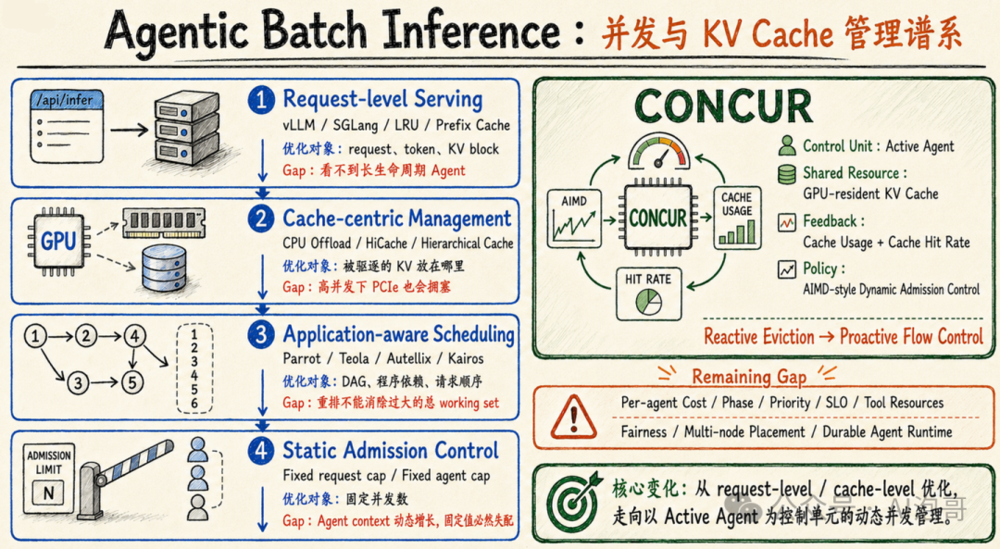

CONCUR 将这种现象定义为 **middle-phase thrashing**，也就是显存看起来还能跑，但 GPU 大量时间都在重复计算刚刚丢掉的历史。

#### 方案

CONCUR 的整体思路是：**把 GPU KV Cache 看成有限的共享带宽，把"当前活跃 Agent 数量"看成需要动态控制的 congestion window**。也就是不要等显存堵住再清缓存，而要先控制同时放多少个 Agent 进来。

其核心创新是一个 **Agent-level Admission Controller**，它持续读取 KV Cache Usage 和 Cache Hit Rate，并以 Agent 为对象执行 admit、pause 和 resume；当缓存利用率较低时，系统采用 Additive Increase，逐步增加活跃 Agent；当利用率较高且命中率下降时，采用 Multiplicative Decrease，快速缩小并发窗口。白话文，空闲时慢慢加人，发现真正堵塞时立即把人数大幅降下来。如下图：

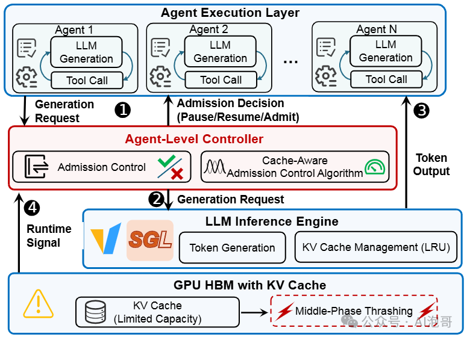

如上图为 System Overview，其信息流为：Agent generation request → CONCUR Controller → SGLang → GPU KV Cache → Usage/Hit Rate feedback → 更新 Active-Agent Window。

按照如上逻辑，其实就是把"原来"缓存满了 → 驱逐 → Agent 回来 → 重新 Prefill 的过程，改成为：提前降低并发 → 稳住 working set → 避免重复计算。本质的思路，就是在拥堵形成前限流。CONCUR 不是底层推理引擎，而是作为轻量控制层插在 Agent Framework 与 Serving Engine 之间，因此部署改动相对集中。

#### 意义

学术上，CONCUR 将 Agent KV Cache 问题重新定义为"控制多少个长期 Agent 可以同时活跃"，把缓存管理提升为 flow control 问题。工业上，它适合 Agent RL rollout、批量评测和数据蒸馏等 throughput-first 场景。

---

### GraphFlow: A Graph-Based Workflow Management for Efficient LLM-Agent Serving

**作者**：Ao Li、Shangpeng Yang、Fahao Chen、Tianheng Xu、Peng Li、Zhou Su（西安交通大学；山东大学；中国科学院上海高等研究院）。

#### 背景

早期 Agent workflow 主要是人编写的 SOP 或固定 Prompt Chain，因此流程稳定、容易检查，但只能处理设计者预先想到的任务；后来的检索式方案从 repository 中找到最相似的 workflow，所以可以复用，但通常仍以"整张模板"为单位，无法自由抽取其中几个步骤重新组合。

例如：Workflow A：理解题目 → 建立方程 → 求解 → 验证；Workflow B：理解题目 → 提取变量 → 建立方程 → 求解；Workflow C：分析代码 → 生成代码 → 执行测试 → 修复错误。当新任务到来时，系统通常会：将任务编码为 embedding → 搜索最相似任务的模板 → 取回一个完整 workflow → 让 Agent 按模板执行。

这样处理的问题在于，workflow 被看作一个不可拆分的整体。如果新任务同时需要部分流程时，传统方法就难以处理了。同时，如果 workflow 之间有相同环节时，传统系统也往往分别保持缓存造成浪费。

为此，LLMCompiler 将工具调用表示为依赖图并支持并行执行，AFlow 进一步把 workflow 写成代码并通过搜索优化拓扑；但每个任务的 DAG 通常仍被独立生成和保存。这样的目的是把流程变成了"程序图"，但这样的相似程序之间仍不知道如何共享。真正的差距在于：不同 workflow 往往重复使用相同的搜索、分析、验证等操作，但现有系统无法支撑这么细粒度的操作，因而难以组合新流程，也会重复保存相似的 KV Cache。如下图：

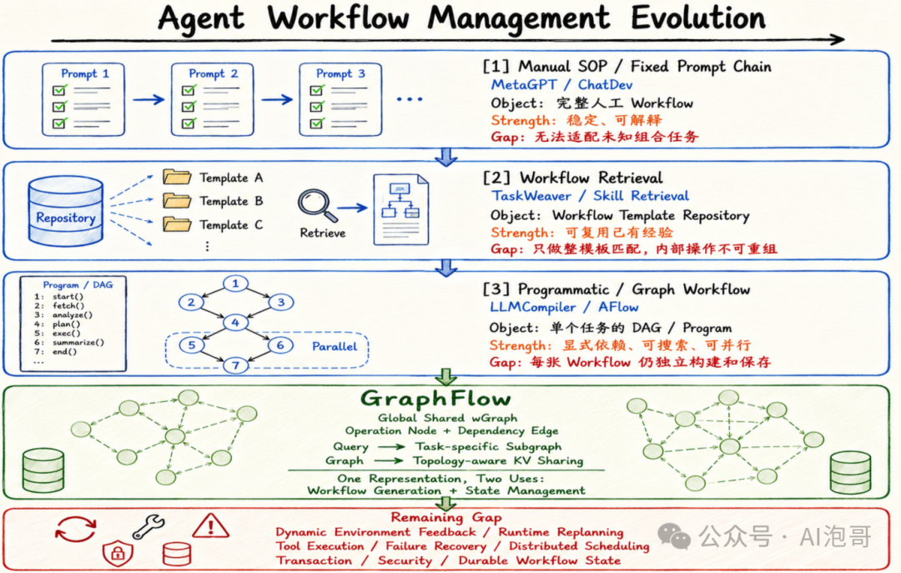

GraphFlow 因此把所有 workflow 合并为全局共享的 **wGraph**：节点是原子操作、边是合法依赖，每个任务只从中选出一张专属子图。白话文，本文希望建立一个"流程积木库"，来了任务再现场拼装。

#### 方案

GraphFlow 的核心思路是：**将 workflow 变成原子操作的组合**，因此先将各种流程拆解并合并为共享 wGraph；当请求到来时，系统把任务语义注入 wGraph，通过图神经网络传播"当前任务需要什么"的信息；随后对候选的依赖边进行评分，选择相关的节点与边，生成 task-specific workflow subgraph（也就是每个任务从 wGraph 里现场拼出合适流程，即从"检索整套流程"变成"按任务组合操作"）。

同时，wGraph 还用于 KV 管理：每个操作只保存一份共享 KV，不同前缀的影响保存为稀疏 Residual KV，并只物化高频路径，从而减少重复状态。如下图：

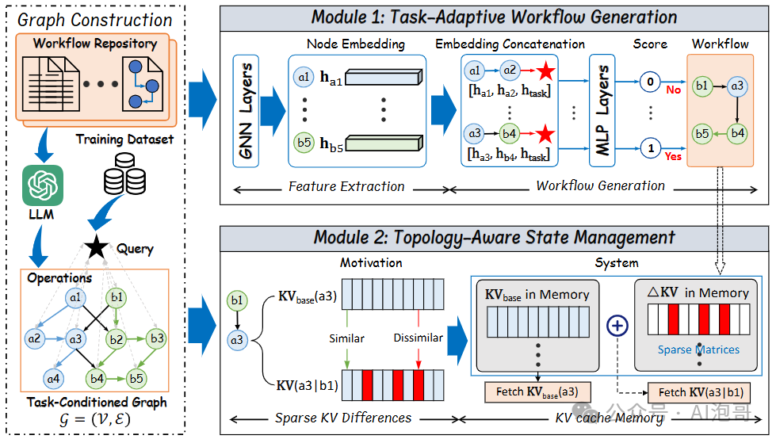

如上图，GraphFlow 的流程：历史 Workflow → 原子操作抽取 → 全局 wGraph → 任务子图生成 → Base KV + Residual KV 重建 → Agent 执行。白话文，同一张图既决定 Agent 要做哪些步骤，也决定相同步骤的 KV 状态怎样共享，避免重复计算和重复存储。

#### 意义

学术上，GraphFlow 的贡献是提出了连接 Agent planning 与 serving state management 的共享 Workflow IR，这样可以为 workflow 从独立 Prompt、模板或 DAG，演化为可组合、可查询、可复用状态的全局图结构提供了思路。工业上，它适合操作集合较稳定但任务组合很多的企业 Agent、Data Agent 和 Coding Agent，同时也可以减少流程维护成本与重复 KV 状态。
