> 本文整理自北京大学学生 Linux 俱乐部 · 未名超算队 **Infra Seminars** 的 Session 1.0《并行计算与并行编程》（主讲：陈嘉骏），结合 Wikipedia、Parallel Computing Tutorial 等公开资料补充整理，作为 AI Infra 系列的开篇，建立从 HPC 到 AI Infra 的直觉。

## 为什么要理解并行计算

为什么超算和 AI Infra 息息相关？为什么随着算力增强，人工智能才能越来越强？为什么大模型在 GPU 上才能运行和训练？

这都归功于大模型的计算和传统的科学计算、气候模拟等问题一样，能够**高度并行**。本文回答三个问题：

- 为什么能并行？什么地方并行？如何做并行计算？
- 为什么大模型 Infra 要写 Kernel？
- 为什么普通 CPU 编程不叫写 Kernel？

## 1. 计算是什么

计算是一种**将输入值按照特定规则转换为输出**的过程，包括加减乘除、乘方、开根、指数、对数、比较以及矩阵乘法等。其中输入和输出涉及到数据和数据的搬运，特定规则则涉及计算单元。

## 2. 如何计算

用计算机进行计算，用程序描述计算。计算机程序是由处理器执行的一串**指令流**，**时钟周期**是处理器执行指令的基本单位。

在冯诺伊曼架构下，执行一条指令需要经过 **取指 → 译码 → 执行 → 访存 → 写回** 这一系列流水线。也就是说，在这一意义上 5 个时钟周期才能执行完一套完整流程。

**IPC（Instructions Per Cycle，每个时钟周期执行的指令数量）** 是衡量处理器性能的关键指标。对下图这种串行执行方式，IPC 只有 1/5。

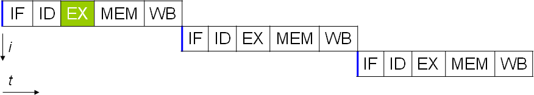

下图展示了一个典型的串行计算流程，计算机同一时刻只能执行一条指令。

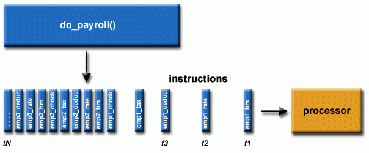

通过让处理器在相同时刻执行指令的不同阶段（流水线），可以在一个时钟周期内完成取指、译码、执行、访存、写回五个环节，IPC 性能达到 1。

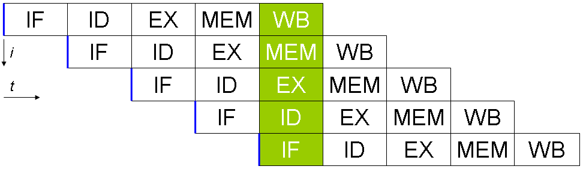

## 3. 并行计算

当有不止一个处理器时，我们可以同时执行多条指令，也就是把不同的指令分配到不同的计算单元。如果有 $n$ 个处理器，可以同时执行 $n$ 条指令，效率提升 $n$ 倍。此时处理器的 IPC 超过 1，我们说这样的处理器具有**超标量（Superscalar）** 性能。

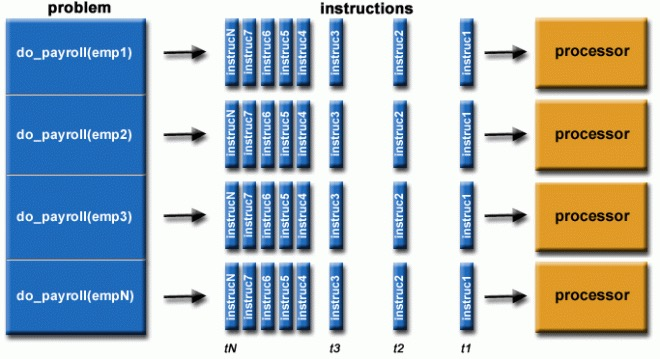

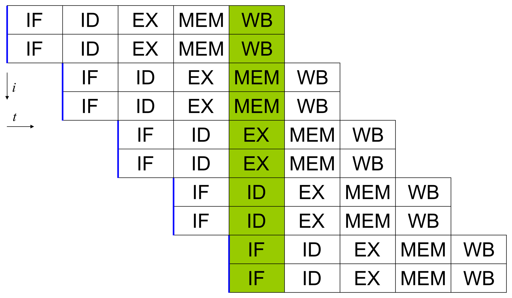

并行计算出现在各个尺度：处理器内部、多个处理器之间、不同设备之间，乃至一整个集群里都存在并行计算。

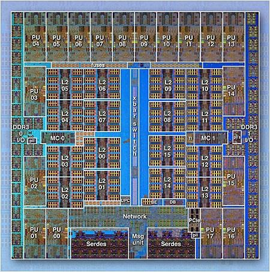

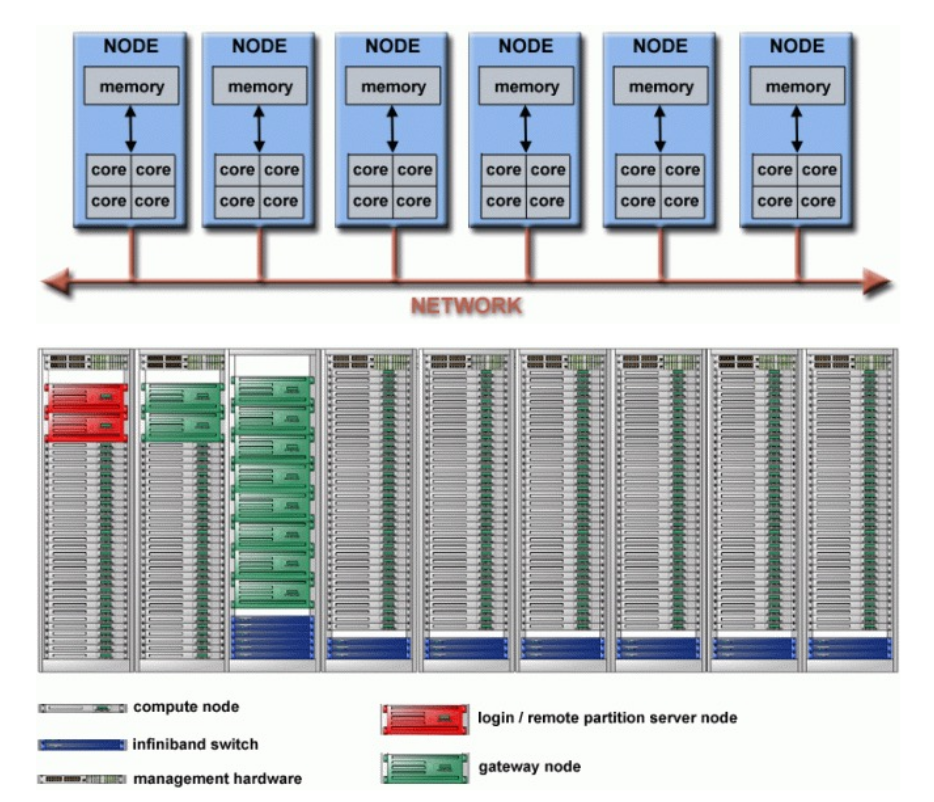

### 延迟与吞吐

影响并行计算的指标有**延迟（Latency）** 和**吞吐（Throughput）**：

- **延迟** 是一个计算单元的运算速度，即完成一次计算需要的时间，由计算单元设计、时钟频率、流水线深度以及内存层次等共同决定。延迟越低，每个计算单元的性能越强，每次计算算得越快。
- **吞吐** 表示单位时间内完成的计算量。当任务具有足够并行性且计算资源能被充分利用时，增加计算单元数量通常可以提高吞吐。

### 并行化与并行度

- **并行化（Parallelization）** 是把一个原本串行的问题改造成可以并行执行的形式，是一种方法或过程。
- **并行度（Degree of Parallelism, DOP）** 是某一时刻实际同时执行的任务数量，是一种指标。

在并行计算中，除了计算资源本身，**数据访问效率**同样重要。较高的数据局部性和缓存复用率能够减少内存访问开销，提高计算单元利用率，从而获得更高性能。

## 4. 从串行计算到并行计算：什么样的计算可并行

并不是所有计算都适合并行执行。一个计算过程能否并行，主要取决于：

### 4.1 数据依赖关系（Data Dependency）

判断不同计算之间是否存在输入/输出依赖关系。如果一个计算需要另一个计算的结果，则必须按顺序执行；如果多个计算只依赖已有输入，则可以同时执行。

下面第一段代码具有数据依赖，而第二段不具有——因而第二段代码的 `c`、`d`、`e` 可以并行计算得到，第一段则不可以。

```python
function Dep(a, b)
    c := a * b
    d := 3 * c      # 依赖 c，必须串行
    e := c + d      # 依赖 c、d，必须串行
end function

function NoDep(a, b)
    c := a * b      # 只依赖 a、b
    d := 3 * b      # 只依赖 b
    e := a + b      # 只依赖 a、b
    # c、d、e 三者互不依赖，可并行
end function
```

### 4.2 竞争、互斥与锁（Race, Mutual Exclusion & Lock）

多个任务访问共享资源时可能产生**竞争**，例如多个线程同时修改同一个变量，或多个任务同时写入同一块内存。这时需要通过**锁（Lock）**、**原子操作（Atomic Operation）** 和**同步机制（Synchronization）** 保证计算结果正确。

### 4.3 通信与同步（Communication & Synchronization）

并行任务之间通常需要交换数据或等待其他任务完成。如果通信量过大或同步等待时间过长，都会降低并行效率。高性能并行程序需要**尽量减少通信，提高计算与通信比例**。

## 5. 哪些计算需要并行

- **科学计算**：气候模拟、物理模拟、生物模拟……
- **矩阵计算、逐元素计算**：深度学习和人工智能。

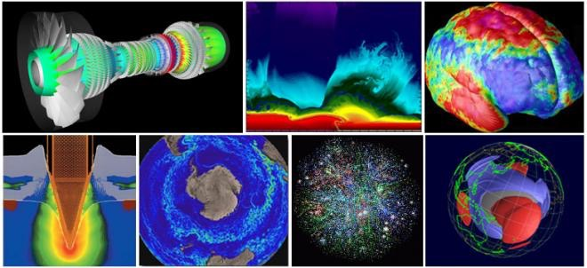

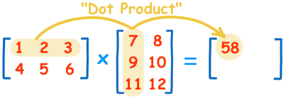

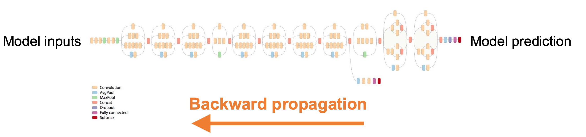


## 6. 如何将任务切分到不同计算单元

为了充分发挥并行计算的优势，我们需要**充分并行化、打满并行度**。为了利用多个计算单元，需要将原始任务进行合理划分。根据划分对象的不同，常见并行方式包括：

- **数据并行（Data Parallelism）**
- **模型并行（Model Parallelism）**
- **流水线并行（Pipeline Parallelism）**
- **张量并行（Tensor Parallelism）**

在实际的大规模 AI 模型训练中，通常会结合多种并行方式形成**混合并行（3D Parallelism）**。

### 6.1 数据并行（Data Parallelism）

将输入数据划分成多个子集，每个计算单元使用**相同的模型**处理不同的数据。

切分方式有两种：

- **域切分（Domain Decomposition）**：对一块任务数据有多种划分方式，不同切分方式对任务计算可能产生影响，需要根据任务类型、硬件特点等共同设计最佳方案。

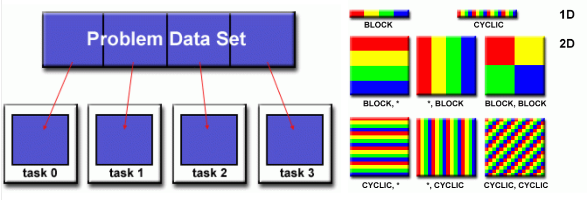

- **功能切分（Functional Decomposition）**：按功能将任务拆分，把相同类型的计算放到一起。

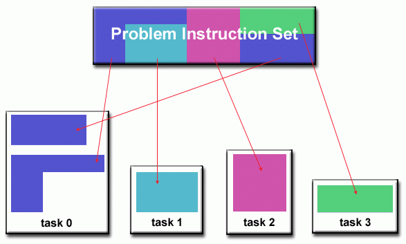

在 Transformer 中，我们将输入数据切分后输入不同的 GPU，在不同的 GPU 上进行一部分计算，从而实现数据并行化。

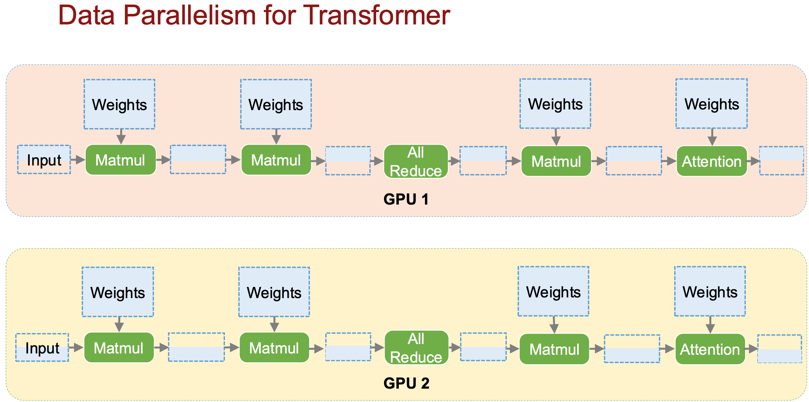

### 6.2 模型并行（Model Parallelism）

将一个模型拆分成多个部分，分别放到不同计算单元执行，不同 GPU 保存不同的模型参数。

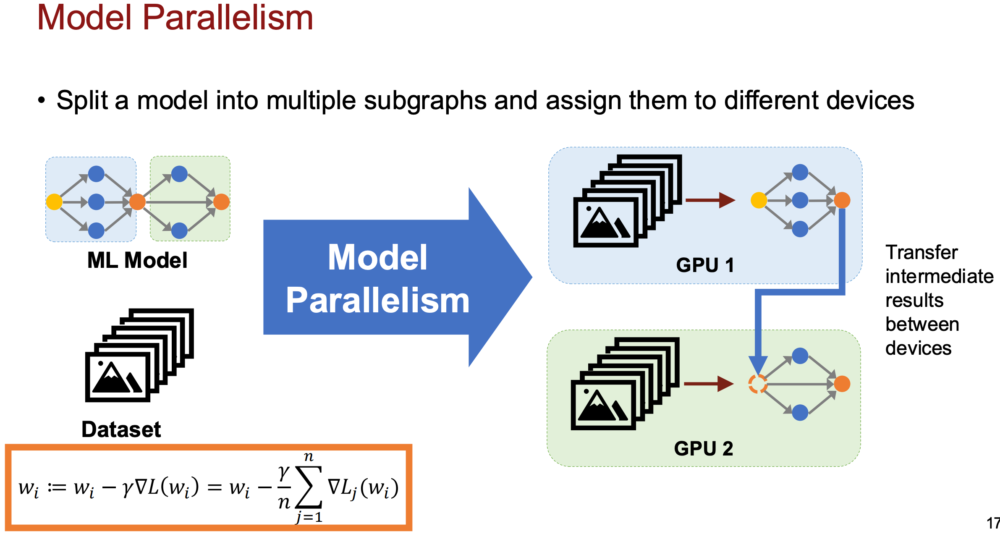

### 6.3 流水线并行（Pipeline Parallelism）

将模型按**阶段**划分，让不同计算单元负责不同阶段，并让多个输入同时流动。通过类似生产线的方式，避免 GPU 空闲，可以类比 CPU 中的**指令级并行**。

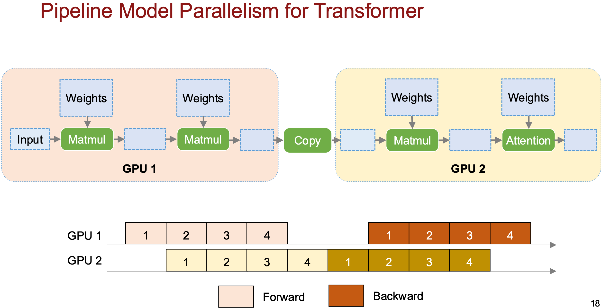

### 6.4 张量并行（Tensor Parallelism）

将**单个计算操作内部的数据**进行切分，让多个计算单元共同完成一次计算。张量并行的通讯频繁，要求 GPU 之间有高速互联。

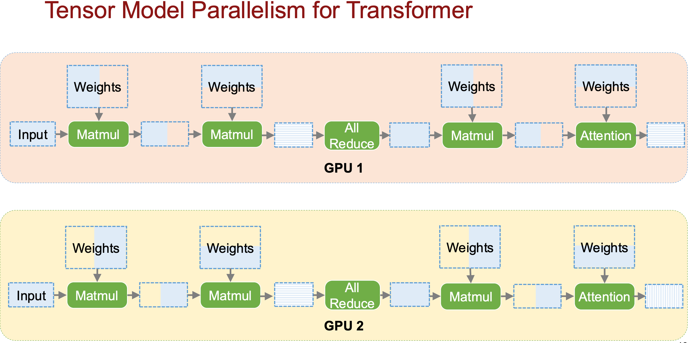

### 6.5 三维并行（3D Parallelism）

对于超大规模的模型训练，应对数据、模型和张量计算任务都进行切分，实现多种并行方式的组合。

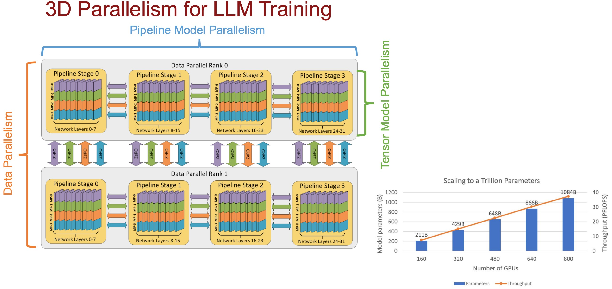

## 7. 并行计算机：如何实现并行计算

### 7.1 指令与数据的组织方式（by Flynn）

并行计算的核心问题是多个计算单元如何组织指令执行，以及如何处理数据。根据**指令流（Instruction Stream）** 和**数据流（Data Stream）** 的数量，Flynn 将计算机体系结构分为四类：

- **SISD**（Single Instruction Single Data）
- **SIMD**（Single Instruction Multiple Data）
- **MISD**（Multiple Instruction Single Data）
- **MIMD**（Multiple Instruction Multiple Data）

#### SISD：单指令单数据

传统串行计算模型。特点是一个处理单元、一条指令流、一组数据流。

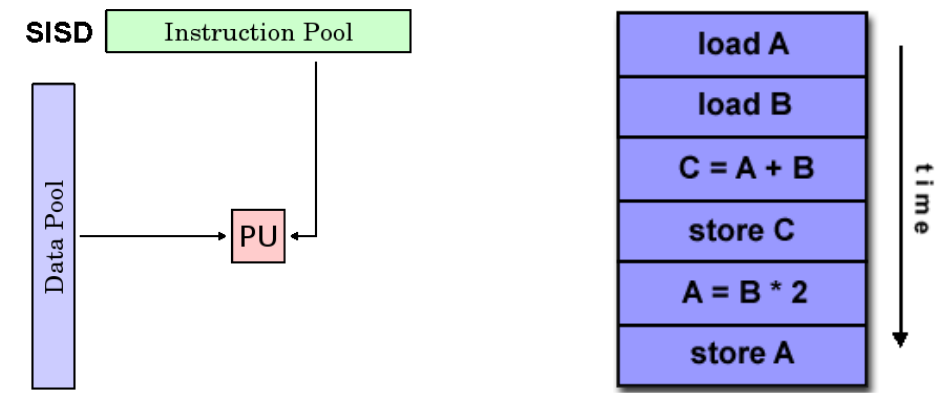

#### SIMD：单指令多数据

同一条指令同时作用于多个数据。例如数组计算中可以把多条相同操作合并成一条指令：

```c
c[0]=a[0]+b[0]
c[1]=a[1]+b[1]
c[2]=a[2]+b[2]
c[3]=a[3]+b[3]
```

被合并为：

```c
load a
load b
c = a + b
store c
```

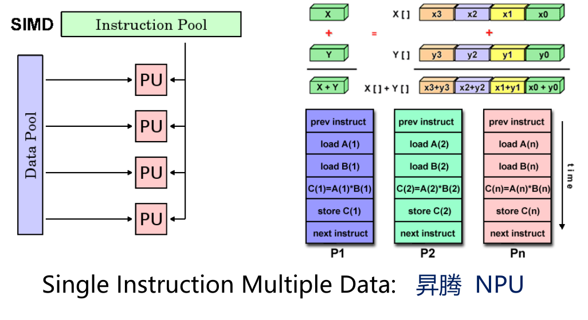

#### MISD：多指令单数据

多个计算单元对同一个数据执行不同操作。MISD 应用非常少，只有某些专用硬件使用。

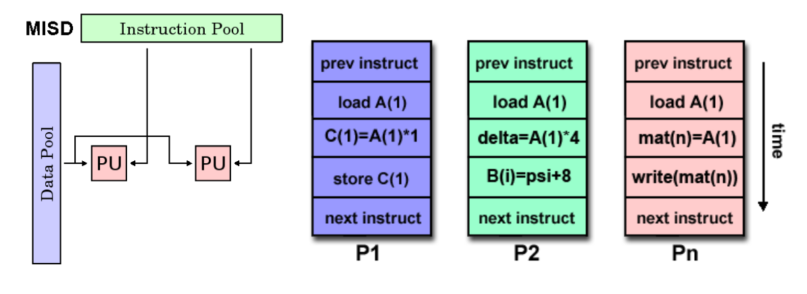

#### MIMD：多指令多数据

多个计算单元可以执行不同指令，同时处理不同数据，是现代并行计算最常见的模型，包括：

- 多核 CPU
- 多节点 HPC
- GPU（通常抽象为 MIMD + SIMT）

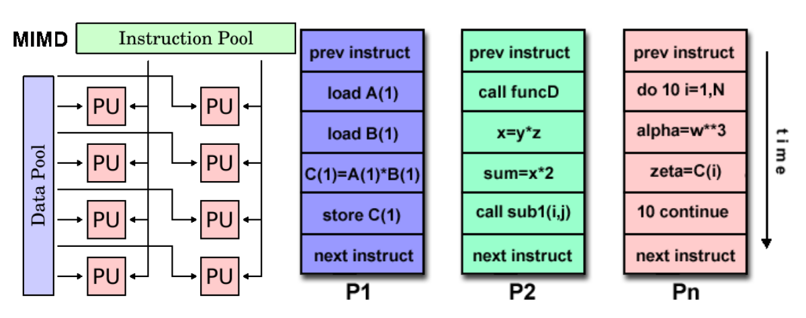

### 7.2 并行编程模型（by Programmers）

我们用计算机进行计算，用程序描述计算。要充分利用计算资源，需要通过编程模型合理描述并行任务。并行编程模型关注的问题是程序员如何将任务、数据以及计算过程映射到多个计算单元上。

常见的并行编程模型包括：

- **Shared Memory**（共享内存）/ Threads（线程模型）
- **Distributed Memory / Message Passing**（分布式内存 / 消息传递）
- **Data Parallel / Partitioned Global Address Space**（数据并行 / 全局地址空间划分）
- **Hybrid**（混合模型）
- **SPMD**（Single Program Multiple Data）
- **MPMD**（Multiple Program Multiple Data）

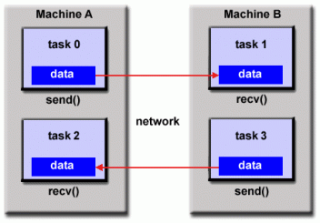

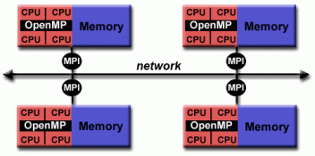

### 7.3 「SIMT」模型 & CUDA（by NVIDIA）

为了更好发挥硬件性能、充分配合硬件设计，我们既要考虑用程序描述好计算，也要考虑计算机进行计算的方式。GPU 编程是一种特殊的并行模型。

CUDA 使用 **SIMT（Single Instruction Multiple Threads）** 思想：程序员编写**线程级**程序，由 GPU 自动组织大量线程执行。

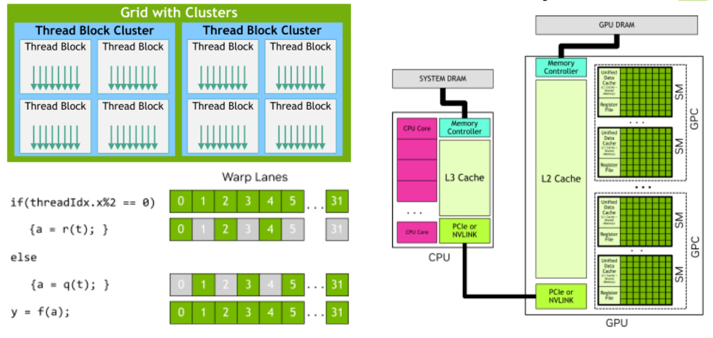

### 7.4 Tile 模型 & Block 编程（by DSLs）

随着 AI 加速需求增加，出现了更高层的编程抽象，例如 Triton 和 TileLang。与 CUDA thread-level 编程不同：**CUDA 关注线程，而 Tile 关注数据块（Tile）和计算块（Block）**。

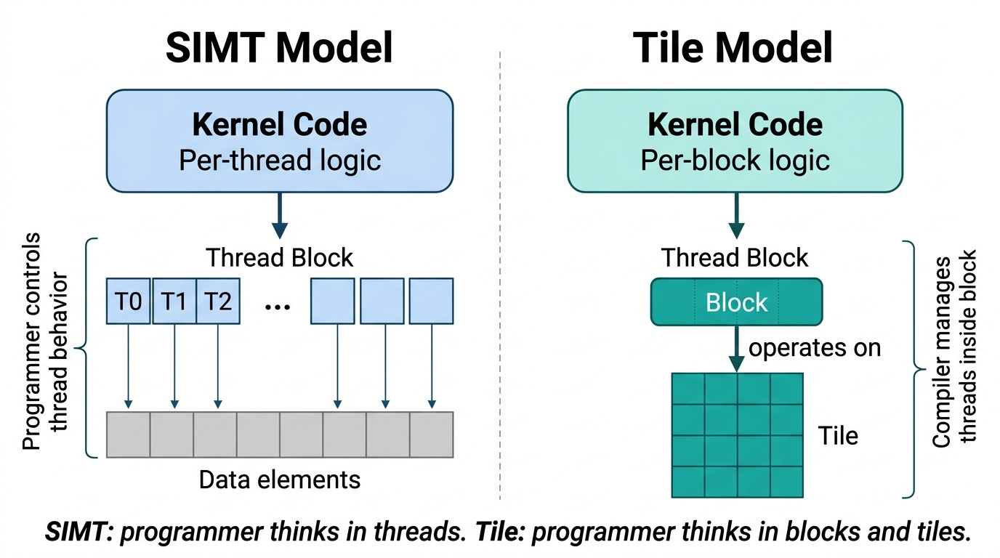

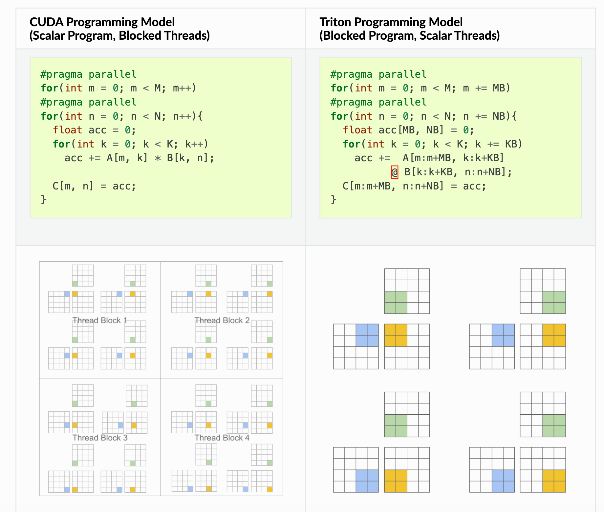

## 8. 不同层次的并行抽象

| 层次 | 关注问题 | 代表 |
|------|----------|------|
| 硬件层 | 如何执行指令和数据 | SIMD / SIMT / MIMD |
| 编程模型层 | 如何描述并行任务 | MPI / OpenMP / CUDA |
| 高级抽象层 | 如何表达计算结构 | Tile / Triton / DSL |

**第一性原理**：我们要用合适的抽象描述计算，使程序能够充分利用硬件并行能力，同时降低开发和优化成本。需要在学习过程中形成自己的认识和视角，这样才能灵活地把各种技术加以运用。

## 9. 结语：去研究有趣的并行计算

AI 中的并行计算涵盖以下方向，也是后续 AI Infra 系列文章的主题：

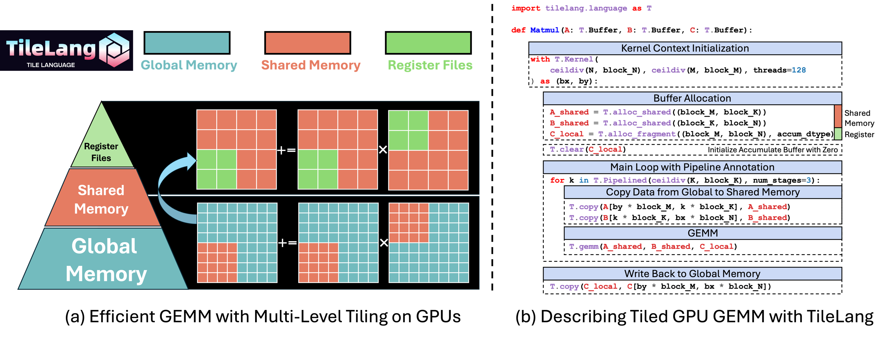

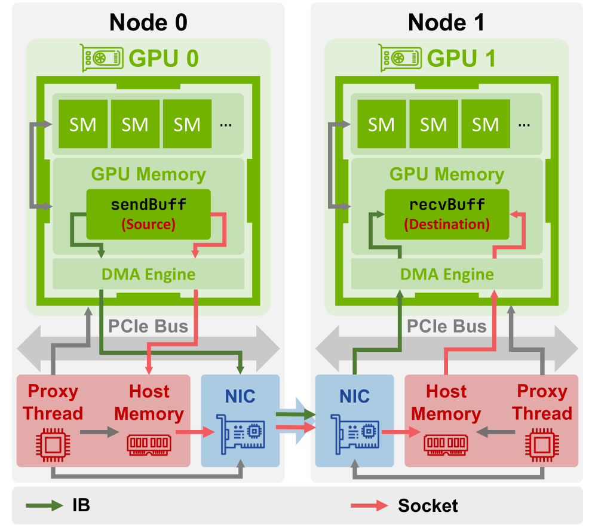

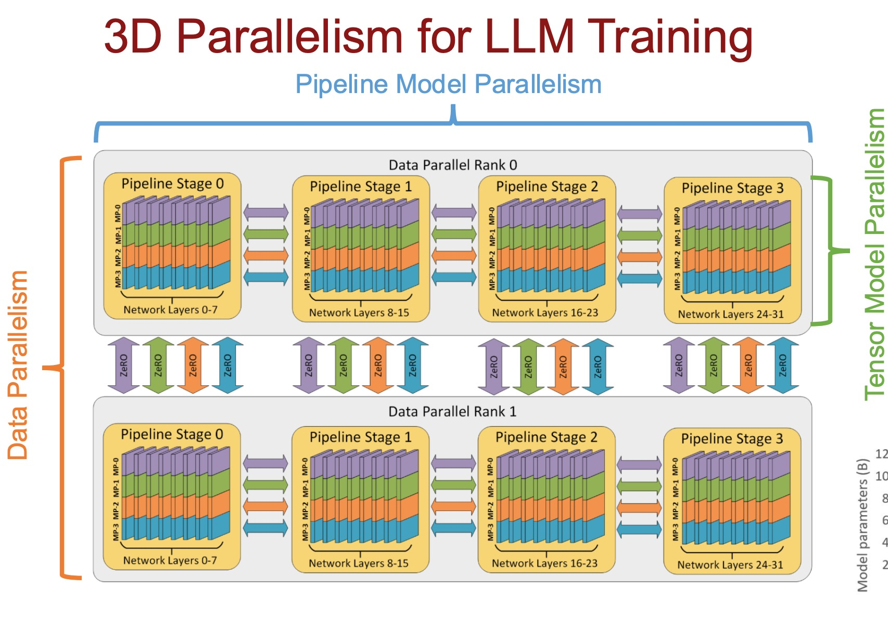

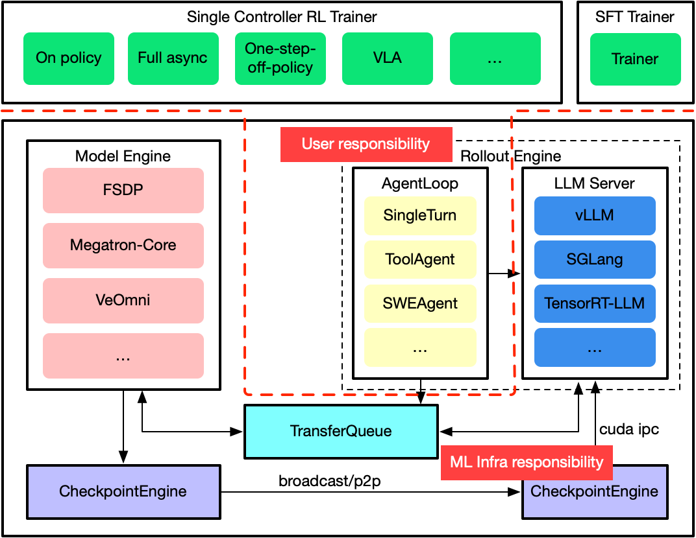


好了，去研究有趣的 AI Infra 吧！
