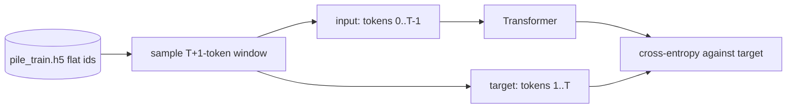

> **本章前置**:第 01 章(环境跑通)、第 02 章(向量/矩阵/张量、概率与对数)、第 03 章(PyTorch 张量与训练循环五件套)。
>
> **你将学到**:为什么模型只能处理数字;字符级、词级、子词三种分词粒度的取舍;把 **BPE(字节对编码)** 的"反复合并最高频相邻对"讲透并手工走一遍;本项目用的 `tiktoken` + `r50k_base` 怎么用;特殊 token `<|endoftext|>` 的作用;如何把一长串 token 切成定长窗口、凑成 `(B, T)` 的 batch;以及训练时输入 `x` 与标签 `y` 为什么要错开一位。
>
> 👈 [上一章:PyTorch 极简入门](/posts/ai_infra/train-llm-from-scratch/train-llm-scratch-03-pytorch-intro) ｜ [返回总览](/posts/ai_infra/train-llm-from-scratch/train-llm-scratch-overview)

---

上一章我们写了一个最小训练循环:准备数据 → 前向 → 算损失 → 反向 → 更新。但那时的"数据"是我们随手造的张量。现在要喂给模型的是**真实文本** —— 一篇维基百科、一段代码、一道数学题。问题来了:神经网络从头到尾只会做加减乘除矩阵运算,它根本不认识字母 `A`、汉字"猫"、标点 `!`。

所以在文本和模型之间,必须先架一座桥,把文字翻译成数字。这座桥叫 **分词器(tokenizer)**。本章就专门讲这座桥,以及过桥之后数据长什么"形状"。

## 4.1 为什么模型只能吃数字

回忆第 03 章:模型的一切运算,都发生在**张量**上 —— 张量就是一堆带形状的浮点数。`nn.Linear` 做的是矩阵乘法,注意力做的是点积,损失函数算的是对数和指数。这些运算的输入输出**只能是数字**。

可文本是离散的符号。"猫"和"狗"之间没有"大小关系",`A` 减 `B` 也没有意义。我们不能直接把字符的某种编码(比如它的 Unicode 码点)塞进矩阵乘法 —— 那样模型会以为"码点大的字更重要",纯属胡来。

正确的做法分两步:

1. **分词(tokenization)**:把一段文本切成一串**最小单位**,每个单位叫一个 **token(词元)**。再给词表里每个不同的 token 编一个整数编号,叫 **token id**。于是文本 → 一串整数 id。
2. **嵌入(embedding)**:在模型内部,把每个整数 id 查表换成一个**可学习的向量**(下一章第 05 章细讲)。这样"猫"和"狗"就各自有一个向量,它们的远近由训练自己学出来,而不是由编号大小决定。

本章只管第 1 步(切词 + 编号)。打个比方:token id 像图书馆里每本书的**索书号**,只是一个身份标签;嵌入向量才是书的**内容**。分词器负责发索书号,模型负责理解内容。

> 一句话:**分词器是语言和张量之间的边界**。它左边是人能读的文字,右边是模型能算的整数。

## 4.2 切多细?三种分词粒度

"把文本切成最小单位"听起来简单,但"最小单位"该多小,是个有讲究的取舍。我们用一句话 `unhappiness` 当例子,看三种切法。

### 字符级(character-level)

最小单位 = 单个字符。`unhappiness` → `u n h a p p i n e s s`,11 个 token。

- 优点:词表极小(英文几十个字母 + 标点就够),**任何**词都能拼出来,永远不会遇到"不认识的词"。
- 缺点:序列变得**很长**。一句话动辄几十上百个 token,模型要在很长的距离上才能拼出一个词的含义,既慢又难学。

### 词级(word-level)

最小单位 = 一个完整单词。`unhappiness` → `unhappiness`,1 个 token。

- 优点:序列很短,一个词就是一个 token,语义集中。
- 缺点:词表会**爆炸**。英文光常用词就几十万,再加上人名、拼写错误、代码标识符、URL、新造的网络词……词表根本装不下。更糟的是,一旦遇到词表里没有的词(比如一个没见过的人名),只能标成"未知"`<UNK>`,信息全丢了。

### 子词级(subword)—— 折中方案

最小单位 = **介于字符和单词之间的片段**。`unhappiness` 可能被切成 `un` + `h` + `appiness`(这正是后面 `r50k_base` 的真实切法)。

- 高频的完整词(像 `the`、`world`)往往是**单个** token;
- 罕见词、长词、生造词会被拆成几个**可复用的片段**;
- 词表大小可控(几万级),且**永远不会遇到完全无法表示的词** —— 实在不行还能退回到单个字符甚至单个字节。

子词分词同时拿到了"序列不太长"和"词表不太大"两个好处,所以现代大模型(GPT、LLaMA 等)清一色用子词分词。本项目也是。

| 粒度 | `unhappiness` 切成 | 词表大小 | 序列长度 | 未知词问题 |
|---|---|---|---|---|
| 字符级 | `u n h a p p i n e s s`(11) | 极小 | 很长 | 没有 |
| 词级 | `unhappiness`(1) | 爆炸(几十万+) | 很短 | 严重(`<UNK>`) |
| 子词级 | `un h appiness`(3) | 可控(几万) | 适中 | 基本没有 |

那子词词表是怎么造出来的?最经典的算法就是 **BPE**。

## 4.3 把 BPE(字节对编码)讲透

BPE 全称 **Byte Pair Encoding(字节对编码)**。它的思想出奇地简单,可以用一句话概括:

> **从最细的单位(字符)开始,反复地把"出现次数最多的相邻一对"合并成一个新单位,直到词表达到想要的大小。**

"高频的相邻对就合并",这就是全部秘密。高频的对合并多了,常见词自然就变成一个整 token,罕见词则保留成几块碎片。下面我们手工走一遍,你就彻底懂了。

### 手工小例子:一步步合并

假设我们的全部训练语料只有这几个词,各自出现的次数(频率)如下:

```
"low"      出现 5 次
"lower"    出现 2 次
"newest"   出现 6 次
"widest"   出现 3 次
```

**第 0 步:拆成字符。** 一开始,每个词都按单个字符拆开(我们用空格分隔,方便看清边界)。词表此刻就是所有出现过的字符:`l o w e r n s t i d`。

```
l o w         (×5)
l o w e r      (×2)
n e w e s t    (×6)
w i d e s t    (×3)
```

**第 1 步:数所有"相邻字符对"的总频率。** 注意要乘上每个词的出现次数。挑几个看:

- `e s`:出现在 `newest`(×6)和 `widest`(×3)里 → 共 `6 + 3 = 9` 次。
- `s t`:同样在 `newest`(×6)和 `widest`(×3)里 → 共 `9` 次。
- `l o`:在 `low`(×5)和 `lower`(×2)里 → 共 `7` 次。
- `o w`:在 `low`(×5)和 `lower`(×2)里 → 共 `7` 次。

最高频是 `e s`(9 次)。**合并它**,把 `e` `s` 变成一个新单位 `es`,加进词表:

```
l o w         (×5)
l o w e r      (×2)
n e w es t     (×6)
w i d es t     (×3)
```

**第 2 步:重新数。** 现在 `es t` 出现在 `newest`(×6)和 `widest`(×3)里 → `9` 次,是最高的。**合并** `es` + `t` → `est`:

```
l o w         (×5)
l o w e r      (×2)
n e w est      (×6)
w i d est      (×3)
```

**第 3 步:再数。** `l o`(7 次)和 `o w`(7 次)并列最高,按约定(比如先出现的)选 `l o`,**合并** → `lo`:

```
lo w          (×5)
lo w e r       (×2)
n e w est      (×6)
w i d est      (×3)
```

**第 4 步:** 现在 `lo w` 出现在 `low`(×5)和 `lower`(×2)里 → `7` 次,最高。**合并** `lo` + `w` → `low`:

```
low           (×5)
low e r        (×2)
n e w est      (×6)
w i d est      (×3)
```

看到了吗?短短四步,高频词 `low` 已经变成了**一个**完整 token,而它正是语料里最常见的词。如果我们继续合并下去,`newest`、`widest` 也会逐渐被拼成更大的块。**何时停?** 当词表大小达到我们预设的目标(比如本项目的约 5 万)就停。停下时手里这套"合并规则"就成了分词器:

- **编码**一段新文本时:先拆成字符,然后**按当初学到的合并顺序**,一条条把能合的相邻对合起来,最后剩下的每个单位查表换成 id。
- **解码**时:把每个 id 换回它代表的片段,拼起来即可。

这就是 BPE 的全部。它没有任何"理解语义"的成分 —— 纯粹是统计上"哪对最常一起出现就先抱团"。但效果出奇地好:常用词成整块,罕见词成碎片,词表不爆,未知词不丢。

> **"字节"对在哪?** 现代实现(包括本项目用的 `r50k_base`)合并的起点不是字符,而是**字节**(0~255)。好处是连 emoji、任意语言、二进制乱码都能用最多 256 个起始单位表示,真正做到"什么都能编码,绝不会遇到无法表示的输入"。思想和上面手工例子完全一样,只是起点从"字母"换成了"字节"。

## 4.4 本项目用的分词器:tiktoken 的 r50k_base

本项目**不自己训练分词器**,而是直接复用 OpenAI 为 GPT-2 训练好的那套 BPE 词表,通过 `tiktoken` 这个库调用。它的名字叫 **`r50k_base`**(GPT-2 系)。三个关键事实先记住:

- **词表大小约 50304**(模型侧把词表对齐到了 50304;`r50k_base` 本身能解码的普通 token 是 0~50255);
- 唯一的特殊 token 是 **`<|endoftext|>`**,它的 id 是 **50256**;
- 因为它没有为"对话角色"预留特殊 token,所以本项目后面做对话时,用的是**纯文本**角色标记(下一节会提到)。

在代码里取到这个分词器只要一行,本项目把它封装在 [`src/post_training/chat_template.py`](https://github.com/FareedKhan-dev/train-llm-from-scratch/blob/main/src/post_training/chat_template.py) 里:

```python
@lru_cache(maxsize=1)
def get_tokenizer() -> "tiktoken.Encoding":
    """Return the shared r50k_base encoder (cached so we build it once)."""
    return tiktoken.get_encoding("r50k_base")
```

> 旁注:`@lru_cache` 让这个函数只真正构建一次分词器,之后每次调用都返回同一个缓存对象 —— 因为加载词表有点开销,没必要重复做。

### 动手:编码一句话,看看 token 和 id

先装好 `tiktoken`(如果你跑过第 01 章的安装,通常已经有了;没有就 `pip install tiktoken`),然后打开 Python 交互环境敲:

```python
import tiktoken

enc = tiktoken.get_encoding("r50k_base")

text = "Tokenizers turn text into numbers."
ids = enc.encode(text)

print(ids)
print([enc.decode([i]) for i in ids])
```

真实输出是(我在本机用 `r50k_base` 跑过核对):

```
[30642, 11341, 1210, 2420, 656, 3146, 13]
['Token', 'izers', ' turn', ' text', ' into', ' numbers', '.']
```

一句 7 个 token 的话,逐个看几个有意思的点:

- `Tokenizers` 被拆成了 **两个** token:`Token` + `izers` —— 这就是子词:常见前缀 `Token` 单独成块,后缀 `izers` 另成一块。
- ` turn`、` text` 前面带一个**空格**!`r50k_base` 把"词 + 它前面的空格"一起编码,所以你看到的是 `' turn'` 而不是 `'turn'`。这是 GPT-2 系分词器的惯例,解码时空格会原样还回来,不用担心。
- 句号 `.` 是一个独立 token(id `13`)。

再看一个被拆碎的词,体会子词:

```python
>>> enc.encode("unhappiness")
[403, 71, 42661]
>>> [enc.decode([i]) for i in enc.encode("unhappiness")]
['un', 'h', 'appiness']
```

`unhappiness` 这种相对少见的长词,被拆成了 `un` + `h` + `appiness` 三块 —— 和我们 4.2 节预告的一致。

### 动手:编码 → 解码往返(round-trip)

分词器必须是**可逆**的:编码再解码,要能一字不差地还原原文。验证一下:

```python
text = "Tokenizers turn text into numbers."
ids = enc.encode(text)
back = enc.decode(ids)

print(back)
print(back == text)   # True
```

输出 `True`,说明 round-trip 成功。这一点至关重要:训练时我们把文本编码成 id 喂给模型;推理时模型吐出 id,我们再 `decode` 回文本给人看(第 09、17 章会用到)。中间任何一步丢了信息,生成结果就会乱码。

## 4.5 特殊 token `<|endoftext|>`:告诉模型"这里是边界"

想象你把整个互联网的文本一篇接一篇拼成一条**超长字符串**喂给模型。问题来了:模型怎么知道"上一篇文章讲到这结束了,下一篇是另一个完全无关的话题"?如果不告诉它边界,它可能会试图用上一篇的结尾去"预测"下一篇的开头 —— 这是噪声,会干扰学习。

解决办法是在每篇文档之间插一个**特殊 token** 当分隔符。在 `r50k_base` 里,这个 token 就是 `<|endoftext|>`(简称 **EOT**),id 固定为 **50256**。它有两个作用:

1. **文档边界**:预训练时,每篇文档结尾都追加一个 EOT,告诉模型"一段独立内容到此为止"。
2. **停止信号**:生成文本时,模型一旦自己输出了 EOT,就表示"我说完了",可以停下来(第 09、17 章的生成会用它当停止符)。

注意一个坑:`<|endoftext|>` 这串字符,默认情况下 `tiktoken` 会把它当**普通文本**编码(拆成好几个普通 token),而不是那个 id 50256 的特殊 token。要拿到真正的 EOT id,得显式允许:

```python
>>> enc.encode("<|endoftext|>", allowed_special={"<|endoftext|>"})
[50256]
```

正因为这个区别,本项目在分词正文内容时一律用 `encode_ordinary`(只当普通文本,绝不冒出特殊 token),需要 EOT 时**直接手写常量 `50256`**,干净利落。你在 `chat_template.py` 里能看到这个常量:

```python
# tiktoken r50k_base end-of-text id; the only true special token and our stop token.
EOT_ID = 50256
```

> **关于对话角色**:既然 `r50k_base` 只有 EOT 这一个特殊 token,本项目做指令对话时,就用纯文本标记 `<|user|>`、`<|assistant|>` 来区分谁在说话(它们只是普通字符串,会被当普通 token 编码),并复用 EOT 当每一轮的结束符。这部分逻辑就在 `chat_template.py`,等到第 12 章 SFT 我们再展开,这里知道有这么回事即可。

## 4.6 上下文窗口:把长 token 流切成定长样本

预训练数据预处理后长什么样?[`scripts/prepare_pretrain_data.py`](https://github.com/FareedKhan-dev/train-llm-from-scratch/blob/main/scripts/prepare_pretrain_data.py) 做的事是:流式读入大量文档,逐篇用 tiktoken 编码,每篇后面追加一个 EOT,把结果**首尾相接**写成一个**扁平的、超长的整数数组**,存进 HDF5 文件。核心循环就这几行(摘自该脚本):

```python
for ids in enc.encode_ordinary_batch(docs):
    buf.extend(ids)
    buf.append(EOT_ID)          # 50256 separates documents
    if len(buf) >= WRITE_CHUNK:
        flush()                 # append ~8M tokens to the HDF5 dataset at once
```

最终我们得到的就是一条长得不得了的 token 流,用公式写出来是:

$$
[\,d_1,\ \text{EOT},\ d_2,\ \text{EOT},\ \ldots,\ d_N,\ \text{EOT}\,]
$$

逐符号解释:$d_i$ 表示第 $i$ 篇文档编码后的那一小串 token id;每个 $d_i$ 后面都跟一个 $\text{EOT}$(就是 50256)当分隔;$N$ 是文档总数。所有这些拼起来就是磁盘上那个扁平数组。

但模型一次吃不下也不需要吃整条流 —— 它有一个固定的**上下文窗口长度** $T$(本项目默认 `context_length = 1024`,smoke 小配置里是 `256`)。所谓上下文窗口,就是模型一次最多能"看到"多少个 token。于是训练时,我们从那条长流里**随机切出**长度为 $T$ 的一小段当作一个**样本**。

用一个简化的例子(假设 $T = 4$,token 流是 `[5, 8, 2, 9, 7, 1, 3, ...]`):随机选个起点,切 4 个连续 token,比如 `[8, 2, 9, 7]`,这就是一个样本。下次再随机切一段。窗口可以从流的任意位置开始,所以同一份数据能切出极多不同的样本。

> 为什么随机切而不是规规整整切?随机起点让模型见到更多样的上下文组合,训练更充分。具体的切窗逻辑(以及为什么实际切的是 $T+1$ 个 token),下面 4.8 节和第 10 章会讲清楚。

## 4.7 batch 形状 (B, T):一次喂一摞样本

一次只训练一个样本太慢、太抖。回忆第 03 章:我们把多个样本堆成一个 **batch(批)**,一起做前向和反向,既快又稳。

把 $B$ 个长度都为 $T$ 的样本摞起来,就得到一个形状为 $(B, T)$ 的整数张量 —— 这就是喂进模型的 `x`:

$$
x \in \mathbb{Z}^{B \times T}
$$

逐符号:$B$(batch size)是这一摞里有几个样本,$T$ 是每个样本的 token 长度,张量里每个元素都是一个 token id(整数)。比如 $B=2, T=4$:

```
x = [[8, 2, 9, 7],     # 样本 1
     [1, 3, 6, 4]]     # 样本 2
形状 = (2, 4)
```

这个 $(B, T)$ 就是贯穿后面所有章节的输入形状。记住这两个字母:$B$ = 这批有几条,$T$ = 每条多长。(还有第三个字母 $C$ = 嵌入向量的宽度,下一章一进模型就会冒出来,把 $(B, T)$ 变成 $(B, T, C)$。)

## 4.8 输入 x 与标签 y:为什么要错开一位

最后一块拼图,也是整个语言模型训练的**核心机关**。

预训练的任务非常朴素,叫"**预测下一个 token**":给模型看前面一串 token,让它猜下一个该是什么。这就是 4.1 节那个公式 $p_\theta(x_t \mid x_{<t})$ 想表达的 —— 在已知前面所有 token 的条件下,预测当前 token 的概率。

那"正确答案"(标签 `y`)从哪来?**就是输入自己,整体往后挪一位**。听起来神奇,其实顺理成章:对于位置 $t$ 的输入 token,它的"下一个 token"正是位置 $t+1$ 的那个 token —— 而那个 token 也在我们的序列里!所以标签根本不用额外标注,把序列错开一位就免费得到了。这叫**自监督**。

具体怎么做:从 token 流里切窗时,我们故意多切**一个** token,切出长度 $T+1$ 的一段,然后:

- **输入 `x`** = 前 $T$ 个 token;
- **标签 `y`** = 后 $T$ 个 token(也就是把 `x` 往左/往后挪一位)。

用公式:

$$
x = [\,t_0,\ t_1,\ \ldots,\ t_{T-1}\,]
$$

$$
y = [\,t_1,\ t_2,\ \ldots,\ t_{T}\,]
$$

逐符号:$t_i$ 是窗口里第 $i$ 个 token。`x` 取下标 0 到 $T-1$,`y` 取下标 1 到 $T$ —— 同一段 token,一个从头取、一个从第二个取,正好**错开一位**。

含义一目了然:在每个位置 $i$,模型看着 $x_i$(及它前面的所有 token),要去预测 $y_i = x_{i+1}$,也就是"下一个"。一个窗口里有 $T$ 个位置,就同时产生了 $T$ 个"预测下一个"的训练信号 —— 效率极高。

举个最小例子,窗口 `[The, cat, sat, down]`($T=3$,实际是 id,这里用词演示):

```
位置:    0      1      2
x  =   [The,   cat,   sat ]      # 输入
y  =   [cat,   sat,   down]      # 标签(x 整体后移一位)
       ↑看The  ↑看The cat ↑看The cat sat
       预测cat 预测sat    预测down
```

参考文档里这张图把这条数据流画得很清楚:



那"模型预测得准不准"怎么量化、怎么变成一个能反向传播的损失?那就是 `F.cross_entropy`(交叉熵)的活儿 —— 这是第 07 章的主角。这里你只要牢牢记住这个**错位一位**的关系:它是连接"数据"和"训练目标"的关键。

> **一个常见的坑**:如果忘了错位,直接拿 `x` 当标签去预测 `x` 自己,模型会学会一件没用的事 —— "把输入原样抄出来"(因为它能看到当前 token,抄它就行),loss 会迅速降到接近 0,但模型什么也没学会。参考文档把这列为"目标未偏移"错误,预防方法就是始终用 `tokens[:, :-1]` 预测 `tokens[:, 1:]`。

## 小结

- 神经网络只会算数字,所以文本必须先经**分词器**变成整数 token id;id 只是身份标签,真正的"含义"靠下一章的嵌入向量学出来。
- 分词粒度三选一:字符级(词表小但序列长)、词级(序列短但词表爆、有未知词)、**子词级**(折中,现代大模型的选择)。
- **BPE** 从字符/字节出发,**反复合并最高频的相邻对**,直到词表达到目标大小;高频词自然合成整块,罕见词留成碎片。
- 本项目用 `tiktoken` 的 **`r50k_base`**(GPT-2 系),`enc = tiktoken.get_encoding("r50k_base")`;词表约 50304,唯一特殊 token `<|endoftext|>`(id **50256**),正文用 `encode_ordinary`,需要 EOT 时直接写常量。
- 预处理把所有文档编码后**首尾相接成一条扁平 token 流**,文档之间用 EOT 分隔;训练时从中**随机切出长度 $T$ 的窗口**,堆成 $(B, T)$ 的 batch。
- 训练任务是"**预测下一个 token**":切 $T+1$ 个 token,输入 `x` 取前 $T$ 个、标签 `y` 取后 $T$ 个,**错开一位**,于是标签免费来自数据本身(自监督)。

## 自测题

1. 为什么不能直接把字符的 Unicode 码点当数字喂给模型?分词 + 嵌入这两步分别解决了什么问题?
2. 词级分词的两大缺点是什么?子词分词如何同时缓解这两点?
3. 手工 BPE 题:语料是 `"aa"`(×3)、`"ab"`(×2)。第一步拆成字符后,统计所有相邻对的频率,指出**第一个会被合并**的对是哪个、合并后各词变成什么样。
4. 在 `r50k_base` 里,直接 `enc.encode("<|endoftext|>")` 和 `enc.encode("<|endoftext|>", allowed_special={"<|endoftext|>"})` 结果会不同。为什么?本项目正文分词为什么坚持用 `encode_ordinary`?
5. 给定窗口 token 流 `[12, 5, 9, 7, 3]`,$T=4$。写出训练用的输入 `x` 和标签 `y`。如果忘了错位、直接拿 `x` 当标签,模型会学到什么没用的"捷径"?

<details>
<summary>参考答案要点</summary>

1. 码点大小没有语义(码点大不代表"更重要"),直接当数字会让矩阵运算引入虚假的大小关系。分词解决"把文本切成离散单位并编号";嵌入解决"把离散 id 变成可学习、能表达语义远近的向量"。
2. 缺点:词表爆炸(几十万+)、遇到没见过的词只能标 `<UNK>` 丢信息。子词把高频词留成整 token、罕见/生造词拆成可复用片段,词表可控且几乎不会出现无法表示的词。
3. 拆字符后:`a a`(×3)、`a b`(×2)。相邻对统计:`a a` 共 3 次,`a b` 共 2 次。最高频是 `a a`,先合并 → `aa`(×3)保持一个块,`ab` 仍是 `a b`(×2)。
4. 默认情况下 `tiktoken` 把 `<|endoftext|>` 这串字符当普通文本拆成多个普通 token;加 `allowed_special` 才会把它识别成 id 50256 的特殊 token。正文用 `encode_ordinary` 是为了保证用户文本里即使出现 `<|endoftext|>` 字样也绝不会被误当成真正的边界标记,边界由代码显式插入常量 50256 控制,更安全。
5. $x = [12, 5, 9, 7]$,$y = [5, 9, 7, 3]$(后移一位)。若不错位,模型会学到"把当前输入 token 原样复制成输出"这个捷径 —— loss 看着降得很快,实则什么也没学会。

</details>

## 深入参考

- 工程速查:[`docs/zh/foundations/tokenization_zh.md`](https://github.com/FareedKhan-dev/train-llm-from-scratch/blob/main/docs/zh/foundations/tokenization_zh.md) —— 本章的精炼版,并预告了 SFT 的损失掩码、偏好数据、RL prompt 等更多数据形状。
- 数据流水线全貌:[`docs/zh/01_data_pipeline_zh.md`](https://github.com/FareedKhan-dev/train-llm-from-scratch/blob/main/docs/zh/01_data_pipeline_zh.md) —— 四条数据流水线(预训练/SFT/偏好/RL)分别长什么样。
- 源码:分词与对话模板 [`src/post_training/chat_template.py`](https://github.com/FareedKhan-dev/train-llm-from-scratch/blob/main/src/post_training/chat_template.py);预训练数据预处理 [`scripts/prepare_pretrain_data.py`](https://github.com/FareedKhan-dev/train-llm-from-scratch/blob/main/scripts/prepare_pretrain_data.py)。
- `tiktoken` 官方仓库:<https://github.com/openai/tiktoken>。

切窗、堆 batch、错位标签的更完整实现,会在 [第 10 章:数据流水线](/posts/ai_infra/train-llm-from-scratch/train-llm-scratch-10-data-pipeline) 动手跑通。

下一章 👉 [第 05 章:解码器 Transformer 骨架](/posts/ai_infra/train-llm-from-scratch/train-llm-scratch-05-transformer),我们把这串 token id 真正送进模型,看它如何变成嵌入向量、流过一层层 Block、最后吐出对"下一个 token"的预测。
