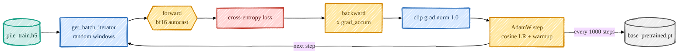

> **本章前置**:第 03 章(`nn.Module`、`nn.Linear`、`nn.Embedding`、张量形状)、第 04 章(token id、`(B, T)` 的 batch、错位标签)。
>
> **你将学到**:"decoder-only / 自回归"到底什么意思;一条 token id 从输入到 logits 的**完整数据流**(配形状标注),以及本仓库 `transformer.py` 里真实的层定义;为什么要加位置嵌入;Transformer Block 的 **pre-norm 残差**结构和 **LayerNorm** 公式;Block 里的 **MLP**;logits 经 softmax 得到下一个 token 分布;以及怎么**估算参数量**(每个 block ≈ $12C^2$)。注意力的内部细节留到第 06 章,本章只点明它的角色。
>
> 👈 [上一章:分词与数据形状](/posts/ai_infra/train-llm-from-scratch/train-llm-scratch-04-tokenization) ｜ [返回总览](/posts/ai_infra/train-llm-from-scratch/train-llm-scratch-overview)

---

第 04 章我们把文本变成了一摞 token id,形状 $(B, T)$。本章就来拆开模型这个"黑箱",看这摞整数是怎么一步步流过网络、最后变成"下一个 token 是谁"的预测的。

好消息是:这个模型并不神秘。它就是第 03 章那种 `nn.Module` 的**堆叠**——嵌入层、若干个结构相同的 Block、一个归一化、一个线性输出层。读完本章,你会发现 `src/models/transformer.py` 整个文件你都能逐行看懂。



## 5.1 "decoder-only / 自回归"是什么意思

你可能听过 Transformer 有"编码器(encoder)"和"解码器(decoder)"两半。本项目(以及 GPT 系列)只用**解码器那一半**,所以叫 **decoder-only(仅含解码器)**。它的三条规矩是:

- 模型读入**单一**的一串 token 序列(不像翻译模型那样分"原文/译文"两路);
- 每个位置**只能看它自己和它前面**的 token,**看不到后面**的(这叫"因果",causal);
- 每个位置的输出,是对"**这个位置的下一个 token**"的一个预测。

为什么要"只能看前面"?因为我们干的是第 04 章那个"预测下一个 token"的任务。如果在预测第 5 个 token 时让模型偷看到第 6、7 个 token,那它直接抄答案就行了,等于作弊。"因果"约束保证了训练时每个位置都只能靠**历史**去猜**未来**,这正是真实生成时的处境。

**自回归(autoregressive)**就是这个意思:生成时,模型先根据已有的 token 预测下一个,把这个新 token 接到序列末尾,再用更长的序列预测再下一个……如此一个接一个地"自己回头吃自己刚生成的输出"。用一个概率式子概括模型在学的东西:

$$
p_\theta(x_t \mid x_{<t})
$$

逐符号解释:$x_t$ 是第 $t$ 个位置的 token,$x_{<t}$ 是它**前面所有**的 token,$p_\theta$ 是带参数 $\theta$(模型全部权重)的概率。整句话读作:"在给定前面所有 token 的条件下,模型给出第 $t$ 个 token 的概率分布。"训练就是不断调 $\theta$,让这个分布在真实数据上尽可能准。

## 5.2 完整前向数据流(带形状标注)

先看全景,再逐站细讲。一条 batch 从进到出,经过这几站(右边是该站之后的张量形状,符号沿用第 04 章:$B$=batch,$T$=序列长,$C$=嵌入宽度 `n_embed`,$V$=词表大小):

```
token ids                 (B, T)        ← 第 04 章的输出,整数
  │  查 token 嵌入表 + 加位置嵌入
  ▼
h⁰ = 嵌入                 (B, T, C)      ← 每个 id 变成一个 C 维向量
  │  第 1 个 Block
  ▼  ... 共 N 个 Block(每个都是 attention + MLP)
hᴺ                        (B, T, C)      ← 形状全程不变!
  │  末尾 LayerNorm
  ▼
归一化后的隐藏状态         (B, T, C)
  │  lm_head:Linear(C → V)
  ▼
logits                    (B, T, V)      ← 每个位置,对词表每个 token 打一个分
```

请记住一个关键直觉:**从嵌入到最后一个 Block,张量形状始终是 $(B, T, C)$,一路不变**。Block 不改变形状,它只是不断"提炼"这 $B \times T$ 个向量里的信息。直到最后 `lm_head` 才把宽度从 $C$ 投影到 $V$,变成对每个 token 的打分。

本仓库 [`src/models/transformer.py`](https://github.com/FareedKhan-dev/train-llm-from-scratch/blob/main/src/models/transformer.py) 的 `__init__` 里,把上面这些站点一字排开定义出来,真实代码如下:

```python
self.token_embed = nn.Embedding(vocab_size, n_embed)
self.position_embed = nn.Embedding(context_length, n_embed)
self.attn_blocks = nn.ModuleList([Block(n_head, n_embed, context_length) for _ in range(N_BLOCKS)])
self.layer_norm = nn.LayerNorm(n_embed)
self.lm_head = nn.Linear(n_embed, vocab_size)
self.register_buffer('pos_idxs', torch.arange(context_length))
```

逐个对上:`token_embed` 是 token 嵌入表,`position_embed` 是位置嵌入表,`attn_blocks` 是 $N$ 个 Block(`N_BLOCKS` 个,用 `nn.ModuleList` 装起来),`layer_norm` 是末尾那次归一化,`lm_head` 是把 $C$ 投到 $V$ 的输出线性层。最后那行 `pos_idxs` 是预先存好的位置编号 `[0, 1, 2, ..., context_length-1]`,下一节就会用到。

对应的 `forward` 也很短(本仓库把"算隐藏状态"抽成了 `forward_hidden`,方便后训练复用,逻辑上等价):

```python
def forward(self, idx, targets=None):
    x = self.forward_hidden(idx)      # 嵌入 → N 个 Block → 末尾 LayerNorm,得 (B, T, C)
    logits = self.lm_head(x)          # (B, T, V)
    loss = None
    if targets is not None:
        B, T, C = logits.shape
        flat_logits = logits.reshape(B * T, C)
        targets = targets.reshape(B * T).long()
        loss = F.cross_entropy(flat_logits, targets)
    return logits, loss
```

注意 `forward` 可选地接收 `targets`(就是第 04 章那个错位的标签 `y`):传了就顺手算交叉熵 `loss`,不传就只返回 `logits`(生成时用)。交叉熵是第 07 章的主角,本章先放着。下面我们一站一站把数据流走完。

## 5.3 嵌入与位置嵌入

### token 嵌入:把 id 换成可学习的向量

第 04 章说过,token id 只是个身份标签,数值大小没有意义。要让模型能算,得把每个 id 换成一个**向量**——这就是嵌入(embedding)。

`nn.Embedding(vocab_size, n_embed)` 本质是一张**查找表**:一个 $V \times C$ 的矩阵,第 $i$ 行就是 id 为 $i$ 的 token 的向量。用数学写,这张表是:

$$
E_{\text{tok}} \in \mathbb{R}^{V \times C}
$$

$V$ 行(词表里每个 token 一行)、每行 $C$ 个数(向量宽度)。给一个 token id $x_t$,它的向量就是查表取第 $x_t$ 行:

$$
e_t = E_{\text{tok}}[x_t]
$$

关键是:**这张表里的数全是可训练参数**。训练前是随机的,训练后,意思相近的 token(比如 "cat" 和 "dog")的向量会被学得彼此靠近。这就是第 04 章埋的伏笔——"含义"在这里学出来。

### 位置嵌入:为什么必须告诉模型"顺序"

这里有个微妙但极重要的问题。下一章你会看到,注意力对输入的**顺序不敏感**——术语叫**置换等变(permutation-equivariant)**。直白说:如果你把句子里的词打乱顺序,光靠注意力,模型算出来的东西会跟着一起打乱,但它**分不清**"猫追狗"和"狗追猫"——因为这两句用到的 token 完全一样,只是顺序不同,而注意力本身不看顺序。

可顺序明明是语言的命根子!"猫追狗"和"狗追猫"意思天差地别。怎么办?**把位置信息也编码成向量,加到 token 向量上**。本仓库再建一张可学习的表,专门存"第 0 个位置长啥样、第 1 个位置长啥样……":

$$
E_{\text{pos}} \in \mathbb{R}^{T_{\max} \times C}
$$

$T_{\max}$ 是最大上下文长度(`context_length`),每个位置一行、宽度也是 $C$。于是,送进第一个 Block 的向量,是 **token 嵌入 + 位置嵌入** 的逐元素相加:

$$
h_t^{(0)} = E_{\text{tok}}[x_t] + E_{\text{pos}}[t]
$$

逐符号:$h_t^{(0)}$ 是第 $t$ 个位置、进入第 0 层(还没过任何 Block)的向量;$E_{\text{tok}}[x_t]$ 是这个位置 token 的内容向量;$E_{\text{pos}}[t]$ 是"它排在第 $t$ 位"这件事的向量。两者一加,模型既知道"是什么词",又知道"它在第几位"。

本仓库 `_pre_attn_pass` 把这一步实现得和公式一模一样:

```python
B, T = idx.shape
tok_embedding = self.token_embed(idx)            # (B, T, C)
pos_embedding = self.position_embed(self.pos_idxs[:T])   # (T, C)
return tok_embedding + pos_embedding             # 广播相加 → (B, T, C)
```

`self.pos_idxs[:T]` 取出 `[0, 1, ..., T-1]` 这 $T$ 个位置编号,查位置表得到 $(T, C)$;它和 $(B, T, C)$ 的 token 嵌入相加时,PyTorch 自动**广播**(每个样本都加同一套位置向量)。加完,形状 $(B, T, C)$,正式进入 Block 流水线。

> 旁注:本仓库用的是"绝对、可学习"的位置嵌入(最简单、最好懂)。生产级模型常用 RoPE、ALiBi 等更高级的方案,但思想都是一样的——想办法把"第几位"这个信息注入模型。

## 5.4 Transformer Block:pre-norm 残差结构

现在到了模型的主体:$N$ 个**结构完全相同**的 Block 串成一条流水线。本仓库默认 $N = 24$(`n_blocks`),smoke 小配置是 `2`。每个 Block 内部做两件事,各配一个"残差 + 归一化"的外壳。

看 [`src/models/transformer_block.py`](https://github.com/FareedKhan-dev/train-llm-from-scratch/blob/main/src/models/transformer_block.py) 里 `forward` 的真实代码,只有两行:

```python
x = x + self.attn(self.ln1(x))
x = x + self.mlp(self.ln2(x))
```

用数学写出来($x$ 是进 Block 的向量,$u$ 是中间结果,$y$ 是出 Block 的向量):

$$
u = x + \mathrm{MHA}(\mathrm{LN}(x))
$$

$$
y = u + \mathrm{MLP}(\mathrm{LN}(u))
$$

逐符号读:第一行,先对 $x$ 做 LayerNorm(`ln1`),送进多头注意力 $\mathrm{MHA}$(`attn`),再把结果**加回** $x$ 本身,得到 $u$。第二行,对 $u$ 做 LayerNorm(`ln2`),送进 MLP,再加回 $u$,得到这个 Block 的输出 $y$。

这里有两个值得拆开讲的设计:**残差**(那个"加回去")和 **LayerNorm**(那个归一化),以及它们的摆放顺序("pre-norm")。

### 残差连接:为什么深层网络才能训得动

注意公式里那个 `x +` ——这叫**残差连接(residual connection)**。它的意思是:子层(注意力或 MLP)不直接**替换**输入,而是计算一个**增量**,加到原输入上:

$$
y = x + f(x)
$$

$f(x)$ 是子层算出的"该怎么修改 $x$"。为什么这么重要?两个角度:

1. **信息高速路**:如果某一层暂时"没想好怎么改",它可以让 $f(x) \approx 0$,于是 $y \approx x$,信息**原封不动穿过去**。这意味着堆很多层也不会把原始信号搅乱——多出来的层"不帮忙至少也不添乱"。
2. **梯度直通**:回忆第 02、03 章的反向传播,梯度要从最后一层一路传回第一层。在 $y = x + f(x)$ 里,因为有那个 `+ x`,梯度有一条**经过加法的笔直通路**直接回流,不会在几十层里被反复相乘而衰减到 0(所谓"梯度消失")。**没有残差,几十层深的网络几乎训不动;有了残差,才敢往深里堆。**

### LayerNorm:为什么放在子层之前(pre-norm)

`LN(x)` 是 **LayerNorm(层归一化)**。它对**每一个 token 向量**,沿着它自己那 $C$ 个特征做归一化——把这 $C$ 个数拉成"均值 0、方差 1",再用可学习的缩放和平移调回来。完整公式:

$$
\mathrm{LN}(x) = \gamma \odot \frac{x - \mu}{\sqrt{\sigma^2 + \epsilon}} + \beta
$$

其中,对一个 token 向量 $x \in \mathbb{R}^{C}$,均值和方差是这样算的:

$$
\mu = \frac{1}{C} \sum_{i=1}^{C} x_i
$$

$$
\sigma^2 = \frac{1}{C} \sum_{i=1}^{C} (x_i - \mu)^2
$$

逐符号拆解:
- $\mu$:把这个向量的 $C$ 个分量加起来除以 $C$,就是**平均值**;
- $\sigma^2$:每个分量减去均值、平方、再求平均,就是**方差**(衡量这些数有多分散);
- $\frac{x - \mu}{\sqrt{\sigma^2 + \epsilon}}$:把向量减去均值再除以标准差,得到一个均值 0、方差 1 的"标准化"向量;$\epsilon$ 是个很小的数(防止除以 0);
- $\gamma$(gamma)和 $\beta$(beta):两个**可学习**的向量,$\odot$ 是逐元素相乘。它们让模型可以在归一化之后,再把每个特征**缩放**($\gamma$)和**平移**($\beta$)到它觉得合适的尺度——归一化不是死板地强行标准化,而是给训练留了调整余地。

**为什么要归一化?** 不归一化的话,向量流过几十层后,数值可能越滚越大或越缩越小,导致训练不稳定(梯度爆炸/消失)。LayerNorm 在每个子层前把尺度"拉回正常",让深层堆叠平稳。

**为什么放在子层"之前"(pre-norm)?** 看公式 $u = x + \mathrm{MHA}(\mathrm{LN}(x))$:归一化只作用在送进注意力的那一路 `LN(x)` 上,而残差那一路 `x` 是**未经归一化的原始值**。这样残差高速路始终保持"干净直通",梯度回流更顺,深层 GPT 类模型更好训。(与之相对的是 "post-norm":先子层再归一化,本仓库没用。)记住摆放顺序就是代码里那个 `x + self.attn(self.ln1(x))`——`ln1` 套在 `attn` 里面,加号外面是干净的 `x`。

### Block 里两个子层各管什么

一个 Block = 注意力子层 + MLP 子层。它俩分工明确:

- **注意力(attention)负责 token 之间的"通信"**:让每个位置去"看"序列里其他位置(只能看前面),按需汲取信息。比如代词 "it" 去注意前文的 "the cat",搞清自己指代谁。**它怎么实现的,是第 06 章的全部内容**,本章只把它当黑箱。
- **MLP 负责"逐 token 的计算"**:注意力汇集完信息后,MLP 对**每个位置独立地**做一次非线性变换,进一步加工这个位置的向量。它不看别的位置,只埋头加工自己。

一句话:**注意力让 token 互相说话,MLP 让每个 token 各自思考。** 这两步交替 $N$ 次,信息就被反复地"汇集—加工—再汇集—再加工",模型的表达能力随深度增长。

## 5.5 MLP:C → 4C → C 的前馈网络

把 MLP 这个子层单独拎出来看,它就是第 03 章学过的最朴素的两层全连接网络。本仓库 [`src/models/mlp.py`](https://github.com/FareedKhan-dev/train-llm-from-scratch/blob/main/src/models/mlp.py) 的定义:

```python
self.hidden = nn.Linear(n_embed, 4 * n_embed)   # C → 4C,先扩张
self.relu = nn.ReLU()                           # 非线性
self.proj = nn.Linear(4 * n_embed, n_embed)     # 4C → C,再压回
```

数据流是 **C → 4C →(ReLU)→ C**:先用 `hidden` 把每个 token 向量从 $C$ 维**扩张**到 $4C$ 维,过一道 **ReLU** 非线性,再用 `proj` **压回** $C$ 维。写成公式:

$$
\mathrm{MLP}(x) = W_2 \,\mathrm{ReLU}(W_1 x + b_1) + b_2
$$

逐符号:$W_1$(就是 `hidden`)把 $C$ 维扩到 $4C$ 维,$b_1$ 是它的偏置;$\mathrm{ReLU}$ 把负数全部置 0、正数保留(就是 `max(0, ·)`),给网络注入**非线性**(没有它,叠多少层线性层都还是一个线性变换,学不到复杂模式);$W_2$(就是 `proj`)把 $4C$ 压回 $C$,$b_2$ 是它的偏置。

> **为什么先扩到 4C 再压回?** 中间那层更宽,给了网络一个"更大的草稿纸"去做非线性加工,表达能力更强;最后压回 $C$ 是为了让形状对齐,好接上残差($u + \mathrm{MLP}(\cdots)$ 要求两者同形)。这个"4 倍"是 Transformer 的惯例。
>
> 旁注:本仓库用 ReLU 是为了教学清晰;很多生产级 GPT 用 GELU 或 SwiGLU 等变体,思想一致,只是非线性函数换了个更平滑的。

## 5.6 从 logits 到下一个 token 的概率分布

走完 $N$ 个 Block,再过末尾那次 `layer_norm`(`forward_hidden` 的最后一步),我们得到形状 $(B, T, C)$ 的最终隐藏状态。最后一步,`lm_head` 把它从 $C$ 维投影到 $V$ 维:

$$
z_t = W_{\text{lm}} h_t + b_{\text{lm}}
$$

逐符号:$h_t$ 是位置 $t$ 的最终隐藏向量($C$ 维),$W_{\text{lm}}, b_{\text{lm}}$ 是 `lm_head` 的权重和偏置,结果 $z_t \in \mathbb{R}^{V}$ 是一个长度为 $V$ 的向量——**词表里每个 token 各对应一个数**。这个向量就叫 **logits**:未归一化的"得分"。分越高,模型越倾向于认为"下一个 token 是它"。整个 batch 的 logits 形状就是 $(B, T, V)$。

但 logits 是任意实数(可正可负),还不是概率。要变成"下一个 token 的概率分布",过一道 **softmax**:

$$
p_\theta(x_{t+1}=i \mid x_{\leq t}) = \frac{\exp(z_{t,i})}{\sum_{j=1}^{V}\exp(z_{t,j})}
$$

逐符号:$z_{t,i}$ 是位置 $t$ 的 logits 里"第 $i$ 个 token"那个分数;分子 $\exp(z_{t,i})$ 把它取指数(变成正数);分母把**所有** $V$ 个 token 的指数加起来。一除,就得到一个在 0~1 之间、且全部加起来等于 1 的概率分布——这正是模型对"位置 $t$ 的下一个 token 是谁"的预测。softmax 的细节(以及配套的交叉熵损失)在第 07 章,生成时怎么从这个分布里采样在第 09 章。

本仓库的 `generate` 方法就是这么用的(节选):

```python
logits, _ = self(idx_cond)          # (B, T, V)
logits = logits[:, -1, :]           # 只取最后一个位置的 logits → (B, V)
probs = F.softmax(logits, dim=-1)   # 变成概率分布
idx_next = torch.multinomial(probs, num_samples=1)   # 按概率随机抽一个 token
idx = torch.cat((idx, idx_next), dim=1)              # 接到序列末尾,继续
```

看,这就是 5.1 节说的**自回归**:取最后位置的概率分布、抽一个 token、接到末尾、再来一轮。

## 5.7 参数量估算:每个 Block 约 12C²

我们能不算代码、只靠纸笔粗估这个模型有多少参数。参数量决定了模型多大、要多少显存、训得多慢,是个值得会算的本事。约定:忽略偏置和 LayerNorm 那点小参数(它们只占零头),只数大头——那些 $C \times C$ 量级的权重矩阵。

**一个 Block 的注意力部分 ≈ $4C^2$。** 下一章你会看到,注意力里有四个形状都是 $C \times C$ 的线性投影:Query、Key、Value 各一个,再加一个输出投影。每个 $C^2$ 个参数,四个就是:

$$
\text{attention} \approx 4C^2
$$

**一个 Block 的 MLP 部分 ≈ $8C^2$。** 看 5.5 节:`hidden` 是 $C \times 4C$(即 $4C^2$ 个参数),`proj` 是 $4C \times C$(又是 $4C^2$),加起来:

$$
\text{MLP} \approx 4C^2 + 4C^2 = 8C^2
$$

**所以每个 Block 合计:**

$$
\text{per-block} \approx 4C^2 + 8C^2 = 12C^2
$$

$N$ 个 Block 就是 $12 N C^2$。**再加上嵌入和输出头**:token 嵌入表是 $V \times C$,`lm_head` 是 $C \times V$,两者各 $VC$:

$$
\text{embed} + \text{lm\_head} \approx VC + CV = 2VC
$$

> **权重绑定?本仓库没做。** 有些实现会让 token 嵌入表和 `lm_head` **共享同一个矩阵**(叫"权重绑定 weight tying"),省下一个 $VC$。本仓库为了代码清晰**没有绑定**,所以输入嵌入和输出头是两个**各自独立**的矩阵,参数量上两者都要算。(位置嵌入 $T_{\max} \times C$ 通常很小,可忽略。)

把两块加起来,整模型参数量约:

$$
\text{total} \approx 12 N C^2 + 2VC
$$

拿 smoke 配置代入验证($C = 128, N = 2, V = 50304$):每 Block $12 \times 128^2 = 196{,}608$;两个 Block 共约 39 万;嵌入+头 $2 \times 50304 \times 128 \approx 1287.8$ 万。可见对这个**小**模型,参数几乎全在嵌入和输出头上(因为 $V$ 巨大而 $C$ 很小)。但对默认的 ~400M 大模型($C = 1024, N = 24$),$12NC^2$ 那项会变成大头——这正是为什么"加深加宽"能让模型迅速变大。

## 5.8 动手:用 smoke 维度搭一个模型,打印形状与参数量

理论讲完,亲手跑一遍。我们用 smoke 小配置的维度(`configs/smoke/base.json`:`n_embed=128, n_head=4, n_blocks=2, context_length=256, vocab_size=50304`)实例化一个真模型,打印每一站的输出形状和总参数量。在项目根目录下新建一个临时脚本或进 Python:

```python
import torch
from src.models.transformer import Transformer

# smoke 维度(取自 configs/smoke/base.json)
model = Transformer(
    n_head=4,
    n_embed=128,
    context_length=256,
    vocab_size=50304,
    N_BLOCKS=2,
)

# 1) 总参数量
total = sum(p.numel() for p in model.parameters())
print("total params:", total)

# 2) 造一个假 batch:B=2, T=16 的随机 token id
x = torch.randint(0, 50304, (2, 16))

# 3) 各站输出形状
emb = model._pre_attn_pass(x)        # 嵌入 + 位置嵌入
print("after embed:", tuple(emb.shape))
h = model.forward_hidden(x)          # N 个 Block + 末尾 LayerNorm
print("after blocks+LN:", tuple(h.shape))
logits, _ = model(x)                 # 加上 lm_head
print("logits:", tuple(logits.shape))
```

记得在项目根目录、用 `PYTHONPATH=. python your_script.py` 运行(这样 `from src.models...` 才找得到)。预期输出:

```
total params: 13356928
after embed: (2, 16, 128)
after blocks+LN: (2, 16, 128)
logits: (2, 16, 50304)
```

逐条对照本章学到的:

- **总参数约 1335 万**——和 5.7 节估算一致:嵌入+头 $2 \times 50304 \times 128 \approx 1288$ 万占了绝大头,两个 Block 只占约 39 万,剩下的零头是偏置、LayerNorm、位置嵌入。
- `after embed` 是 $(2, 16, 128)$ = $(B, T, C)$:16 个 token id 各变成了 128 维向量。
- `after blocks+LN` **还是** $(2, 16, 128)$:验证了 5.2 节那句"Block 不改变形状",只提炼信息。
- `logits` 是 $(2, 16, 50304)$ = $(B, T, V)$:每个位置对词表里 50304 个 token 各打了一个分。

把这串输出和 5.2 节的全景图对一对,整条数据流就在你手里活起来了。

## 小结

- **decoder-only / 自回归**:模型读单一序列,每个位置只能看自己和前面(因果),输出对"下一个 token"的预测;生成时一个接一个地吃自己的输出,学的是 $p_\theta(x_t \mid x_{<t})$。
- **完整数据流**:token id $(B,T)$ → token 嵌入 + 位置嵌入 $(B,T,C)$ → $N$ 个 Block(形状不变)→ 末尾 LayerNorm → `lm_head` → logits $(B,T,V)$。真实层定义就在 `transformer.py` 的 `__init__`。
- **嵌入**把 id 查表换成可学习向量;**位置嵌入**不可少,因为注意力对顺序不敏感,$h_t^{(0)} = E_{\text{tok}}[x_t] + E_{\text{pos}}[t]$ 把"是什么词"和"在第几位"都注入进去。
- **Block = pre-norm 残差**:$u = x + \mathrm{MHA}(\mathrm{LN}(x))$、$y = u + \mathrm{MLP}(\mathrm{LN}(u))$。残差让深层可训练(信息直通 + 梯度直通);LayerNorm 把每个 token 向量按 $\mu, \sigma^2$ 归一化再用 $\gamma, \beta$ 调回,稳定训练。
- Block 里**注意力管 token 间通信、MLP 管逐 token 计算**;MLP 是 $C \to 4C \to(\text{ReLU})\to C$。
- logits 经 **softmax** 变成下一个 token 的概率分布。
- 参数量估算:每 Block ≈ $12C^2$(注意力 $4C^2$ + MLP $8C^2$),整模型 ≈ $12NC^2 + 2VC$;本仓库**不做权重绑定**,嵌入和 `lm_head` 各自独立计参。

## 自测题

1. "decoder-only"为什么要求每个位置只能看它前面的 token?如果允许看后面会怎样?
2. 注意力被称为"置换等变 / 对顺序不敏感"。这为什么使得"位置嵌入"成为必需?用"猫追狗 vs 狗追猫"说明。
3. 写出 pre-norm Block 的两行公式,并指出残差连接是哪个加号、它对"训练很深的网络"有什么两条好处。
4. LayerNorm 公式里的 $\mu$、$\sigma^2$、$\gamma$、$\beta$ 各是什么?其中哪些是可学习参数?
5. 一个模型 $C = 768$、$N = 12$ 个 Block、$V = 50304$。用 $12NC^2 + 2VC$ 估算它的参数量(给出量级即可),并说明此时是 Block 占大头还是嵌入+头占大头。

<details>
<summary>参考答案要点</summary>

1. 因为训练任务是"预测下一个 token";若能看到后面的 token,模型直接抄答案就行,学不到真本事,且与真实生成时"只有历史可用"的处境不符。
2. 注意力只看 token 集合、不看排列顺序,所以"猫追狗"和"狗追猫"用的 token 一样、注意力分不清。加上位置嵌入,模型才知道每个 token 排在第几位,从而区分语序。
3. $u = x + \mathrm{MHA}(\mathrm{LN}(x))$、$y = u + \mathrm{MLP}(\mathrm{LN}(u))$;残差是那两个 `x +` / `u +`。好处:(a) 子层可学接近 0 的增量让信息原样穿过,深堆不添乱;(b) 梯度经加法直通回流,缓解梯度消失,使几十层可训练。
4. $\mu$ 是该 token 向量 $C$ 个分量的均值,$\sigma^2$ 是方差;$\gamma$(缩放)、$\beta$(平移)是**可学习**参数,$\mu, \sigma^2$ 由数据当场算出、不是参数。
5. 每 Block $12 \times 768^2 \approx 7.08$ M,$\times 12 \approx 85$ M;嵌入+头 $2 \times 50304 \times 768 \approx 77$ M;合计约 1.6 亿(0.16B)。两项量级相当,Block 略多——$C$ 变大后 $12NC^2$ 开始追上并超过嵌入+头。

</details>

## 深入参考

- 工程速查:[`docs/zh/foundations/transformer_zh.md`](https://github.com/FareedKhan-dev/train-llm-from-scratch/blob/main/docs/zh/foundations/transformer_zh.md) —— 本章的精炼版,附本仓库架构选择对照表(绝对位置嵌入、ReLU、无 dropout、无权重绑定等)。
- 源码:整体骨架 [`src/models/transformer.py`](https://github.com/FareedKhan-dev/train-llm-from-scratch/blob/main/src/models/transformer.py);单个 Block [`src/models/transformer_block.py`](https://github.com/FareedKhan-dev/train-llm-from-scratch/blob/main/src/models/transformer_block.py);前馈网络 [`src/models/mlp.py`](https://github.com/FareedKhan-dev/train-llm-from-scratch/blob/main/src/models/mlp.py)。
- smoke 配置:[`configs/smoke/base.json`](https://github.com/FareedKhan-dev/train-llm-from-scratch/blob/main/configs/smoke/base.json)。

下一章 👉 [第 06 章:注意力机制 · 完整推导](/posts/ai_infra/train-llm-from-scratch/train-llm-scratch-06-attention),我们打开本章一直当黑箱的"注意力",从缩放点积、因果掩码一路推到多头注意力——它才是让 token 互相"通信"的真正引擎。
