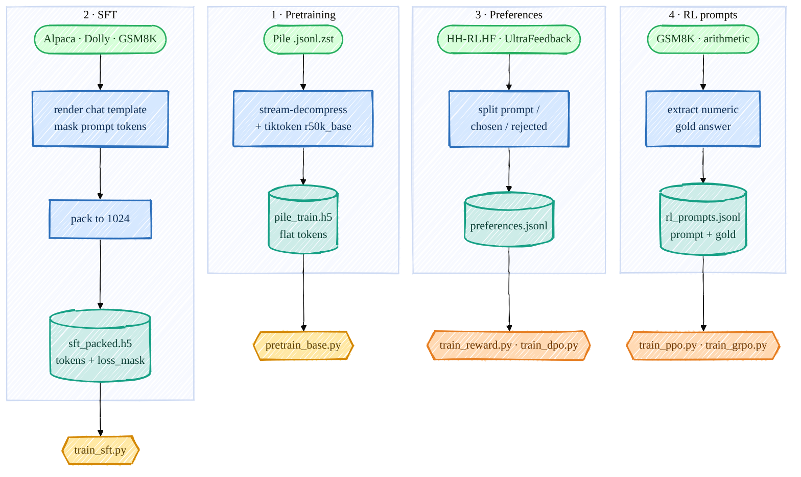

> **本章前置**:第 04 章(分词与数据形状)、第 07 章(交叉熵与标签错位)。如果你还记得"一段文本 → 一串 token id → 喂给模型"这条链路,本章就会很顺。
>
> **你将学到**:
> - The Pile 是什么、为什么我们用它来预训练;
> - 预训练数据是怎么从一堆压缩文本变成一条"扁平 token 长河",再存进 HDF5 文件的,以及为什么偏偏选 HDF5;
> - DataLoader 如何从这条长河里随机捞出一个个 `(B, T)` 的训练窗口,标签 y 为什么是输入 x 右移一位;
> - 后训练(SFT / 偏好 / RL)各自需要什么数据、由哪个脚本准备;
> - 一组**逐字核对过源码**的真实命令。
>
> 👈 [上一章:生成与采样](/posts/ai_infra/train-llm-from-scratch/train-llm-scratch-09-generation) ｜ [返回总览](/posts/ai_infra/train-llm-from-scratch/train-llm-scratch-overview)

---

前面九章,我们把"模型"这台机器从螺丝钉一颗颗拧了出来:张量、自动求导、Transformer、注意力、交叉熵、AdamW、采样……但机器再精巧,没有"燃料"也跑不起来。这一章讲的就是**燃料是怎么炼出来的**。

一句话概括本章:**把海量文本变成模型一口就能吃的形状**。这个"形状",对预训练来说就是一个超长的整数数组,存在一个叫 HDF5 的文件里。



> 这张图来自工程参考页 [`../01_data_pipeline_zh.md`](https://github.com/FareedKhan-dev/train-llm-from-scratch/blob/main/docs/zh/01_data_pipeline_zh.md)。本仓库一共有**四条**数据流水线:① 预训练、② SFT、③ 偏好、④ RL prompt。本章重点讲第①条(你下一章就要用它),后三条在阶段四会反复用到,这里先认个脸。

## 10.1 The Pile 是什么

要让模型"学会语言本身",得喂它**海量、多样、高质量的公开文本**。The Pile 就是这样一份语料:它把维基百科、书籍、论文、代码、网页、问答……几十种来源拼在一起,总量达到几百 GB 的纯文本。模型读得越多越杂,学到的"语言常识"就越扎实——这正是"预训练"这个词的含义:**在通用文本上先把语言的底子打好**,之后再针对具体任务微调。

打个比方:The Pile 之于大模型,就像"读了一整座图书馆"之于一个孩子。孩子不是为了背下某一本书,而是在大量阅读里慢慢学会"中文/英文是怎么遣词造句的"。

本仓库用的是它的一个无版权风险的子集 **Pile-uncopyrighted**,托管在 HuggingFace 上。打开 [`scripts/prepare_pretrain_data.py`](https://github.com/FareedKhan-dev/train-llm-from-scratch/blob/main/scripts/prepare_pretrain_data.py) 顶部就能看到下载地址:

```python
BASE_URL = "https://huggingface.co/datasets/monology/pile-uncopyrighted/resolve/main"
EOT_ID = 50256
WRITE_CHUNK = 8_000_000  # flush tokens to HDF5 in ~8M-token chunks
ENC_BATCH = 1024          # documents per tiktoken batch-encode
```

数据以 `*.jsonl.zst` 的形式分片存放:`.jsonl` 表示"每行一个 JSON",`.zst` 表示用 Zstandard 算法压缩过。验证集只有一个文件 `val.jsonl.zst`,训练集则被切成 `00.jsonl.zst`、`01.jsonl.zst`……一片片,你可以只下其中几片来控制数据量。

> **诚实提醒**:就算只下一个训练分片,也是好几 GB 的下载量;全量预训练需要的数据更是按几十上百 GB 算。**完全零基础、只有 CPU 的读者,本章重点是把"流程"理解透**——真正动手训练放到第 11 章,而且第 11 章我会给你一个**不依赖任何下载、CPU 几分钟跑完**的迷你示例,让你亲眼看到 loss 下降。

## 10.2 预训练数据预处理:四步炼油

`prepare_pretrain_data.py` 做的事,可以拆成四步。我们顺着源码一步步看。

### 第一步:流式下载

`download()` 函数把远程的 `.jsonl.zst` 分片下载到本地(默认放在 `/ephemeral/data/pile_raw/`)。注意它用了 `stream=True` 边下边写,并且已经下过的文件会直接复用(`if os.path.exists(dest)`),不会重复下载。

### 第二步:流式解压 + 取出文本

文件是压缩的,而且很大,不可能整个解压到内存里。`iter_texts()` 用 `zstandard` 做**流式解压**——像拧开水龙头一样,一行一行地往外流,每行解析出 JSON 里的 `"text"` 字段:

```python
def iter_texts(zst_path: str):
    dctx = zstd.ZstdDecompressor()
    with open(zst_path, "rb") as fh:
        reader = dctx.stream_reader(fh)
        for line in io.TextIOWrapper(reader, encoding="utf-8"):
            ...
            txt = json.loads(line).get("text")
            if txt:
                yield txt
```

`yield` 是 Python 的"生成器":它不会一次性把所有文本读进内存,而是**用一条吐一条**。这样哪怕原始文件有几十 GB,内存占用也始终很小。

### 第三步:用 r50k_base 分词,拼成一条"token 长河"

这是最核心的一步,也是第 04 章那条"文本 → token id"链路的真实落地。我们用 OpenAI 的 **`r50k_base`** 分词器(`tiktoken`),它的词表大小约 `50304`(模型配置里写的就是这个数;分词器实际产出的最大 id 是 `50256` = `<|endoftext|>`)。

```python
enc = tiktoken.get_encoding("r50k_base")
...
for ids in enc.encode_ordinary_batch(docs):
    buf.extend(ids)
    buf.append(EOT_ID)          # 50256 separates documents
    if len(buf) >= WRITE_CHUNK:
        flush()                 # append ~8M tokens to the HDF5 dataset at once
```

这几行藏着两个关键设计,务必看懂:

1. **批量编码**:`encode_ordinary_batch(docs)` 一次给一批(1024 篇)文档分词,比一篇篇调用快得多。`encode_ordinary` 意为"普通编码,不识别特殊 token",这样文档正文里万一出现 `<|endoftext|>` 这种字符串,也只会被当普通文字处理,不会被误认成分隔符。

2. **把所有文档首尾相接成一条长序列**:每篇文档分完词,把它的 token id 全部 `extend` 进一个大缓冲区 `buf`,然后**追加一个 `EOT_ID`(50256)作为"文档结束"的分隔符**。这样做的效果是:

   ```
   [文档A的token...] 50256 [文档B的token...] 50256 [文档C的token...] 50256 ...
   ```

   整个语料最后变成**一条没有"行""列"概念的、纯粹的一维整数长河**。这就是"扁平 token(flat tokens)"这个说法的由来。那个 `50256` 分隔符很重要:它告诉模型"上一篇讲完了,下一篇是新话题",免得模型把毫不相干的两篇文档当成一段连续的话来学。

### 第四步:分块写入 HDF5

token 攒到约 800 万个(`WRITE_CHUNK`)就调用一次 `flush()`,把这一大块一次性追加写进 HDF5 文件:

```python
with h5py.File(out_path, "w") as f:
    dset = f.create_dataset("tokens", (0,), maxshape=(None,), dtype="i4", chunks=(WRITE_CHUNK,))

    def flush():
        ...
        arr = np.asarray(buf, dtype=np.int32)
        dset.resize(total + arr.size, axis=0)   # 把数组拉长
        dset[total: total + arr.size] = arr     # 把这一块写进去
        total += arr.size
```

最终产物是一个 HDF5 文件,里面有**唯一一个名叫 `tokens` 的数据集**,它就是那条一维 `int32` 长河。

### 为什么用 HDF5?

你可能会问:为什么不直接存成一个 `.npy` 文件,或者干脆一个文本文件?HDF5(Hierarchical Data Format)在这里有三个不可替代的好处,正好对应训练时的真实需求:

| 需求 | HDF5 怎么满足 |
|---|---|
| 语料几十 GB,**装不进内存** | HDF5 支持**内存映射 / 按需读取**:文件躺在磁盘上,要用哪一段才读哪一段,内存里永远只放当前这个 batch。 |
| 训练时要**随机**取窗口 | HDF5 是分块(chunked)存储,支持**高效随机切片** `dset[idx : idx+1025]`,不用从头扫到尾。 |
| 写入时数据**边产边写、长度未知** | `maxshape=(None,)` 允许数据集长度无上限地动态增长,`resize` 一下就能继续追加。 |

一句话:**HDF5 让我们能把一条比内存大得多的 token 长河存在磁盘上,训练时却像它就在内存里一样,随手切出任意一段。** 这正是大规模预训练能在有限内存的机器上跑起来的关键。

### dev / train 切分

预处理脚本通过 `--split` 参数分别生成两个文件:`--split val` 产出验证集(dev),`--split train` 产出训练集。它们各自是独立下载、独立分词、独立存盘的两个 HDF5。训练时:**train 用来更新参数,dev 只用来"考试"——定期在 dev 上算一次 loss,看模型有没有在死记硬背(过拟合)。** 第 11 章读日志时你会看到 `eval train` 和 `eval dev` 两行,就是分别在这两个文件上算的。

## 10.3 DataLoader:从长河里捞窗口

数据存好了,训练时怎么用?核心在 [`data_loader/data_loader.py`](https://github.com/FareedKhan-dev/train-llm-from-scratch/blob/main/data_loader/data_loader.py) 的 `get_batch_iterator`。它是一个**无限生成器**:每次 `next()` 就吐出一个 `(xb, yb)`——一批输入和它们对应的标签。我们逐段拆解它真实的实现。

### 第一步:这条长河能切出多少个样本

```python
with h5py.File(data_path, 'r') as hdf5_file:
    dataset = hdf5_file['tokens']
    dataset_size = dataset.shape[0]
    n_examples = (dataset_size - 1) // context_length
```

`dataset` 就是那条扁平 token 长河,`dataset_size` 是它的总长度。每个训练样本要占用 `context_length` 个连续 token 当输入(还要再多 1 个当最后一个标签,所以是 `-1`),于是整条河大约能切成 `n_examples` 个不重叠的窗口。

### 第二步:把窗口编号打乱

```python
example_idxs = np.arange(n_examples)
np.random.shuffle(example_idxs)
```

我们给每个窗口编号 `0, 1, 2, ...`,然后**整体洗牌**。为什么要洗?因为长河是按文档顺序拼的,如果不洗,模型会先连着读一大堆同一来源的文本,梯度方向会有偏。打乱后每个 batch 都是从语料各处随机抓来的,训练更稳。

> **小彩蛋**:第 11 章多卡训练时,`pretrain_base.py` 给每个 GPU 设了不同的随机种子(`set_seed(cfg.seed + ctx.rank)`),所以不同 GPU 洗出的顺序不同、看到的窗口不同,等于变相扩大了数据多样性。

### 第三步:取出一批窗口,切成输入 x 和标签 y

```python
while True:
    if counter + batch_size > n_examples:
        np.random.shuffle(example_idxs)   # 用完一轮,重新洗牌
        counter = 0
        print(f"Finished epoch {epochs}")
        epochs += 1

    # 取 batch_size 个窗口编号,乘以 context_length 得到它们在长河里的起始位置
    random_indices = example_idxs[counter:counter+batch_size] * context_length

    # 对每个起始位置,切出 context_length + 1 个 token
    random_samples = torch.tensor(np.array([dataset[idx:idx+context_length+1] for idx in random_indices]))

    xb = random_samples[:, :context_length].to(device)    # 输入:前 context_length 个
    yb = random_samples[:, 1:context_length+1].to(device)  # 标签:整体右移一位

    counter += batch_size
    yield xb, yb
```

这段是整个数据流水线的"临门一脚",有三个点必须吃透:

**① 为什么切 `context_length + 1` 个 token?** 因为我们要从同一段连续 token 里,同时凿出"输入"和"标签"两条序列。比如 `context_length = 4`,从长河切出 5 个 token `[A, B, C, D, E]`:

```
切出来:  A  B  C  D  E
输入 x : A  B  C  D        ← 前 4 个
标签 y :    B  C  D  E     ← 后 4 个(整体右移一位)
```

**② 标签 y 就是输入 x 右移一位**,这正是第 07 章讲的"语言模型的训练目标":在每个位置上,让模型根据"已经看到的 token"去预测"下一个 token"。对齐关系是:

- 看到 `A`,要预测 `B`;
- 看到 `A B`,要预测 `C`;
- 看到 `A B C`,要预测 `D`;
- 看到 `A B C D`,要预测 `E`。

代码里 `xb = [:, :context_length]`、`yb = [:, 1:context_length+1]` 这两行,就是把这个"错位一格"用切片精确实现出来。模型 `forward(xb, yb)` 内部会对每个位置算交叉熵——你在第 07 章推导过的那个损失,在这里真正用上了。

**③ 形状是 `(B, T)`。** `xb` 和 `yb` 的形状都是 `(batch_size, context_length)`,也就是第 04 章反复强调的 `(B, T)`——B 个序列、每个 T 个 token。这就是模型前向接收的标准输入形状。

你可以亲手验证这个形状。`data_loader.py` 文件末尾自带一个用假数据的小例子(它会临时造一个 `dummy_data.h5`,里面是 `0..999` 这 1000 个数):

```bash
PYTHONPATH=. python data_loader/data_loader.py
```

输出会是:

```
Input Batch Shape: torch.Size([4, 10])
Target Batch Shape: torch.Size([4, 10])
```

`batch_size=4`、`context_length=10`,所以是 `(4, 10)`。这条命令**不需要下载任何数据**,普通笔记本一秒跑完,强烈建议你跑一下,亲手摸一摸 `(B, T)` 这个形状。

## 10.4 后训练各数据集一览

预训练只是第一步。等模型学会了"语言本身",还要教它"听话"(SFT)、"分辨好坏"(偏好)、"自己解题"(RL)。这三类后训练各需要**不同形状**的数据,由不同脚本准备。这里先做个总览,具体训练放在阶段四(第 12 章起)。

| 阶段 | 数据来源 | 准备脚本 | 产物 | 形状特点 |
|---|---|---|---|---|
| **预训练** | Pile-uncopyrighted | `prepare_pretrain_data.py` | `pile_train.h5` / `pile_dev.h5` | 扁平 `int32` token 长河 |
| **SFT 指令微调** | Alpaca、Dolly、GSM8K | `prepare_sft_data.py` | `sft_packed.h5`(`tokens` + `loss_mask`) | 打包成定长 `(N, 1024)`,带损失掩码 |
| **偏好(奖励模型 / DPO)** | HH-RLHF、UltraFeedback | `prepare_preference_data.py` | `preferences.jsonl`(+ `_test`) | 每条是 `{prompt, chosen, rejected}` |
| **RL prompt(PPO / GRPO)** | GSM8K、程序化算术 | `prepare_rl_prompts.py` | `rl_prompts_train.jsonl`、`arithmetic_prompts.jsonl` | 每条是 `{prompt, gold}` |

几个关键区别,先有个印象(细节到对应章节再展开):

- **SFT 的 `loss_mask`**:微调时我们**只想训练模型生成"助手回答"那部分**,不想让它去背诵用户的问题。所以 `prepare_sft_data.py` 在产出 token 的同时,产出一条等长的 `loss_mask`,只有"回答"的位置标 `1`、其余标 `0`。算损失时一乘这个掩码,问题部分就不参与训练了。这就是为什么 SFT 数据是 `tokens` + `loss_mask` 两个数据集,而预训练只有 `tokens` 一个。

- **偏好数据是"成对"的**:每条样本里,`chosen`(更好的回答)和 `rejected`(更差的回答)**共享同一个 `prompt`**,只在回答上不同。奖励模型和 DPO 就是从这种"A 比 B 好"的成对比较里学打分。

- **RL prompt 带"标准答案"`gold`**:`prepare_rl_prompts.py` 从 GSM8K 里解析出每道题的数值答案(数据集里 `#### 数字` 后面那个数),存进 `gold`。强化学习时,模型自己生成解答,校验器拿生成的答案和 `gold` 一比,对就给奖励、错就不给——这叫"可验证奖励"。

## 10.5 真实命令(逐字核对源码)

下面这些命令的参数名都**逐一核对过脚本里的 `argparse` 定义**,可以放心复制。它们默认把产物写到 `/ephemeral`,你可以按需改路径。注意:除了第一条 dev 集相对小,其余都涉及较大下载,**只有 GPU + 大磁盘的环境才适合真正跑全量**。

```bash
# ① 预训练数据:先来一个相对小的验证集(dev),用来在训练时"考试"
PYTHONPATH=. python scripts/prepare_pretrain_data.py --split val --out /ephemeral/data/pile_dev.h5

# ② 预训练数据:一个训练分片(--num_shards 1 表示只下第 1 片;想小一点可加 --max_tokens 限制 token 数)
PYTHONPATH=. python scripts/prepare_pretrain_data.py --split train --num_shards 1 --out /ephemeral/data/pile_train.h5

# ③ SFT 数据:Alpaca + Dolly + GSM8K → 打包成定长 1024 的 sft_packed.h5
PYTHONPATH=. HF_HOME=/ephemeral/hf_cache python scripts/prepare_sft_data.py --context_length 1024 --out_dir /ephemeral/data

# ④ 偏好数据:HH-RLHF + UltraFeedback → preferences.jsonl(+ _test)
PYTHONPATH=. HF_HOME=/ephemeral/hf_cache python scripts/prepare_preference_data.py --source both --max_per_source 40000 --out_dir /ephemeral/data

# ⑤ RL prompt:GSM8K + 算术课程 → rl_prompts_train/test.jsonl、arithmetic_prompts.jsonl
PYTHONPATH=. HF_HOME=/ephemeral/hf_cache python scripts/prepare_rl_prompts.py --out_dir /ephemeral/data
```

> **关于 `PYTHONPATH=.` 和 `HF_HOME`**:
> - `PYTHONPATH=.` 让 Python 能 `import` 到项目根目录下的 `src/`、`config/` 等包。如果你已经用 `pip install -e ".[train]"` 做了可编辑安装(见 [`../howto/train_zh.md`](https://github.com/FareedKhan-dev/train-llm-from-scratch/blob/main/docs/zh/howto/train_zh.md)),就可以省掉它。
> - `HF_HOME=/ephemeral/hf_cache` 把 HuggingFace 的数据集缓存指向大磁盘,免得几十 GB 的数据撑爆系统盘。后三个脚本要从 HuggingFace 下载数据集,所以都加了它。

**想先在 CPU 上零成本体验?** 只跑这一条不下载、秒级完成的形状验证就够了:

```bash
PYTHONPATH=. python data_loader/data_loader.py
```

看到两个 `torch.Size([4, 10])`,你就已经亲手走通了"扁平 token → `(B, T)` 训练窗口"这最关键的一跳。剩下的"真刀真枪喂给模型",第 11 章见。

## 小结

- **The Pile** 是一份几百 GB 的公开混合语料,我们用它的无版权子集 **Pile-uncopyrighted** 做预训练,目的是让模型"在海量文本里学会语言本身"。
- 预训练预处理四步:**流式下载 → 流式解压取文本 → 用 `r50k_base` 分词并以 `<|endoftext|>`(50256)为分隔拼成一条扁平 token 长河 → 分块写入 HDF5**。
- 选 **HDF5** 是因为它能**内存映射、按需读取、高效随机切片、动态增长**——让比内存大得多的语料也能随手切窗口。
- `get_batch_iterator` 从长河里随机切出 `context_length + 1` 个 token,**前 `context_length` 个当输入 x、整体右移一位当标签 y**,形状都是 `(B, T)`;这正是第 07 章"预测下一个 token"目标的代码落地。
- 后训练三类数据各有形状:**SFT** 是 `tokens`+`loss_mask`、**偏好**是成对的 `{prompt, chosen, rejected}`、**RL** 是带标准答案的 `{prompt, gold}`,分别由 `prepare_sft_data.py` / `prepare_preference_data.py` / `prepare_rl_prompts.py` 准备。

## 自测题

1. 预训练的 HDF5 文件里只有一个数据集 `tokens`,它是几维的?里面那些等于 `50256` 的元素起什么作用?
2. 为什么 `get_batch_iterator` 每次要切 `context_length + 1` 个 token,而不是 `context_length` 个?
3. 用第 04 章的话说清楚:为什么标签 `yb` 是输入 `xb` "右移一位"?如果不右移、直接让 y = x 会发生什么?
4. HDF5 相比"把整个语料读进一个 Python list"有哪些好处?哪一个对"语料比内存大"这件事最关键?
5. SFT 数据为什么比预训练数据多了一个 `loss_mask`?它标 `1` 的是哪部分 token?

> 参考答案要点:① 一维;`50256` 是 `<|endoftext|>`,作为文档之间的分隔符,防止模型把不相干的两篇当连续文本。② 因为要同时凿出输入和"右移一位"的标签,5 个 token 才能切出长度各为 4 的 x 和 y。③ 语言模型的目标是"看前文预测下一个 token",位置 i 的标签应是位置 i 的下一个 token;y=x 会让模型学会"原样复制",学不到任何预测能力。④ 内存映射、按需读取、随机切片快、可动态增长;其中"按需读取/内存映射"对"语料比内存大"最关键。⑤ 因为微调时只想训练"助手回答"部分;`loss_mask` 在回答(及其结束符)的位置标 `1`,用户问题处标 `0`。

## 深入参考

- 工程速查:[`../01_data_pipeline_zh.md`](https://github.com/FareedKhan-dev/train-llm-from-scratch/blob/main/docs/zh/01_data_pipeline_zh.md)(四条流水线的精炼版,含 Mermaid 源码)。
- 第一性原理:[`../foundations/tokenization_zh.md`](https://github.com/FareedKhan-dev/train-llm-from-scratch/blob/main/docs/zh/foundations/tokenization_zh.md)(为什么预训练用扁平 token 流、为什么 SFT 要 `loss_mask`)。
- 真实源码:[`scripts/prepare_pretrain_data.py`](https://github.com/FareedKhan-dev/train-llm-from-scratch/blob/main/scripts/prepare_pretrain_data.py)、[`data_loader/data_loader.py`](https://github.com/FareedKhan-dev/train-llm-from-scratch/blob/main/data_loader/data_loader.py)。
- 命令大全:[`../howto/train_zh.md`](https://github.com/FareedKhan-dev/train-llm-from-scratch/blob/main/docs/zh/howto/train_zh.md)、[`../howto/commands_zh.md`](https://github.com/FareedKhan-dev/train-llm-from-scratch/blob/main/docs/zh/howto/commands_zh.md)。

数据炼好了,燃料就位。下一章我们把前面所有零件拼成一台完整的预训练机器,并让你在 CPU 上亲眼看到 loss 一路下降 👉 [第 11 章:预训练你的基座模型 · 动手](/posts/ai_infra/train-llm-from-scratch/train-llm-scratch-11-pretraining)
