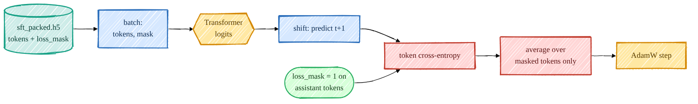

> **本章前置**:你已经读完第 01–11 章。你知道 Transformer 怎么把 token 序列变成 logits(第 05、06 章)、知道训练目标是下一个 token 的交叉熵以及"标签错位 / shift"(第 07 章)、知道优化器怎么一步步更新参数(第 08 章)、知道模型怎么自回归地生成文本(第 09 章),并且你已经亲手跑出过一个**预训练好的 base 模型**(第 11 章)。
>
> **你将学到**:① 为什么 base 模型"只会续写、不会听话",SFT 到底要修复什么;② 对话模板(chat template)长什么样,以及 GSM8K 数学题为什么要被重排成 `<think>...</think><answer>N</answer>`;③ **掩码损失的完整推导**——在第 07 章交叉熵的基础上,只对"回答"部分算损失;④ 序列打包(packing)怎么把零碎样本拼满上下文窗口提高效率;⑤ 怎么评估 SFT 的效果;⑥ 在你自己的电脑上(哪怕没 GPU)亲手跑通一次 SFT。
>
> 👈 [上一章:预训练你的基座模型](/posts/ai_infra/train-llm-from-scratch/train-llm-scratch-11-pretraining) ｜ [返回总览](/posts/ai_infra/train-llm-from-scratch/train-llm-scratch-overview)

---

我们终于走到了"后训练 / 对齐"这一大阶段的第一站。从这一章开始,模型不再只是学"语言本身",而是开始学"怎么跟人打交道"。



## 12.1 base 模型为什么"只会续写、不会听话"

先回忆一下第 07、11 章里 base 模型到底学了什么。它的训练目标只有一个:**给定前面的 token,预测下一个 token**。在海量互联网文本上反复做这件事,它学会的是"语言的统计规律"——什么词后面常跟什么词、一句话该怎么接下去。

这带来一个有点违反直觉的后果:base 模型是个**超强的续写机**,但它**不知道你在跟它"对话"**。打个比方,它像一个读了整座图书馆、却从没跟人聊过天的人。你给它一句:

```
法国的首都是哪里?
```

一个对齐过的助手会回答"巴黎"。但 base 模型很可能不会回答,它会**接着把这句话"写下去"**,因为在它见过的网页里,这种句子后面经常跟着的是更多类似的问句:

```
法国的首都是哪里?德国的首都是哪里?意大利的首都是哪里?请在下面作答……
```

它没做错——它忠实地完成了"预测下一个 token"的任务。问题在于:**预训练的目标(续写)和我们想要的行为(回答 / 听话)之间有一道鸿沟**。base 模型有"知识",但没有"听指令、给回答"这个**习惯**。

SFT(Supervised Fine-Tuning,监督微调 / 指令微调)要做的,就是补上这个习惯。方法朴素得让人意外:**给它看成千上万条 `(指令, 回答)` 的范例,让它学会"看到指令格式,就该产出回答"**。这里没有强化学习、没有奖励模型,就是普普通通的"看着标准答案学",所以叫"监督"微调。

> **一句话总结**:预训练教模型"世界是什么样的";SFT 教模型"被问到时该怎么回应"。知识在预训练里就有了,SFT 只是把它"调教"成一个会听话的助手。

那 SFT 和预训练在技术上的区别有多大?答案是:**几乎只差一个掩码**。这正是本章的核心,我们一步步来。

## 12.2 对话模板:让模型分得清"谁在说话"

要让模型学会"听指令、给回答",我们得先用一种**固定的格式**把对话写下来,这样模型才能从格式里认出"哪段是用户说的、哪段该我回答"。这种固定格式就叫**对话模板(chat template)**。

本项目的对话模板定义在 `src/post_training/chat_template.py`。一轮"用户问、助手答"被渲染成这样(英文原样,来自源码注释):

```
<|user|>
{用户内容}<|endoftext|><|assistant|>
{助手内容}<|endoftext|>
```

这里有几个关键设计,务必理解清楚:

- `<|user|>`、`<|assistant|>`(还有 `<|system|>`)是**角色标记**。它们看起来很像"特殊 token",但**其实不是**。本项目用的分词器是 tiktoken 的 `r50k_base`,它**唯一**的真正特殊 token 是 `<|endoftext|>`(id 是 `50256`)。我们没法给它注册新的特殊 token,所以这些角色标记就是**普普通通的文本**,会被分词器切成好几个普通 token,模型在 SFT 时**像学任何别的文字一样把它们学会**。

  源码里把这点写得很清楚(`chat_template.py` 顶部注释):

  ```
  Instead we use plain-text role markers that simply tokenize as ordinary
  multi-token strings -- the model learns them during SFT just like any other text.
  ```

- `<|endoftext|>`(简称 EOT)被**复用**成两件事:既是"一轮发言结束"的分隔符,也是生成时**唯一的停止符**。模型学会"该停的时候输出 EOT",我们在第 09 章讲生成时见到的"遇到停止符就停"才有了着落。

我们来看渲染函数 `render_chat`(`src/post_training/chat_template.py`),它纯粹用于调试展示——真正喂给模型的 token 由后面的 `encode_chat` 生成,以保证掩码和 token 边界严丝合缝:

```python
def render_chat(messages: Iterable[dict], add_generation_prompt: bool = False) -> str:
    parts: list[str] = []
    for m in messages:
        parts.append(_header_for(m["role"]))
        parts.append(m["content"])
        parts.append("<|endoftext|>")
    if add_generation_prompt:
        parts.append(ASSISTANT_HEADER)
    return "".join(parts)
```

逐句读:对消息列表里的每一条 `{"role", "content"}`,先拼上角色头(比如 `<|user|>\n`),再拼上内容,最后拼一个 `<|endoftext|>` 作为这轮的收尾。`add_generation_prompt=True` 时,在最后额外补一个 `<|assistant|>\n`——这是**推理/生成时**用的"提示词形态":意思是"轮到你(助手)说了",把舞台让给模型去续写回答。

> **类比**:对话模板就像剧本里的"角色名:台词"。`<|user|>` 和 `<|assistant|>` 是角色名,`<|endoftext|>` 是"这句台词念完了"。模型读多了这种剧本,就学会了"看到 `<|assistant|>\n` 开头,接下来该我念助手的台词"。

## 12.3 GSM8K 为什么要被重排成 `<think>...</think><answer>N</answer>`

SFT 用到的数据里,除了通用的指令数据(Alpaca、Dolly),还有数学题数据集 **GSM8K**。但它不是原样喂进去的,而是被**重排**成一种特定结构。先看为什么。

GSM8K 原始的答案长这样(末尾用 `#### 数字` 给出最终答案,中间还夹着 `<<...>>` 这种计算器注释):

```
Natalia sold 48/2 = <<48/2=24>>24 clips in May.
Altogether she sold 48+24 = <<48+24=72>>72 clips.
#### 72
```

本项目在准备数据时(`scripts/prepare_sft_data.py` 里的 `gsm8k_to_messages`),把它清洗并重排成助手的一段结构化回答:

```python
def gsm8k_to_messages(question: str, answer: str) -> list[dict]:
    answer = _CALC_RE.sub("", answer).strip()           # 去掉 <<...>> 计算器注释
    m = _HASH_RE.search(answer)
    final = m.group(1).strip() if m else answer          # 抠出 #### 后面的最终答案
    reasoning = _HASH_RE.sub("", answer).strip()         # 剩下的就是推理过程
    completion = f"{THINK_OPEN}{reasoning}{THINK_CLOSE}{ANSWER_OPEN}{final}{ANSWER_CLOSE}"
    return [{"role": "user", "content": question.strip()},
            {"role": "assistant", "content": completion}]
```

也就是说,助手的回答被组织成:

```
<think>一步步的推理过程……</think><answer>72</answer>
```

这里的 `<think>`、`</think>`、`<answer>`、`</answer>`(定义在 `chat_template.py` 顶部)**和角色标记一样,也只是普通文本 token**,模型把它们当普通字符串学。

为什么要费这个劲?因为它给后面的强化学习阶段(第 16 章 GRPO / RLVR)埋了一个**关键伏笔**:RL 阶段需要一个"验证器(verifier)"来自动判断模型答得对不对。验证器最省事的做法,就是从模型输出里**用 `<answer>...</answer>` 把最终答案精确抠出来**,再跟标准答案比对。如果模型已经在 SFT 阶段就**养成了"先 `<think>` 推理、再 `<answer>` 给答案"的输出习惯**,那么到了 RL 阶段,验证器一抠一个准,奖励信号就干净可靠。

`chat_template.py` 把这些结构标记**显式导出**,正是为了让"数据生成"和"奖励解析"共用同一份"真理来源(single source of truth)",免得两边写得不一致:

```python
# Reasoning structure markers (also ordinary tokens). Exposed so reward parsing and
# data generation share a single source of truth.
THINK_OPEN, THINK_CLOSE = "<think>", "</think>"
ANSWER_OPEN, ANSWER_CLOSE = "<answer>", "</answer>"
```

> **一句话总结**:在 SFT 阶段就把数学题答案重排成 `<think>…</think><answer>N</answer>`,是为了让模型**提前学会 RL 阶段验证器想要的输出结构**。这是一个跨章节的设计,现在先记住"为什么这么排",到第 16 章你会看到它怎么开花结果。

## 12.4 掩码损失推导:只对"回答"算账

这是本章数学上的核心。我们从第 07 章的交叉熵出发,一步步推出 SFT 真正用的"带掩码的损失"。

### 12.4.1 先回忆:普通的下一个 token 交叉熵

第 07 章里,对一条长度为 $T$ 的序列 $x_1, x_2, \dots, x_T$,语言模型的训练损失是**每个位置上"预测下一个 token"的交叉熵的平均**:

$$
\mathcal L_{\text{pretrain}} = -\frac{1}{T-1}\sum_{t=1}^{T-1} \log p_\theta\!\left(x_{t+1}\mid x_{\le t}\right)
$$

逐符号解释:

- $x_{\le t}$ 表示"位置 $t$ 及之前的所有 token",也就是模型已经看到的上下文;
- $p_\theta(x_{t+1}\mid x_{\le t})$ 是模型(参数 $\theta$)在看完前文后,给"真实的下一个 token $x_{t+1}$"分配的概率;
- $-\log(\cdot)$ 是负对数:模型给真实 token 的概率越高,这一项越小(损失越小);概率越低,惩罚越大;
- $\frac{1}{T-1}$ 是对所有位置求平均。

预训练对**序列里的每一个位置**都算这笔账——它要学的就是"任何文本都该怎么往下写"。

### 12.4.2 SFT 的关键改动:不想让模型去"复述提示词"

现在轮到 SFT 的对话数据。一条打包好的序列里,既有**提示词部分**(角色标记 + 用户内容,比如 `<|user|>\n法国的首都是哪里?<|endoftext|><|assistant|>\n`),也有**回答部分**(助手内容 + 它的结尾 EOT,比如 `巴黎<|endoftext|>`)。

如果我们像预训练那样对**每个位置**都算损失,会发生什么?模型会被训练去"预测好"提示词里的每一个 token——也就是说,它会努力学着**自己把用户的问题也写出来**。但这不是我们要的!我们要的是:**给定提示词,产出回答**。让模型去复述用户的提问,纯属浪费(甚至有害,模型可能学会自问自答地胡扯)。

解决办法非常直接:**算损失时,把提示词部分"屏蔽(mask)"掉,只在回答部分计损失**。我们给每个位置 $t$ 配一个**掩码值** $m_t$:

$$
m_t = \begin{cases} 1, & \text{位置 } t \text{ 属于助手回答(含其结尾 EOT)} \\ 0, & \text{位置 } t \text{ 属于提示词(角色标记、用户内容)} \end{cases}
$$

于是损失变成**只对 $m_t = 1$ 的位置求和、并只在这些位置上求平均**:

$$
\boxed{\;\mathcal L_{\text{SFT}} = -\frac{1}{\sum_t m_t}\sum_{t} m_t \,\log p_\theta\!\left(x_t \mid x_{<t}\right)\;}
$$

逐符号解释(这是本章最重要的公式,慢慢看):

- $m_t$ 就是那个开关:它是 1 的位置才进损失,是 0 的位置整项被乘成 0、直接消失;
- $\sum_t m_t$ 是"回答部分一共有多少个 token"。我们用它来求平均,意思是**损失按"回答的 token 数"取平均,而不是按整条序列的长度**——这样提示词长短就不会稀释损失;
- $\log p_\theta(x_t \mid x_{<t})$ 还是那个老朋友:模型对"真实 token $x_t$"打的对数概率($x_{<t}$ 是它前面的全部上下文)。

直观理解:**我们只为"该模型自己生成的那些 token"算账,而提示词是"给定的题面",不该让模型为复述题面而受训练或受惩罚。**

> **$m_t$ 是从哪来的?** 它不是训练时临时算的,而是在**数据准备阶段**,由 `encode_chat` 在切 token 的同时**逐 token 对齐地生成**好,和 token 一起打包进数据文件。下一节我们就看它怎么造出来。

### 12.4.3 掩码 $m_t$ 的来历:`encode_chat`

掩码 $m_t$ 由 `src/post_training/chat_template.py` 里的 `encode_chat` 生成。它一边把对话切成 token,一边给每个 token 贴上 0 或 1 的标签:

```python
def encode_chat(messages, add_generation_prompt=False):
    ids: list[int] = []
    mask: list[int] = []

    for m in messages:
        role = m["role"]
        # 角色头(<|user|>\n / <|assistant|>\n):永远掩掉(mask=0)
        header_ids = _encode_ordinary(_header_for(role))
        ids.extend(header_ids)
        mask.extend([0] * len(header_ids))

        content_ids = _encode_ordinary(m["content"])
        is_completion = role == "assistant"
        ids.extend(content_ids)
        # 只有助手内容 mask=1,用户/系统内容 mask=0
        mask.extend([1 if is_completion else 0] * len(content_ids))

        # 这一轮结尾的 EOT:只有当它收尾"助手回答"时才 mask=1
        # (这样模型才学得会"该停的时候输出 EOT")
        ids.append(EOT_ID)
        mask.append(1 if is_completion else 0)

    if add_generation_prompt:
        header_ids = _encode_ordinary(ASSISTANT_HEADER)
        ids.extend(header_ids)
        mask.extend([0] * len(header_ids))

    return ids, mask
```

把它和上面的公式对上:

- **角色头永远 `mask=0`**——模型不该被训练去"主动吐出" `<|user|>` 这种标记,而且在推理时它们是固定提示词的一部分;
- **用户/系统内容 `mask=0`**——就是上一节说的"不让模型复述题面";
- **助手内容 `mask=1`**——这才是我们要模型学着生成的东西;
- **结尾 EOT 只在收尾助手回答时 `mask=1`**——这是个精妙的小细节:它让模型**学会在回答完后输出停止符**,否则模型生成时就不知道该在哪停下来。

还有一个细节:当 `add_generation_prompt=True`(推理/rollout 时),对话以 `<|assistant|>\n` 结尾、没有任何回答内容,所以返回的 mask **全是 0**——这正是"提示词形态",没有任何 token 需要算损失,只等模型去生成。

### 12.4.4 对照真实实现:`sft_loss`

公式和掩码都有了,我们看损失函数的真身,在 `src/post_training/sft.py`:

```python
def sft_loss(logits: torch.Tensor, tokens: torch.Tensor, loss_mask: torch.Tensor) -> torch.Tensor:
    # Predict token t+1 from position t (same shift the base model uses).
    logits = logits[:, :-1, :]
    targets = tokens[:, 1:]
    mask = loss_mask[:, 1:].to(logits.dtype)

    V = logits.size(-1)
    ce = F.cross_entropy(logits.reshape(-1, V).float(), targets.reshape(-1).long(), reduction="none")
    ce = ce.view(targets.shape) * mask
    return ce.sum() / mask.sum().clamp(min=1.0)
```

逐行对照公式来读:

1. `logits = logits[:, :-1, :]` 和 `targets = tokens[:, 1:]`:这就是第 07 章讲过的**标签错位 / shift**——用"位置 $t$ 的输出"去预测"位置 $t+1$ 的真实 token"。去掉最后一个位置的 logits(它没有下一个 token 可预测),去掉第一个 token 作为目标(它没有前文可依据)。
2. `mask = loss_mask[:, 1:]`:掩码也要跟着错位一格,才能和 `targets` 一一对齐。注意:因为目标是 $x_{t+1}$,所以"这个目标该不该算"取决于 $x_{t+1}$ 的掩码,因此切的是 `[:, 1:]`。
3. `F.cross_entropy(..., reduction="none")`:对**每个位置**单独算交叉熵 $-\log p_\theta(x_t\mid x_{<t})$,先不求和、不平均(`reduction="none"`)。这一步算出来的是一整片逐位置的损失。
4. `ce = ce.view(targets.shape) * mask`:把逐位置损失**乘上掩码**——这正是公式里的 $m_t \log p_\theta(\cdot)$。$m_t=0$ 的位置被乘没了,只剩回答部分。
5. `return ce.sum() / mask.sum().clamp(min=1.0)`:分子是 $\sum_t m_t \log p_\theta(\cdot)$(对掩码后的损失求和),分母是 $\sum_t m_t$(回答 token 的总数)。`.clamp(min=1.0)` 是个安全垫:万一某个 batch 一个回答 token 都没有(分母为 0),避免除零。这一行精确实现了 $\boxed{\mathcal L = -\frac{1}{\sum_t m_t}\sum_t m_t \log p_\theta(\cdot)}$。

还有个工程细节:`F.cross_entropy(... .float() ...)` 里那个 `.float()`,是把 logits 升到 float32 再算交叉熵,这样即使训练用 bf16 混合精度(第 08 章),损失在数值上也保持干净、不容易出问题。

> **回到那句"只差一个掩码"**:对比一下,预训练的损失是对所有位置平均,SFT 的损失只是多乘了一个 $m_t$、并只对回答 token 求平均。**整条训练流水线(前向、反向、优化器)和预训练几乎一模一样**——这就是为什么 `src/post_training/sft.py` 顶部注释直接说:"与预训练唯一真正的区别,就是这个逐 token 的 loss_mask。"

## 12.5 序列打包(packing):别浪费上下文窗口

SFT 数据有个特点:每条样本长短差异极大。Alpaca 里一句"把这句话翻译成法语"可能就几十个 token,而一道 GSM8K 数学题连推理过程可能好几百个 token。模型的上下文窗口(context_length)是固定的(比如 1024)。如果**一行只放一条样本**,短样本就会留下大片空白,要么浪费算力去算 padding,要么白白浪费窗口容量。

**序列打包(packing)** 的思路很简单:**把多条样本首尾相接地拼起来,塞满一整行 `context_length`,再切成定长的若干行**。看 `src/post_training/sft.py` 的 `pack_examples`:

```python
def pack_examples(examples, context_length):
    flat_ids: list[int] = []
    flat_mask: list[int] = []
    for ids, mask in examples:
        flat_ids.extend(ids)
        flat_mask.extend(mask)

    n_rows = len(flat_ids) // context_length
    ids_arr = np.asarray(flat_ids[: n_rows * context_length], dtype=np.int32).reshape(n_rows, context_length)
    mask_arr = np.asarray(flat_mask[: n_rows * context_length], dtype=np.int8).reshape(n_rows, context_length)
    return ids_arr, mask_arr
```

逐步理解:

1. 把所有样本的 `ids` 和 `mask` 分别**首尾相接拼成两条超长的扁平序列**(`flat_ids`、`flat_mask`);因为 `encode_chat` 已经在每条样本结尾放了 EOT,所以**EOT 天然就是样本之间的分隔符**;
2. `n_rows = len(flat_ids) // context_length`:能切出多少整行;
3. 把扁平序列**切成 `(n_rows, context_length)` 的二维数组**;末尾凑不满一整行的零头**直接丢掉**(`[: n_rows * context_length]`);
4. token 和 mask 用**完全一样的切法**,所以它们逐位置严格对齐——这至关重要,因为损失函数靠 mask 来认"哪段是回答"。

打包后,**几乎每一个位置都有真实 token**,GPU 不空转,训练效率高得多。你可能会担心:一行里相邻两条样本会不会互相"串味"?在本项目的设置下影响很小——因为注意力是因果的,且 EOT 把样本隔开,模型很快就学会"EOT 之后是新的一段"。

> 打包后的数据被写进 HDF5 文件(`scripts/prepare_sft_data.py` 里的 `write_packed`),里面有两个对齐的数据集:`tokens` 和 `loss_mask`,形状都是 `(N, context_length)`。训练时由 `data_loader/sft_dataset.py` 的 `get_sft_batch_iterator` 逐 batch 读出来,产出 `(tokens, loss_mask, epoch)`,并按 DDP 的 rank 把行分片(每张卡看到不重叠的一份),这样多卡训练能在一个 epoch 内恰好把数据集覆盖一遍。

## 12.6 训练器长什么样

把上面所有零件拼起来,就是 `scripts/train_sft.py` 的主循环。它先用 `load_backbone_from_ckpt` 把**预训练好的 base 模型**加载进来(这就是第 11 章产出的 checkpoint),然后跑一个很紧凑的循环:

```python
tokens, mask, epoch = next(train_it)
if epoch >= cfg.epochs and cfg.max_steps <= 0:
    break
optimizer.zero_grad(set_to_none=True)
with amp_autocast(cfg.amp_dtype, ctx.device):
    logits, _ = model(tokens)
    loss = sft_loss(logits, tokens, mask)
loss.backward()
torch.nn.utils.clip_grad_norm_(model.parameters(), cfg.grad_clip)
optimizer.step()
```

是不是很眼熟?和第 08、11 章的训练循环几乎一模一样:取一个 batch → 前向算 logits → 算损失 → 反向传播 → 梯度裁剪 → 优化器走一步。**唯一的不同就是损失函数换成了带掩码的 `sft_loss`**,而且 batch 里多带了一个 `mask`。学习率用余弦调度(`cosine_lr`),每隔若干步在留出集上做一次 dev 评估。

注意一个重点(`configs/sft.json` 第一行):

```json
"pretrained_ckpt": "/ephemeral/ckpts/base_pretrained.pt",
```

**SFT 不是从零开始训练,而是从预训练 base 模型的 checkpoint 初始化的。** 这正是"后训练"这个名字的由来——我们站在 base 模型的肩膀上,只是给它"加个习惯",学习率因此也设得很小(`configs/sft.json` 里 `"lr": 1e-05`,远小于预训练的 `3e-4`),免得把 base 模型辛苦学来的知识冲掉。SFT 训完后,checkpoint 存到 `/ephemeral/ckpts/sft.pt`,它会成为后面奖励模型、DPO、PPO、GRPO 所有阶段的**共同起点**。

## 12.7 怎么评估 SFT 的效果

训练时屏幕上滚动的数字,主要看这几个:

- **train_loss / ppl**——回答 token 上的**带掩码交叉熵**(及其对应的困惑度,第 07 章讲过 $\text{ppl} = e^{\mathcal L}$)。因为只对回答算,它会明显低于 base 模型在同样文本上的整体损失。一个常用的"机制自检":在极少的几行数据上故意**过拟合**一下,看损失能不能一路崩塌下去(项目作者实测过从 `11.0 → 4.7`),如果能,说明梯度路径是通的、模型确实在学。
- **dev_loss**——在留出划分 `sft_dev_packed.h5` 上的**同一个带掩码损失**(`scripts/train_sft.py` 里 `eval_dev` 算的)。训练集损失会因为见过数据而偏乐观,dev 上的损失才是更诚实的信号。
- **GSM8K dev 贪心准确率**——这是最贴近"我们到底想要什么"的指标。SFT 之后,模型既学会了**听指令**,又学会了**输出 `<answer>…</answer>` 格式**,所以用贪心解码(第 09 章)生成回答、再用验证器抠出 `<answer>` 里的数字跟标准答案比对,准确率应当**明显高于 base 模型**。这一步的具体做法我们留到第 17 章详细讲。

## 12.8 动手:亲手跑一次 SFT(CPU 也能跑)

下面带你在自己的机器上把 SFT 跑通。我们用项目自带的"小号"smoke 配置——模型极小、`device` 设为 `cpu`、只跑 10 步——所以**没有 GPU 也能在几秒到几分钟内体验完整流程**。

### 第 1 步:准备 SFT 数据

> ⚠️ **需要先准备数据**:下面这条命令会从 HuggingFace 下载 Alpaca、Dolly、GSM8K 并打包,需要联网,数据量不小。如果你只想体验流程、不在乎数据规模,可以用 `--limit_per_set` 把每个数据集截断到很少几条,跑得飞快。

先 Read 一下脚本顶部的 flag(`scripts/prepare_sft_data.py`)确认参数,然后运行:

```bash
# 完整准备(联网下载,较慢、占空间)
PYTHONPATH=. HF_HOME=/ephemeral/hf_cache python scripts/prepare_sft_data.py \
    --context_length 1024 --out_dir /ephemeral/data

# 或者:只取每个数据集的很少几条,快速体验
PYTHONPATH=. HF_HOME=/ephemeral/hf_cache python scripts/prepare_sft_data.py \
    --context_length 256 --out_dir /ephemeral/data --limit_per_set 50
```

它会在 `--out_dir` 下写出两个文件:`sft_packed.h5`(训练)和 `sft_dev_packed.h5`(留出 dev)。脚本可用的 flag 有 `--context_length`、`--out_dir`、`--dev_frac`、`--limit_per_set`、`--seed`,都已在源码 `argparse` 里(去掉编造的可能,这些是逐个核对过的)。

### 第 2 步:用 smoke 配置跑 SFT

smoke 配置文件是 `configs/smoke/sft.json`(只覆盖了几个 step 数:`max_steps=10`、`batch_size=4` 等),而模型尺寸、`device: "cpu"`、`amp_dtype: null` 这些来自**同目录下的** `configs/smoke/base.json`——配置加载器(`config/loader.py`)会自动让 `configs/smoke/sft.json` 用上同目录的 `base.json`,所以模型会缩到很小、跑在 CPU 上。

用 `--config` 指定 smoke 配置来运行(命令与 flag 已对照 `scripts/train_sft.py` 和 `src/post_training/cli.py` 核对):

```bash
PYTHONPATH=. python scripts/train_sft.py --config configs/smoke/sft.json
```

> ⚠️ smoke 跑通需要 `cfg.pretrained_ckpt` 指向的 base checkpoint 和 `cfg.data_path` 指向的打包数据都存在。如果你只是想验证流程,可以临时用 `--pretrained_ckpt`、`--data_path` 等 flag 指到你自己的小文件——CLI 帮助类 `src/post_training/cli.py` 会把**配置里的每一个字段**都自动变成一个 `--字段名` 命令行参数,所以 `SFTConfig` 里有的字段(如 `--lr`、`--epochs`、`--batch_size`、`--max_steps`、`--out_ckpt`……)都能在命令行覆盖。你也可以加 `--print-config` 先打印出最终解析好的配置、检查无误再正式跑。

真正训练有用的模型时,用默认(非 smoke)配置并上 GPU:

```bash
PYTHONPATH=. python scripts/train_sft.py                                   # 单 GPU
PYTHONPATH=. torchrun --standalone --nproc_per_node=2 scripts/train_sft.py # 两张 GPU
# 想调参就在后面加,例如:--lr 1e-5 --epochs 3 --batch_size 16
```

跑完后,SFT 的 checkpoint 会写到配置里 `out_ckpt` 指定的路径(默认 `/ephemeral/ckpts/sft.pt`),屏幕上会打印最终的 `dev_loss`。恭喜——你已经把一个"只会续写"的 base 模型,调教成了一个"会听话、会按 `<think>/<answer>` 格式答题"的助手雏形。

## 小结

- base 模型只会**续写**,SFT 用大量 `(指令, 回答)` 范例教会它**听指令、给回答**;知识来自预训练,SFT 只补上"听话的习惯"。
- **对话模板**用 `<|user|>` / `<|assistant|>` 标记角色、用 `<|endoftext|>`(EOT)分隔每轮并兼作停止符;这些角色标记和 `<think>/<answer>` 一样,都是**普通文本 token**,模型当普通文字学(`r50k_base` 唯一的特殊 token 只有 EOT)。
- GSM8K 被重排成 `<think>…</think><answer>N</answer>`,是为了让模型**提前学会 RL 阶段验证器要的输出结构**。
- **掩码损失**是 SFT 的灵魂:$\mathcal L = -\frac{1}{\sum_t m_t}\sum_t m_t \log p_\theta(x_t\mid x_{<t})$,只对回答 token($m_t=1$)算账;$m_t$ 由 `encode_chat` 在切 token 时同步生成,`sft_loss` 把它实现成"逐位置交叉熵 × mask,再除以 mask 之和"。
- **打包(packing)** 把多条样本拼满 `context_length`,EOT 天然当分隔符,几乎不浪费窗口、训练更高效。
- 训练循环与预训练**几乎一致**,只是损失换成 `sft_loss` 且从 base checkpoint 初始化、学习率很小;评估看带掩码的 train/dev 损失和 GSM8K 准确率。

## 自测题

1. base 模型为什么对"法国的首都是哪里?"倾向于"继续写问题"而不是回答?用"预训练目标"来解释。
2. `<|user|>`、`<|assistant|>`、`<think>` 这些标记是不是 `r50k_base` 的特殊 token?它们在训练里被怎么对待?
3. 在带掩码损失 $\mathcal L = -\frac{1}{\sum_t m_t}\sum_t m_t \log p_\theta(\cdot)$ 里,为什么分母是 $\sum_t m_t$ 而不是序列长度 $T$?如果用 $T$ 会有什么问题?
4. `encode_chat` 里,为什么"角色头"和"用户内容"的 mask 是 0,而"助手内容"和它结尾的 EOT 是 1?把结尾 EOT 也设成 1,对模型学会"停止"有什么帮助?
5. `sft_loss` 里 `logits[:, :-1, :]` 和 `tokens[:, 1:]` 这对切片是在做什么?为什么 mask 要切成 `loss_mask[:, 1:]`?
6. 序列打包(packing)解决了什么浪费?为什么相邻样本"串味"的影响在本项目里很小?
7. SFT 为什么要从预训练 base 的 checkpoint 初始化、并用很小的学习率(`1e-5`)?如果学习率设得和预训练一样大会有什么风险?

## 深入参考

- 本项目工程速查:`../03_sft_zh.md`(SFT 阶段总览、带掩码损失、训练器与运行命令)。
- 交叉熵 / 困惑度 / 标签错位的完整推导:本教程第 [07 章](/posts/ai_infra/train-llm-from-scratch/train-llm-scratch-07-objectives)。
- 对话模板与掩码的源码:`src/post_training/chat_template.py`(`encode_chat`、`render_chat`)。
- 损失与打包的源码:`src/post_training/sft.py`(`sft_loss`、`pack_examples`)。
- 训练脚本与配置:`scripts/train_sft.py`、`configs/sft.json`、`configs/smoke/sft.json`。
- 数据准备:`scripts/prepare_sft_data.py`(Alpaca / Dolly / GSM8K 的重排与打包)。

下一章 👉 [第 13 章:奖励模型 · Bradley-Terry 推导](/posts/ai_infra/train-llm-from-scratch/train-llm-scratch-13-reward-model)
