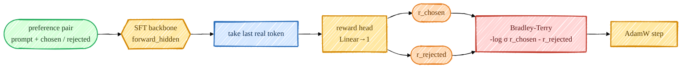

> **本章前置**:你已经读完第 01–12 章。你知道 Transformer 怎么从 token 序列产出隐藏状态和 logits(第 05、06 章)、知道交叉熵与最大似然(第 07 章)、知道因果注意力和右 padding(第 06、12 章),并且你已经亲手把 base 模型微调成了一个会听话的 **SFT 模型**(第 12 章)。
>
> **你将学到**:① 为什么需要"奖励模型(reward model)"——它把"人类更喜欢哪个回答"变成一个**可优化的标量信号**,以及它在 PPO 里扮演什么角色;② 标量奖励头怎么搭——在 SFT 主干的 `forward_hidden` 上接一个输出 1 维的线性头,取**最后一个真实 token** 的隐藏态打分,以及因果注意力为什么让右 padding 安全;③ **Bradley-Terry 损失的完整推导**——从"一对回答谁更好"的概率建模,经最大似然,推出 $\mathcal L = -\log\sigma(r_c - r_l)$;④ 训练用的成对偏好数据(HH-RLHF + UltraFeedback)与准备脚本;⑤ 怎么评估,以及为什么准确率"不会很高"是正常的;⑥ 在你自己的电脑上(CPU 也行)亲手跑一次。
>
> 👈 [上一章:SFT 指令微调](/posts/ai_infra/train-llm-from-scratch/train-llm-scratch-12-sft) ｜ [返回总览](/posts/ai_infra/train-llm-from-scratch/train-llm-scratch-overview)

---

上一章我们得到了一个会听话的 SFT 模型。但"会听话"不等于"答得好"。同一个问题,模型可能给出好几种回答,有的礼貌有用、有的啰嗦跑题。我们怎么让模型**偏向更好的那种**?这一章要造的"奖励模型",就是回答这个问题的第一块基石。



## 13.1 为什么需要奖励模型

先想一个根本困难:**"好不好"这件事,很难写成一个公式**。

SFT 用的是"标准答案"式的监督——每条数据都有一个"正确回答",模型照着学。但现实里,"一个回答好不好"往往**没有唯一正确答案**,只有"人更喜欢哪个"。比如"给我写个周末出游的建议",有一万种合理回答,你没法给每条都写标准答案,但你能比较:"A 比 B 好"。

人类的这种**偏好(preference)**,恰恰是最宝贵的信号。问题是:强化学习(下一章的 PPO)需要的是一个**数值奖励**——每生成一个回答,得有个分数告诉它"这次有多好",它才能朝高分方向优化。可我们总不能让真人 24 小时守在旁边,对模型吐出的每一句话现场打分吧?

**奖励模型(reward model,简称 RM)就是来当这个"自动打分员"的。** 它的使命是:**学会人类的偏好,然后对任意一个回答给出一个标量分数——分数越高,代表越受偏好。** 一旦训练好,它就能在 PPO 里**无限次、零成本地**给模型生成的回答打分,把"人类偏好"这个抽象的东西,变成一个可以反复优化的、具体的数字信号。

它在整条链路里的位置是这样的(回忆第 00 章的全流程图):

```
SFT 模型 ──► 奖励模型(本章)──► PPO(用 RM 的分数当奖励去优化策略)
```

> **类比**:奖励模型像一个"品味被训练过的评委"。你没法把"什么是好作文"写成数学公式,但你可以让评委看大量"A 比 B 好"的样例,学会一套打分的品味;之后他就能独立地给任何一篇作文打分。PPO 阶段,这个评委会不知疲倦地给模型的每次"作文"打分,推动模型越写越好。
>
> **本项目的特别之处**:本项目的 PPO/GRPO 主战场其实是**数学推理(GSM8K)**,那里有一个更省事的"打分员"——可以直接用验证器(verifier)检查 `<answer>` 里的数字对不对(这正是第 12 章埋的伏笔)。奖励模型则是**经典 RLHF(InstructGPT 那套)** 的打分方式,用在没有标准答案、只能靠人类偏好的开放式任务上。两条路本项目都实现了,这一章我们专注把"奖励模型"这条经典路线讲透。

## 13.2 标量奖励头:在 SFT 主干上接一个"打分器"

奖励模型不必从头训练。我们已经有一个理解语言、读得懂回答的 SFT 模型了——它的主干(backbone)能把一段文本编码成富含语义的隐藏状态。我们要做的,只是在这个主干上**接一个极小的"打分头"**,把隐藏状态映射成一个分数。这就是本项目反复强调的设计哲学:**"wrap, don't rewrite"(包一层,别重写)**。

### 13.2.1 复用 `forward_hidden`,丢掉 `lm_head`

回忆第 12 章:原 Transformer 有个方法 `forward_hidden`,它跑完整个主干,返回**最后一层 LayerNorm 之后的隐藏状态**,形状 `(B, T, n_embed)`——这正是原本喂给 `lm_head`(语言模型头)去算 logits 的那个张量。源码里它的注释说得很直接:这个隐藏状态"正是后训练时给辅助头(PPO 的 value 头、奖励模型的 reward 头)复用的正确表示"。

奖励模型就建立在它之上。看 `src/post_training/reward_model.py`:

```python
class RewardModel(nn.Module):
    """Wrap a Transformer and add a scalar reward head (no lm_head used)."""

    def __init__(self, transformer: Transformer) -> None:
        super().__init__()
        self.transformer = transformer
        n_embed = transformer.lm_head.in_features
        self.reward_head = nn.Linear(n_embed, 1, bias=False)
        nn.init.zeros_(self.reward_head.weight)  # start near-zero rewards
```

逐行读:

- `self.transformer = transformer`:**包住**一个完整的 Transformer 主干(就是从 SFT checkpoint 来的);
- `n_embed = transformer.lm_head.in_features`:读出主干隐藏维度(比如 1024),作为打分头的输入维度;
- `self.reward_head = nn.Linear(n_embed, 1, bias=False)`:**这就是奖励头**——一个把 `n_embed` 维隐藏向量映射到**1 维标量**的线性层。注意输出维度是 `1`:整个回答最后浓缩成**一个数**。原来的 `lm_head`(输出 50304 维 logits)在奖励模型里**完全不用**;
- `nn.init.zeros_(...)`:把奖励头初始化为全 0,这样训练刚开始时所有回答的奖励都接近 0,起步平稳。

### 13.2.2 在"最后一个真实 token"上读取奖励

一个回答有很多个 token,但奖励是**针对整个回答的一个分数**。该从哪个位置读出这个分数?

答案(沿用 InstructGPT 的惯例):**最后一个真实 token 的隐藏状态**。看 `forward`:

```python
    def token_rewards(self, idx: torch.Tensor) -> torch.Tensor:
        """Per-token scalar reward (B, T)."""
        hidden = self.transformer.forward_hidden(idx)
        return self.reward_head(hidden).squeeze(-1)

    def forward(self, idx, seq_lengths=None):
        rewards = self.token_rewards(idx)  # (B, T)
        if seq_lengths is None:
            return rewards[:, -1]
        return gather_last(rewards, seq_lengths)  # 最后一个真实 token 处的奖励 -> (B,)
```

逐步理解:

1. `token_rewards`:先用主干跑出隐藏状态 `(B, T, n_embed)`,再过奖励头,得到**每个位置一个标量**的张量 `(B, T)`——理论上序列里每个位置都能算出个分,但我们只想要"整个回答"的那一个;
2. `gather_last(rewards, seq_lengths)`:从每一行里挑出"**最后一个真实 token**"位置上的那个分(`gather_last` 就是去索引 `rewards[i, seq_lengths[i]-1]`),得到形状 `(B,)`——一条序列一个分。

**为什么是"最后一个真实 token"?** 因为注意力是**因果的(causal)**:第 06 章讲过,因果掩码让每个位置只能看见自己和它**左边**的 token。所以"最后一个真实 token"是**唯一一个把整个回答从头到尾都看过一遍**的位置——它的隐藏状态浓缩了对整个回答的理解,拿它来打总分最合适。

### 13.2.3 因果注意力为什么让右 padding 安全

训练时我们要把一批回答凑成一个矩形 batch,长短不一就得**补齐(padding)**。本项目用的是**右 padding**——在序列右边补上 EOT 直到对齐(见 `data_loader/preference_dataset.py`)。这会不会污染奖励?

不会,而且原因正是因果注意力。`reward_model.py` 顶部和 `04_reward_model_zh.md` 把这点讲得很清楚:由于注意力是因果的,**"最后一个真实 token"永远不会去关注它右边的 padding**(因果掩码禁止往右看)。所以:

- 我们打分的位置(最后一个真实 token)**完全看不到后面补的那些 padding**,它的隐藏状态干净、不受污染;
- 因此我们**根本不需要额外的注意力掩码**去屏蔽 padding——因果性已经天然帮我们做到了。

这就是为什么 `forward` 需要 `seq_lengths`(每行真实长度):有了它,`gather_last` 才能精确定位到"补 padding 之前的最后一个真实 token",而不是傻乎乎地取 `rewards[:, -1]`(那会取到 padding 上、得到无意义的分)。

> **小结**:奖励模型 = SFT 主干(`forward_hidden`)+ 一个 `Linear(n_embed, 1)` 打分头,在最后一个真实 token 上读出整段回答的标量分。因果注意力让右 padding 天然安全,无需注意力掩码。

## 13.3 Bradley-Terry 推导:从"谁更好"到一个损失函数

现在到了本章的数学核心。我们手上的训练数据是**成对偏好**:同一个提示 $x$,有一个**被选中的(chosen)** 回答 $y_c$ 和一个**被拒绝的(rejected)** 回答 $y_l$(下标 c = chosen,l = "loser"/rejected)。人类(或更强的 AI 评委)判定:$y_c$ 比 $y_l$ 好。

我们想训练奖励模型 $r_\theta$,让它给好回答打高分、差回答打低分。怎么把"$y_c$ 比 $y_l$ 好"这个**比较关系**变成一个能反向传播的损失?这就是 **Bradley-Terry 模型**要解决的。

### 13.3.1 把"偏好"建模成概率

Bradley-Terry 是一个经典的"成对比较"统计模型(最早用于给棋手、球队排名)。它的核心假设是:**每个对象都有一个潜在的"实力分",两者比较时,实力分高的"获胜"的概率,由两者分差决定。**

套到我们这儿:奖励 $r_\theta(x, y)$ 就是回答 $y$ 的"实力分"。那么"$y_c$ 击败 $y_l$(即人类更偏好 $y_c$)"的概率,被建模为:

$$
P(y_c \succ y_l \mid x) = \frac{\exp\!\big(r_\theta(x, y_c)\big)}{\exp\!\big(r_\theta(x, y_c)\big) + \exp\!\big(r_\theta(x, y_l)\big)}
$$

逐符号解释:

- $y_c \succ y_l$:读作"$y_c$ 优于 $y_l$";
- 分子是 chosen 回答奖励的指数 $e^{r_c}$,分母是两个回答奖励指数之和。这其实就是对两个分数做了一次 **softmax**,取出 chosen 那一项的概率;
- 直觉:如果 $r_c$ 比 $r_l$ 大很多,这个概率就接近 1(几乎肯定偏好 chosen);如果两者相等,概率就是 0.5(五五开)。完全符合我们对"偏好"的朴素理解。

### 13.3.2 化简成 sigmoid:只依赖分差

上面的式子可以漂亮地化简。把分子分母同时除以 $\exp(r_\theta(x, y_c))$(为简洁,下面把 $r_\theta(x, y_c)$ 简记为 $r_c$,$r_\theta(x, y_l)$ 记为 $r_l$):

$$
P(y_c \succ y_l) = \frac{1}{1 + \dfrac{\exp(r_l)}{\exp(r_c)}} = \frac{1}{1 + \exp\!\big(-(r_c - r_l)\big)}
$$

而 $\dfrac{1}{1 + e^{-z}}$ 正是大名鼎鼎的 **sigmoid 函数** $\sigma(z)$(第 02 章见过,它把任意实数压到 $(0,1)$ 之间)。所以:

$$
\boxed{\;P(y_c \succ y_l) = \sigma\!\big(r_c - r_l\big)\;}
$$

这是一个非常关键的观察:**偏好的概率只依赖于两个奖励的差 $r_c - r_l$,而和它们各自的绝对大小无关。**

- 这符合直觉:重要的是"chosen 比 rejected 好多少",而不是分数本身落在哪个数值区间;
- 它也带来一个性质:奖励模型学到的分数**没有绝对零点**(你给所有回答的分都加 100,偏好概率一点不变)。所以奖励模型的"绝对分值"没有意义,有意义的是**回答之间的相对高低**——这一点在 PPO 里会用奖励归一化等手段来处理。

### 13.3.3 最大似然 → 损失函数

有了"偏好概率"的模型,怎么训练参数 $\theta$?用第 07 章学过的**最大似然估计(MLE)**:**调整 $\theta$,让模型对"我们观察到的所有偏好判断"赋予尽可能高的概率。**

对单个偏好对,我们观察到的事实是"$y_c \succ y_l$",模型给这个事实的概率是 $\sigma(r_c - r_l)$。最大似然就是要**最大化**这个概率。按照第 07 章的老套路,"最大化概率"等价于"最小化负对数概率",于是单个样本的损失就是:

$$
\mathcal L = -\log P(y_c \succ y_l) = -\log \sigma\!\big(r_c - r_l\big)
$$

对一整批 $N$ 个偏好对取平均,就是奖励模型最终的训练目标:

$$
\boxed{\;\mathcal L_{\text{BT}} = -\frac{1}{N}\sum_{i=1}^{N} \log \sigma\!\big(r_{c}^{(i)} - r_{l}^{(i)}\big)\;}
$$

逐符号 + 直觉解释:

- $\sigma(r_c - r_l)$ 是"模型认为 chosen 确实更好"的概率,我们希望它**接近 1**;
- $-\log(\cdot)$:当括号里接近 1 时,$-\log$ 接近 0(损失小、皆大欢喜);当它接近 0(模型搞反了、给 rejected 打了更高分)时,$-\log$ 飙到很大(重罚);
- 所以最小化这个损失,**等价于推动 $r_c - r_l$ 变大**——也就是**逼着模型把 chosen 的奖励抬到 rejected 之上**。这正是我们想要的全部训练信号。

> **为什么只依赖分差,是个好性质?** 因为它让训练只关心"排序对不对",不强求模型去拟合某个绝对分值。人类偏好数据本就只告诉我们"谁比谁好",没告诉我们"好多少分",Bradley-Terry 恰好只用到这一点信息,不多不少。

### 13.3.4 对照真实实现:`bradley_terry_loss`

推导了一大堆,真实代码却短得感人。看 `src/post_training/reward_train.py`:

```python
def bradley_terry_loss(chosen_rewards: torch.Tensor, rejected_rewards: torch.Tensor) -> torch.Tensor:
    """Mean -log sigmoid(chosen - rejected) over a batch of preference pairs."""
    return -F.logsigmoid(chosen_rewards - rejected_rewards).mean()
```

逐项对照公式 $\mathcal L_{\text{BT}} = -\frac{1}{N}\sum_i \log\sigma(r_c^{(i)} - r_l^{(i)})$:

- `chosen_rewards - rejected_rewards` 就是**逐对的分差** $r_c - r_l$;
- `F.logsigmoid(...)` 一步算出 $\log\sigma(r_c - r_l)$(用 `logsigmoid` 而不是先 `sigmoid` 再 `log`,是为了数值稳定,避免 $\sigma$ 太接近 0 时 $\log$ 爆掉);
- 前面的负号和 `.mean()` 合起来就是 $-\frac{1}{N}\sum$。

一行代码,精确实现了整个推导。同文件里还有两个评估辅助函数:

```python
def preference_accuracy(chosen_rewards, rejected_rewards):
    """Fraction of pairs where the model scores the chosen response higher."""
    return (chosen_rewards > rejected_rewards).float().mean()

def reward_margin(chosen_rewards, rejected_rewards):
    """Mean reward gap (chosen - rejected)."""
    return (chosen_rewards - rejected_rewards).mean()
```

- `preference_accuracy`:模型把 chosen 打得比 rejected 高的**对数占比**——这是我们真正盯着看的指标;
- `reward_margin`:平均分差 $\overline{r_c - r_l}$,一个"模型是否还在拉开两者差距"的诊断量。

## 13.4 训练器:chosen 和 rejected 一次前向算完

训练循环在 `scripts/train_reward.py`。它从 SFT 的 checkpoint 初始化主干(`configs/reward.json` 里 `"sft_ckpt": "/ephemeral/ckpts/sft.pt"`),套上奖励头,然后对每个 batch 做一件聪明的事:**把 chosen 和 rejected 两边的序列拼成一个 `2B` 的大 batch,一次前向就算完两边的奖励**,再拆开来算损失:

```python
def _pair_rewards(rm, batch, cfg, ctx):
    B = batch["chosen_ids"].size(0)
    ids  = torch.cat([batch["chosen_ids"], batch["rejected_ids"]], dim=0)
    lens = torch.cat([batch["chosen_len"], batch["rejected_len"]], dim=0)
    with amp_autocast(cfg.amp_dtype, ctx.device):
        rewards = rm(ids, seq_lengths=lens).float()
    return rewards[:B], rewards[B:]
```

逐步理解:

1. `torch.cat([chosen_ids, rejected_ids], dim=0)`:把 chosen 那 `B` 条和 rejected 那 `B` 条在 batch 维度上**摞起来**,变成 `2B` 条;`lens` 同理摞起来;
2. `rm(ids, seq_lengths=lens)`:**一次前向**算出全部 `2B` 条序列的奖励(`seq_lengths` 保证每条都从它自己"最后一个真实 token"读分);
3. `rewards[:B]` 是前 `B` 条(chosen)的奖励 $r_c$,`rewards[B:]` 是后 `B` 条(rejected)的奖励 $r_l$。

之后主循环就是标准动作:

```python
cr, rr = _pair_rewards(rm, batch, cfg, ctx)
loss = bradley_terry_loss(cr, rr)
optimizer.zero_grad(set_to_none=True)
loss.backward()
torch.nn.utils.clip_grad_norm_(rm.parameters(), cfg.grad_clip)
optimizer.step()
```

数据由 `data_loader/preference_dataset.py` 的 `get_preference_iterator` 产出:它读一个 JSONL 文件(每行 `{"prompt", "chosen", "rejected"}`),把每一侧都过一遍**对话模板**(`encode_chat`,就是第 12 章那个),凑成 batch 时做**右 padding**(因果注意力下安全),并记录每条的**真实长度**给奖励模型读最后一个真实 token。学习率同样用余弦调度,每隔若干步在留出测试集上评估准确率。

## 13.5 训练数据:成对的人类偏好

奖励模型的"营养"全靠成对偏好数据。本项目用 `scripts/prepare_preference_data.py` 从两个真实公开数据集构造:

- **Anthropic/hh-rlhf**(helpful & harmless):真人标注的偏好,关于"哪个回答更有用、更无害";脚本里 `_split_hh` 负责把对话串拆成 `(prompt 上下文, 最终回答)`,再分别取 chosen / rejected 那一条的最终回答;
- **HuggingFaceH4/ultrafeedback_binarized**:由更强的 LLM 当评委判出的偏好对。

脚本把它们统一成 `{"prompt", "chosen", "rejected"}` 的 JSONL,产出训练集 `preferences.jsonl` 和留出测试集 `preferences_test.jsonl`(后者就是衡量偏好准确率用的)。过程里它会过滤掉 chosen 和 rejected 完全相同、或空内容的脏样本。

## 13.6 怎么评估,以及为什么准确率"不会很高"

训练时屏幕上主要看三个数(`scripts/train_reward.py` 里打印):

- **loss**——Bradley-Terry 损失。起点是 $-\log\sigma(0) = -\log 0.5 \approx 0.693$(随机水平:模型对两边一视同仁,分差为 0)。随着模型学会拉开 chosen 和 rejected 的差距,损失从 0.693 往下走。
- **train_acc / test_acc**——**偏好准确率**(`preference_accuracy`),即"chosen 被打得比 rejected 高"的对数占比。在干净、无歧义的样例上能到 `1.0`;但在**真实、含噪**的 HH-RLHF / UltraFeedback 上,预期大约只有 **0.65–0.75**。
- **margin**——平均分差 $\overline{r_c - r_l}$,看模型是否还在持续区分两者。

**为什么真实数据上准确率到 0.65–0.75 就算正常,不会更高?** 这不是模型不行,而是**人类偏好本身就含噪、含主观**:

- 同一对回答,不同标注者可能给出相反的偏好;甚至同一个人,不同时间、不同心情也可能改判;
- 很多回答对"半斤八两",好坏差异极其微妙,本就没有客观正确答案;
- 数据里还混着标注失误、口味差异。

奖励模型只能学到偏好里**有规律、可预测的那部分**;那些纯随机的噪声,它**学不会也不该学**(硬学就是过拟合噪声)。所以 0.65–0.75 反而是一个"健康"的信号:说明它抓住了真实信号,又没有去硬背噪声。理解这一点很重要——别看到准确率不是 0.9+ 就以为训练失败了。

> 训完的奖励模型存到 `configs/reward.json` 里 `out_ckpt` 指定的路径(默认 `/ephemeral/ckpts/reward.pt`)。到了 PPO 阶段,当 `--reward_source rm` 时,就会用 `load_reward_model` 把它加载进来,给模型生成的每个回答打分。

## 13.7 动手:亲手跑一次奖励模型(CPU 也能跑)

### 第 1 步:准备偏好数据

> ⚠️ **需要先准备数据 + 联网**:下面这条命令会从 HuggingFace 下载 HH-RLHF 和 UltraFeedback。

先 Read 一下 `scripts/prepare_preference_data.py` 顶部确认 flag(`--source` 取值 `hh` / `ultrafeedback` / `both`,还有 `--max_per_source`、`--out_dir`),然后运行:

```bash
PYTHONPATH=. HF_HOME=/ephemeral/hf_cache python scripts/prepare_preference_data.py --source both
```

它会在 `/ephemeral/data` 下写出 `preferences.jsonl`(训练)和 `preferences_test.jsonl`(留出测试)。想跑得快一点,可以把 `--max_per_source` 调小,例如 `--max_per_source 500`。

### 第 2 步:用 smoke 配置跑奖励模型训练

smoke 配置是 `configs/smoke/reward.json`(只覆盖了 `batch_size=4`、`epochs=1`、`max_len=256` 等几个小参数),而模型尺寸、`device: "cpu"`、`amp_dtype: null` 来自**同目录的** `configs/smoke/base.json`——配置加载器(`config/loader.py`)会自动让它用上同目录的 `base.json`,所以模型缩到极小、跑在 CPU 上。

用 `--config` 指定 smoke 配置(命令与 flag 已对照 `scripts/train_reward.py`、`src/post_training/cli.py` 核对):

```bash
PYTHONPATH=. python scripts/train_reward.py --config configs/smoke/reward.json
```

> ⚠️ 跑通需要 `cfg.sft_ckpt`(默认 `/ephemeral/ckpts/sft.pt`,即上一章产物)和 `cfg.pref_path`、以及测试集 `preferences_test.jsonl` 都存在。`src/post_training/cli.py` 会把 `RewardConfig` 的**每个字段**都变成一个 `--字段名` 命令行参数,所以 `--lr`、`--max_len`、`--batch_size`、`--sft_ckpt`、`--pref_path`、`--out_ckpt` 等都能在命令行覆盖;加 `--print-config` 可先打印解析后的完整配置检查一遍。

真正训练时用默认(非 smoke)配置并上 GPU:

```bash
PYTHONPATH=. python scripts/train_reward.py                                   # 单 GPU
PYTHONPATH=. torchrun --standalone --nproc_per_node=2 scripts/train_reward.py # 两张 GPU
# 想调参就在后面加,例如:--lr 1e-5 --max_len 768
```

跑完后会打印最终的 `test_acc` 和 `margin`,并把奖励模型 checkpoint 写到 `out_ckpt`。你现在手上就有了一个"自动打分员",它将在第 15 章的 PPO 里大显身手。

## 小结

- **奖励模型**把"人类更喜欢哪个回答"这种没法写成公式的东西,变成一个**可优化的标量分数**,从而能在 PPO 里无限次、零成本地给模型的回答打分。
- 它沿用 **"wrap, don't rewrite"**:在 SFT 主干的 `forward_hidden`(末尾 LayerNorm 后的隐藏态)上接一个 `Linear(n_embed, 1)` 奖励头,丢掉 `lm_head`,在**最后一个真实 token** 上读出整段回答的分。
- **因果注意力**让最后一个真实 token 看不到右边的 padding,所以右 padding 天然安全、无需额外注意力掩码;`seq_lengths` 用来精确定位"最后一个真实 token"。
- **Bradley-Terry 推导**:把偏好建模为 $P(y_c \succ y_l) = \sigma(r_c - r_l)$(只依赖分差),用最大似然推出损失 $\mathcal L = -\log\sigma(r_c - r_l)$;`bradley_terry_loss` 用 `-F.logsigmoid(cr - rr).mean()` 一行实现。
- 训练把 chosen / rejected 拼成 `2B` 一次前向算完;数据来自 HH-RLHF + UltraFeedback 的成对偏好。
- 评估看**偏好准确率**;真实含噪数据上 **0.65–0.75 是正常的**——因为人类偏好本身含噪,模型只学规律、不硬背噪声。

## 自测题

1. 为什么不能像 SFT 那样直接用"标准答案"来教模型"答得好"?奖励模型把什么变成了什么?
2. 奖励模型为什么从 SFT checkpoint 初始化,而不是从零训练?它复用了主干的哪个方法、丢掉了哪个头?
3. 为什么奖励要从"最后一个真实 token"读取?如果序列有右 padding,直接取 `rewards[:, -1]` 会出什么问题?`seq_lengths` 在这里起什么作用?
4. 推导 $P(y_c \succ y_l) = \sigma(r_c - r_l)$:从 $\dfrac{e^{r_c}}{e^{r_c}+e^{r_l}}$ 出发,怎么化简成 sigmoid?
5. 为什么 Bradley-Terry 损失"只依赖分差 $r_c - r_l$"是一个好性质?它意味着奖励的"绝对数值"有没有意义?
6. Bradley-Terry 损失的起始值大约是多少?为什么是这个数?
7. 真实偏好数据上准确率只有 0.65–0.75,这说明模型训练失败了吗?请用"人类偏好含噪"来解释为什么这反而正常。
8. 训练器为什么要把 chosen 和 rejected 拼成一个 `2B` 的 batch 一次前向?这样做有什么好处?

## 深入参考

- 本项目工程速查:`../04_reward_model_zh.md`(标量头、Bradley-Terry、训练器与运行命令)。
- 最大似然 → 负对数似然 → 损失的完整推导:本教程第 [07 章](/posts/ai_infra/train-llm-from-scratch/train-llm-scratch-07-objectives)。
- 因果注意力与掩码:本教程第 [06 章](/posts/ai_infra/train-llm-from-scratch/train-llm-scratch-06-attention)。
- 奖励模型与损失的源码:`src/post_training/reward_model.py`(`RewardModel`、`gather_last`)、`src/post_training/reward_train.py`(`bradley_terry_loss`、`preference_accuracy`)。
- 偏好数据加载与右 padding:`data_loader/preference_dataset.py`。
- 训练脚本与配置:`scripts/train_reward.py`、`configs/reward.json`、`configs/smoke/reward.json`。
- 数据准备:`scripts/prepare_preference_data.py`(HH-RLHF / UltraFeedback)。

下一章 👉 [第 14 章:DPO · 完整目标函数推导](/posts/ai_infra/train-llm-from-scratch/train-llm-scratch-14-dpo)
