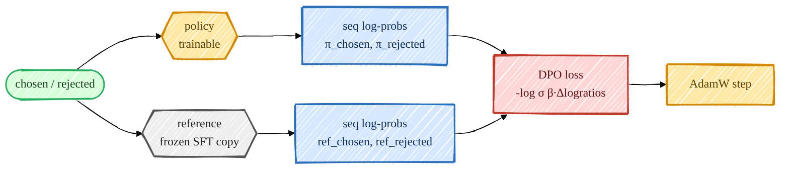

> **本章前置**:第 12 章([12_sft.md](/posts/ai_infra/train-llm-from-scratch/train-llm-scratch-12-sft))讲的 SFT 指令微调、第 13 章([13_reward_model.md](/posts/ai_infra/train-llm-from-scratch/train-llm-scratch-13-reward-model))讲的成对偏好、奖励模型与 **Bradley-Terry** 偏好概率,以及更早讲过的**交叉熵**(第 07 章)、**sigmoid 函数 $\sigma$**(第 13 章)。这些是本章推导的砖块,如果对它们还不熟,建议先回去过一遍。
>
> **你将学到**:为什么有了奖励模型 + PPO 那一套之后,人们还要发明 DPO;DPO 的核心思想——**直接用偏好数据优化策略,跳过显式奖励模型和强化学习循环**;从 RLHF 的带 KL 约束目标出发,一步一步、不跳步地推导出 **DPO 损失的闭式解**;对照本仓库 `src/post_training/dpo.py` 的真实代码逐行读懂;再了解两个变体 **ORPO** 与 **KTO**,以及如何在本项目里把 DPO 真正跑起来。
>
> 👈 上一章 [13_reward_model.md](/posts/ai_infra/train-llm-from-scratch/train-llm-scratch-13-reward-model) ｜ [返回总览](/posts/ai_infra/train-llm-from-scratch/train-llm-scratch-overview)

---

## 1. 先回忆:我们走到哪一步了

到这一章为止,我们手上已经有了三块东西:

1. **一个基座模型(base)**:在海量文本上预训练过,会"接着往下写"(第 11 章)。
2. **一个 SFT 模型**:在"指令 → 回答"数据上微调过,会**听话、按格式回答**(第 12 章)。我们把它记作 $\pi_{\mathrm{ref}}$ 或 SFT 模型。
3. **一份偏好数据**:每条是一个三元组 $(x,\, y_c,\, y_l)$——同一个提示 $x$,人类标注者认为回答 $y_c$(**c** = chosen,中选)比回答 $y_l$(**l** = losing/rejected,被拒)更好(第 13 章)。

> 术语小贴士:这一章会反复出现 **policy(策略)** 这个词。在强化学习里,"策略"就是那个"做决策的模型"。在我们这里,**策略就是那个会生成文本的 LLM 本身**——给它一个提示 $x$,它吐出一段回答 $y$,这就是它"做的决策"。所以下文你看到"策略 $\pi_\theta$",脑子里直接换成"我们正在训练的那个语言模型"即可。$\theta$(theta)是它的全部参数(权重)。

第 13 章我们用偏好数据训练了一个**奖励模型**(reward model,RM):它给任意 $(x,y)$ 打一个标量分数 $r(x,y)$,分数越高代表"人类越喜欢"。下一步(第 15 章)本来的剧本是:**拿这个奖励模型当裁判,用强化学习(PPO)去训练策略,让策略生成的回答尽量拿高分**。

这条路叫 **RLHF**(Reinforcement Learning from Human Feedback,基于人类反馈的强化学习),它是 ChatGPT 那一代模型对齐的经典做法。但它有个让人头疼的地方,我们先把痛点摆出来。

---

## 2. 动机:RLHF 那套为什么"又重又抖"

RLHF 的标准流程是**两阶段**:

1. **训练奖励模型**:用偏好数据拟合一个 $r(x,y)$(第 13 章已经做完)。
2. **强化学习微调策略**:固定住奖励模型,用 PPO 这类算法,让策略 $\pi_\theta$ 去"追"高奖励。

第 2 步具体长什么样?它需要一个完整的**强化学习循环**,每一步大致是:

- 让当前策略 $\pi_\theta$ 对一批提示**实际生成**回答(这一步叫 rollout,采样,很慢);
- 把生成的回答喂给**奖励模型**打分;
- 再算出"优势"、用 PPO 的裁剪目标更新策略;
- 同时还要养一个 **value(价值)模型**来估计基线,还要加 **KL 惩罚**防止策略跑偏……

你不用现在懂上面每个词(它们是第 15 章的内容),只需要感受到一件事:**这套东西零件多、要同时在显存里放好几个模型(策略、奖励模型、价值模型、参考模型)、还要不停地采样,既慢又容易训不稳**——学习率稍大、KL 系数没调好,模型就可能"崩"(开始胡言乱语或重复刷屏)。

于是有人问了一个很自然的问题:

> 我们手上明明已经有偏好数据 $(x,y_c,y_l)$ 了。**能不能不要中间那个奖励模型、也不要那个强化学习循环,直接拿偏好数据去调策略?**

**DPO(Direct Preference Optimization,直接偏好优化)**给出的答案是:**能**。而且它最漂亮的地方在于——这不是一个"差不多就行"的近似拍脑袋方案,而是可以从 RLHF 那个一模一样的数学目标里,**严格推导**出一个**只用偏好数据、连奖励模型都不用显式训练**的简单损失函数。

### 它凭什么能这样?(先建直觉,再上数学)

打个比方。RLHF 的做法像是:**先请一位评委(奖励模型)给所有菜打分,再让厨师(策略)对着评委的分数反复练习**。两步,要养评委、要反复试做。

DPO 的洞察是:**评委的"打分"和厨师"该怎么做菜"之间,其实有一座数学桥**。这座桥告诉我们:一旦你确定了"理想厨师"长什么样,你就**反过来**知道"评委的隐含打分"是多少——**奖励并不需要被单独训练出来,它已经"藏"在策略相对参考模型的变化里了**。

更具体一点(这就是后面要推的):

- RLHF 的目标有一个**已知的最优解**——理想策略 $\pi^*$ 可以用奖励 $r$ 和参考模型 $\pi_{\mathrm{ref}}$ 写成一个**闭式公式**。
- 把这个公式**反过来解**,就能把奖励 $r$ 用策略和参考模型表示出来——这叫**隐式奖励(implicit reward)**。
- 再把这个"隐式奖励"代进第 13 章的 **Bradley-Terry 偏好公式**里,那个最难算的部分会**奇迹般地抵消掉**,剩下的就是一个长得很像第 13 章奖励模型损失、但**直接作用在策略上**的损失函数。

于是奖励模型这个"中间商"被消掉了,强化学习的采样循环也不需要了——**只剩一个损失函数、一遍标准的梯度下降**。听起来太好了?我们现在就把这条桥一砖一砖搭出来,**保证每一步都不跳**。



---

## 3. 完整推导:从 RLHF 目标到 DPO 损失

这一节是本章的核心。我们分成 5 小步,每一步先写公式,再用大白话把每个符号讲清楚。**你只要会"对数 $\log$、指数 $\exp$、求和、sigmoid"这几样,就能一步步跟下来。**

### 3.1 第一步:写出 RLHF 的优化目标

RLHF 第 2 阶段(用 RL 调策略)其实是在解这样一个优化问题:

$$
\max_{\pi}\ \mathbb{E}_{x\sim D,\ y\sim \pi(\cdot\mid x)}\big[\, r(x,y)\,\big]\ -\ \beta\,\mathrm{KL}\!\big(\pi(\cdot\mid x)\,\big\|\,\pi_{\mathrm{ref}}(\cdot\mid x)\big)
$$

这个式子看着唬人,我们把它**逐块拆开**读:

- $\max_{\pi}$:我们要找一个**策略 $\pi$**,让后面整坨东西**最大**。这里的 $\pi$ 就是"给定提示 $x$ 时,生成回答 $y$ 的概率分布" $\pi(y\mid x)$。
- $\mathbb{E}_{x\sim D,\ y\sim \pi(\cdot\mid x)}[\,r(x,y)\,]$:**期望奖励**。$\mathbb{E}$ 是"期望"(就是"平均")的意思。$x\sim D$ 表示提示从数据分布 $D$ 里抽;$y\sim\pi(\cdot\mid x)$ 表示回答由**当前策略自己生成**。整体读作:"用当前策略去回答各种提示,平均能拿到多高的奖励"——我们当然希望它**越高越好**,所以放在 $\max$ 里。
- $\mathrm{KL}\big(\pi\,\|\,\pi_{\mathrm{ref}}\big)$:**KL 散度**,衡量"新策略 $\pi$ 和参考策略 $\pi_{\mathrm{ref}}$ 差多远"。两个分布越像,KL 越接近 0;越不像,KL 越大。$\pi_{\mathrm{ref}}$ 就是我们**冻结的 SFT 模型**。
- $-\beta\,\mathrm{KL}(\cdots)$:前面有个**负号**,意味着 KL 越大,整个目标越小。也就是说:**我们一边想拿高奖励,一边又被惩罚"不许离 SFT 模型太远"**。
- $\beta$(beta,读"贝塔"):一个大于 0 的**温度/强度系数**,控制"惩罚跑偏"这件事有多狠。$\beta$ 大 → 死死拽住别让它离 SFT 远;$\beta$ 小 → 给策略更大自由去追奖励。

> **为什么非要加这个 KL 惩罚项?** 因为奖励模型 $r$ 不是完美的。如果你让策略**毫无约束**地只追高奖励,它会找到奖励模型的漏洞、生成一些奖励虚高但其实是垃圾的文本(这叫 reward hacking,奖励钻空子)。加上"别离 SFT 太远"这条缰绳,能把策略**拴在一个本来就会说人话的模型附近**,既追奖励、又不至于跑飞。这一项是 RLHF 能稳定工作的关键,**也正是 DPO 推导能成立的关键**。

> KL 散度的展开式是 $\mathrm{KL}(\pi\|\pi_{\mathrm{ref}})=\mathbb{E}_{y\sim\pi}\!\big[\log\frac{\pi(y\mid x)}{\pi_{\mathrm{ref}}(y\mid x)}\big]$。你只需记住一句话:**它衡量两个概率分布的差异,恒大于等于 0,相等时为 0。**

### 3.2 第二步:这个目标的最优策略有闭式解

现在做一件关键的事:**这个带 KL 约束的最大化问题,数学上能解出"最优策略到底长什么样"**。结论是:

$$
\pi^*(y\mid x)=\frac{1}{Z(x)}\,\pi_{\mathrm{ref}}(y\mid x)\,\exp\!\Big(\tfrac{1}{\beta}\,r(x,y)\Big)
$$

先别管怎么推出来的(下面 3.2.1 给一个直觉版推导),先把它**读懂**:

- $\pi^*(y\mid x)$:上标 $*$ 表示"最优"。这就是"在那个 RLHF 目标下,最理想的策略给回答 $y$ 分配多少概率"。
- $\pi_{\mathrm{ref}}(y\mid x)$:参考模型(SFT)对 $y$ 的概率。注意最优策略是**以 SFT 为底**的。
- $\exp\!\big(\tfrac{1}{\beta}r(x,y)\big)$:一个**放大/缩小因子**。某个回答 $y$ 的奖励 $r$ 越高,这个因子越大,理想策略就**在 SFT 的基础上把它的概率往上抬**;奖励越低,因子越小(趋近 0),概率被往下压。
- $Z(x)$:**配分函数(partition function),也叫归一化常数**。它的作用是"把所有 $y$ 的概率加起来等于 1",定义为

$$
Z(x)=\sum_{y}\pi_{\mathrm{ref}}(y\mid x)\,\exp\!\Big(\tfrac{1}{\beta}\,r(x,y)\Big)
$$

**一句话总结这个闭式解**:理想策略 = **以 SFT 为基准**,**按奖励的指数去加权**,**再归一化成一个合法概率分布**。奖励高的回答概率被抬高,奖励低的被压低,而 $\beta$ 控制"抬/压"的力度。

#### 3.2.1 这个闭式解从哪来(直觉版推导,可跳过)

如果你只想拿结论,跳到 3.3。这里给一个不严格但能服人的推导。把目标(对单个 $x$)写成对 $\pi$ 的泛函:

$$
\max_{\pi}\ \mathbb{E}_{y\sim\pi}\big[r(x,y)\big]-\beta\,\mathbb{E}_{y\sim\pi}\Big[\log\tfrac{\pi(y\mid x)}{\pi_{\mathrm{ref}}(y\mid x)}\Big]
$$

把两个期望合并,并整体除以 $\beta$(不改变最大值的位置):

$$
\max_{\pi}\ \mathbb{E}_{y\sim\pi}\Big[\tfrac{1}{\beta}r(x,y)-\log\tfrac{\pi(y\mid x)}{\pi_{\mathrm{ref}}(y\mid x)}\Big]
$$

我们想把方括号里的东西凑成"一个 $\log$ 比值"的形式。注意 $\tfrac{1}{\beta}r=\log\exp(\tfrac{1}{\beta}r)$,于是:

$$
\tfrac{1}{\beta}r(x,y)-\log\tfrac{\pi}{\pi_{\mathrm{ref}}}
=\log\frac{\pi_{\mathrm{ref}}(y\mid x)\exp(\tfrac{1}{\beta}r(x,y))}{\pi(y\mid x)}
$$

现在把分子里那一坨**人为地除以再乘以** $Z(x)$($Z(x)$ 不依赖 $y$,只依赖 $x$),并令

$$
\pi^*(y\mid x):=\frac{1}{Z(x)}\pi_{\mathrm{ref}}(y\mid x)\exp\!\big(\tfrac{1}{\beta}r(x,y)\big)
$$

那么方括号变成:

$$
\log\frac{Z(x)\,\pi^*(y\mid x)}{\pi(y\mid x)}=\log Z(x)-\log\frac{\pi(y\mid x)}{\pi^*(y\mid x)}
$$

代回期望($\log Z(x)$ 与 $y$ 无关,可提出来):

$$
\max_{\pi}\ \Big[\log Z(x)-\mathbb{E}_{y\sim\pi}\log\tfrac{\pi(y\mid x)}{\pi^*(y\mid x)}\Big]
=\log Z(x)-\min_{\pi}\,\mathrm{KL}\big(\pi\,\|\,\pi^*\big)
$$

最后一步用到:$\mathbb{E}_{y\sim\pi}\log\frac{\pi}{\pi^*}$ **正是** $\mathrm{KL}(\pi\|\pi^*)$。而我们知道 **KL 散度恒 $\ge 0$,且当且仅当两个分布完全相等时取到 0**。所以要让整体最大,唯一的办法就是让 $\mathrm{KL}(\pi\|\pi^*)=0$,即:

$$
\boxed{\ \pi=\pi^*\ }
$$

这就证明了 3.2 那个闭式解。**翻译成大白话**:在"追奖励 + 别离 SFT 太远"的拉扯下,最好的策略就是"把 SFT 按奖励的指数重新加权一下"——多一分不行(会离 SFT 太远),少一分不行(没充分追奖励)。

### 3.3 第三步:配分函数 $Z(x)$ 算不动——这是大麻烦

3.2 的闭式解看着很美,但**实际上没法直接用**。问题全出在 $Z(x)$ 身上:

$$
Z(x)=\sum_{y}\pi_{\mathrm{ref}}(y\mid x)\,\exp\!\Big(\tfrac{1}{\beta}\,r(x,y)\Big)
$$

这个求和 $\sum_y$ 是**对所有可能的回答 $y$ 求和**。一个回答是一串 token,长度几十上百,每个位置有几万种词表选择——**可能的 $y$ 的数量是天文数字(指数爆炸)**,根本枚举不完。所以 $Z(x)$ **算不出来**。

> 这正是为什么经典 RLHF 不直接用这个闭式解、而是绕道去跑 PPO:PPO 用采样和策略梯度**回避**了显式计算 $Z(x)$。但代价就是第 2 节说的那一堆复杂度。

DPO 的高明之处,是**根本不去算 $Z(x)$,而是想办法让它自己消失**。怎么消?往下看。

### 3.4 第四步:反解出"隐式奖励"

我们把 3.2 的闭式解**反过来解出 $r(x,y)$**。从

$$
\pi^*(y\mid x)=\frac{1}{Z(x)}\pi_{\mathrm{ref}}(y\mid x)\exp\!\big(\tfrac{1}{\beta}r(x,y)\big)
$$

两边除以 $\pi_{\mathrm{ref}}(y\mid x)$,再乘上 $Z(x)$:

$$
\frac{\pi^*(y\mid x)}{\pi_{\mathrm{ref}}(y\mid x)}\,Z(x)=\exp\!\Big(\tfrac{1}{\beta}r(x,y)\Big)
$$

两边取 $\log$($\log\exp(u)=u$,指数和对数互相抵消):

$$
\log\frac{\pi^*(y\mid x)}{\pi_{\mathrm{ref}}(y\mid x)}+\log Z(x)=\tfrac{1}{\beta}\,r(x,y)
$$

两边乘 $\beta$,把 $r(x,y)$ 单独拎到左边:

$$
\boxed{\ r(x,y)=\beta\,\log\frac{\pi^*(y\mid x)}{\pi_{\mathrm{ref}}(y\mid x)}+\beta\,\log Z(x)\ }
$$

**逐项读这个公式**(它就是 DPO 的灵魂):

- $\beta\log\dfrac{\pi^*(y\mid x)}{\pi_{\mathrm{ref}}(y\mid x)}$:**回答 $y$ 在最优策略下相对参考模型,概率"涨了多少"的对数,乘以 $\beta$**。如果最优策略比 SFT 更爱说 $y$,这一项就是正的;更不爱说,就是负的。
- $\beta\log Z(x)$:那个**讨厌的、算不动的**配分函数项。注意它**只跟 $x$ 有关、跟 $y$ 无关**——对同一个提示 $x$ 下的任意回答,它都是同一个数。**记住这一点,这就是后面让它消失的钥匙。**

这个式子在说一件很深刻的事:**奖励 $r$ 不必单独训练,它"等价于"策略相对参考模型的对数概率比(再差一个只跟 $x$ 有关的常数)。** 这个 $\beta\log\frac{\pi}{\pi_{\mathrm{ref}}}$ 就叫 **隐式奖励(implicit reward)**——它隐藏在策略的变化里,我们从来不用显式地造一个奖励模型出来。

### 3.5 第五步:代入 Bradley-Terry,$\log Z(x)$ 抵消

现在把"隐式奖励"接回第 13 章的偏好模型。回忆第 13 章:人类偏好用 **Bradley-Terry** 模型刻画——"$y_c$ 比 $y_l$ 好"的概率由两者奖励之差经过 sigmoid 决定:

$$
P(y_c\succ y_l\mid x)=\sigma\big(r(x,y_c)-r(x,y_l)\big)
$$

其中 $\sigma(z)=\dfrac{1}{1+e^{-z}}$ 是 sigmoid(第 13 章已讲),$y_c\succ y_l$ 读作"$y_c$ 优于 $y_l$"。**关键来了**:把 3.4 反解出的 $r$ 代进**奖励之差** $r(x,y_c)-r(x,y_l)$。我们用最优策略 $\pi^*$ 的角色,把训练中的策略记为 $\pi_\theta$(我们要优化的对象):

$$
r(x,y_c)-r(x,y_l)
=\Big[\beta\log\tfrac{\pi_\theta(y_c\mid x)}{\pi_{\mathrm{ref}}(y_c\mid x)}+\beta\log Z(x)\Big]
-\Big[\beta\log\tfrac{\pi_\theta(y_l\mid x)}{\pi_{\mathrm{ref}}(y_l\mid x)}+\beta\log Z(x)\Big]
$$

看那两个 $\beta\log Z(x)$:一个加、一个减,而且**它们是同一个数**(因为 $Z(x)$ 只跟 $x$ 有关,跟 $y_c$ 还是 $y_l$ 无关)。于是——

$$
\beta\log Z(x)-\beta\log Z(x)=0
$$

**那个算不动的配分函数,被减法干净利落地消掉了!** 这就是 DPO 全部魔法的所在。剩下:

$$
r(x,y_c)-r(x,y_l)=\beta\log\frac{\pi_\theta(y_c\mid x)}{\pi_{\mathrm{ref}}(y_c\mid x)}-\beta\log\frac{\pi_\theta(y_l\mid x)}{\pi_{\mathrm{ref}}(y_l\mid x)}
$$

代回 Bradley-Terry,偏好概率变成:

$$
P(y_c\succ y_l\mid x)=\sigma\!\Big(\beta\log\tfrac{\pi_\theta(y_c\mid x)}{\pi_{\mathrm{ref}}(y_c\mid x)}-\beta\log\tfrac{\pi_\theta(y_l\mid x)}{\pi_{\mathrm{ref}}(y_l\mid x)}\Big)
$$

最后一步:训练就是**最大化这个偏好概率的对数似然**(让模型尽量同意"人类标的 chosen 确实更好"),等价于**最小化它的负对数**。这就是 **DPO 损失**:

$$
\boxed{\ \mathcal{L}_{\mathrm{DPO}}=-\,\log\sigma\!\Big(\beta\log\tfrac{\pi_\theta(y_c\mid x)}{\pi_{\mathrm{ref}}(y_c\mid x)}-\beta\log\tfrac{\pi_\theta(y_l\mid x)}{\pi_{\mathrm{ref}}(y_l\mid x)}\Big)\ }
$$

(对一个 batch 里所有偏好对,再取平均。)

**推导到此结束。** 我们从 RLHF 那个"追奖励 + KL 约束"的目标出发,没做任何近似,纯靠代数,就得到了一个**只用偏好数据 $(x,y_c,y_l)$、只需要策略 $\pi_\theta$ 和冻结参考 $\pi_{\mathrm{ref}}$、连奖励模型都不出现、连 $Z(x)$ 都不用算**的损失函数。回头看一眼:它长得和第 13 章的奖励模型损失 $-\log\sigma(r_c-r_l)$ 几乎一模一样,只是把"奖励模型打的分 $r$"换成了"策略的隐式奖励 $\beta\log\frac{\pi_\theta}{\pi_{\mathrm{ref}}}$"。**奖励模型被"折叠"进了策略本身。**

### 3.6 逐项再读一遍 DPO 损失(以及它在干嘛)

把损失里的核心量起个名字,方便讲:

- $\hat r_c:=\beta\log\dfrac{\pi_\theta(y_c\mid x)}{\pi_{\mathrm{ref}}(y_c\mid x)}$ —— chosen 的**隐式奖励**。
- $\hat r_l:=\beta\log\dfrac{\pi_\theta(y_l\mid x)}{\pi_{\mathrm{ref}}(y_l\mid x)}$ —— rejected 的**隐式奖励**。

于是 $\mathcal{L}_{\mathrm{DPO}}=-\log\sigma(\hat r_c-\hat r_l)$。

- **$\beta$ 的作用**:它是隐式奖励的"放大倍数",也是 KL 约束的强度。$\beta$ 大 → 一点点对数概率比的变化就被放得很大,损失对"偏离 ref"很敏感,策略被**紧紧拴**在参考模型附近(更新更保守);$\beta$ 小 → 给策略更大空间偏离 ref。本项目默认 $\beta=0.1$。
- **参考模型 $\pi_{\mathrm{ref}}$ 的作用**:它是**锚点**。损失里始终是"策略相对 ref 涨了多少",不是"策略本身概率多少"。这很重要——它防止模型为了拉开 chosen/rejected 的差距而**无脑地把所有概率乱拉**(那样会破坏语言能力)。有了 ref 当基准,优化的是"**相对**变化",模型仍被锚在那个会说人话的 SFT 上。
- **为什么这等价于"让 chosen 相对 ref 涨得比 rejected 更多"**:最小化 $-\log\sigma(\hat r_c-\hat r_l)$ 就是**最大化 $\hat r_c-\hat r_l$**(因为 $\log\sigma$ 是单调增的)。而 $\hat r_c-\hat r_l$ 正是"chosen 相对 ref 的对数概率比"减去"rejected 相对 ref 的对数概率比"。把它推大,就是要求:**相对于参考模型,策略给 chosen 的概率涨幅,要明显超过给 rejected 的涨幅。** 注意——不是"chosen 概率绝对要高",而是"相对 ref 的**涨幅差**要大"。

#### 梯度直觉:它自动给"难分对"更大权重

来看损失对策略参数 $\theta$ 的梯度(只看方向和权重,推导可跳)。记 $u=\hat r_c-\hat r_l$,则 $\mathcal{L}=-\log\sigma(u)$,而

$$
\frac{\partial \mathcal{L}}{\partial \theta}=-\,\underbrace{\sigma(-u)}_{\text{权重}}\cdot\Big(\frac{\partial \hat r_c}{\partial\theta}-\frac{\partial \hat r_l}{\partial\theta}\Big)\cdot\beta
$$

(用到 $\frac{d}{du}\log\sigma(u)=\sigma(-u)$。)这里的关键是前面那个权重 $\sigma(-u)$:

- 当模型**已经分对了**($\hat r_c$ 远大于 $\hat r_l$,即 $u$ 很大正数),$\sigma(-u)$ 趋近 0 → **几乎不更新**。已经会的题,不用再练。
- 当模型**分错了或拿不准**($u$ 是负数或接近 0),$\sigma(-u)$ 接近 1 甚至更大的有效权重 → **大力更新**。错得越离谱、越难分的对,梯度权重越大,模型在它们身上学得越狠。

**大白话**:DPO 自带一个"哪壶不开提哪壶"的机制——会做的题不浪费力气,把精力都花在自己当前还分不清好坏的偏好对上。这也是它比"对所有样本一视同仁"更稳、更高效的原因之一。梯度方向 $\frac{\partial\hat r_c}{\partial\theta}-\frac{\partial\hat r_l}{\partial\theta}$ 则是在说:**抬高 chosen 的对数概率、压低 rejected 的对数概率**,正合我们的直觉。

---

## 4. 对照真实代码:`dpo_loss` 逐行读

理论讲完,我们落到本仓库的真实实现。DPO 损失在 `src/post_training/dpo.py`。**在贴之前先说清楚一个关键事实**(它把上面公式里的 $\pi(y\mid x)$ 和代码对上号):

> 公式里的 $\log\pi(y\mid x)$ 是**整段回答 $y$ 的对数概率**。而一段回答是一串 token,所以它等于**这段回答里每个 token 的对数概率之和**:$\log\pi(y\mid x)=\sum_{t}\log\pi(y_t\mid x,y_{<t})$。这个"对一整条 response 的 token 对数概率求和"由 `src/post_training/rollout.py` 里的 `sequence_logprobs` 完成。

我们先看 `sequence_logprobs`(`src/post_training/rollout.py`):

```python
def sequence_logprobs(
    model,
    sequences: torch.Tensor,
    response_mask: torch.Tensor,
    *,
    temperature: float = 1.0,
    requires_grad: bool = True,
) -> tuple[torch.Tensor, torch.Tensor]:
    """
    Sequence-level summed log-prob over response tokens (used by DPO/KTO/ORPO).

    Returns ``(sum_logprob, n_tokens)`` each shape (B,). The per-token mean is
    ``sum_logprob / n_tokens.clamp(min=1)``.
    """
    lp, mask = compute_logprobs(model, sequences, response_mask, temperature=temperature, requires_grad=requires_grad)
    m = mask.to(lp.dtype)
    return (lp * m).sum(dim=-1), m.sum(dim=-1)
```

逐行讲:

- `lp, mask = compute_logprobs(...)`:`compute_logprobs` 用 **teacher forcing**(把整条序列喂进模型,一次拿到每个位置预测下一个真实 token 的对数概率,和第 07 章训练时算交叉熵是同一套"错位对齐")。`lp` 形状 `(B, T-1)`,是**每个位置上、那个真实 token 的对数概率**;`mask` 标出"哪些位置属于回答 response(而非提示 prompt)"——我们只算回答部分的概率,提示部分不算。
- `(lp * m).sum(dim=-1)`:用 `mask` 把提示位置清零,再**沿 token 维求和**——这就把"每个 token 的对数概率"加成了"**整条回答的对数概率** $\log\pi(y\mid x)$",形状 `(B,)`,每条序列一个数。
- 第二个返回值 `m.sum(dim=-1)`:这条回答里**有多少个有效 response token**(ORPO 要用它把和变成均值)。

> **一个容易被忽略但很重要的数值细节**(写在 `rollout.py` 文件头):**对数概率一律在 fp32 下计算**(`logits.float()`),即使外层开了 bf16 自动混合精度也不例外。原因正是 DPO/PPO/GRPO 都要**相减**对数概率(就是损失里那些 $\log\frac{\pi_\theta}{\pi_{\mathrm{ref}}}$ 的减法),bf16 在这种相减上的舍入误差会带来实质伤害,所以这一步必须用 fp32。

现在看 DPO 损失本体(`src/post_training/dpo.py`):

```python
def dpo_loss(
    policy_chosen_logps: torch.Tensor,
    policy_rejected_logps: torch.Tensor,
    ref_chosen_logps: torch.Tensor,
    ref_rejected_logps: torch.Tensor,
    beta: float = 0.1,
) -> tuple[torch.Tensor, torch.Tensor, torch.Tensor]:
    """
    Standard DPO loss. Inputs are summed response log-probs (B,).

    Returns ``(loss, chosen_reward, rejected_reward)`` where the implicit rewards
    ``beta * (policy_logp - ref_logp)`` are detached diagnostics.
    """
    pi_logratios = policy_chosen_logps - policy_rejected_logps
    ref_logratios = ref_chosen_logps - ref_rejected_logps
    logits = pi_logratios - ref_logratios
    loss = -F.logsigmoid(beta * logits).mean()
    chosen_reward = beta * (policy_chosen_logps - ref_chosen_logps).detach()
    rejected_reward = beta * (policy_rejected_logps - ref_rejected_logps).detach()
    return loss, chosen_reward, rejected_reward
```

四个输入,都是**整条回答求和后的对数概率**(由上面的 `sequence_logprobs` 算出),形状 `(B,)`:

- `policy_chosen_logps` = $\log\pi_\theta(y_c\mid x)$ —— 策略给 chosen 的对数概率;
- `policy_rejected_logps` = $\log\pi_\theta(y_l\mid x)$ —— 策略给 rejected 的;
- `ref_chosen_logps`、`ref_rejected_logps` = 同样两条,但来自**冻结的参考模型** $\pi_{\mathrm{ref}}$。

逐行对照我们推出的公式 $\mathcal{L}=-\log\sigma\big(\beta[(\log\frac{\pi_\theta(y_c)}{\pi_{\mathrm{ref}}(y_c)})-(\log\frac{\pi_\theta(y_l)}{\pi_{\mathrm{ref}}(y_l)})]\big)$:

1. `pi_logratios = policy_chosen_logps - policy_rejected_logps`
   = $\log\pi_\theta(y_c\mid x)-\log\pi_\theta(y_l\mid x)$。利用 $\log a-\log b=\log\frac ab$,这是"策略下 chosen 比 rejected 的对数概率高多少"。
2. `ref_logratios = ref_chosen_logps - ref_rejected_logps`
   = 同样的差,但在**参考模型**下。
3. `logits = pi_logratios - ref_logratios`
   = $\big(\log\frac{\pi_\theta(y_c)}{\pi_\theta(y_l)}\big)-\big(\log\frac{\pi_{\mathrm{ref}}(y_c)}{\pi_{\mathrm{ref}}(y_l)}\big)$。重新整理一下,这**正好等于** $\log\frac{\pi_\theta(y_c)}{\pi_{\mathrm{ref}}(y_c)}-\log\frac{\pi_\theta(y_l)}{\pi_{\mathrm{ref}}(y_l)}$(就是公式里 sigmoid 括号内、还没乘 $\beta$ 的那部分)。注意代码里 $\log Z(x)$ 根本不出现——因为推导时它已经被减法消掉了,**代码里压根不需要它**。
4. `loss = -F.logsigmoid(beta * logits).mean()`
   = $-\log\sigma(\beta\cdot\texttt{logits})$ 再对 batch 取平均。`F.logsigmoid` 是 $\log\sigma$ 的**数值稳定**实现(直接 `log(sigmoid(x))` 在 x 很负时会下溢,PyTorch 这个内置函数避免了)。这一行就是 $\mathcal{L}_{\mathrm{DPO}}$ 本人。
5. `chosen_reward`、`rejected_reward`:把隐式奖励 $\hat r_c=\beta(\log\pi_\theta(y_c)-\log\pi_{\mathrm{ref}}(y_c))$、$\hat r_l$ 算出来。`.detach()` 表示"**只用来记日志/算指标,不参与反向传播**"——它们不影响训练,只是给我们看"模型现在给 chosen / rejected 打的隐式分各是多少"。

训练脚本怎么把这些串起来?看 `scripts/train_dpo.py` 的 `_compute_losses`:它把 chosen 和 rejected 的 ids **拼成一个大 batch** 一起前向(省一次 forward),用 `sequence_logprobs` 一次性拿到策略下两半的对数概率(`requires_grad=True`,要回传梯度);再在 `torch.no_grad()` 下用**冻结的 ref** 算同样两半(`requires_grad=False`,不回传);最后按 `cfg.loss_type` 路由到 `dpo_loss` / `orpo_loss` / `kto_loss`。策略由 `load_backbone_from_ckpt(cfg, cfg.sft_ckpt, ...)` **从 SFT 检查点初始化**,参考模型由 `make_frozen_copy(policy, ...)` **对策略做一次冻结深拷贝**得到——这正对应本章一直强调的:**policy 从 SFT 初始化,reference 是 SFT 的冻结深拷贝**。

---

## 5. 两个变体:ORPO 与 KTO(本项目同文件实现)

`src/post_training/dpo.py` 里在同一个 `--loss_type` 开关后面还提供了两个流行变体。它们解决"标准 DPO 的两个不便",你按需要选用。

### 5.1 ORPO:连参考模型都不要,SFT 与对齐一步搞定

标准 DPO 需要在显存里**同时放策略和冻结的参考模型**(两份权重),而且默认你已经做过 SFT。**ORPO**(Odds Ratio Preference Optimization,几率比偏好优化)更激进:**它不需要参考模型**,而是把"SFT(把 chosen 学进去)"和"对齐(让 chosen 比 rejected 更受偏好)"**折叠进同一个损失、一个阶段**。看代码(`src/post_training/dpo.py`):

```python
def orpo_loss(
    policy_chosen_logps: torch.Tensor,
    policy_rejected_logps: torch.Tensor,
    chosen_n_tokens: torch.Tensor,
    rejected_n_tokens: torch.Tensor,
    orpo_lambda: float = 1.0,
) -> tuple[torch.Tensor, torch.Tensor, torch.Tensor]:
    """
    ORPO (reference-free). Uses per-token MEAN log-probs.

    ``L = NLL(chosen) + lambda * -log sigmoid(log_odds_chosen - log_odds_rejected)``
    where ``log_odds = mean_logp - log(1 - exp(mean_logp))``.
    """
    chosen_mean = policy_chosen_logps / chosen_n_tokens.clamp(min=1)
    rejected_mean = policy_rejected_logps / rejected_n_tokens.clamp(min=1)
    log_odds = (chosen_mean - _log1mexp(chosen_mean)) - (rejected_mean - _log1mexp(rejected_mean))
    or_loss = -F.logsigmoid(log_odds).mean()
    nll = -chosen_mean.mean()
    loss = nll + orpo_lambda * or_loss
    # Implicit rewards for logging: the mean log-probs themselves.
    return loss, chosen_mean.detach(), rejected_mean.detach()
```

要点(不必深抠每个公式,抓住思路即可):

- 它用的是**每 token 的平均**对数概率(`logps / n_tokens`),不是求和——所以长短回答更公平。
- 损失有**两项相加**:`nll = -chosen_mean.mean()` 是对 chosen 回答的**标准 SFT 负对数似然**(就是第 07/12 章的交叉熵,逼模型学会 chosen 怎么说);`or_loss` 是一个**几率比(odds ratio)偏好项**,逼 chosen 的"几率"比 rejected 的"几率"高。`orpo_lambda`(默认 1.0)控制对齐项的权重。
- `log_odds = mean_logp - log(1 - exp(mean_logp))` 是把"概率"换算成"对数几率"(几率 = 概率 / (1-概率));`_log1mexp` 是数值稳定地算 $\log(1-e^x)$。
- **适用场景**:你想**省掉参考模型那份显存、把 SFT 和对齐合并成一步训完**时用 ORPO。注意它的 loss 起始值会比 DPO 高(因为含 NLL 项),不要被吓到。在 `train_dpo.py` 里,`loss_type=="orpo"` 时 `ref` 直接被设为 `None`,不会去做冻结拷贝。

### 5.2 KTO:不需要成对数据,单条样本 + 参考 KL 基线

标准 DPO 要求**成对**数据 $(y_c, y_l)$——同一个提示下,你得有"一好一坏"两条回答。但现实中常常只有**单条**反馈:用户对某条回答点了"赞 👍"或"踩 👎",并没有配对。**KTO**(Kahneman-Tversky Optimization,以行为经济学家命名)就为这种情况设计:**它从"每条样本是合意(desirable)还是不合意(undesirable)"出发**,不需要成对。看代码(`src/post_training/dpo.py`):

```python
def kto_loss(
    policy_chosen_logps: torch.Tensor,
    policy_rejected_logps: torch.Tensor,
    ref_chosen_logps: torch.Tensor,
    ref_rejected_logps: torch.Tensor,
    beta: float = 0.1,
    desirable_weight: float = 1.0,
    undesirable_weight: float = 1.0,
) -> tuple[torch.Tensor, torch.Tensor, torch.Tensor]:
    """
    KTO from paired data: chosen = desirable, rejected = undesirable, with a reference-KL
    baseline estimated (detached) from the batch's mean log-ratio.
    """
    chosen_logratio = policy_chosen_logps - ref_chosen_logps
    rejected_logratio = policy_rejected_logps - ref_rejected_logps
    kl = torch.cat([chosen_logratio, rejected_logratio]).mean().clamp(min=0).detach()
    chosen_losses = 1.0 - torch.sigmoid(beta * (chosen_logratio - kl))
    rejected_losses = 1.0 - torch.sigmoid(beta * (kl - rejected_logratio))
    loss = (desirable_weight * chosen_losses).mean() + (undesirable_weight * rejected_losses).mean()
    return loss, (beta * chosen_logratio).detach(), (beta * rejected_logratio).detach()
```

要点:

- 它仍然用**参考模型**(和 DPO 一样需要 ref)。每条样本算一个"相对 ref 的对数概率比" `logratio = policy_logp - ref_logp`。
- `kl` 是一个**从当前 batch 估计出来的参考 KL 基线**(整个 batch 对数概率比的均值,`clamp(min=0)` 截到非负,`detach` 不回传)。它充当一个"水平线":合意样本要被推到**水平线之上**,不合意样本要被压到**水平线之下**。
- `chosen_losses = 1 - σ(β(logratio - kl))`:对合意(chosen)样本,想让 `logratio` 超过基线 `kl` → 把这一项往 0 压;`rejected_losses = 1 - σ(β(kl - logratio))`:对不合意(rejected)样本,想让 `logratio` 低于基线 → 同理。`desirable_weight` / `undesirable_weight` 让你给"赞"和"踩"不同的权重(现实中常常踩的样本多于赞,可以调权重平衡)。
- **适用场景**:你只有**逐条的"赞/踩"信号、没有配对偏好**时用 KTO。本项目为了演示,直接把成对数据里的 chosen 当"合意"、rejected 当"不合意"来喂它。

> 还有一个小工具 `implicit_accuracy(chosen_reward, rejected_reward)`:它返回"有多少比例的对,模型给 chosen 的隐式奖励 > 给 rejected 的隐式奖励"——这就是下一节"隐式奖励准确率"指标的来源,DPO / ORPO / KTO 三者共用。

**三者一句话对比**:

| 变体 | 要参考模型吗 | 数据形态 | 一句话定位 |
|---|---|---|---|
| **DPO** | 要(冻结 SFT) | 成对 $(y_c,y_l)$ | 标准款,推导最干净,最常用 |
| **ORPO** | **不要** | 成对 | 省一份显存,SFT + 对齐一步训完 |
| **KTO** | 要 | **可非成对**(赞/踩) | 只有单条反馈时用 |

---

## 6. 评估:怎么知道 DPO 练好了

DPO 训练脚本 `scripts/train_dpo.py` 在训练中和结束时报告这几个数,对应第 13 章学过的偏好概念:

- **loss(损失)**:DPO / KTO 的起点接近 `0.693`。这个数不是巧合——$-\log\sigma(0)=-\log 0.5=\log 2\approx 0.693$,它表示训练刚开始时策略 = 参考模型,隐式奖励差为 0,sigmoid 给出 0.5"五五开"。随训练损失应当**下降**。ORPO 起点更高(因为多了 NLL 项)。
- **acc(隐式奖励准确率)**:由 `implicit_accuracy` 算出——**有多少比例的偏好对,模型给 chosen 的隐式奖励确实高于 rejected**。它应当从 0.5 附近**往上爬**(越过 0.5 说明模型开始把人类偏好学进去了)。
- **r_chosen / r_rejected 与 margin(间隔)**:两个隐式奖励 $\hat r_c$、$\hat r_l$ 的平均值,以及它们的差 `margin = r_chosen - r_rejected`。健康的训练里**间隔应当逐渐拉大**——chosen 越来越受偏好、rejected 越来越被压低。脚本里 `eval_implicit_acc` 在留出的测试集 `preferences_test.jsonl` 上算 `test_acc` 和 `margin`。
- **GSM8K dev 准确率**:这是**真正的下游检验**。前面那些隐式指标只说明"模型学到了偏好的相对关系",但**最终目的**是模型在真实任务上更强。本项目用 GSM8K(小学数学应用题)开发集的准确率,衡量对齐后模型的真实能力是否提升(第 17 章会专门讲评估)。

> **一句重要提醒**(来自参考文档):DPO 用**很小的学习率**(本项目默认 `lr=5e-7`)。因为隐式奖励对"偏离 ref"很敏感,学习率一大,模型很容易被推离参考模型**过头**,导致退化(开始胡说、重复)。**宁可轻柔一些、慢一点。**

---

## 7. 动手:把 DPO 跑起来

前提:你已经有一个 SFT 检查点(第 12 章产出,默认 `sft.pt`)和一份偏好数据(默认 `preferences.jsonl`)。先用 **smoke 小配置**在 CPU 上验证流程能跑通(模型极小、几步就停),再上真训练。

**先 smoke(几秒到几分钟,CPU 可跑)**。本项目的 smoke 配置在 `configs/smoke/dpo.json`(`batch_size=4`、`max_len=256`、只跑很少步)。训练脚本通过 `parse_config_with_json` 读取 JSON 覆盖默认值,命令行 flag 再覆盖 JSON:

```bash
PYTHONPATH=. python scripts/train_dpo.py --config configs/smoke/dpo.json --loss_type dpo --beta 0.1
```

**正式训练(单卡可用 `python`)**:

```bash
PYTHONPATH=. python scripts/train_dpo.py --loss_type dpo --beta 0.1
```

**多卡(两张 GPU,用 `torchrun` 起 DDP)**:

```bash
PYTHONPATH=. torchrun --standalone --nproc_per_node=2 scripts/train_dpo.py --loss_type dpo --beta 0.1
```

想试变体,换 `--loss_type` 即可(ORPO 还能调 `--orpo_lambda`):

```bash
PYTHONPATH=. python scripts/train_dpo.py --loss_type orpo --orpo_lambda 1.0
PYTHONPATH=. python scripts/train_dpo.py --loss_type kto  --beta 0.1
```

> flag 速查(均来自 `config/post_training_config.py` 的 `DPOConfig`,可直接核对):`--loss_type`(`dpo`/`orpo`/`kto`,默认 `dpo`)、`--beta`(默认 `0.1`)、`--orpo_lambda`(默认 `1.0`)、`--lr`(默认 `5e-7`)、`--batch_size`(默认 `8`)、`--max_len`(默认 `768`)、`--sft_ckpt`(策略/参考的来源,默认 `sft.pt`)、`--pref_path`(偏好数据)、`--out_ckpt`(输出,默认 `dpo.pt`)。

运行时你会在终端看到类似 `step .. | loss .. | acc .. | r_chosen .. r_rejected ..` 的日志,以及周期性的 `[eval] .. test_acc .. margin ..`。盯着 **acc 往上、margin 拉大、loss 从 0.69 下降**,就说明在正常学习。最终检查点保存到 `--out_ckpt`(默认 `dpo.pt`)。

---

## 小结

- **动机**:RLHF(奖励模型 + PPO)零件多、要同时跑采样和好几个模型,慢且容易训不稳。DPO 的核心思想是**直接用偏好数据优化策略,跳过显式奖励模型和强化学习循环**。
- **完整推导一条线**:RLHF 带 KL 约束目标 → 它的**最优策略闭式解** $\pi^*\propto\pi_{\mathrm{ref}}\exp(\frac1\beta r)$ → 配分函数 $Z(x)$ 算不动 → **反解出隐式奖励** $r=\beta\log\frac{\pi}{\pi_{\mathrm{ref}}}+\beta\log Z$ → 代入 Bradley-Terry,**$\log Z(x)$ 在 chosen 与 rejected 的差中抵消** → 得到 $\mathcal{L}_{\mathrm{DPO}}=-\log\sigma\big(\beta\log\frac{\pi_\theta(y_c)}{\pi_{\mathrm{ref}}(y_c)}-\beta\log\frac{\pi_\theta(y_l)}{\pi_{\mathrm{ref}}(y_l)}\big)$。**没有近似,纯代数。**
- **它在做什么**:让 chosen **相对参考模型**的对数概率比,涨得比 rejected 更多;$\beta$ 控制力度;参考模型当锚点防退化;梯度自动给"难分对"更大权重。
- **代码对照**:$\log\pi(y\mid x)$ 是整段 response 的 token 对数概率**之和**(`sequence_logprobs`,fp32 计算);`dpo_loss` 四行精确对应公式,$\log Z$ 因被消掉而根本不出现;policy 从 SFT 初始化、reference 是其冻结深拷贝。
- **变体**:**ORPO**(无参考模型,NLL + 几率比,一步合并 SFT 与对齐)、**KTO**(可非成对,赞/踩信号 + 参考 KL 基线)。
- **评估**:隐式奖励准确率(应 > 0.5)与间隔(应拉大)+ GSM8K dev 准确率;学习率要很小。

## 自测题

1. 用你自己的话说清楚:DPO 相比 RLHF + PPO,**省掉了哪两样东西**?省掉它们为什么能让训练更简单、更稳?
2. RLHF 的目标里那个 **KL 约束项** $-\beta\,\mathrm{KL}(\pi\|\pi_{\mathrm{ref}})$ 是干嘛的?如果把它去掉,会发生什么坏事?
3. 最优策略闭式解里的**配分函数 $Z(x)$** 为什么算不出来?DPO 又是靠什么"技巧"让它**不需要被算出来**的?(提示:它只跟谁有关、跟谁无关?)
4. DPO 损失里出现的是 $\log\frac{\pi_\theta(y_c)}{\pi_{\mathrm{ref}}(y_c)}$ 这种**比值**,而不是 $\log\pi_\theta(y_c)$ 本身。为什么要除以参考模型?如果直接用 $\log\pi_\theta$、不要参考模型,可能出什么问题?
5. 训练刚开始时 DPO 的 loss 大约是 `0.693`,这个数是怎么来的?(动手:用计算器算一下 $-\log(0.5)$。)
6. 看 `dpo_loss` 的代码:`logits = pi_logratios - ref_logratios`。请逐步说明这一行**展开后**恰好等于公式里 sigmoid 括号内(未乘 $\beta$)的那一项。
7. 公式里的 $\log\pi(y\mid x)$ 在代码里对应什么?为什么它要对"一整段回答的 token 对数概率"**求和**,而且要在 **fp32** 下算?
8. ORPO 和 DPO 最大的区别是什么?在什么情况下你会优先选 ORPO?KTO 又适合什么数据形态?

## 深入参考

- 本仓库精炼参考:[`../05_dpo_zh.md`](https://github.com/FareedKhan-dev/train-llm-from-scratch/blob/main/docs/zh/05_dpo_zh.md)(DPO / ORPO / KTO 的工程速查)。
- 序列对数概率记法:[`../foundations/objectives_zh.md`](https://github.com/FareedKhan-dev/train-llm-from-scratch/blob/main/docs/zh/foundations/objectives_zh.md)。
- 真实源码:
  - `src/post_training/dpo.py` —— `dpo_loss` / `orpo_loss` / `kto_loss` / `implicit_accuracy`。
  - `src/post_training/rollout.py` —— `sequence_logprobs` / `compute_logprobs`(fp32 对数概率)。
  - `scripts/train_dpo.py` —— 训练循环、`_compute_losses`、`eval_implicit_acc`。
  - `config/post_training_config.py` —— `DPOConfig`(全部可调 flag 与默认值)。
- 原论文:Rafailov et al., *Direct Preference Optimization: Your Language Model is Secretly a Reward Model* (2023)——本章推导即出自此文。

---

下一章 👉 [15_ppo.md](/posts/ai_infra/train-llm-from-scratch/train-llm-scratch-15-ppo)
