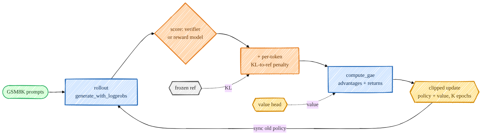

> **本章前置**:第 13 章(奖励模型)、第 14 章(DPO 里的"最大化奖励 − β·KL"目标)。还会用到第 07 章的交叉熵/对数概率、第 09 章的生成(rollout)。
> **你将学到**:强化学习(RL)到底在干嘛、策略梯度定理、为什么要"优势(advantage)"、GAE 怎么算、PPO 的"裁剪"为什么能让训练不翻车、KL 惩罚的作用,以及这一切在本项目 `src/post_training/ppo.py` 里是怎么落地的。
>
> 👈 上一章 [14_dpo.md](/posts/ai_infra/train-llm-from-scratch/train-llm-scratch-14-dpo) ｜ [返回总览](/posts/ai_infra/train-llm-from-scratch/train-llm-scratch-overview)

这是全课**最硬**的一章,但也是最能让你"看懂 ChatGPT 是怎么练出来的"的一章。最初的 InstructGPT / ChatGPT 用的就是这套 **RLHF(基于人类反馈的强化学习)** 配方。我们会从"什么是强化学习"一路推到 PPO 的裁剪目标函数,每个公式后面都配大白话。慢慢来,跟着走就行。



## 一、先建立直觉:什么是"强化学习"

前面几章(预训练、SFT)都属于**监督学习**:我们有"标准答案"(下一个 token 是什么、assistant 该回什么),让模型去模仿。

但很多时候我们**没有标准答案**,只有一个"好不好"的评判。比如:让模型解一道数学题,我们不一定知道最优解法长什么样,但我们能判断**最终答案对不对**。这种"做完一件事后给个评分,让你自己摸索怎么做得更好"的学习方式,就是**强化学习(Reinforcement Learning, RL)**。

用一个类比:教小孩骑自行车。你没法手把手规定"第 3 秒左脚用力 40%",你只能在他骑得稳时说"好!"、摔了说"再来"。他通过**不断尝试 + 根据结果调整**,慢慢学会。RL 就是这个过程。

把它对应到我们的 LLM 上:

| RL 术语 | 在 LLM 里是什么 |
|---|---|
| 智能体(agent) | 我们的模型 |
| 策略(policy)$\pi_\theta$ | 模型本身——给定已生成的文字,它输出"下一个 token 的概率分布" |
| 状态(state)$s_t$ | 当前已经生成的前缀(prompt + 已生成的 token) |
| 动作(action)$a_t$ | 选择下一个 token |
| 轨迹/回合(episode) | 生成一整句回答的过程 |
| 奖励(reward)$r$ | 对这次输出的打分(答案对=高分,错=低分) |

所以"用 PPO 训练 LLM"翻译成大白话就是:**让模型自己生成回答 → 给回答打分 → 朝着"以后更容易生成高分回答"的方向,小步调整模型参数**。这个"打分器"在本项目里有两种:一个**验证器(verifier)**(直接检查 GSM8K 数学题答案对错),或第 13 章训练好的**奖励模型(RM)**。

我们的目标可以写成一句话:

$$
\max_\theta \; J(\theta) = \mathbb{E}_{\tau \sim \pi_\theta}\big[\, R(\tau) \,\big]
$$

- $\tau$(读作 tau)是一条**轨迹**,也就是模型生成的一整句回答;
- $\tau \sim \pi_\theta$ 表示"这句回答是用当前策略 $\pi_\theta$ 采样出来的";
- $R(\tau)$ 是这条轨迹拿到的总奖励;
- $\mathbb{E}[\cdot]$ 是"期望",即对所有可能生成的回答按概率加权求平均。

翻译:**调整参数 $\theta$,让模型生成的回答"平均拿到的奖励"尽可能高。**

## 二、策略梯度定理:怎么"朝高奖励方向"调参数

我们想用梯度上升来最大化 $J(\theta)$,所以需要 $\nabla_\theta J(\theta)$。难点在于:奖励 $R(\tau)$ 本身通常和 $\theta$ 没有直接的可导关系(答案对不对是个"硬"判断),而 $\theta$ 是藏在"采样出 $\tau$ 的概率"里的。

**策略梯度定理**漂亮地解决了这个问题。一条轨迹被采样到的概率是每一步动作概率的连乘:

$$
\pi_\theta(\tau) = \prod_{t} \pi_\theta(a_t \mid s_t)
$$

利用一个恒等式 $\nabla_\theta \pi_\theta(\tau) = \pi_\theta(\tau)\,\nabla_\theta \log \pi_\theta(\tau)$(这就是"对数求导技巧":$\nabla \log f = \frac{\nabla f}{f}$),可以推出:

$$
\nabla_\theta J(\theta) = \mathbb{E}_{\tau \sim \pi_\theta}\Big[\, \nabla_\theta \log \pi_\theta(\tau)\; R(\tau) \,\Big]
= \mathbb{E}\Big[\sum_t \nabla_\theta \log \pi_\theta(a_t \mid s_t)\; R(\tau)\Big]
$$

这个式子是整个 RL 训练的"发动机",务必理解它的**大白话含义**:

> 对每一步选出的 token,计算"提高这个 token 概率的方向"($\nabla_\theta \log \pi_\theta(a_t\mid s_t)$),然后用这条轨迹的总奖励 $R(\tau)$ 给它**加权**。
> - 如果这句回答得了高分($R$ 大、正),就**沿着这个方向走**——让以后更容易生成这些 token;
> - 如果得了低分($R$ 小甚至负),就**反方向走**——让以后更少生成这些 token。

这正是"做对了就鼓励、做错了就抑制"的数学化。注意它只需要 $\log \pi_\theta$ 可导(这我们有,就是第 07 章的对数概率),完全不要求奖励可导。

## 三、降方差:用"优势"代替"总奖励"

策略梯度能用,但有个大毛病:**方差太大,训练抖得厉害**。

问题出在用 $R(\tau)$ 当权重。假设一道题所有回答的奖励都在 +10 附近,那么哪怕是"相对较差"的回答也会被当成"好样的"使劲鼓励——因为它的奖励也是 +10(正数)。模型分不清"绝对的好"和"相对的好"。

解决办法:减去一个**基准线(baseline)**,只看"比平均水平好多少"。我们引入**价值函数** $V(s_t)$:它估计"从状态 $s_t$ 出发,按当前策略走下去,预期能拿多少奖励"。然后定义**优势(advantage)**:

$$
A_t = Q(s_t, a_t) - V(s_t)
$$

- $Q(s_t,a_t)$:在状态 $s_t$ 选了动作 $a_t$ 之后,预期总奖励;
- $V(s_t)$:在状态 $s_t$ 不管选什么动作的平均预期;
- $A_t$:这一步选的 token **比平均水平好多少**。$A_t>0$ 才鼓励,$A_t<0$ 就抑制。

把策略梯度里的 $R(\tau)$ 换成 $A_t$,数学上可以证明期望不变(因为减去一个只依赖状态的 baseline 不改变梯度的期望),但**方差大大降低**——这就是为什么 PPO 又快又稳。

谁来估计 $V(s_t)$?再训练一个小网络,叫 **critic(评论家)**。我们的模型(策略)叫 **actor(演员)**,两者合起来就是 **actor-critic** 架构。

在本项目里,actor 和 critic **共享同一个主干网络**,只在顶上多接一个"价值头"。看 [`src/post_training/value_head.py`](https://github.com/FareedKhan-dev/train-llm-from-scratch/blob/main/src/post_training/value_head.py) 的 `TransformerWithValueHead`:

```python
def forward(self, idx):
    hidden = self.transformer.forward_hidden(idx)
    logits = self.transformer.lm_head(hidden)      # policy (actor)
    values = self.value_head(hidden).squeeze(-1)   # critic, (B, T)
    return logits, values
```

这就是本项目的设计哲学**"wrap, don't rewrite"**的又一次体现(回忆第 12、13 章):复用第 05 章那个 Transformer 的 `forward_hidden` 拿到隐藏状态,`lm_head` 给出策略 logits,再加一个**输出 1 维标量的价值头**给出 $V$。价值头初始化成约 0,这样训练早期 critic 还不准时,不会把策略带歪。

## 四、GAE:广义优势估计

上面的 $A_t$ 是理想定义,实际中 $Q$ 我们并不知道。怎么估计每一步的优势?有两种极端:

- **只用真实奖励**:$A_t \approx R_{\text{实际}} - V(s_t)$。无偏,但方差大(整句的随机性都算进来了)。
- **只用一步预测**:$A_t \approx r_t + \gamma V(s_{t+1}) - V(s_t)$。方差小,但有偏(依赖 $V$ 估得准不准)。

**GAE(Generalized Advantage Estimation,广义优势估计)** 用一个参数 $\lambda$ 在两者之间平滑插值,兼顾偏差和方差。先定义每一步的 **TD 残差(temporal-difference error)**:

$$
\delta_t = r_t + \gamma\, V(s_{t+1}) - V(s_t)
$$

- $r_t$:第 $t$ 步拿到的即时奖励;
- $\gamma$(gamma,折扣因子):未来奖励打几折,$\gamma\in[0,1]$。本项目默认 $\gamma=1.0$(回答很短,不打折);
- $V(s_{t+1}) - V(s_t)$:状态价值的变化。
- $\delta_t$ 的含义:"实际拿到的 $r_t$ + 对未来的新估计" 比 "原来对 $s_t$ 的估计" 好多少——一步到位的"惊喜值"。

然后把未来所有 TD 残差按 $(\gamma\lambda)$ 衰减加权求和,得到 GAE 优势:

$$
A_t^{\text{GAE}} = \sum_{l=0}^{\infty} (\gamma\lambda)^l\, \delta_{t+l}
$$

- $\lambda$(lambda,本项目默认 0.95):偏差-方差的旋钮。$\lambda=0$ 退化成"只用一步"(低方差高偏差);$\lambda=1$ 退化成"用全部真实奖励"(高方差低偏差)。0.95 是常用折中。

这个无穷和有个漂亮的**从后往前递推**写法,正是代码里的实现。看 [`src/post_training/ppo.py`](https://github.com/FareedKhan-dev/train-llm-from-scratch/blob/main/src/post_training/ppo.py) 的 `compute_gae`:

```python
for t in reversed(range(L)):
    # 只有当下一步仍是回复 token 时才 bootstrap(回答结束后就没有未来了)
    nonterminal = m[:, t + 1] if t + 1 < L else torch.zeros(B, device=rewards.device)
    delta   = rewards[:, t] + gamma * values_next[:, t] * nonterminal - values[:, t]
    lastgae = delta + gamma * lam * nonterminal * lastgae
    adv[:, t] = lastgae
returns = adv + values
```

逐行看:`delta` 就是上面的 $\delta_t$;`lastgae` 把"后面累积的优势"乘上 $\gamma\lambda$ 滚进来,等价于那个无穷和;`returns = adv + values` 给出**回报目标**(用来训练 critic,让 $V$ 去逼近它)。`nonterminal` 保证回答的最后一个 token 之后不再向"未来"借值(回合结束了)。

算出的优势还会用 [`whiten`](https://github.com/FareedKhan-dev/train-llm-from-scratch/blob/main/src/post_training/ppo.py) 做归一化(减均值除标准差),让数值尺度稳定:

```python
return ((advantages - mean) / (var.sqrt() + 1e-8)) * m
```

## 五、PPO 的核心:为什么要"裁剪"

现在我们有了每一步的优势 $A_t$,可以用策略梯度更新了。但还有一个工程难题。

为了**数据效率**,我们希望"采样一批回答后,反复用它更新好几轮"(代码里是 `ppo_epochs=4` 轮)。可一旦更新了几步,当前策略 $\pi_\theta$ 就和"当初采样这批数据的旧策略" $\pi_{\theta_{\text{old}}}$ 不一样了。直接拿旧数据更新新策略,需要用**重要性采样比**修正:

$$
\rho_t = \frac{\pi_\theta(a_t \mid s_t)}{\pi_{\theta_{\text{old}}}(a_t \mid s_t)}
$$

- $\rho_t$ 衡量"同一个 token,在新策略下比旧策略下概率涨了/跌了多少倍"。
- 朴素目标就是最大化 $\rho_t A_t$。

问题:如果某一步优势很大,模型会拼命把 $\rho_t$ 推到很大(疯狂提高那个 token 的概率),**一步更新过头**,策略直接崩掉。这是早期策略梯度方法最头疼的不稳定性。

**PPO(Proximal Policy Optimization,近端策略优化)** 的解法极其简单粗暴却有效:**给 $\rho_t$ 加一个"安全栏",不让它离 1 太远**。这就是**裁剪代理目标(clipped surrogate objective)**:

$$
L^{\text{CLIP}}(\theta) = \mathbb{E}_t\Big[\min\big(\rho_t A_t,\;\; \text{clip}(\rho_t,\,1-\epsilon,\,1+\epsilon)\,A_t\big)\Big]
$$

- $\epsilon$(epsilon,裁剪幅度):本项目 `clip=0.2`,即把 $\rho_t$ 限制在 $[0.8, 1.2]$;
- $\text{clip}(\rho_t, 1-\epsilon, 1+\epsilon)$:把比值强行夹在这个区间里;
- 取 $\min$:这是关键的"悲观"操作——在裁剪和不裁剪两个值里取**小**的那个。

为什么取 $\min$ 能防翻车?分两种情况想:

- **优势为正($A_t>0$,这步是好动作)**:我们想增大 $\rho_t$。但一旦 $\rho_t$ 超过 $1+\epsilon$,裁剪项把它锁死在 $1+\epsilon$,$\min$ 取到这个被锁死的值,**梯度消失**——模型再怎么想推也推不动了,防止一步涨过头。
- **优势为负($A_t<0$,这步是坏动作)**:我们想减小 $\rho_t$。同理,一旦 $\rho_t$ 低于 $1-\epsilon$,也被锁死,防止一步跌过头。

一句话:**PPO 允许小步快走,但不许大跨步**,所以稳。看 [`ppo_policy_loss`](https://github.com/FareedKhan-dev/train-llm-from-scratch/blob/main/src/post_training/ppo.py) 的真实实现:

```python
ratio = torch.exp(new_logp - old_logp)                       # ρ = exp(log π_θ - log π_old)
surr1 = ratio * advantages                                   # 不裁剪
surr2 = torch.clamp(ratio, 1.0 - clip, 1.0 + clip) * advantages  # 裁剪
loss  = -masked_mean(torch.min(surr1, surr2), mask)          # 取 min,再取负(因为要最大化)
```

注意 `ratio = torch.exp(new_logp - old_logp)`:用对数概率相减再取指数算比值,数值更稳(这也是第 08 章说的"log-prob 用 fp32"的原因之一)。前面的负号是因为优化器做的是**最小化**,而我们要**最大化** $L^{\text{CLIP}}$。

critic(价值)也做类似的裁剪更新,见 [`ppo_value_loss`](https://github.com/FareedKhan-dev/train-llm-from-scratch/blob/main/src/post_training/ppo.py):

```python
v_clipped      = old_values + torch.clamp(new_values - old_values, -vf_clip, vf_clip)
loss_unclipped = (new_values - returns) ** 2
loss_clipped   = (v_clipped - returns) ** 2
return 0.5 * masked_mean(torch.max(loss_unclipped, loss_clipped), mask)
```

它让 $V$ 回归到第四节算出的 `returns`,同样限制每步更新幅度。最终总损失大致是 `policy_loss + vf_coef * value_loss - ent_coef * entropy`(本项目 `vf_coef=0.5`,`ent_coef=0.0`)。

## 六、KL 惩罚:别跑得离 SFT 太远

只盯着奖励优化有个危险叫 **reward hacking(奖励作弊)**:模型可能发现某种胡言乱语恰好能骗高分,于是越练越怪,彻底丢掉 SFT 学到的语言能力。

防止办法:在奖励里**加一项"别离参考模型太远"的惩罚**。参考模型 $\pi_{\text{ref}}$ 就是冻结的 SFT 模型(回忆第 14 章 DPO 也用了它)。我们给**每一个回复 token** 都加上一份 KL 惩罚。看 [`scripts/train_ppo.py`](https://github.com/FareedKhan-dev/train-llm-from-scratch/blob/main/scripts/train_ppo.py) 里构造每步奖励的真实代码:

```python
rewards = -cfg.kl_coef * (old_logp - ref_logp) * resp.float()
```

- `old_logp - ref_logp` 是"策略 vs 参考"在这个 token 上的对数概率差,正是 KL 的逐 token 估计;
- 乘上 `-kl_coef`(本项目 `kl_coef=0.05`)变成惩罚:策略越偏离参考,这一项越负,即扣分;
- `resp.float()` 是回复掩码,只在回答部分施加(prompt 部分不算)。

然后,**真正的任务奖励**(验证器判对 = +1 之类)只加在**最后一个回复 token** 上。所以每一步的总奖励 $r_t$ = 这一步的 KL 惩罚 +(若是最后一步)任务奖励。这个 $r_t$ 就是喂给第四节 `compute_gae` 的输入。

直觉:**用任务奖励把模型往"答对"方向拉,同时用 KL 惩罚像一根橡皮筋把它拴在 SFT 附近**,两股力量平衡,既学到本事又不跑偏。

## 七、把一次完整的 PPO 迭代串起来

[`scripts/train_ppo.py`](https://github.com/FareedKhan-dev/train-llm-from-scratch/blob/main/scripts/train_ppo.py) 的主循环,每一轮迭代做这几件事(对照本章前面每一节):

1. **Rollout(采样)**:用当前策略对一批 prompt 各生成一条回答,同时记录采样时的对数概率 `old_logp`(第 09 章的生成 + [`rollout.py`](https://github.com/FareedKhan-dev/train-llm-from-scratch/blob/main/src/post_training/rollout.py) 的 `generate_with_logprobs`,对数概率用 fp32)。
2. **打分**:用验证器或奖励模型给每条回答打任务奖励。
3. **构造每 token 奖励**:逐 token KL 惩罚 + 最后一个 token 的任务奖励(第六节)。
4. **算优势**:用 critic 的 $V$ 跑 `compute_gae` 得到 `advantages` 和 `returns`,再 `whiten` 归一化(第三、四节)。
5. **多轮裁剪更新**:把这批数据切成 minibatch,跑 `ppo_epochs` 轮,每轮算 `ppo_policy_loss` + `ppo_value_loss`,反向传播、梯度裁剪、`optimizer.step()`(第五节;就是第 03 章"训练循环五件套"在 RL 上的展开)。
6. 周期性地在 GSM8K 上评估、保存 checkpoint 到 `/ephemeral/ckpts/ppo.pt`。

更新完后,把"旧策略"同步成当前策略,进入下一轮 rollout。

## 八、动手跑一跑

> ⚠️ PPO 是所有阶段里**最娇气、最吃算力**的:它要一边生成一边训练,还要同时跑策略、参考、critic。真正训练需要 GPU。没有 GPU 的同学可以用 smoke 配置在 CPU 上跑极小规模,**目的是看流程跑通、看奖励曲线动起来**,而不是练出好模型。

第一步,准备 RL 用的 prompt(GSM8K + 算术热身):

```bash
PYTHONPATH=. python scripts/prepare_rl_prompts.py
```

第二步,启动 PPO 训练(默认用验证器打分):

```bash
# 单卡
PYTHONPATH=. python scripts/train_ppo.py --reward_source verifier
# 改用第 13 章训练的奖励模型打分
PYTHONPATH=. python scripts/train_ppo.py --reward_source rm
# 双卡(DDP)
PYTHONPATH=. torchrun --standalone --nproc_per_node=2 scripts/train_ppo.py --reward_source verifier
```

CPU 上想几分钟跑通流程,用 smoke 配置(它会自动选用 `configs/smoke/base.json` 的极小模型,见第 11、12 章讲的配置分层):

```bash
PYTHONPATH=. python scripts/train_ppo.py --config configs/smoke/ppo.json --reward_source verifier
```

`configs/smoke/ppo.json` 把规模压到极小(`iterations=2`、`prompts_per_iter=4`、`rollout_len=32`、`ppo_epochs=2`、`minibatch_size=2`)。和前几章一样,**任何配置字段都能用 `--字段名` 在命令行覆盖**(比如 `--kl_coef 0.1 --clip 0.1`),`--print-config` 可以先打印最终生效的配置自检。

## 九、怎么看那几条曲线

训练日志(`/ephemeral/logs/ppo_*.jsonl`)里盯这几个数,判断"健不健康":

| 指标 | 含义 | 健康表现 |
|---|---|---|
| **reward** | 每轮平均任务奖励 | **头号曲线,应当上升** |
| **KL_ref** | 策略相对 SFT 参考的平均 KL([`approx_kl`](https://github.com/FareedKhan-dev/train-llm-from-scratch/blob/main/src/post_training/ppo.py)) | **保持有界**;爆掉=模型在退化,调低 `--lr` 或调高 `--kl_coef` |
| **clipfrac** | 命中裁剪的 token 比例 | 步长/健康度信号,不宜过高 |
| **value_loss** | critic 的回归误差 | 平稳下降 |
| **GSM8K test 准确率** | 真正的结果 | 每 `--eval_every`(默认 50)评估一次 |

经验值:本项目作者用 `lr=1e-6`、`clip=0.2`、`grad_clip=1.0`,并紧盯 KL;在一个可学习的合成奖励上验证过这个循环确实在优化——奖励从 `0.10` 一路爬到 `1.00`。

## 小结

- **强化学习**:没有标准答案,只有"打分";让模型自己生成→打分→朝高分方向调参。LLM 里"策略"就是模型本身。
- **策略梯度定理** $\nabla_\theta J=\mathbb{E}[\nabla_\theta\log\pi_\theta(a|s)\,\Phi]$:好动作就提高其概率,坏动作就降低,用奖励加权。
- 用**优势 $A_t$** 代替总奖励来降方差;$A_t$ 由 **GAE** 估计,需要一个 **critic(价值头)** 提供 baseline——actor 和 critic 共享主干。
- **PPO 裁剪**:用 $\min(\rho A,\ \text{clip}(\rho,1\pm\epsilon)A)$ 限制每步更新幅度,只许小步快走,所以稳。
- **KL-to-reference 惩罚**:把策略拴在 SFT 附近,防止 reward hacking。
- 一次迭代 = rollout → 打分 → 加 KL → GAE → 多轮裁剪更新。PPO 强但娇气、零件多。下一章的 GRPO 会**直接丢掉 critic**,把这套大大简化。

## 自测题

1. 为什么策略梯度里要用"优势 $A_t$"而不是直接用整句的总奖励 $R$?(提示:方差 / 相对好坏)
2. PPO 的裁剪目标取了 $\min$。当某一步优势为正、且 $\rho_t$ 已经涨到大于 $1+\epsilon$ 时,梯度会发生什么?这如何防止训练翻车?
3. GAE 里的 $\lambda$ 取 0 和取 1 分别对应什么极端?它在权衡什么?
4. KL-to-reference 惩罚是加在哪里的(每个 token 还是只在最后)?任务奖励又加在哪里?为什么这样设计能防止 reward hacking?
5. 本项目的 actor 和 critic 是两个独立网络吗?价值头为什么初始化成约 0?

<details>
<summary>参考答案要点</summary>

1. 直接用 $R$ 方差大、且分不清"绝对高分"和"相对更好";减去 baseline $V$ 得到的优势只看"比平均好多少",期望不变但方差大降,训练更稳。
2. $\rho_t$ 超过 $1+\epsilon$ 后裁剪项把它锁死,$\min$ 取到被锁死的常数项,对 $\theta$ 的梯度变 0——模型无法在这一步继续推高该 token 概率,从而避免单步更新过头。
3. $\lambda=0$:只用一步 TD(低方差、高偏差,依赖 $V$ 准);$\lambda=1$:用全部真实奖励(高方差、低偏差)。它在偏差和方差之间权衡,本项目用 0.95。
4. KL 惩罚加在**每一个回复 token**上(`-kl_coef*(old_logp-ref_logp)*resp`);任务奖励只加在**最后一个回复 token**。这样模型一偏离 SFT 参考就被持续扣分,像橡皮筋把它拴住,无法靠胡乱输出去骗奖励。
5. 不是独立的——actor 和 critic **共享同一个 Transformer 主干**(`forward_hidden`),只在顶上多一个标量价值头。价值头初始化约 0,使训练早期还不准的 critic 不会扰乱策略。
</details>

## 深入参考

- 本项目精炼版:[阶段 5 —— PPO](https://github.com/FareedKhan-dev/train-llm-from-scratch/blob/main/docs/zh/06_ppo_zh.md)
- 目标函数与对数概率记法:[../foundations/objectives_zh.md](https://github.com/FareedKhan-dev/train-llm-from-scratch/blob/main/docs/zh/foundations/objectives_zh.md)
- 优化器与稳定性(学习率、梯度裁剪、bf16/fp32):[../foundations/optimization_zh.md](https://github.com/FareedKhan-dev/train-llm-from-scratch/blob/main/docs/zh/foundations/optimization_zh.md)
- 源码:`src/post_training/ppo.py`(GAE / 裁剪损失 / approx_kl)、`src/post_training/value_head.py`(actor-critic)、`src/post_training/rollout.py`(rollout 与 fp32 对数概率)、`scripts/train_ppo.py`(完整编排)

下一章 👉 [16_grpo.md](/posts/ai_infra/train-llm-from-scratch/train-llm-scratch-16-grpo):GRPO / RLVR——丢掉 critic,用"组内相对优势"把 PPO 大大简化(DeepSeek-R1 同款思路)。
