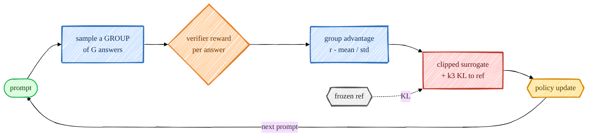

> **本章前置**:你刚在 [第 15 章 PPO](/posts/ai_infra/train-llm-from-scratch/train-llm-scratch-15-ppo) 学过策略梯度、actor-critic、裁剪代理目标(clipped surrogate)和 KL 惩罚。本章会**反复引用**这些概念,所以如果你对"为什么要裁剪""KL 惩罚在防什么"还发怵,请先回到上一章把那几节读顺。
>
> **你将学到**:
> - 为什么 PPO 要额外养一个**价值网络(critic)**,以及它为什么"又重又难调";
> - **RLVR(可验证奖励强化学习)**:为什么"数学题答案对错"是一种免费、可信的奖励;
> - **组相对优势**的完整推导:GRPO 怎么用"一组答案自己的平均分"当 baseline,从而**彻底删掉 critic**;
> - GRPO 的损失:token 级裁剪代理目标 + **k3 KL 估计**,逐行对照仓库真实代码;
> - **课程学习(curriculum)**:为什么开训前要先用简单算术热身,否则"优势全是 0,学不动";
> - 一次完整 GRPO 迭代怎么串起来,以及怎么读它的几个监控指标。
>
> 👈 上一章 [15_ppo.md](/posts/ai_infra/train-llm-from-scratch/train-llm-scratch-15-ppo) ｜ [返回总览](/posts/ai_infra/train-llm-from-scratch/train-llm-scratch-overview)

---

GRPO(Group Relative Policy Optimization,**组相对策略优化**)是 2025 年 DeepSeek-R1 那一波"推理大模型"背后的核心 RL 算法。它最让人拍案的地方在于:**它把 PPO 里那个又大又娇气的价值网络整个删掉了**,而且删掉之后不但没变差,反而更稳、更省、更好调。

这一章我们就来彻底搞懂它"删了什么、用什么补上、为什么这样就行"。本仓库的实现在 `src/post_training/grpo.py`,整套代码加注释也就七十行——读完本章你会发现,简单是它的优点,不是它的妥协。

---

## 一、动机:PPO 的 critic 太重,而很多任务的奖励其实是"白送"的

### 1.1 回顾:PPO 为什么需要一个 critic

先把上一章的记忆唤醒一下。PPO 是 **actor-critic** 架构:

- **actor(策略,policy)**:就是我们的语言模型,负责"生成回答"。
- **critic(价值网络,value network)**:一个额外的网络(在本仓库里是 `src/post_training/value_head.py` 给主干接的一个**价值头**),负责估计"从当前这个状态(已经生成了一半的句子)出发,未来大概能拿到多少奖励"——这个估计值就叫**状态价值** $V(s)$。

PPO 需要 critic 是为了算**优势(advantage)**。回忆优势的直觉定义:

$$
A(s, a) = Q(s, a) - V(s)
$$

> 大白话:$A$ 衡量"在状态 $s$ 下,选了动作 $a$ 之后的实际结果,比这个状态下的**平均水平** $V(s)$ **好多少**"。$A > 0$ 说明这个动作比平均强,应该提高它的概率;$A < 0$ 说明它拖后腿,应该压低它的概率。这个"减去一个 baseline $V(s)$"的操作,是策略梯度降低方差的关键(第 15 章讲过:不减 baseline,梯度噪声大到几乎学不动)。

所以 critic 的存在感全在那个 $V(s)$ 上:它就是策略梯度的 **baseline**。PPO 进一步用 GAE 把这个 baseline 精细化到每个 token,但骨子里离不开一个能给出 $V(s)$ 的网络。

### 1.2 critic 为什么"又重又难调"

养一个 critic,代价是实打实的:

1. **显存翻倍**:critic 通常和 actor 差不多大(在本仓库里 critic 是在主干上加一个价值头,要跑一遍同样规模的前向)。一次训练你得同时塞下 4 套参数:可训练的策略、冻结的参考模型(ref)、旧策略快照(old)、再加这个价值网络。
2. **多一个损失要平衡**:PPO 的总损失里有个**价值损失**项 $\text{vf\_coef} \cdot (V_\theta - \text{return})^2$(见上一章 `PPOConfig` 里的 `vf_coef`、`vf_clip`)。这个系数怎么配、价值损失要不要裁剪、和策略损失谁压谁,都是要反复调的旋钮。
3. **critic 自己也会学坏**:价值估计不准 → 优势算错 → 策略被带偏 → rollout 分布变了 → critic 估计更不准……这是 RLHF 里出了名的"难调"来源之一。

一句话:critic 是 PPO 稳定性的**来源**,也是它复杂度和不稳定的**来源**。如果能不要它,何乐不为?

### 1.3 RLVR:有一类任务,奖励是"白送的可信信号"

PPO 用 **奖励模型(RM,第 13 章)** 来打分,因为"回答好不好"很主观,只能训一个网络来近似人类偏好。但 RM 本身是个会犯错、会被钻空子(reward hacking)的近似器。

**RLVR(Reinforcement Learning with Verifiable Rewards,可验证奖励强化学习)** 抓住了一个朴素观察:

> **很多任务的"对错"是可以被程序直接判定的**。

数学题就是典型:一道 GSM8K 应用题的标准答案是 `42`,模型答 `42` 就是对,答 `41` 就是错——这件事用一个正则表达式 + 一次数值比较就能裁定,**不需要任何神经网络**。

本仓库的验证器在 `src/post_training/rewards/verifiers.py`,核心就是 `reward_gsm8k`:

```python
def reward_gsm8k(text: str, gold: float | None) -> float:
    """Reward for a GSM8K response: correctness (dominant) + small format bonus, clipped."""
    r = 0.0
    if _answers_match(extract_answer(text), gold):
        r += CORRECT_BONUS
    if has_well_formed_answer(text):
        r += FORMAT_BONUS
    return min(r, REWARD_CLIP)
```

逐行读:

- `extract_answer(text)`:从模型输出里**容错地**抠出最终数字答案。它的优先级是(见 `rewards/parsing.py`):先找 `<answer>...</answer>` 标签里的数,找不到再找 GSM8K 风格的 `#### N`,再不行就取全文最后一个数字。这种"宽容解析"是为了应对小模型格式不稳定。
- `_answers_match(pred, gold)`:用 `math.isclose(..., abs_tol=1e-4)` 做带容差的浮点比较——答对了就加 `CORRECT_BONUS = 1.0`,这是**主导项**。
- `has_well_formed_answer(text)`:如果输出里**恰好有一个**规范的 `<answer>...</answer>` 块,再加一个很小的 `FORMAT_BONUS = 0.2` 作为格式塑形(format shaping)。
- 最后 `min(r, REWARD_CLIP)` 把奖励夹到 `[0, 1.2]`。

> 大白话:这个奖励函数说的是"**答对了给 1 分(最重要),顺手把答案规规矩矩包进标签里再奖 0.2 分,但封顶 1.2 分**"。源码注释里特意强调:格式奖励要给得**小**,否则小模型会学会"投机"——只吐空标签 `<answer></answer>` 来骗格式分,而不去真正解题。这就是 **reward hacking(奖励钻空子)**,RLVR 用"以正确性为主导"来压制它。

RLVR 的好处:奖励**免费**(不用训 RM)、**可信**(对就是对)、**抗钻空子**(答案对不对没法装)。代价是它只适用于"对错可程序判定"的任务——数学、代码、形式逻辑。这恰好是 2025 年推理模型最想攻克的方向。

### 1.4 GRPO 的巧思:用"一组答案的平均分"当 baseline

现在两块拼图凑齐了:

- RLVR 给了我们一个**可信、便宜**的奖励 $r$;
- 但策略梯度还是需要一个 **baseline** 来降方差(否则回到 1.1 节的"学不动")。

PPO 用 critic 来当 baseline。GRPO 的巧思是:**既然奖励这么便宜,那我对同一道题多采几个回答,直接拿这一组回答的平均奖励当 baseline 不就行了?** 根本不用单独训一个网络去估计 $V(s)$。

这就是"组相对(group relative)"的含义。下面我们把它推导清楚。

---

## 二、组相对优势:完整推导

### 2.1 采样一个"组(group)"

对每一个 prompt(比如一道数学题),GRPO **不只采一个回答,而是采一整组** $G$ 个回答:

$$
\{o_1, o_2, \dots, o_G\} \sim \pi_\theta(\cdot \mid \text{prompt})
$$

> 大白话:让模型对**同一道题**独立作答 $G$ 次(`group_size`,smoke 配置里是 4,正式配置里是 8)。因为采样有温度(`temperature`),这 $G$ 个回答会各不相同——有的解对,有的解错,有的思路清晰,有的胡言乱语。

在代码里,这一步就是"把每个 prompt 复制 $G$ 份、组内连续排布"(`scripts/train_grpo.py`):

```python
prompts = [p for p in base_prompts for _ in range(G)]            # group-contiguous
```

> "group-contiguous(组内连续)"很重要:prompt 0 的 $G$ 个副本排在最前面,然后才是 prompt 1 的 $G$ 个副本……后面 reshape 成 `(num_prompts, G)` 时正好每行是一个组。

### 2.2 给每个回答打分

用 RLVR 验证器给组里每个回答 $o_i$ 打一个标量奖励:

$$
r_i = \text{reward\_gsm8k}(o_i, \text{gold}), \qquad i = 1, \dots, G
$$

代码:

```python
rewards = torch.tensor([reward_gsm8k(responses[i], golds[i]) for i in range(len(prompts))])
```

### 2.3 用组内均值/标准差做 baseline 与标准化

这是 GRPO 的**心脏**。对第 $i$ 个回答,它的**组相对优势**定义为:

$$
A_i = \frac{r_i - \operatorname{mean}(r_1, \dots, r_G)}{\operatorname{std}(r_1, \dots, r_G) + \epsilon}
$$

逐符号拆开讲:

- $\operatorname{mean}(r_1,\dots,r_G)$:这一组 $G$ 个回答奖励的**平均分**。它扮演的就是 PPO 里 $V(s)$ 的角色——"这道题上的平均水平"。**这就是 baseline,而且它完全是免费算出来的,不需要任何网络。**
- $r_i - \operatorname{mean}(\cdot)$:第 $i$ 个回答**比同组平均好多少**。比平均好 → 正优势 → 提高它的概率;比平均差 → 负优势 → 压低它的概率。这正是"优势"二字的本意。
- $\operatorname{std}(r_1,\dots,r_G)$:组内奖励的标准差。除以它是在做**标准化(normalization)**,把优势缩放到一个量纲稳定的范围,免得不同题目奖励尺度不同导致梯度忽大忽小。
- $\epsilon$(代码里 `eps=1e-4`):一个很小的数,防止"全组奖励一样、std 为 0"时除以零爆炸。

仓库实现(`src/post_training/grpo.py`,`group_advantages`):

```python
def group_advantages(rewards: torch.Tensor, group_size: int, eps: float = 1e-4) -> torch.Tensor:
    r = rewards.view(-1, group_size)
    mean = r.mean(dim=1, keepdim=True)
    std = r.std(dim=1, keepdim=True)
    adv = (r - mean) / (std + eps)
    return adv.reshape(-1)
```

逐行对照:

- `rewards.view(-1, group_size)`:把扁平的 `(num_prompts * G,)` 奖励 reshape 成 `(num_prompts, G)`——每一**行**就是一个组(这就是 2.1 节"组内连续"的回报)。
- `r.mean(dim=1, keepdim=True)`:沿组维(每行)求均值,得到每组的 baseline。
- `r.std(dim=1, keepdim=True)`:每组的标准差。
- `(r - mean) / (std + eps)`:就是上面那条公式,逐元素算出每个回答的标准化优势。
- `adv.reshape(-1)`:再压回扁平形状,和 `rewards` 一一对应。

### 2.4 为什么"这样就不需要价值函数"了?

这是本章最该想透的一句话。我们对比一下:

| | baseline 从哪来 | 代价 |
|---|---|---|
| **PPO** | 一个学出来的 critic $V_\theta(s)$ | 多一个网络、多一个损失、多一份不稳定 |
| **GRPO** | **同组 $G$ 个回答奖励的算术平均** | 多采几个样,几乎零成本 |

关键洞察:**baseline 的唯一作用是"给优势一个参照零点"以降低方差,它不要求是 $V(s)$ 的精确估计。** PPO 选择用网络去精确逼近 $V(s)$;GRPO 选择"用同一道题上的同伴平均分"作为参照——这是一个**对这道题无偏**的 baseline(因为这 $G$ 个样本都来自同一个 prompt、同一个策略)。

换句话说,GRPO 把"估计一个状态的未来价值"这个**困难的回归问题**,替换成了"在同一道题上多采几个样、求个平均"这个**平凡的算术问题**。这就是它能删掉 critic 的根本原因。

> 类比:你想知道班上某次小测里"小明这次考得算好还是算差"。
> - **PPO 式**:先训练一个模型,根据小明的平时表现去预测"他这次大概该考多少分",再看实际分数比预测高还是低。
> - **GRPO 式**:让小明就这一道题做 $G$ 遍(或者让 $G$ 个水平相当的同学做同一道题),直接看他这次比这 $G$ 份的平均分高还是低。
> 后者根本不需要"预测模型",平均分自己就是最公道的参照。

### 2.5 一个回答的优势,被它所有 token 共享

注意 $A_i$ 是**一整条回答**的一个标量(序列级优势),但 GRPO 的损失是 **token 级**的。怎么连接?——**同一条回答里的每个 token 共享这同一个序列优势** $A_i$。

直觉:RLVR 的奖励是"整条回答答对没有",这是个序列级信号,我们没有 token 级的细粒度反馈(不像 PPO 的 GAE 能逐 token 分配)。所以最朴素也最诚实的做法就是:**这条回答整体好($A_i>0$),就让它里面的每个生成 token 都"更可能";整体差,就让每个 token 都"更不可能"。** 代码里这一步是 `adv = advantages[:, None]`(把 `(B,)` 广播成 `(B, 1)`,自动覆盖该回答的所有 token)。

---

## 三、损失:token 级裁剪代理目标 + k3 KL 估计

有了优势 $A_i$,GRPO 的更新目标在**形式上和 PPO 几乎一样**——这也是为什么我们说"先学 PPO 再学 GRPO 顺理成章":二者复用同一套 rollout / 对数概率核心(`src/post_training/rollout.py`)。区别只在于**优势从哪来**(GRPO 来自组相对,PPO 来自 GAE+critic)。

### 3.1 token 级裁剪代理目标

先定义**概率比(probability ratio)**,这和上一章一模一样:

$$
\rho_t = \frac{\pi_\theta(o_t \mid \cdot)}{\pi_{\theta_\text{old}}(o_t \mid \cdot)} = \exp\big(\log \pi_\theta(o_t) - \log \pi_{\theta_\text{old}}(o_t)\big)
$$

> 大白话:$\rho_t$ 是"**当前策略**给这个 token 的概率"除以"**采样时那个旧策略**给它的概率"。等于 1 表示没变;大于 1 表示更新后模型更想说这个 token;小于 1 表示更不想。用 `exp(新对数概率 - 旧对数概率)` 算,数值上更稳。

裁剪代理目标(逐 token):

$$
L^{\text{clip}}_t = \min\Big(\rho_t \, A_i,\ \operatorname{clip}(\rho_t,\, 1-\epsilon,\, 1+\epsilon)\, A_i\Big)
$$

> 大白话:这和 PPO 的裁剪目标是同一个公式($\epsilon$ 是 `clip=0.2`)。它在说"按优势方向去调整这个 token 的概率,但**别一步迈太大**——概率比一旦超出 $[1-\epsilon, 1+\epsilon]$,就把它夹住,不让这一步的更新过猛"。这是 PPO/GRPO 稳定性的招牌机制,防止一次更新把策略带飞。唯一的新意是:这里的 $A_i$ 来自**组相对优势**,而非 critic。

### 3.2 为什么要 KL 惩罚,以及为什么用 k3

光有裁剪还不够。我们还希望策略**别离参考模型(ref,通常就是 SFT 后的初始策略)太远**——否则模型可能为了刷奖励而说出一堆怪话,丢掉 SFT 学到的语言能力(还是 reward hacking 的一种)。所以加一个**对参考模型的 KL 惩罚**。

问题来了:KL 散度 $\mathrm{KL}(\pi_\theta \,\|\, \pi_\text{ref})$ 没法精确算(要对整个词表求和),只能用采样**估计**。最朴素的估计量是 $\log\frac{\pi_\theta}{\pi_\text{ref}}$,但它**方差大、还可能为负**(单个样本上,KL 的"瞬时值"可正可负,但真实 KL 必须非负)。

GRPO 采用 John Schulman 提出的 **k3 估计量**,它**无偏、低方差、且逐样本非负**:

$$
\mathrm{KL} \approx \frac{\pi_\text{ref}}{\pi_\theta} - \log\frac{\pi_\text{ref}}{\pi_\theta} - 1
$$

令 $\Delta = \log\pi_\text{ref} - \log\pi_\theta$(即 $\log\frac{\pi_\text{ref}}{\pi_\theta}$),则等价写成:

$$
\mathrm{KL} \approx e^{\Delta} - \Delta - 1
$$

为什么这个式子好?逐点看 $f(\Delta) = e^\Delta - \Delta - 1$:

- **非负**:$f(0)=0$,且 $f'(\Delta)=e^\Delta - 1$ 在 $\Delta=0$ 处为 0、两侧单调——所以 $\Delta=0$(两策略一致)是最小值 0,**任何偏离都让它严格大于 0**。这保证了"KL 惩罚永远在惩罚偏离,从不给负奖励",训练信号干净。
- **无偏**:可以证明 $\mathbb{E}[e^\Delta - \Delta - 1] = \mathrm{KL}(\pi_\theta\|\pi_\text{ref})$,即它在期望意义下就是真的 KL。
- **低方差**:相比朴素的 $-\Delta$,它在 $\Delta$ 较小时贴着抛物线 $\tfrac{1}{2}\Delta^2$(对 $e^\Delta$ 做泰勒展开 $1+\Delta+\tfrac{1}{2}\Delta^2+\dots$ 即得),抖动小得多。

仓库实现(`src/post_training/grpo.py`,`k3_kl`):

```python
def k3_kl(new_logp: torch.Tensor, ref_logp: torch.Tensor) -> torch.Tensor:
    """Per-token unbiased, non-negative KL estimator (Schulman's k3) for KL(policy||ref)."""
    diff = ref_logp - new_logp
    return torch.exp(diff) - diff - 1.0
```

逐行:`diff = ref_logp - new_logp` 就是 $\Delta=\log\pi_\text{ref}-\log\pi_\theta$;`torch.exp(diff) - diff - 1.0` 就是 $e^\Delta - \Delta - 1$。一行公式,直接落地。

### 3.3 合起来:GRPO 的完整损失

把裁剪代理目标和 KL 惩罚合并,逐 token 算,再对**回答位置**(response 部分,不含 prompt)做带掩码的平均:

$$
L_{\text{GRPO}} = -\ \frac{1}{\sum_t m_t}\sum_t m_t \Big[\, L^{\text{clip}}_t - \beta\, \mathrm{KL}_t \,\Big]
$$

> 逐符号:$m_t$ 是 **response mask**(只在真正生成的回答 token 上为 1,prompt 和 padding 处为 0,见 `rollout.py` 的 `response_mask`);$\beta$ 是 KL 系数 `kl_coef=0.04`;最外层的负号是因为我们要**最大化**代理目标,而优化器只会**最小化**损失,所以取负。

仓库实现(`src/post_training/grpo.py`,`grpo_loss`,逐行讲):

```python
def grpo_loss(new_logp, old_logp, ref_logp, advantages, resp_mask,
              clip=0.2, kl_coef=0.04):
    adv = advantages[:, None]                                   # (B,) -> (B,1) 广播到每个 token
    ratio = torch.exp(new_logp - old_logp)                      # 概率比 ρ_t = exp(Δlogp)
    surr1 = ratio * adv                                         # ρ·A
    surr2 = torch.clamp(ratio, 1.0 - clip, 1.0 + clip) * adv    # clip(ρ)·A
    surrogate = torch.min(surr1, surr2)                         # 取二者较小 = 裁剪代理目标
    kl = k3_kl(new_logp, ref_logp)                              # 每 token 的 k3 KL ≥ 0

    per_token = surrogate - kl_coef * kl                        # 逐 token: L_clip - β·KL
    loss = -masked_mean(per_token, resp_mask)                   # 只在回答 token 上平均, 取负
    stats = {
        "kl": masked_mean(kl, resp_mask).item(),               # 监控: 平均 KL
        "clipfrac": masked_mean(((ratio - 1.0).abs() > clip).float(), resp_mask).item(),  # 被裁剪的比例
    }
    return loss, stats
```

逐行对照上面的公式:

1. `adv = advantages[:, None]`:把每条回答的**序列级**优势 $A_i$ 广播到它的每个 token(就是 2.5 节说的"同组所有 token 共享序列优势")。
2. `ratio = torch.exp(new_logp - old_logp)`:概率比 $\rho_t$。这里 `new_logp` 是**当前可训练策略**重新算的对数概率,`old_logp` 是**采样时**记录的(rollout 阶段的旧策略)。
3. `surr1 / surr2 / surrogate`:就是 $\min(\rho A,\ \operatorname{clip}(\rho,1\pm\epsilon)A)$。
4. `kl = k3_kl(new_logp, ref_logp)`:对**参考模型**的 k3 KL(注意 KL 是对 ref,不是对 old)。
5. `per_token = surrogate - kl_coef * kl`:逐 token 的 $L^{\text{clip}}_t - \beta\,\mathrm{KL}_t$。
6. `loss = -masked_mean(per_token, resp_mask)`:在回答位置做掩码平均、取负。`masked_mean` 在 `src/post_training/utils.py`,就是"只统计 mask 为真的位置的平均"。
7. `stats`:`kl` 是平均 KL(监控用),`clipfrac` 是"概率比偏离 1 超过 `clip` 的比例"——它太高说明更新步子普遍迈太大。

> 和 PPO 的损失对比一下你就懂"GRPO 简化在哪":PPO 的损失里除了上面这些,**还有一项价值损失** $\text{vf\_coef}\cdot(V_\theta-\text{return})^2$、还要算 GAE、还要维护 critic。GRPO 把这一整块全删了——优势直接来自组相对标准化。**整个 `grpo.py` 没有任何 value/critic 的影子。**

---

## 四、课程学习:先用简单算术热身,否则"优势全是 0"

GRPO 有一个 PPO 没有的、非常实际的坑,这一节专门讲它。

### 4.1 致命问题:奖励方差为 0 → 优势为 0 → 没有学习信号

回看 2.3 节优势公式的分子 $r_i - \operatorname{mean}(r_{1..G})$。假设一个新手策略面对一道很难的 GSM8K 题,**这一组 $G$ 个回答全都答错**,于是:

$$
r_1 = r_2 = \dots = r_G = 0 \ (\text{或全是 }0.2\text{ 格式分})
$$

那么 $\operatorname{mean} = r_i$,分子 $r_i - \operatorname{mean} = 0$;又因为全相等,std 也约等于 0,于是:

$$
A_i = \frac{0}{0 + \epsilon} = 0 \quad\text{对所有 } i
$$

**整组优势全是 0** → 损失里 $L^{\text{clip}}_t = 0 \cdot \rho = 0$ → **这一组完全不产生梯度,什么都没学到**。

> 大白话:组相对优势的本质是"比同组的好坏"。如果组里**全对**或**全错**,大家一样,就没有"谁比谁好"可言,自然没有可学的方向。这是 GRPO 的结构性弱点:**它需要组内有对有错(奖励有方差),才有学习信号。**

源码注释里也明确点了这一点(`group_advantages` 上方):"如果一组里每个答案都拿到相同奖励(全对或全错),基于标准差的优势就约为 0,那一组便不贡献任何梯度。"

### 4.2 解法:用算术课程让策略先"挣到非零方差"

对一个刚从 SFT 出来的小模型,直接上完整 GSM8K,大概率**每组全错**——于是从头到尾优势全 0,训练原地踏步。

解法是**课程学习(curriculum learning)**:前 `curriculum_iters` 轮(正式配置 100 轮,smoke 配置 1 轮)先喂一套**简单算术题**(`arithmetic_prompts.jsonl`)。简单题里,策略**有时蒙对、有时蒙错**,于是组内出现了"有对有错"——奖励方差非零——优势不再全是 0——**学习信号回来了**。等策略在简单题上把"按格式作答、基本算对"练出来,再切到完整 GSM8K。

代码(`scripts/train_grpo.py`):

```python
warm_it = get_prompt_iterator(cfg.curriculum_path, cfg.prompts_per_iter, ...)  # 算术热身
main_it = get_prompt_iterator(cfg.prompt_path, cfg.prompts_per_iter, ...)      # 完整 GSM8K
...
for it in range(cfg.iterations):
    rows = next(warm_it if it < cfg.curriculum_iters else main_it)
    ...
```

逐行:维护两个数据迭代器——`warm_it`(算术)和 `main_it`(GSM8K);每轮根据 `it < cfg.curriculum_iters` 决定从哪个取数据。前 100 轮走算术热身,之后自动切到 GSM8K。简单到不能再简单,却是让 GRPO 能"冷启动"的关键。

> 类比:别一上来就让小学生做奥数压轴题(全军覆没,改卷老师无从评点谁进步了)。先做"3+5=?"这种有人对有人错的题,让他在"对错对比"里学会基本套路,再逐步加难度。

---

## 五、把一次 GRPO 迭代串起来

现在把前面所有零件拼成一次完整迭代(对照 `scripts/train_grpo.py` 的主循环):



1. **取 prompt**:从课程或 GSM8K 取 `prompts_per_iter` 个 prompt;前 `curriculum_iters` 轮走算术热身。
2. **采一个组**:每个 prompt 复制 $G$ 份(组内连续),用 `rollout_prompts`(`rollout.py`)采样,得到每条回答的 token 序列、`response_mask`,以及采样时的对数概率(后面当 `old_logp`)。
3. **验证器打分**:`decode` 出文本 → `reward_gsm8k` 给每条回答打分,得到 `rewards`。
4. **组内标准化得优势**:`group_advantages(rewards, G)` → 每条回答一个标量优势 $A_i$。
5. **算 old/ref 对数概率**:用 `compute_logprobs` 在**当前策略快照**和**冻结参考模型**上重算 `old_logp`、`ref_logp`(都 `no_grad`)。
6. **更新**:按"一组的量"切 minibatch,前向得 `new_logp`,调 `grpo_loss` 算 **token 级裁剪代理 + k3 KL**,反向、`clip_grad_norm_` 裁梯度、`optimizer.step()`。重复 `grpo_epochs` 遍。
7. **记录指标**、定期评估、定期存 checkpoint。

主循环关键片段:

```python
adv = group_advantages(rewards, G)
...
loss, st = grpo_loss(new_logp.float(), old_logp[mb], ref_logp[mb], adv[mb], resp[mb],
                     clip=cfg.clip, kl_coef=cfg.kl_coef)
optimizer.zero_grad(set_to_none=True)
loss.backward()
torch.nn.utils.clip_grad_norm_(policy_ddp.parameters(), cfg.grad_clip)
optimizer.step()
```

> 注意整个流程里**没有任何 critic 的前向/反向/价值损失**——对比上一章 PPO 的主循环,你会直观感到 GRPO 少了多大一块。

---

## 六、怎么知道它在好转?读这几个指标

训练脚本每 5 轮打印一行,关键看这几个(`scripts/train_grpo.py` 的日志):

- **reward(平均组奖励)**:组内各采样的平均验证器奖励 $\bar r$。这是**头号曲线**,你希望看到它从低位(比如 0.1)一路往上爬到接近上限(1.0~1.2)。
- **informative(有信息量的组比例)**:奖励方差非零(组内有对有错)的组所占比例——也就是 4.1 节说的"真正能教会模型东西的组"。代码:
  ```python
  grp_std = rewards.view(-1, G).std(dim=1)
  informative = reduce_scalar((grp_std > 1e-6).float().mean().item(), ctx)
  ```
  它**塌到 0** 是危险信号(全对或全错,学不动)——对策是调高 `temperature`、加大 `group_size`、或在课程阶段多待几轮。
- **KL(对参考模型的散度)**:`grpo_loss` 返回的平均 k3 KL。希望它**有界**——既不为 0(那说明完全没动),也别爆炸(那说明跑偏太远,可能在钻空子)。
- **GSM8K test 准确率**:每 `eval_every` 轮在 GSM8K 测试集上跑一次(`gsm8k_accuracy`,见 `evaluation.py`)。这是**最终目标**——下一章 [第 17 章](/posts/ai_infra/train-llm-from-scratch/train-llm-scratch-17-eval-inference) 会专门讲怎么用 GSM8K 系统地评估各个训练阶段。

---

## 七、动手:跑一次 GRPO

> ⚠️ 真正训练 GRPO 需要 GPU(要反复 rollout 一个 ~400M 模型)。下面给两条命令:第一条是论文级配置(需 GPU),第二条用 smoke 小配置,**普通笔记本 CPU 也能几秒跑通**,目的是验证整条流水线、读懂日志,而非训出好模型。

**多卡正式跑**(命令与 flag 已对照 `scripts/train_grpo.py` 与 `cli.py` 核对,`--group_size` 是 `GRPOConfig` 的真实字段):

```bash
PYTHONPATH=. torchrun --standalone --nproc_per_node=2 scripts/train_grpo.py --group_size 8
```

**CPU smoke 跑通流水线**(用极小配置 `configs/smoke/grpo.json`,里面 `group_size=4`、`iterations=2`、`rollout_len=32`):

```bash
PYTHONPATH=. python scripts/train_grpo.py --config configs/smoke/grpo.json
```

说明:

- 每个训练器都接受 `--config <path>` 指定阶段 JSON,以及任意 `--field value` 覆盖(见 `src/post_training/cli.py` 的 `parse_config_with_json`)。所以 `--group_size 8` 就是把 `GRPOConfig.group_size` 覆盖成 8。
- 想看最终生效的完整配置而不训练,可加 `--print-config`:
  ```bash
  PYTHONPATH=. python scripts/train_grpo.py --config configs/smoke/grpo.json --print-config
  ```
- 想边训边调,可覆盖这几个最有用的旋钮(默认值来自 `GRPOConfig`):
  ```bash
  PYTHONPATH=. python scripts/train_grpo.py --curriculum_iters 100 --kl_coef 0.04 --temperature 1.0
  ```
- 正式跑会从 `sft.pt` 加载策略(`load_backbone_from_ckpt`),所以你得先有第 12 章产出的 SFT checkpoint。smoke 跑只是验证代码路径,不依赖真实大 checkpoint 的质量。

---

## 八、收尾:GRPO 和 PPO / DPO 到底差在哪

把后训练里这三条主要路线放一起对比(对应 `src/post_training/` 下的 `ppo.py` / `dpo.py` / `grpo.py`):

| 维度 | **PPO**(第 15 章) | **DPO**(第 14 章) | **GRPO**(本章) |
|---|---|---|---|
| 要不要 **critic(价值网络)**? | **要**(actor-critic) | 不要 | **不要**(组均值当 baseline) |
| 要不要单独训 **奖励模型 RM**? | 通常要(也可用验证器) | **不要**(隐式奖励) | **不要**(RLVR,程序判定) |
| 奖励来源 | RM 打分 / 验证器 | 偏好数据(成对) | **可验证奖励**(对错可判定) |
| baseline(降方差)从哪来 | 学出来的 $V(s)$ | 不涉及(非 RL) | **同组奖励均值**(免费) |
| 是不是在线 RL(要 rollout)? | 是 | **否**(离线,直接用偏好对) | 是 |
| 损失核心 | 裁剪代理 + 价值损失 + KL | 偏好对数似然 | **裁剪代理 + k3 KL**(无价值损失) |
| 复杂度 / 稳定性 | 最重、最难调 | 最轻、最稳(但要偏好数据) | **比 PPO 轻**、删了 critic 这一大不稳定源 |
| 最适合 | 通用 RLHF | 偏好对齐 | **可验证任务**(数学/代码/推理) |

**一句话总结 GRPO**:它继承了 PPO 的"裁剪代理目标 + KL 惩罚"这套稳定更新机制,但用一个朴素到优雅的想法——**"对同一道题采一组答案,拿组内平均分当 baseline"**——**彻底删掉了 critic**;再配上 **RLVR**(数学答案对错免费可验证)和**算术课程热身**(保证冷启动时组内有方差),就成了 2025 年推理大模型最主流的 RL 方案。简单,是它最大的本事。

---

## 小结

- **PPO 的痛点**:critic 又重(显存翻倍)又难调(多一个价值损失、自身还会学坏)。
- **RLVR**:数学/代码这类任务的对错可被程序直接判定,奖励**免费、可信、抗钻空子**(`reward_gsm8k`:答对 +1.0 主导,格式 +0.2,封顶 1.2)。
- **组相对优势**:对每个 prompt 采 $G$ 个回答,$A_i = \frac{r_i - \operatorname{mean}}{\operatorname{std} + \epsilon}$,用**同组平均**当 baseline——把"估计 $V(s)$ 的回归难题"换成"求组内平均的算术",于是**不再需要 critic**。一条回答的标量优势被它**所有 token 共享**。
- **损失**:token 级裁剪代理目标(形式同 PPO,优势改成组相对)+ **k3 KL 估计**($e^\Delta-\Delta-1$,无偏、非负、低方差)。
- **课程学习**:奖励方差为 0(全对/全错)→ 优势为 0 → 无梯度;前 `curriculum_iters` 轮用简单算术保证组内有对有错,再切 GSM8K。
- **监控**:平均组奖励(往上爬)、informative-group 比例(别塌到 0)、KL(有界)、GSM8K 测试准确率(最终目标)。

## 自测题

1. GRPO 删掉了 PPO 的哪个组件?它用什么**免费**的东西替代了这个组件原本提供的 baseline?
2. 写出组相对优势 $A_i$ 的公式,并解释为什么"比同组平均好的回答会得到正优势"。分母里的 $\epsilon$ 是干嘛的?
3. 如果一个组里 $G$ 个回答**全部答错**,这一组的优势是多少?它会对训练产生梯度吗?课程学习是怎么缓解这个问题的?
4. k3 KL 估计式 $e^\Delta - \Delta - 1$(其中 $\Delta=\log\frac{\pi_\text{ref}}{\pi_\theta}$)相比朴素的 $-\Delta$ 好在哪三点?为什么它一定 $\ge 0$?
5. GRPO 的裁剪代理目标和 PPO 的长得几乎一样,唯一的本质区别是什么?(提示:看 $A$ 从哪来。)
6. 在 `grpo_loss` 里,KL 惩罚是对 **old(旧策略)** 还是 **ref(参考模型)** 算的?为什么是这个而不是另一个?
7. `informative` 指标如果一路掉到 0,说明发生了什么?源码建议怎么调?

## 深入参考

- 仓库 GRPO 实现:`src/post_training/grpo.py`(`group_advantages` / `k3_kl` / `grpo_loss`)
- 训练脚本与课程逻辑:`scripts/train_grpo.py`
- rollout / 对数概率公共核心(与 PPO 共用):`src/post_training/rollout.py`
- RLVR 验证器与容错解析:`src/post_training/rewards/verifiers.py`、`src/post_training/rewards/parsing.py`
- 配置:`configs/grpo.json`、smoke 配置 `configs/smoke/grpo.json`(`group_size=4` 等)
- 工程速查参考页:[`../07_grpo_zh.md`](https://github.com/FareedKhan-dev/train-llm-from-scratch/blob/main/docs/zh/07_grpo_zh.md)
- 上一章 PPO 的概念基础(策略梯度 / GAE / 裁剪 / KL):[15_ppo.md](/posts/ai_infra/train-llm-from-scratch/train-llm-scratch-15-ppo)

下一章 👉 [17_eval_inference.md](/posts/ai_infra/train-llm-from-scratch/train-llm-scratch-17-eval-inference)
