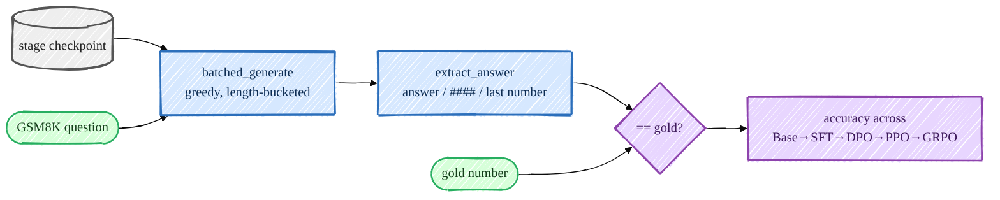
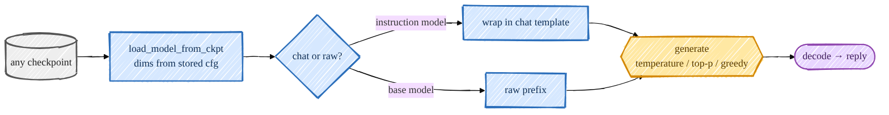

> **本章前置**:你已读完第 01–16 章。也就是说你已经走完了"预训练 → SFT → 奖励模型 → DPO → PPO → GRPO"的整条链路,理解了每一步在改数据还是改损失。你也已经知道 checkpoint 存在 `/ephemeral/ckpts/<阶段>.pt`、模型用的是"贪心/温度/top-k/top-p"那几种采样方式(第 09 章)。
>
> **你将学到**:训练完之后,怎么**客观地**衡量"模型到底变好了没有"。我们会弄懂本项目的头号指标——**贪心 GSM8K 准确率跨阶段对比**:GSM8K 是什么、怎么自动判分(从 `<answer>` 里抠数字);怎么用真实命令把那张"跨阶段成绩表"生成出来并读懂它;然后亲手用 `chat.py` 加载一个 checkpoint,既跑几道数学题、也随便聊几句。最后你会看到一个漂亮的设计:评估和对话**复用同一套生成核心**,所以"评测分数"和"你聊到的回答"永远是一致的。
>
> 👈 [上一章:GRPO / RLVR · 组相对优势推导](/posts/ai_infra/train-llm-from-scratch/train-llm-scratch-16-grpo) ｜ [返回总览](/posts/ai_infra/train-llm-from-scratch/train-llm-scratch-overview)

---

## 17.1 为什么一定要评估

先讲个大白话的道理。

你花了几天电费、跑了 SFT、跑了 PPO、跑了 GRPO,屏幕上 loss 也在往下掉、reward 也在往上爬。但有一个问题始终悬在头顶:**模型真的变聪明了吗?还是只是 loss 数字好看?**

loss 下降只能说明"模型在训练数据上越来越合群",它**不直接等于**"模型真的会做题了"。一条训练流水线只有在你能**独立地、客观地衡量它**时,才真正可信。这就是评估(evaluation)要解决的事:拿一批**模型训练时没见过**的题目(留出集,held-out set),让它现场作答,然后数一数它答对了几道。

本项目把这件事做得非常聚焦:**一个主指标,贯穿所有阶段**——

> **贪心解码下的 GSM8K 准确率,从 Base → SFT → DPO → PPO → GRPO 一路对比。**

这句话里有三个关键词,我们逐个拆开。

## 17.2 GSM8K 是什么,以及怎么"自动判对错"

### GSM8K:一批小学数学应用题

GSM8K(读作 "G-S-M-8-K")是一个公开的数据集,全称 *Grade School Math 8K*,大约有八千道**小学水平的数学应用题**。题目长这样:

> Natalia sold clips to 48 of her friends in April, and then she sold half as many clips in May. How many clips did she sell altogether in April and May?
> (Natalia 四月卖给 48 个朋友夹子,五月卖出的数量是四月的一半。四月和五月一共卖了多少?)

答案是 `72`(四月 48,五月 24,合计 72)。

为什么选数学题来当主指标?因为数学题有一个无可替代的好处:**答案是唯一确定的数字,对就是对、错就是错**,不像"帮我写首诗"那样需要人来主观打分。这正好和我们在第 15、16 章反复强调的**可验证奖励(verifiable reward)**是同一个思想——能被机器客观判分,评测才能自动化、才能公平地横向比较各个阶段。

### 怎么判一道题答对了

模型作答时,我们在 SFT(第 12 章)就教过它输出固定格式:先在 `<think>…</think>` 里写推理过程,再在 `<answer>…</answer>` 里给出最终数字。判分逻辑就藏在仓库的奖励/校验器里,核心是一个叫 `extract_answer` 的"抠数字"函数,它**很宽容**,按优先级依次尝试:

1. 优先取 `<answer>…</answer>` 标签里的数字;
2. 取不到就退而求其次,找 GSM8K 原始风格的 `#### N`;
3. 再不行,就取整段文本里**最后一个出现的数字**。

抠出模型的数字后,和标准答案(gold)比一比,相等就算对。对应的源码在 `src/post_training/evaluation.py` 的 `gsm8k_accuracy` 里,核心三行是这样的(原样摘自源码):

```python
prompts = [encode_prompt([{"role": "user", "content": q}]) for q, _ in qa_pairs]
responses = batched_generate(model, prompts, max_new_tokens, device=device, greedy=greedy)
correct = sum(is_correct(resp, gsm8k_gold_answer(ans)) for (q, ans), resp in zip(qa_pairs, responses))
```

一句话翻译:把每道题包成对话 prompt → 让模型**贪心**地生成回答 → 用 `is_correct` 逐题比对标准答案 → 数出答对几道。

### 为什么是"贪心"解码

注意上面 `greedy=greedy`,评测时这个值固定为 `True`。回忆第 09 章:**贪心(greedy)**就是每一步都取概率最大的那个 token,**完全确定、没有随机性**。

为什么评测要用它?因为如果用带温度的随机采样,同一道题这次蒙对、下次蒙错,分数就成了"看运气"。贪心解码保证**同一个模型、同一道题,永远给出同一个答案**,这样跨阶段的分数才真正可比。`batched_generate` 里有一行 `if greedy: temperature, top_k, top_p = 1.0, 1, None`,本质就是把采样退化成"取 argmax"。

> 顺带一个工程细节:这个教学版模型**没有**感知 padding 的注意力掩码,所以 `batched_generate` 会把**长度相同**的 prompt 分到一组(length-bucketing)再一起解码。你不用关心它怎么实现的,只要知道这是为了在没有 padding mask 的前提下还能批量加速。

## 17.3 生成那张"跨阶段成绩表"

这是本章最重要的动手环节。脚本是 `scripts/eval_post_training.py`,它能**加载任意阶段的 checkpoint**(维度从 checkpoint 自己存的 `cfg` 里读,所以你永远不用手动指定 `n_embed`/`n_blocks`),给它在 GSM8K 上打分,并往一个 JSONL 文件里**追加一行**结果。

### 第一步:逐个阶段评测,把结果追加进同一个文件

下面这段命令逐字来自脚本头部的文档说明(我已对照 `scripts/eval_post_training.py` 核对过每个 flag):

```bash
for s in base_pretrained sft dpo ppo grpo; do
  PYTHONPATH=. python scripts/eval_post_training.py --ckpt /ephemeral/ckpts/$s.pt \
    --label $s --limit 200 --append /ephemeral/logs/stage_table.jsonl
done
```

逐个 flag 解释:

- `--ckpt /ephemeral/ckpts/$s.pt`:要评测的 checkpoint 路径,循环里 `$s` 依次取 `base_pretrained`、`sft`、`dpo`、`ppo`、`grpo`。
- `--label $s`:给这一行结果起个名字(就是阶段名),稍后汇总成表时显示在最左列。
- `--limit 200`:只取测试集前 200 道题来评。题越多越准、但越慢;200 道是"够稳又不太慢"的折中。想更快可以调小,例如 `--limit 50`。
- `--append /ephemeral/logs/stage_table.jsonl`:把这一阶段的成绩**追加**到这个 JSONL 文件里,每跑一个阶段就多一行。

每跑完一个阶段,脚本还会顺手打印几道样例题(默认 `--samples 3`),让你直接看到模型的原始作答长什么样、对在哪、错在哪。其它可调项还有 `--max_new_tokens 300`(最多生成多少 token)、`--split test`(用哪个划分)、`--device`(默认有 GPU 就 `cuda`、没有就 `cpu`)。

### 第二步:把追加好的文件汇总成一张表

所有阶段都跑完后,再调用同一个脚本、但这次只传 `--table`,它会把那个 JSONL 渲染成对齐的表格然后退出:

```bash
PYTHONPATH=. python scripts/eval_post_training.py --table /ephemeral/logs/stage_table.jsonl
```

输出大致长这样(`...` 是实际数字的占位):

```
stage              GSM8K acc       n
------------------------------------
base_pretrained         ...      200
sft                     ...      200
dpo                     ...      200
ppo                     ...      200
grpo                    ...      200
```

最左列是阶段名(`--label` 给的),中间是 GSM8K 准确率(百分比),最右 `n` 是评了多少道题。



### 怎么读这张表:看趋势,别看绝对值

读这张表有两个要点,务必记牢。

**第一,看相对趋势,而不是绝对分数。** 一般你应该看到一条**自下而上的攀升**:

- `base_pretrained`(纯预训练基座):分数通常**很低甚至接近 0**。它只学过"接着往下写文本",压根没被教过要在 `<answer>` 里给数字,连作答格式都不会,自然抠不出对的数。
- `sft`:第一次明显跳升。SFT 教会了它"看到问题要按 `<think>/<answer>` 格式作答",光是会摆格式、肯认真算,正确率就上来了。
- `dpo` / `ppo` / `grpo`:在 SFT 基础上继续爬。DPO 用偏好把"更好的答案"顶上来;PPO/GRPO 直接拿"答对了没有"当奖励去强化,通常能再榨出一截,尤其是专攻数学推理的 GRPO。

**第二,别指望绝对分数很高,这完全正常。** 一个从零预训练、只有约 4 亿参数(~400M)的小模型,**不可能**在 GSM8K 上登顶排行榜——前沿模型的高分背后是多上几个数量级的预训练算力。本项目的算力有限(参考配置是 2×H100 跑几天的基座),所以:

> 重点从来不是"刷出多高的分",而是**每一步之间清晰、真实的前后对比提升**,以及 RL 阶段那条**被 KL 约束住、没有失控**的曲线。绝对数字平平无奇,但"SFT 比 base 高、GRPO 比 SFT 再高"这个**因果链**是真实可复现的。

这也呼应了第 13–16 章反复出现的设计哲学:校验器奖励以**正确性为主导**、只附带一个很小且有界的格式奖励,再加上 **KL 锚定**把策略拽在 SFT 附近,正是为了防止模型"为了刷分而学坏"(reward hacking)。

> **训练过程中其实也在算这个指标。** 不用等训练全部结束,PPO/GRPO 的训练器在跑的时候,就会把奖励、KL、截断比例连同 GSM8K 准确率一起写进 `/ephemeral/logs/<阶段>_<时间戳>.jsonl`(经由 `MetricsLogger`)。传 `--use_wandb true` 还能同步到 Weights & Biases;但 JSONL 始终会落盘,方便你离线画图。

## 17.4 和你的 checkpoint 对话:`chat.py`

成绩表是"冷冰冰的数字",但训练真正令人满足的时刻,是你能**亲自和它说上话**。这一节我们用 `scripts/chat.py`。

它的设计同样优雅:**只传 checkpoint 路径就行**,模型维度从 checkpoint 自己读(底层是 `src/post_training/inference.py` 的 `load_model_from_ckpt`),你不用记任何超参。它有两种模式:

- **chat 模式(默认)**:把你的话**自动包进对话模板**(就是 SFT 时那套 `<|user|>…<|assistant|>`),返回助手回合。**SFT/DPO/PPO/GRPO 这些指令模型都用它。**
- **raw 模式(加 `--raw`)**:把你的话当成一段**前缀**,让基座模型**续写**下去,不套任何模板。**只有 `base_pretrained.pt` 用它**——因为基座根本没学过对话格式,硬套模板它会懵。

### 单次提问(one-shot)

下面命令逐字核对自 `scripts/chat.py`:

```bash
# 指令模型:对话模板自动套上
PYTHONPATH=. python scripts/chat.py --ckpt /ephemeral/ckpts/sft.pt  --prompt "What is 13 + 29?"
PYTHONPATH=. python scripts/chat.py --ckpt /ephemeral/ckpts/grpo.pt --prompt "..." --greedy
# 基座模型:原始续写(注意 --raw)
PYTHONPATH=. python scripts/chat.py --ckpt /ephemeral/ckpts/base_pretrained.pt --raw --prompt "Once upon a time"
```

传了 `--prompt` 就是"问一句、答一句、然后退出"。

### 交互式 REPL

**省略 `--prompt`**,它就进入交互式对话循环(REPL),你可以一句接一句地聊,输入 `exit`/`quit` 或按 `Ctrl-D` 退出:

```bash
PYTHONPATH=. python scripts/chat.py --ckpt /ephemeral/ckpts/sft.pt
```

跑起来后你会看到一行加载信息(它会打印参数量、设备、当前模式和采样设置),然后出现 `you>` 提示符等你输入,模型用 `bot>` 回你。

### 采样旋钮:控制"答得多稳还是多活"

`chat.py` 支持这几个采样开关(我已对照源码确认 flag 名):

- `--greedy`:确定性 argmax,**最适合做数学题、要可复现的场景**。开了它,温度等设置就被忽略。
- `--temperature`(默认 `0.8`):越高越随机、越发散;开放式闲聊一般取 `0.7–1.0`。
- `--top_p`(默认 `0.95`):核采样(nucleus),只在累积概率前 `p` 的 token 里采,削掉低概率长尾。
- `--top_k`(默认不设):只在概率最高的 `k` 个 token 里采。

这几个旋钮的原理你在第 09 章已经完整学过,这里就是它们落到命令行的样子。还有 `--device cuda`/`cpu`(两者均已验证)和 `--max_new_tokens`(默认 256)、`--system`(可选,给一条 system 提示)。

> **没有 GPU 也能玩。** `chat.py` 在 CPU 上经过验证。只要你手上有任意一个 checkpoint(哪怕是用 smoke 小配置训出来的),就能 `--device cpu` 加载它聊几句——加载和单次生成在 CPU 上是可以接受的。

### 动手:挑一个 checkpoint,既做题也闲聊

强烈建议你现在就做这件事(假设你已经有了某阶段的 checkpoint;没有的话,第 18 章会教你怎么用一键脚本或 smoke 思路先产出几个):

```bash
# 1. 让指令模型贪心地做一道数学题,看它会不会摆出 <think>/<answer> 格式
PYTHONPATH=. python scripts/chat.py --ckpt /ephemeral/ckpts/grpo.pt \
  --prompt "Tom has 3 boxes with 7 apples each. How many apples in total?" --greedy

# 2. 同一个模型,换成闲聊,调高温度看它更"放飞"
PYTHONPATH=. python scripts/chat.py --ckpt /ephemeral/ckpts/sft.pt \
  --prompt "Tell me something fun about cats." --temperature 0.9 --top_p 0.95

# 3. 进 REPL 连聊几句,体会它的"性格"
PYTHONPATH=. python scripts/chat.py --ckpt /ephemeral/ckpts/sft.pt
```

对照感受一下:做数学题时 `--greedy` 是不是回答更稳、更愿意一步步算?闲聊时调高 `--temperature` 是不是更天马行空(也更容易胡说)?这就是采样参数在你眼前活生生地起作用。

## 17.5 一个优雅的闭环:评估与对话共用同一颗"心脏"

这一节是点睛之笔,理解了它,你才算真正读懂这套代码的设计。

你可能没注意到:第 17.2 节判分用的 `gsm8k_accuracy`、第 17.4 节对话用的 `generate_reply`,**底层调用的是同一个生成函数** `batched_generate`(在 `src/post_training/evaluation.py`),而它再往下又复用训练时 rollout 用的 `generate_with_logprobs`(在 `src/post_training/rollout.py`)。一张图说清楚:

```
       训练(PPO/GRPO 采样)  ┐
       评估(gsm8k_accuracy) ┼──► batched_generate ──► generate_with_logprobs(同一颗心脏)
       对话(generate_reply) ┘
```

为什么这件事很重要?因为它保证了**一致性**:

- 你在评测表里看到的 GSM8K 分数,**就是**你在 `chat.py` 里 `--greedy` 问同样的题会得到的答案——不存在"评测时是一套生成、聊天时是另一套生成"导致的对不上。
- 训练时模型采样补全(completion)的方式,和评测、对话时的生成方式**同源**,所以"训练优化的东西"和"评测衡量的东西"是同一个东西,不会出现"练的是 A、考的是 B"的尴尬。

这正是整个仓库的核心设计哲学——**包装,而非重写(wrap, don't rewrite)**:不为评估、对话各写一套生成逻辑,而是让它们都**围绕**同一个经过测试的核心来组合。少写代码、少出 bug、还天然一致。第 18 章我们会把这套哲学完整地点出来。



## 小结

- **为什么评估**:loss 下降 ≠ 真的变聪明。必须在**没见过的留出集**上客观判分,流水线才可信。
- **主指标**:**贪心解码下的 GSM8K 准确率,跨 Base → SFT → DPO → PPO → GRPO 对比**。选数学题是因为答案是唯一数字、**可验证**、对错客观。
- **怎么判对**:`extract_answer` 宽容地抠数字(优先 `<answer>` 标签 → `#### N` → 最后一个数字),和标准答案比对;评测固定用**贪心**以保证可比、可复现。
- **生成成绩表**:对 `base_pretrained/sft/dpo/ppo/grpo` 循环跑 `eval_post_training.py --append` 到同一个 JSONL,再用 `--table` 汇总。看**相对攀升**,别苛求绝对值——~400M 小模型在有限算力下分数注定平平,但每一步的真实提升清晰可见。
- **对话**:`chat.py` 只需 checkpoint 路径(维度自读);指令模型自动套对话模板,基座加 `--raw` 续写;`--greedy` 做题、`--temperature/--top_p/--top_k` 闲聊;省略 `--prompt` 进 REPL。
- **闭环之美**:评估、对话、训练采样**共用 `batched_generate` 这一颗心脏**,所以分数和聊天结果永远一致——这就是"包装,而非重写"。

## 自测题

1. **本项目的头号评估指标具体是什么?为什么偏偏选数学题、而且偏偏用贪心解码?**
   <details><summary>提示 / 答案</summary>指标是"贪心解码下的 GSM8K 准确率,跨 Base→SFT→DPO→PPO→GRPO 对比"。选数学题是因为答案是唯一确定的数字、**可验证**,对错客观、能自动判分;用贪心是因为它**完全确定无随机**,保证同一模型同一题永远同一答案,跨阶段分数才真正可比、可复现。</details>

2. **`extract_answer` 抠数字时的三级优先顺序是什么?为什么要设计得这么"宽容"?**
   <details><summary>提示 / 答案</summary>① 先取 `<answer>…</answer>` 里的数字;② 取不到则找 `#### N`;③ 再不行取文本里最后一个数字。宽容是因为模型(尤其早期阶段)未必每次都严格遵守格式,多留几条退路能尽量公平地抠出它"真正想给的那个数",不让格式小瑕疵白白吃判错。</details>

3. **为什么 `base_pretrained` 这一行的 GSM8K 分数通常很低甚至接近 0?这说明模型"没用"吗?**
   <details><summary>提示 / 答案</summary>因为基座只学过"续写文本",从没被教过"看到问题要在 `<answer>` 里给数字",连作答格式都不会,自然抠不出对的数。但这**不**说明它没用——它学到的是"语言本身",是后面 SFT/RL 的地基。评估看的是**相对攀升**,base 的低分正是衬托后续提升的基线。</details>

4. **你想让 `sft.pt` 做一道数学题、要求可复现;又想让它陪你天马行空地闲聊。两条 `chat.py` 命令分别该怎么设采样参数?**
   <details><summary>提示 / 答案</summary>做题(可复现):加 `--greedy`,如 `python scripts/chat.py --ckpt /ephemeral/ckpts/sft.pt --prompt "..." --greedy`。闲聊(发散):用较高温度+核采样,如 `--temperature 0.9 --top_p 0.95`(不加 `--greedy`)。前者每次答案一致,后者更随机有趣但更容易胡说。</details>

5. **为什么"评测看到的分数"和"你在 chat.py 里问同一道题得到的答案"是天然一致的?这背后是什么设计思想?**
   <details><summary>提示 / 答案</summary>因为评估(`gsm8k_accuracy`)、对话(`generate_reply`)、训练采样底层**共用同一个生成核心 `batched_generate`**(再往下是 `generate_with_logprobs`)。同源生成保证"练的、考的、聊的"是同一套逻辑。这就是"包装,而非重写(wrap, don't rewrite)"——围绕一个经过测试的核心组合,少代码、少 bug、天然一致。</details>

## 深入参考

- 评估参考页(成绩表、判分器、健全性检查):[`../08_evaluation_zh.md`](https://github.com/FareedKhan-dev/train-llm-from-scratch/blob/main/docs/zh/08_evaluation_zh.md)
- 推理 / 对话参考页(chat 与 raw、防御性解码):[`../09_inference_zh.md`](https://github.com/FareedKhan-dev/train-llm-from-scratch/blob/main/docs/zh/09_inference_zh.md)
- 采样原理回顾:[第 09 章:生成与采样](/posts/ai_infra/train-llm-from-scratch/train-llm-scratch-09-generation)、基础页 [`../foundations/generation_zh.md`](https://github.com/FareedKhan-dev/train-llm-from-scratch/blob/main/docs/zh/foundations/generation_zh.md)
- 源码对照:`scripts/eval_post_training.py`、`scripts/chat.py`、`src/post_training/evaluation.py`、`src/post_training/inference.py`

---

你已经会衡量模型、会和模型对话了。下一章是全课的收官:我们把前 17 章串成一个完整的故事,用一行命令把整条链路真正跑起来,列一份常见报错排查清单,点出本项目的工程智慧,并给你一份"接下来学什么"的进阶路线图。

下一章 👉 [18_capstone.md](/posts/ai_infra/train-llm-from-scratch/train-llm-scratch-18-capstone)
