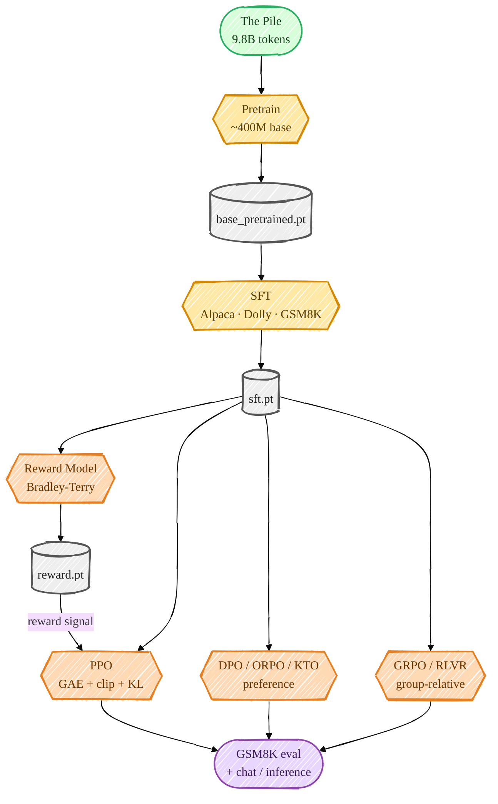

> **本章前置**:你已读完第 01–17 章。也就是说从"什么是张量"到"GRPO 怎么用组内相对优势更新策略",再到"怎么评估、怎么对话",你**全部走过一遍了**。这一章不引入任何新公式,而是把这一路串成一个完整的故事,教你用一行命令把整条链路跑起来,并指给你接下来该往哪走。
>
> **你将学到**:① 一张"预训练 → SFT → RM → {DPO, PPO} → GRPO → 评估"的全景串讲,把前 17 章每一步一句话讲清;② 怎么用 `bash scripts/run_posttraining.sh` 一键跑通整条对齐链;③ 一份**常见报错与排查**清单;④ 本项目最值得记住的几条**工程智慧**;⑤ 一份进阶学习路线(读什么论文、做什么小实验);⑥ 结业寄语。
>
> 👈 [上一章:评估(GSM8K)与推理对话 · 动手](/posts/ai_infra/train-llm-from-scratch/train-llm-scratch-17-eval-inference) ｜ [返回总览](/posts/ai_infra/train-llm-from-scratch/train-llm-scratch-overview)

---

## 18.1 全景回顾:一张图串起前 17 章

还记得第 00 章总览图里那条线吗?现在你已经懂了它的每一个箭头。让我们用**一句话一步**,把整个故事重讲一遍——注意每一步,你只需要问自己两个问题:**它改了数据,还是改了损失?**



```
预训练(Base) ──► SFT ──► 奖励模型(RM) ──► PPO ┐
                  │                            ├─► GRPO / RLVR(数学推理)
                  └──────────► DPO / ORPO / KTO ┘
                                                   └─► 评估(GSM8K)+ 对话
```

逐站串讲(括号里标出"改数据 / 改损失"):

1. **预训练(第 10–11 章)** — 在海量原始文本(The Pile)上做**下一个 token 预测**,用交叉熵。这一步教模型**"语言本身"**:语法、常识、文风。产物是 `base_pretrained.pt`,它会**续写**但不会**听话**。*(损失=普通交叉熵,数据=海量无标注文本)*

2. **SFT 指令微调(第 12 章)** — 换成"指令→回答"的对话数据(Alpaca/Dolly/GSM8K),仍是下一个 token 预测,但**只对助手那部分 token 算损失**(prompt 掩码),并把 GSM8K 重排成 `<think>…</think><answer>N</answer>`。这一步教模型**"遵循指令、按固定格式作答"**。*(改数据:换成对话;改损失:加掩码)*

3. **奖励模型(第 13 章)** — 在 SFT 骨干上接一个**标量奖励头**,用成对偏好数据 + **Bradley-Terry** 损失,学会"给人类更偏好的回答打高分"。它把"输出 token"变成"输出一个分数"。*(改数据:成对偏好;改损失:Bradley-Terry)*

4. **DPO / ORPO / KTO(第 14 章)** — **绕开 RL 循环**,直接用偏好数据优化策略:比较"被选中 vs 被拒绝"回复的序列对数概率,把好的顶上去。隐式地等价于优化一个奖励,但不需要真去跑强化学习。*(改数据:成对偏好;改损失:DPO 目标)*

5. **PPO(第 15 章)** — 经典 RLHF:策略**采样补全 → 用奖励(校验器或 RM)打分 → 加每 token 的 KL-to-reference 惩罚 → GAE 算优势 → 裁剪目标更新**。actor-critic 共享骨干(多一个价值头)。*(改的是整个优化范式:从监督学习变成强化学习)*

6. **GRPO / RLVR(第 16 章)** — 2025 前沿(DeepSeek-R1 风格):**去掉 critic**,改用"每个 prompt 自己一组 G 个样本"当基线算**组内相对优势**,配 token 级裁剪 + k3 KL 惩罚,奖励用**可验证**的 GSM8K 校验器。还带一段算术课程(curriculum)热身。*(改损失:组相对优势;改数据:RL prompts + 课程)*

7. **评估 + 对话(第 17 章)** — 用**贪心 GSM8K 准确率**横量上面每一个 checkpoint,看相对攀升;再用 `chat.py` 和任意阶段对话。

看出规律了吗?**整条链路始终复用同一个骨干网络(backbone)**,各阶段无非是在"喂什么数据"和"用什么损失"这两个旋钮上做文章。这就是现代对齐/推理模型的真实构建方式,你已经亲手把它走了一遍。

## 18.2 一键跑通:`run_posttraining.sh`

理解了全景,现在把它**真的跑起来**。整条对齐链(SFT 之后的部分)被打包成了一个脚本:

```bash
bash scripts/run_posttraining.sh        # SFT → RM → DPO → PPO → GRPO → eval 表
```

我对照 `scripts/run_posttraining.sh` 核实过,它依次做这几件事:

```
1/5  SFT          → scripts/train_sft.py
2/5  Reward Model → scripts/train_reward.py
3/5  DPO          → scripts/train_dpo.py --loss_type dpo
4/5  PPO          → scripts/train_ppo.py --reward_source verifier
5/5  GRPO         → scripts/train_grpo.py
Eval             → 对 base_pretrained/sft/dpo/ppo/grpo 跑 eval_post_training.py 并汇总成表
```

### 跑之前要满足的两个前置

脚本开头的注释写得很清楚,它**假设**:

1. **基座已经预训练好**:`/ephemeral/ckpts/base_pretrained.pt` 已存在(由 `scripts/pretrain_base.py` 产出)。脚本**不包含**预训练那一步——因为预训练是"最长的那根杆子",需要多卡跑几天,不适合塞进一键脚本。
2. **数据已经准备好**:各个 `scripts/prepare_*.py` 已经跑过(SFT 数据、偏好数据、RL prompts 都备齐)。

### 产物去向

脚本里设了 `export PYTHONPATH=. HF_HOME=/ephemeral/hf_cache`,每个阶段:

- **Checkpoint** → `/ephemeral/ckpts/<阶段>.pt`(每个都自带已解析的 `cfg`,所以评估/对话时维度自读)。
- **指标 JSONL** → `/ephemeral/logs/<阶段>_<时间戳>.jsonl`(每步一条 JSON,可离线画图)。
- 最后的成绩表 → `/ephemeral/logs/stage_table.jsonl`,并打印成对齐的表格。

### 单卡 / 多卡 与 smoke 先验

脚本默认用 `torchrun` 起 2 卡(DDP);只有一张卡就 `NPROC=1 bash scripts/run_posttraining.sh`。

**没有 GPU、或想先确认链路通不通?** 用 **smoke 思路先小规模验证**:本仓库提供了 `configs/smoke/*.json` 这种"小号"配置(模型极小、`device` 设成 `cpu`),能在普通笔记本上几秒到几分钟跑完一遍。它**训不出有用的模型**,但能让你在烧 GPU 之前,先确认"数据路径对不对、各阶段脚本能不能从头跑到尾、checkpoint 能不能正常保存与加载"。仓库里还有一份 smoke 自检:

```bash
PYTHONPATH=. python tests/test_post_training_smoke.py   # 核心数学:log-probs、各种头、解析、掩码
```

它在秒级内验证 log-prob 计算、奖励/价值头、答案解析、掩码这些**核心数学**对不对。**养成习惯:先 smoke、再上量。** 这能帮你把"代码 bug"和"训练不收敛"两类问题彻底分开。

## 18.3 常见报错与排查清单

下面是新手最容易撞上的几类问题,按"症状 → 病因 → 处方"列出。

| 症状 | 病因 | 处方 |
|---|---|---|
| `ModuleNotFoundError: No module named 'src'` | 没装成可编辑模式,或没设 `PYTHONPATH` | 在项目根目录 `pip install -e ".[train]"`;或在命令前加 `PYTHONPATH=.`(本课命令都带了);确认虚拟环境已激活 |
| `CUDA out of memory`(显存不足) | batch 太大 / 序列太长 / 显存碎片 | ①减小 `--batch_size`;②用**梯度累积** `--grad_accum` 把有效 batch 补回来(如 `--batch_size 8 --grad_accum 12`);③设环境变量 `PYTORCH_CUDA_ALLOC_CONF=expandable_segments:True` 缓解碎片 |
| `FileNotFoundError`,找不到数据/checkpoint | 数据没准备,或路径不对 | 先跑对应的 `scripts/prepare_*.py`;确认 `/ephemeral/ckpts/` 下确有该 `.pt`;一键脚本要求 `base_pretrained.pt` 已存在 |
| 一键脚本中途跳过了某阶段评测 | 该阶段 checkpoint 不存在 | 这是**正常**行为——脚本对每个 `$s.pt` 做了 `[ -f ... ]` 存在性判断,没有就跳过。先把缺的阶段训出来 |
| CPU 上跑全量训练极慢 / 卡死 | 拿 CPU 跑了本该上 GPU 的全量训练 | CPU 上**只跑 smoke**(`configs/smoke/*.json`、`--device cpu`)和 `chat.py` 单次推理;真正训练要 GPU |
| HF 数据集每次重新下载 / 占满主盘 | 没设缓存目录到大盘 | `export HF_HOME=/ephemeral/hf_cache`,把数据集缓存放到大盘 |
| 多卡训练日志/checkpoint 重复或打架 | 不清楚 DDP 下谁负责落盘 | 正常现象的反面——本项目只有 **rank 0** 负责记日志和存 checkpoint,无需你干预 |

排查的总原则:**先看报错最后一行**(Python 的真正错误通常在最末),再对照上表定位是"环境问题"(模块/路径)还是"资源问题"(显存)还是"该用 smoke 却上了全量"。

## 18.4 本项目的设计哲学:几条值得带走的工程智慧

这套代码之所以干净、好懂、少 bug,靠的是几条贯穿始终的原则。它们不只是这个项目的技巧,而是你以后做任何 LLM 工程都用得上的**通用智慧**。

- **包装,而非重写(wrap, don't rewrite)。** 教学版的 `Transformer`/`Block`/`Head`/`MLP` **几乎原封不动**,只加了**一个**方法 `forward_hidden`(返回最后一层归一化后的隐藏状态)。价值头、奖励头、所有 RL 的 log-prob 计算,全都**围绕**这一个方法来组合。少改动 = 少出错 = 你已经懂的那个模型始终成立。

- **因果注意力让右侧 padding 天然安全。** 因为是因果(causal)注意力,最后一个真实 token **永远不会**注意到它后面的 padding,所以奖励模型(取最后一个 token 的奖励)和 DPO(掩码后的回复)**根本不需要 attention mask**,只要在损失里把 padding 位置置零即可。一个看似不起眼的性质,省掉了一大堆 mask 代码。

- **log-prob 一律用 fp32。** PPO/GRPO/DPO 都要**相减** log-prob,这种减法对数值精度极敏感;所以即便整体在 bf16 自动混合精度下跑,log-prob 也**强制用 fp32 计算**,避免精度损失把训练带偏。

- **KL 锚定防 reward hacking。** RL 阶段如果一味追奖励,模型会"学坏"——找到刷分捷径却胡言乱语。对策有两层:校验器奖励**以正确性为主导**、格式奖励又小又有界;再加一个 **KL-to-reference 惩罚**,把策略死死拽在 SFT 附近,既追了奖励、又没飘走。

- **上下文上限处处守住。** 学到的是绝对位置编码,任何序列都被 `context_length` 卡住;rollout 强制 `prompt + 生成 ≤ context_length`。

这几条你在第 13–17 章其实都零散见过,这里把它们**收拢成一份清单**,值得你记进笔记本。

## 18.5 进阶学习路线:接下来读什么、做什么

恭喜你走到这里。但"从零训练大模型"是一条很深的路,这一节给你**地图**。

### 先精读本仓库已有的文档

你手上这门教程是"老师讲解版";仓库里还有更精炼的"工程速查版",非常适合现在回头巩固:

- 英文主文档:仓库根的 [`README.md`](https://github.com/FareedKhan-dev/train-llm-from-scratch/blob/main/README.md) 与 [`POST_TRAINING.md`](https://github.com/FareedKhan-dev/train-llm-from-scratch/blob/main/POST_TRAINING.md)——后者是一页纸的全链路命令速查。
- 中文参考总入口:[`../README_zh.md`](https://github.com/FareedKhan-dev/train-llm-from-scratch/blob/main/docs/zh/README_zh.md)。
- 基础速查各页:[`../foundations/README_zh.md`](https://github.com/FareedKhan-dev/train-llm-from-scratch/blob/main/docs/zh/foundations/README_zh.md)(分词、Transformer、注意力、目标、优化、生成,每页都对照源码)。

### 然后读这几篇经典论文

这些论文在 [`../foundations/README_zh.md`](https://github.com/FareedKhan-dev/train-llm-from-scratch/blob/main/docs/zh/foundations/README_zh.md) 末尾就有链接,顺序建议如下——读的时候带着"它对应我学过的哪一章"去读,事半功倍:

- **Attention Is All You Need** — Transformer 与缩放点积注意力的源头(对应第 05–06 章)。
- **InstructGPT(Training language models to follow instructions with human feedback)** — 经典 RLHF 配方:SFT → 奖励模型 → PPO(对应第 12、13、15 章)。
- **Direct Preference Optimization(DPO)** — 为什么能绕开 RL 直接用偏好优化(对应第 14 章)。
- **PPO(Proximal Policy Optimization)** — 裁剪目标的策略梯度方法(对应第 15 章)。
- **DeepSeekMath / GRPO** — 组相对优势、去 critic 的数学推理 RL(对应第 16 章)。

### 最后,动手做几个小实验

读懂不如改一遍。下面几个实验**改动小、反馈快**,最能加深理解(都能在 smoke / 小配置上跑):

1. **改采样参数看输出怎么变。** 用 `chat.py` 对同一个 prompt,分别试 `--greedy`、`--temperature 0.5`、`--temperature 1.2 --top_p 0.9`,直观感受"稳重 ↔ 放飞"。
2. **改 GRPO 的 `group_size`。** `train_grpo.py --group_size 8` 改成 `4` 或 `16`,看组内相对优势的方差和训练稳定性怎么变(回忆第 16 章:组越大基线越稳但越费算力)。
3. **换数据集 / 换奖励来源。** PPO 试 `--reward_source rm`(用训好的奖励模型)对比 `verifier`(GSM8K 校验器),看两种奖励信号训出来的模型脾气有何不同。
4. **改 DPO 的 `--beta` 或 `--loss_type`。** 试 `orpo`(免参考模型)、`kto`(不成对),体会第 14 章讲的几种变体在实操上的差异。
5. **把 `--limit` 调大重评一遍。** 把 GSM8K 评测从 200 道加到更多,看分数会不会更稳。

> 做实验的黄金习惯:**一次只改一个变量**,记下改之前/之后的指标。这样你才能把"是这个改动起的作用"和"只是随机波动"分清楚——这也是整个机器学习工程最核心的纪律。

## 小结

- **全景**:整条链路始终复用**同一个骨干**,各阶段只在"喂什么数据 / 用什么损失"上做文章:预训练学语言 → SFT 学听话 → RM 学打分 → DPO/PPO/GRPO 学对齐与推理 → 评估与对话验收。
- **一键跑通**:`bash scripts/run_posttraining.sh` 依次跑 SFT→RM→DPO→PPO→GRPO→eval 表;前置是"基座已预训练 + 数据已准备";产物落在 `/ephemeral/ckpts` 与 `/ephemeral/logs`;**先 smoke 再上量**。
- **排查**:模块找不到→可编辑安装/`PYTHONPATH`;显存不足→减 batch + 加 `grad_accum` + `expandable_segments`;CPU 只跑 smoke 与单次推理。
- **工程智慧**:包装而非重写、因果注意力使右 padding 安全、log-prob 用 fp32、KL 锚定防 reward hacking、处处守住上下文上限。
- **进阶**:精读仓库英文 README 与 foundations,按章对应去读经典论文,再做"改采样/改 group_size/换奖励"这类小而快的实验,坚持一次只改一个变量。

## 自测题

1. **把整条链路的每一步,用"改了数据还是改了损失"各归一类。哪一步是最彻底的范式切换?**
   <details><summary>提示 / 答案</summary>预训练(海量文本/交叉熵)→ SFT(换对话数据 + 加助手掩码)→ RM(成对偏好 + Bradley-Terry 损失)→ DPO(成对偏好 + DPO 目标)→ PPO/GRPO(从监督学习切换到**强化学习**范式)。最彻底的范式切换是进入 **PPO/GRPO**:不再是"给定答案算损失",而是"自己采样、被打分、按 RL 目标更新"。</details>

2. **`run_posttraining.sh` 为什么不包含预训练那一步?跑它之前你必须先确保哪两件事?**
   <details><summary>提示 / 答案</summary>因为预训练是"最长的杆子",要多卡跑几天,不适合塞进一键脚本。跑之前必须确保:①基座已预训练好,`/ephemeral/ckpts/base_pretrained.pt` 存在;②各 `prepare_*.py` 已跑过,SFT/偏好/RL prompts 数据都备齐。</details>

3. **训练报 `CUDA out of memory`,列出三种递进的应对手段。**
   <details><summary>提示 / 答案</summary>①减小 `--batch_size`;②用梯度累积 `--grad_accum` 把有效 batch 补回来(如 `--batch_size 8 --grad_accum 12`);③设 `PYTORCH_CUDA_ALLOC_CONF=expandable_segments:True` 缓解显存碎片。</details>

4. **"因果注意力让右侧 padding 安全"具体省掉了什么麻烦?为什么奖励模型不需要 attention mask?**
   <details><summary>提示 / 答案</summary>因为是因果注意力,最后一个真实 token 永远不会注意到它后面的 padding,所以"取最后一个 token 的奖励"不会被 padding 污染,DPO 的掩码回复同理。这省掉了一整套 padding-aware 的 attention mask 代码,只需在损失里把 padding 位置置零即可。</details>

5. **为什么 RL 阶段要加 KL-to-reference 惩罚?不加会发生什么?**
   <details><summary>提示 / 答案</summary>不加的话,模型可能为了一味追奖励而"学坏"——找到刷分捷径却输出胡言乱语(reward hacking)。KL-to-reference 把策略锚定在 SFT 附近,加上"正确性主导、格式奖励小而有界"的校验器设计,既能追奖励、又不会飘离一个合理的语言模型。</details>

## 深入参考

- 全链路命令速查(英文一页纸):[`../../POST_TRAINING.md`](https://github.com/FareedKhan-dev/train-llm-from-scratch/blob/main/POST_TRAINING.md)
- 后训练总览(中文):[`../README_zh.md`](https://github.com/FareedKhan-dev/train-llm-from-scratch/blob/main/docs/zh/README_zh.md)
- 训练流程(UI 与 CLI、安装、输出去向):[`../howto/train_zh.md`](https://github.com/FareedKhan-dev/train-llm-from-scratch/blob/main/docs/zh/howto/train_zh.md)
- LLM 基础与论文清单:[`../foundations/README_zh.md`](https://github.com/FareedKhan-dev/train-llm-from-scratch/blob/main/docs/zh/foundations/README_zh.md)
- 一键脚本源码,随时可对照:`scripts/run_posttraining.sh`

---

## 🎉 恭喜结业

你做到了。

回头看看你走过的路:从"什么是张量""什么是梯度"开始,你亲手推导了缩放点积注意力里那个 $\sqrt{D}$、把交叉熵从最大似然一路推到困惑度、看懂了 DPO 怎么绕开 RL、PPO 的裁剪目标怎么来、GRPO 怎么用一组样本当基线把 critic 省掉。你不只是"听说过"这些名词——你**理解了每一个箭头**,还能用真实代码、真实数据,把现代大模型从预训练到 RLHF 的每一步**亲手跑一遍**。

这门课的价值从来不在于"刷出多高的分",而在于:**你现在拥有了一张完整、连贯、没有黑箱的心智地图。** 当你以后读到一篇新论文、看到一个新框架,你会发现它们大多只是这张地图上某个节点的变体——而你已经知道那个节点在哪、它在解决什么问题。

继续往前走吧:读那几篇经典论文、做那几个小实验、改一行参数看世界怎么变。保持"一次只改一个变量"的纪律,保持动手的习惯。你已经从"完全零基础"变成了"能从零训练并对齐一个大模型的人"。

这很了不起。🎓

回到 [课程总览](/posts/ai_infra/train-llm-from-scratch/train-llm-scratch-overview),随时回来查阅任何一章。

—— 祝你在大模型的世界里走得又远又稳。
